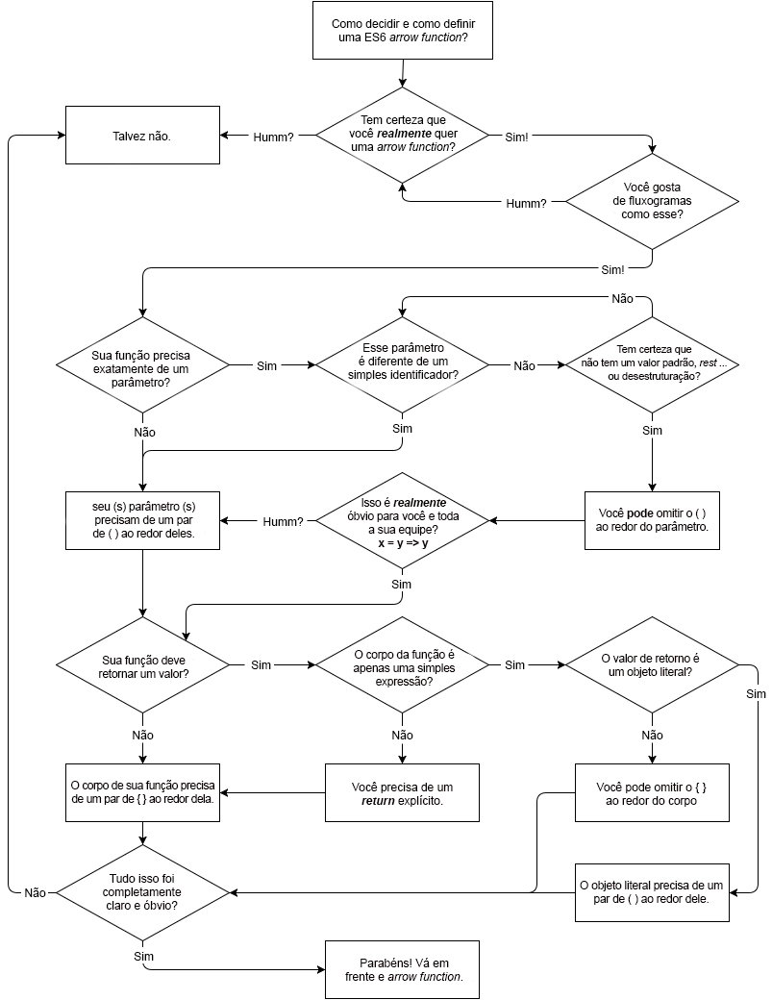

# You Don't Know JS: ES6 & Além
# Capítulo 2: Sintaxe

Se você vem escrevendo JS por algum tempo, é provável que a sintaxe pareça bem familiar à você. Com certeza existem algumas confusões, mas em geral a sintaxe é bem clara e de entendimento razoável, com formato bem similar à outras linguagens.

Entretanto, o ES6 adiciona algumas formas sintáxicas que requerem algum tempo para se familiarizar. Nesse capítulo, iremos navegar através dela para encontrar o que ela nos reserva.

**Dica:** No momento desta escrita, algumas funcionalidades	discutidas neste livro já foram implementadas em diversos navegadores (Firefox, Chrome, etc.), mas algumas foram apenas parcialmente implementadas e muitas outras não sequer implementadas ainda. Sua experiência pode ser diversificada ao tentar esses exemplos diretamente. Se for, tente elas utilizando transpiladores, já que a maioria dessas funcionalidades foram cobertas por essas ferramentas. O ES6Fiddle (http://www.es6fiddle.net/) é um playground ótimo, fácil de usar para testar o ES6, já que é o REPL online para o transpilador Babel. (http://babeljs.io/repl/).

## Declarações em blocos de Escopos

Você provavelmente está consciente que a unidade fundamental de escopo de variáveis em JavaScript sempre foi `function`. Se você precisar criar um escopo de bloco, a forma mais prevalente de fazê-lo além da declaração regular de função seria a Expressão de Função Imediatamente Invocada (IIFE). Por exemplo:

```js
var a = 2;

(function IIFE(){
	var a = 3;
	console.log( a );	// 3
})();

console.log( a );		// 2
```

### Declarações `let`

Entretanto, nós podemos criar declarações que estão limitadas à qualquer bloco, chamados (sem nenhuma surpresa) *escopo de bloco* (block scoping). Isso significa que tudo que precisamos é um par de `{ .. }` para criar o escopo. Ao invés de usar `var`, que sempre declara variáveis anexadas ao enclausuramento do escopo da função (ou global, se for *top level*), use `let`:

```js
var a = 2;

{
	let a = 3;
	console.log( a );	// 3
}

console.log( a );		// 2
```

Não é muito comum ou idiomático até o presente momento, usar blocos `{ .. }` soltos, mas de qualquer forma isso sempre foi válido. E desenvolvedores de outras linguagens que contém *escopamento* de blocos (block scoping) irão rapidamente reconhecer este padrão.

Eu acredito que esta é a melhor forma de criar variáveis escopadas em blocos, usando um bloco `{ .. }` dedicado. E ainda mais, você deve sempre colocar as declarações `let` no ponto mais alto do bloco. Se você tiver mais de um a declarar, eu recomendo usar apenas um `let`.

Estéticamente falando, eu sempre prefiro usar o `let` na mesma linha do que a abertura `{`, para deixar claro que este escopo de bloco tem o objetivo de apenas declarar o escopo dessas variáveis.

```js
{	let a = 2, b, c;
	// ..
}
```

Agora, isso parece estranho aos olhos e é provável que não vá corresponder às recomendações dadas na maioria das literaturas sobre ES6. Maas eu tenho razões para minha loucura.

Existe outra forma experimental (não padronizada) de declarações `let` chamadas de `let`-block, que se parece com isso:

```js
let (a = 2, b, c) {
	// ..
}
```

Esta forma é o que eu chamo de escopo de bloco *explícito*, onde a forma da declaração `let ..` que espelha `var`é mais *implícita*, como se ela meio que *sequestrasse* qualquer par de `{ .. }` que for encontrado. Geralmente desenvolvedores acham mecanismos *explícitos* mais *preferíveis*, e eu digo que esse seria um desses casos.

Se você comparar os dois trechos e código, eles são bem similares, e na minha opinião os dois se qualificam estéticamente como escopamento de blocos *explícito*. Infelizmente, a forma `let (..) { .. }`, a mais *explícita* das opções, não foi adotada no ES6. Ela pode ser revisada em um pós-ES6, mas por ora a primeira opção é nossa melhor pedida, eu acho.

Para reforçar a natureza *implícita* das declarações `let ..`, considere seu uso:

```js
let a = 2;

if (a > 1) {
	let b = a * 3;
	console.log( b );		// 6

	for (let i = a; i <= b; i++) {
		let j = i + 10;
		console.log( j );
	}
	// 12 13 14 15 16

	let c = a + b;
	console.log( c );		// 8
}
```

Pequeno quiz antes de olhar novamente para o trecho de código: qua(l/is) variáve(l/is) existe(m) apenas dentro da instrução `if`, e qua(l/is) variáve(l/is) existe(m) apenas dentro do loop `for`?

As respostas: a instrução `if` contém em escopo de bloco as variáveis `b` e `c`, e o loop `for` contém em escopo de bloco as variáveis `i` e `j`.

Você teve que pensar nisso por um instante? Te surpreende que  `i` não tenha sido adicionada ao encerramento do escopo da instrução `if`? Aquela pausa mental e questionadora -- Eu chamo isso de "taxa mental" -- vem do fato de que o esse mecanismo `let` não é só novo para nós, como também é *implícito*.

Existe também o perigo da declaração `let c = ..` aparecer tão abaixo no escopo. Diferente das declarações `var` tradicionais, que são anexadas ao enclausuramento de todo escopo da função independentemente de onde apareçam, as declarações `let` anexam-se ao escopo de bloco mas não são inicializadas até aparecerem no bloco.

Acessar uma declaração de variável `let` antes de sua declaração/inicialização `let ..`, causa um erro, onde de outra forma nas declarações `var` sua ordenação não importa (apenas esteticamente).

Considere:

```js
{
	console.log( a );	// undefined
	console.log( b );	// ReferenceError!

	var a;
	let b;
}
```

**Atenção:** Por conta da referências declaradas com `let` terem sido acessado de forma muito antecipada, esse `ReferenceError` é tecnicamente chamado de um erro de Zona Morta Temporal *Temporal Dead Zone (TDZ)* -- você está acessando uma variável que foi declarada mas não foi inicializada ainda. Esta não será a primeira vez que você verá erros TDZ -- eles estão talhados em diversos lugares no ES6. Além disso, note que *inicializado* não significa explicitamente designar um valor no seu código, visto que `let b;` é totalmente válido. Uma variável que não é designda no momento da declaração é pressuposta a ter o valor designado de `undefined`. Sendo assim `let b;` é o mesmo que `let b = undefined;`. Explicitamente declarado ou não, você não pode acessar `b` até que a instrução `let b` rode.

Uma última pegadinha: `typeof` se comporta de maneira diferente entre variáveis não declaradas (ou declaradas!) e variáveis TDZ. Por exemplo:

```js
{
	// `a` não está declarada
	if (typeof a === "undefined") {
		console.log( "cool" );
	}

	// `b` está declarada, mas em seu TDZ
	if (typeof b === "undefined") {		// ReferenceError!
		// ..
	}

	// ..

	let b;
}
```

A variável `a` não está declarada, então `typeof` é a única maneira segura de verificar sua existência ou não. Mas `typeof b` lança um erro TDZ por lá embaixo no código acontece de haver uma declaração `let b`. Oops.

Agora que já deve estar claro sobre o porquê de eu insistir sobre porque declarações `let` devem estar todas no topo de seu escopo. Essa forma afasta totalmente o erro acidental de acessá-las de maneira precoce. Essa forma também faz torná-la mais *explícita* quando você procura no bloco, qualquer bloco, quais variáveis ele contém.

Seus blocos (instruções `if`, `while` loops, etc.) não precisam compartilhar seus comportamentos originais com seu comportamentos de escopo.

Estas explicitações são da sua parte, é contigo, e se você manter a sua parte com disciplina, esta forma irá te salvar de diversas dores de cabeça com refatorações e evitar tiros no pé.

**Nota:** Para mais informações sobre `let` escopos de blocos, veja o Capítulo 3 do título desta série *Escopos & Clausuras*.

#### `let` + `for`

A única exceção que eu daria preferência pela forma *explicita* num bloco de declaração é o `let` que aparece no cabeçalho de um `for` loop. O motivo pode parecer confuso, mas eu acho que seja um dos recursos mais importantes do ES6.

Considere:

```js
var funcs = [];

for (let i = 0; i < 5; i++) {
	funcs.push( function(){
		console.log( i );
	} );
}

funcs[3]();		// 3
```

O `let i` no cabeçalho do `for` declara um `i` não só para o `for` loop, mas redeclara um novo `i` para cada interação do loop. Isso significa que closures criadas dentro do loop fecham essas variáveis por iteração do jeito que você esperava.

Se você tentou esse mesmo trecho, mas com o `var i` no cabeçalho do `for` loop, você deveria ter `5` ao invés de `3`, porque haveria apenas um `i` no escopo externo que foi fechado, em vez de um novo `i` para cada função de fechamento.

Você também poderia ter obtido a mesma coisa um pouco mais verbosamente:

```js
var funcs = [];

for (var i = 0; i < 5; i++) {
	let j = i;
	funcs.push( function(){
		console.log( j );
	} );
}

funcs[3]();		// 3
```

Aqui, nós forçadamente criamos um novo `j` para cada iteração, e então a closure trabalha da mesma maneira. Eu prefiro da primeira forma; esta habilidade especial extra é a razão pela qual eu defendo a forma `for (let ..) ..`. Pode se argumentar que é um pouco mais *implícito*, mas isso é *explícito* o bastante, e útil bastante, pro meu gosto.

`let` também funciona do mesmo jeito com os loops `for..in` e `for..of` (veja em "for..of Loops").

### Declarações `const`

Há uma outra forma de declaração com escopo de bloco a ser considerada: o `const`, que cria *constantes*.

O que exatamente é uma constante? É uma variável que se baseia na leitura do valor inicial e definido. Considere:

```js
{
	const a = 2;
	console.log( a );	// 2

	a = 3;				// TypeError!
}
```

Você não tem permissão para alterar o valor que a variável tem uma vez que tenha sido definido, no momento da declaração. A declaração da `const` deve ter uma inicialização explícita. Se você quisesse uma *constante* com o valor `undefined`, você deveria ter declarado `const a = undefined` para obtê-la.

Constantes não são uma restrição ao valor em si, mas à atribuição da variável desse valor. Em outras palavras, o valor não é congelado ou imutável por causa da `const`, apenas a atribuição dele. Se o valor é complexo, como um objeto ou array, o conteúdo do valor ainda poderá ser modificado:

```js
{
	const a = [1,2,3];
	a.push( 4 );
	console.log( a );		// [1,2,3,4]

	a = 42;					// TypeError!
}
```

A variável `a` na verdade não contém um array constante; em vez disso, ele contém uma referência constante ao array. O array em si é livremente mutável.

**Atenção:** Atribuir um objeto ou array como uma constante, significa que o valor não estará disponível para o coletor de lixo até que o escopo léxico dessa constante desapareça pois a referência ao valor nunca pode ser desconfigurada. Isso pode ser desejável, mas tenha cuidado se não for sua intenção!

Essencialmente, declarações `const` reforçam o que estilisticamente sinalizamos com nosso código por anos, onde declaramos o nome da variável de todas as letras em maiúsculo e atribuímos isso algum valor literal que nós tomamos cuidado em nunca mudar. Não existe uma aplicação em uma atribuição `var`, mas agora há com a atribuição `const`, que pode te ajudar a capturar alterações não intencionais.

`const` *pode* ser usada com declarações de variáveis de `for`, `for..in` e `for..of` loops (veja em "for..of Loops"). No entanto, um erro será retornado se houver qualquer tentativa de reatribuição, como a típica cláusula de `i ++` de um `for` loop.

#### `const` Ou Não

Há algumas suposições de que a `const` poderia ser mais otimizável pelo JS em certos cenários do que um `let` ou `var` poderiam ser. Teoricamente, o JS reconhece mais facilmente o valor/tipo da variável que nunca mudará, então, ele pode eliminar qualquer possibilidade de rastreamento.

Se `const` realmente ajuda aqui ou isso é apenas coisa de nossas próprias fantasias e intuições, a decisão muito mais importante a se fazer é se você pretende ter um comportamento constante ou não. Lembre-se: um dos papéis mais importantes para o código-fonte é se comunicar claramente, não para apenas você, mas para seu eu do futuro e outros colaboradores, qual é a sua intenção.

Alguns desenvolvedores preferem começar a declaração de cada variável como uma 'const' e depois relaxar uma declaração para 'let` se for necessário que seu valor seja alterado no código. Essa é uma perspectiva interessante, mas não está claro se ela realmente melhora a legibilidade ou capacidade de raciocínio do código.

Isso não é realmente uma *proteção*, como muitos acreditam, porque o próximo desenvolvedor que quiser alterar o valor da `const` pode cegamente mudar esse `const` para `let` na declaração. Na melhor das hipóteses, isso protege de mudanças acidentais. Mas ainda, além de nossas intuições e sensibilidades, não parece haver uma medida objetiva e clara do que constitui "acidentes" ou prevenção disso. Existem maneiras semelhantes de pensar sobre a aplicação de tipos.

Meu conselho: para evitar códigos potencialmente confusos, use apenas `const` para variáveis que intencionalmente e obviamente você está sinalizando que não irão mudar. Em outras palavras, não *dependa* do `const` para o comportamento do código, mas use-o como uma ferramenta para sinalizar a intenção, quando a intenção puder ser claramente sinalizada.

### Funções de Escopo em Bloco

A partir do ES6, as declarações de função que ocorrem dentro dos blocos são agora definidas para serem escopo nesse bloco. Antes do ES6, as especificações não exigiam isso, mas muitas implementações faziam de qualquer forma. Então agora as especificações atendem a realidade.

Considere:

```js
{
	foo();					// funciona!

	function foo() {
		// ..
	}
}

foo();						// ReferenceError
```

A função `foo()` é declarada dentro do bloco `{...}`, e a partir do ES6 tem um escopo de bloco. Portanto, não está disponível fora desse bloco. Mas também note que ele é “içado” dentro do bloco, ao contrário das declarações do `let`, que sofrem da armadilha de erro TDZ mencionada anteriormente.

O escopo em bloco de uma declaração de função pode ser um problema se você sempre codificou desse jeito, e se baseou no que foi herdado do comportamento de escopo fora do bloco:

```js
if (algumaCoisa) {
	function foo() {
		console.log( "1" );
	}
}
else {
	function foo() {
		console.log( "2" );
	}
}

foo();		// ??
```

Em ambientes pré-ES6, `foo()` imprimiria `”2”`, independentemente do valor de `algumaCoisa`, porque ambas declarações da função foram içadas pelos blocos, e a segunda sempre vence.

No ES6, essa última linha retorna um `ReferenceError`.

## Spread/Rest

O ES6 introduz um novo operador `...` que normalmente é chamado de operador *spread* ou *rest*, dependendo de onde/como ele é usado. Vamos dar uma olhada:

```js
function foo(x,y,z) {
	console.log( x, y, z );
}

foo( ...[1,2,3] );				// 1 2 3
```

Quando `...` é usado na frente de um array (na verdade, qualquer *iterável*, que abordamos no Capítulo 3), ele age para "distribuí-lo" em seus valores individuais.

Você normalmente verá esse uso como é mostrado no trecho anterior, ao distribuir um array como um conjunto de argumentos para uma chamada de função. Neste caso, o `...` atua para nos dar uma substituição sintática mais simples para o método `apply(...)`, que normalmente teríamos usado antes do ES6 como:

```js
foo.apply( null, [1,2,3] );		// 1 2 3
```

Mas o `...` pode ser usado para distribuir/expandir um valor em outros contextos também, como dentro de uma outra declaração de array:

```js
var a = [2,3,4];
var b = [ 1, ...a, 5 ];

console.log( b );					// [1,2,3,4,5]
```

Neste caso, o `...` está basicamente substituindo o `concat(..)`, que se comporta como o `[1].concat( a, [5] )` aqui.

O outro uso comum de `…` pode ser visto essencialmente como o oposto; em vez de distribuindo um valor, o `...` *agrupa* um conjunto de valores em um array. Considere:

```js
function foo(x, y, ...z) {
	console.log( x, y, z );
}

foo( 1, 2, 3, 4, 5 );			// 1 2 [3,4,5]
```

O `…z` neste trecho está essencialmente dizendo: “reúna o *resto* dos argumentos (se houver) em um array chamado de `z`.” Como o `x` foi designado como `1` e o `y` foi designado como `2`, o restante dos argumentos `3`,`4` e `5` foram agrupados em `z`.

Claro, se você não tem nenhum parâmetro nomeado, o `...` agrupa todos os argumentos:

```js
function foo(...args) {
	console.log( args );
}

foo( 1, 2, 3, 4, 5);			// [1,2,3,4,5]
```

**Nota:** O `…args` na declaração da função `foo(...)` é normalmente chamado de “parâmetros restantes”, porque você está coletando o resto dos parâmetros. Eu prefiro “agrupar”, porque é mais descritivo do que ele faz e não o que contém.

A melhor parte deste uso é que ele fornece uma alternativa bastante sólida ao uso do array `arguments` a muito tempo já obsoleto - que na verdade não é realmente um array, mas um objeto parecido com array.  Porque o `args` (ou como você quiser chamar – muitas pessoas preferem chamar de  `r` ou `resto`) é um verdadeiro array, podemos nos livrar de um monte de truques pré-ES6 que criamos para fazer o `arguments` em algo que podemos tratá-lo como um array.

Considere:

```js
// fazendo as coisas à nova maneira ES6
function foo(...args) {
	// `args` já é um array real

	// descarte o primeiro elemento em `args`
	args.shift();

	// passa por todos os `args` como argumentos
	// para `console.log(..)`
	console.log( ...args );
}

// fazendo as coisas à moda antiga pré-ES6
function bar() {
	// transforma `arguments` em um array real
	var args = Array.prototype.slice.call( arguments );

	// adiciona alguns elementos ao final
	args.push( 4, 5 );

	// filtra os números ímpares
	args = args.filter( function(v){
		return v % 2 == 0;
	} );

	// passa por todos os `args` como argumentos
	// para `foo(..)`
	foo.apply( null, args );
}

bar( 0, 1, 2, 3 );					// 2 4
```

O `...args` na declaração da função `foo(...)` reúne os argumentos, e o `...args` no `console.log(...)` chama os distribui. Essa é uma boa ilustração dos usos simétricos, mas opostos operadores `...`.

Além do caso do `...` na declaração da função, há outro caso onde `...` é usado para reunir valores, e nós veremos isso mais adiante neste capítulo, na seção “Muitos, poucos, apenas o suficiente”.

## Valores Padrão de Parâmetro

Talvez um dos idiomas mais comuns em JavaScript seja definir um valor padrão para um parâmetro de uma função. A maneira como nós fizemos isso por anos deve ser bastante familiar a:

```js
function foo(x,y) {
	x = x || 11;
	y = y || 31;

	console.log( x + y );
}

foo();				// 42
foo( 5, 6 );		// 11
foo( 5 );			// 36
foo( null, 6 );		// 17
```

É claro que, se você já usou este padrão antes, você sabe como isso é um tanto perigoso como útil, se por exemplo, você precisa ser capaz de transmitir em o que outro modo pode ser considerado um valor falso para um dos parâmetros. Considere:

```js
foo( 0, 42 );		// 53 <-- Oops, não 42
```

Por quê? Porque o `0` é falso, e então o `x || 11` resulta em `11`, não o transmitido diretamente em `0`.

Para corrigir essa pegadinha, algumas pessoas vão escrever a validação de uma maneira mais verbosa, assim:

```js
function foo(x,y) {
	x = (x !== undefined) ? x : 11;
	y = (y !== undefined) ? y : 31;

	console.log( x + y );
}

foo( 0, 42 );			// 42
foo( undefined, 6 );	// 17
```

Claro, isso significa que qualquer valor, exceto `undefined`, pode ser transmitido diretamente. No entanto, será assumido que "indefinido" indica "Eu não passei isso". Isso funciona muito bem, a não ser que que você realmente precise passar `undefined`.

Nesse caso, você poderia testar para ver se o argumento é realmente omitido, por não estar presente na matriz `arguments`, talvez assim:

```js
function foo(x,y) {
	x = (0 in arguments) ? x : 11;
	y = (1 in arguments) ? y : 31;

	console.log( x + y );
}

foo( 5 );				// 36
foo( 5, undefined );	// NaN
```

Mas como omitir o primeiro argumento `x` sem a possibilidade de passar para qualquer tipo de valor (nem mesmo `undefined`) que sinalize "estou omitindo este argumento"?

`foo (, 5)` é tentador, mas é uma sintaxe inválida. `foo.apply (null, [, 5])` parece que deve fazer o truque, mas as peculiaridades do `apply (..)` aqui significam que os argumentos são tratados como `[undefined, 5]`, que com certeza não são omitidos

Se você investigar mais, verá que só pode omitir argumentos no final (ou seja, no lado direito) simplesmente passando menos argumentos que "esperado", mas você não pode omitir os argumentos no meio ou no início da lista de argumentos. Isso não é possível.

Há um princípio aplicado ao design do JavaScript aqui que é importante lembrar: `undefined` significa *ausente*. Ou seja, não há diferença entre `undefined` e *ausente*, pelo menos no que diz respeito aos argumentos de função.

**Nota:** Estranhamente, existem outros lugares em JS onde esse princípio específico de design não se aplica, como arrays com casas vazios. Veja o título *Tipos & Gramática* desta série para mais informações.

Com tudo isso em mente, agora podemos examinar uma sintaxe útil e agradável adicionada a partir do ES6 para facilitar a atribuição de valores padrão a argumentos ausentes:

```js
function foo(x = 11, y = 31) {
	console.log( x + y );
}

foo();					// 42
foo( 5, 6 );			// 11
foo( 0, 42 );			// 42

foo( 5 );				// 36
foo( 5, undefined );	// 36 <-- `undefined` está faltando
foo( 5, null );			// 5  <-- null é convertido em `0`

foo( undefined, 6 );	// 17 <-- `undefined` está faltando
foo( null, 6 );			// 6  <-- null é convertido em `0`
```

Observe os resultados e a maneira como eles implicam sutis diferenças e semelhanças com abordagens anteriores.

`x = 11` em uma declaração de função é mais parecido com` x! == undefined? x: 11` do que o mais comum `x || 11`, então você deve ter cuidado ao converter seu código pré-ES6 nesta sintaxe do valor do parâmetro ES6 padrão.

**Nota:** Um parâmetro rest/gather (veja "Spread/Rest") não pode ter um valor padrão. Então, enquanto `function foo(...vals=[1,2,3]) {` pode parecer uma capacidade intrigante, não é uma sintaxe válida. Você terá que continuar aplicando esse tipo de lógica manualmente, se necessário.

### Expressões de valor padrão

Os valores padrão de funções podem ser mais do que apenas valores como `31`; pode ser qualquer expressão válida, até mesmo uma chamada de função:

```js
function bar(val) {
	console.log( "bar chamado!" );
	return y + val;
}

function foo(x = y + 3, z = bar( x )) {
	console.log( x, z );
}

var y = 5;
foo();								// "bar chamado!"
									// 8 13
foo( 10 );							// "bar chamado!"
									// 10 15
y = 6;
foo( undefined, 10 );				// 9 10
```

Como você pode ver, as expressões de valor padrão são avaliadas preguiçosamente, o que significa que elas só serão executadas se e quando forem necessárias - ou seja, quando o argumento de um parâmetro for omitido ou for `undefined`.

É um detalhe sutil, mas os parâmetros formais em uma declaração de função estão dentro de seu próprio escopo (pense nisso como uma bolha de escopo envolvendo apenas o `(..)` da declaração da função), não dentro do corpo da função. Isso significa que uma referência a um identificador em uma expressão de valor padrão corresponde primeiro ao escopo dos parâmetros formais antes de procurar um escopo externo. Veja o título *Escopos & Clausuras* desta série para mais informações.

Considere:

```js
var w = 1, z = 2;

function foo( x = w + 1, y = x + 1, z = z + 1 ) {
	console.log( x, y, z );
}

foo();					// ReferenceError
```

O `w` na expressão de valor padrão` w + 1` procura por `w` no escopo dos parâmetros formais, mas não o encontra, então o` w` do escopo externo é usado. Assim, o `x` na expressão de valor padrão` x + 1` encontra `x` no escopo dos parâmetros formais e, felizmente, o ` x` já foi inicializado, então a designação para `y` funciona bem.

No entanto, o `z` em` z + 1` encontra `z` como uma variável de parâmetro ainda não inicializada no momento, então ele nunca tenta encontrar o` z` do escopo externo.

Como mencionamos na seção "Declarações de let" anteriormente neste capítulo, o ES6 tem um TDZ (Temporal Dead Zone), que impede que uma variável seja acessada em seu estado não inicializado. Como tal, a expressão de valor padrão `z + 1` gera um erro TDZ `ReferenceError`.

Embora não seja necessariamente uma boa ideia para clareza de código, uma expressão de valor padrão pode até ser uma chamada de expressão de função embutida (ou in-line) - normalmente chamada de expressão de função invocada imediatamente (IIFE):

```js
function foo( x =
	(function(v){ return v + 11; })( 31 )
) {
	console.log( x );
}

foo();			// 42
```

Raramente haverá casos em que um IIFE (ou qualquer outra expressão de função in-line executada) seja apropriado para expressões de valor padrão. Se você se sentir tentado a fazer isso, dê um passo atrás e reavalie!

**Atenção:** Se a IIFE tentasse acessar o identificador `x` e não tivesse declarado seu próprio` x`, isso também seria um erro de TDZ, como discutido acima.

A expressão de valor padrão no trecho anterior é considerada uma IIFE desde que, no sentido de que é uma função que é executada imediatamente, através de `(31)`. Se tivéssemos deixado essa parte de lado, o valor padrão atribuído a `x` teria sido apenas uma referência de função, talvez como um retorno de chamada padrão. Provavelmente haverá casos em que esse padrão será bastante útil, como:

```js
function ajax(url, cb = function(){}) {
	// ..
}

	ajax( "http://algum.url.1" );
```

Neste caso, nós essencialmente queremos que o padrão `cb` seja uma chamada de função vazia, se não for especificada. A expressão de função é apenas uma referência a uma função, não uma chamada de função em si (sem invocar `()` no final dela), que realiza esse objetivo.

Desde o começo do JS, há uma peculiaridade pouco conhecida, mas útil, disponível para nós: `Function.prototype` é uma função vazia não operacional. Assim, a declaração poderia ter sido `cb = Function.prototype` e salva a criação das expressões in-line.

## Desestruturação (Destructuring)

ES6 introduz um novo recurso sintático chamado *destructuring* (*desestruturação*), que pode ser um pouco menos confusa se você pensar nela como uma *designação estruturada*. Para entender esse significado, considere:

```js
function foo() {
	return [1,2,3];
}

var tmp = foo(),
	a = tmp[0], b = tmp[1], c = tmp[2];

console.log( a, b, c );				// 1 2 3
```

Como pode ver, criamos uma atribuição manual dos valores no array que `foo()` retorna para as variáveis individuais `a`,` b` e `c` e para isso nós (infelizmente) precisamos da variável `tmp`.

Da mesma forma, podemos fazer o seguinte com objetos:

```js
function bar() {
	return {
		x: 4,
		y: 5,
		z: 6
	};
}

var tmp = bar(),
	x = tmp.x, y = tmp.y, z = tmp.z;

console.log( x, y, z );				// 4 5 6
```

O valor da propriedade `tmp.x` é assinado para variável `x`, e da mesma forma `tmp.y` para `y` e `tmp.z` para `z`.

A atribuição manual de valores indexados por um array ou propriedades de um objeto pode ser considerada como *atribuição estruturada*. O ES6 adiciona uma sintaxe dedicada para *destructuring*, especificamente *array destructuring* e *object destructuring*. Esta sintaxe elimina a necessidade da variável `tmp` nos trechos anteriores, tornando-os muito mais limpos. Considere:

```js
var [ a, b, c ] = foo();
var { x: x, y: y, z: z } = bar();

console.log( a, b, c );				// 1 2 3
console.log( x, y, z );				// 4 5 6
```

Você provavelmente está mais acostumado a ver sintaxes como `[a, b, c]` à direita de uma atribuição `=`, como o valor sendo atribuído.

A desestruturação inverte simetricamente esse padrão, de modo que `[a, b, c]` no lado esquerdo da atribuição `=` é tratado como um tipo de "padrão" para decompor o valor da matriz à direita em atribuições de variáveis separadas.

Da mesma forma, `{x: x, y: y, z: z}` especifica um "padrão" para decompor o valor do objeto de `bar ()` em atribuições de variáveis separadas.

### Padrão de Atribuição de Propriedade do Objeto

Vamos nos aprofundar nessa sintaxe `{x: x, ..}` do trecho anterior. Se o nome da propriedade correspondente for igual à variável que você deseja declarar, é possível encurtar a sintaxe:

```js
var { x, y, z } = bar();

console.log( x, y, z );				// 4 5 6
```

Massa demais, né!?

Mas é `{x, ..}` que deixa de fora a parte `x:` ou deixa a parte `: x`? Na verdade estamos deixando de fora a parte `x:` quando usamos a sintaxe mais curta. Pode não parecer um detalhe importante, mas você entenderá sua importância em um momento.

Se você pode escrever o formulário mais curto, por que você deveria escrever o formulário mais longo? Porque essa forma mais longa realmente permite que você atribua uma propriedade a um nome de variável diferente, o que às vezes pode ser bastante útil:

```js
var { x: bam, y: baz, z: bap } = bar();

console.log( bam, baz, bap );		// 4 5 6
console.log( x, y, z );				// ReferenceError
```

Há uma peculiaridade sutil, mas superimportante, para entender essa variação da forma de desestruturação do objeto. Para ilustrar por que pode ser uma pegadinha que precisa de atenção, vamos considerar o "padrão" de como os valores literais de objeto normais são especificados:

```js
var X = 10, Y = 20;

var o = { a: X, b: Y };

console.log( o.a, o.b );			// 10 20
```

Em `{a: X, b: Y}`, sabemos que `a` é a propriedade do objeto, e `X` é o valor de origem que é atribuído a ela. Em outras palavras, o padrão sintático é `target: source` ou, mais obviamente, `property-alias: value`. Intuitivamente entendemos isso porque é o mesmo que `=`, onde o padrão é 'target = source'.

No entanto, ao usar a atribuição de objetos destrutivos - isto é, colocando a sintaxe de visual literal do objeto `{..}` no lado esquerdo do operador `=`, você inverte o padrão `target: source`.

Lembre-se:

```js
var { x: bam, y: baz, z: bap } = bar();
```

O padrão de sintaxe aqui é `source: target` (ou `value: variable-alias`). `x: bam` significa que a propriedade` x` é o valor de origem e `bam` é a variável de destino a ser designada. Em outras palavras, os literais de objeto são `target <- source`, e as atribuições de desestruturação de objetos são `source -> target`. Percebe como isso é invertido?

Há outra maneira de pensar sobre essa sintaxe, o que pode ajudar a aliviar a confusão. Considere:

```js
var aa = 10, bb = 20;

var o = { x: aa, y: bb };
var     { x: AA, y: BB } = o;

console.log( AA, BB );				// 10 20
```

Na linha `{x: aa, y: bb}`, `x` e` y` representam as propriedades do objeto. Na linha `{x: AA, y: BB}`, o `x` e o `y` *também* representam as propriedades do objeto.

Lembre-se de como eu afirmei anteriormente que `{x, ..}` estava deixando de fora a parte `x:`? Nessas duas linhas, se você apagar as partes `x:` e `y:` nesse trecho, você ficará apenas com `aa, bb` e` AA, BB`, que na verdade - apenas conceitualmente, não atualmente - são atribuições de `aa` para` AA` e de `bb` para` BB`.

Assim, essa simetria pode ajudar a explicar por que o padrão sintático foi invertido intencionalmente para esse recurso do ES6.

**Nota:** Eu teria preferido que a sintaxe fosse `{AA: x, BB: y}` para a atribuição de desestruturação, já que isso preservaria a consistência do padrão mais conhecido de `target: source` para ambos os usos. Ai, estou tendo que treinar meu cérebro para a inversão, como alguns leitores também podem ter que fazer.

### Não só declarações

Até agora, usamos a atribuição de desestruturação com declarações `var` (obviamente, elas também poderiam usar `let` e `const`), mas a desestruturação é uma operação de atribuição geral, não apenas uma declaração.

Considere:

```js
var a, b, c, x, y, z;

[a,b,c] = foo();
( { x, y, z } = bar() );

console.log( a, b, c );				// 1 2 3
console.log( x, y, z );				// 4 5 6
```

As variáveis já podem ser declaradas e, em seguida, a desestruturação só executa atribuições, exatamente como já vimos.

**Nota:** Para a desestruturação de objetos especificamente, ao sair de um declarador `var` / `let` / `const`, nós tivemos que cercar toda a expressão de atribuição em `()`, porque senão o `{. .}` no lado esquerdo, como o primeiro elemento na declaração é considerado como uma instrução de bloco em vez de um objeto.

De fato, expressões de atribuição (`a`,`y`, etc.) não precisam ser apenas identificadores de variáveis. Qualquer coisa que seja uma expressão de atribuição válida é permitida. Por exemplo:

```js
var o = {};

[o.a, o.b, o.c] = foo();
( { x: o.x, y: o.y, z: o.z } = bar() );

console.log( o.a, o.b, o.c );		// 1 2 3
console.log( o.x, o.y, o.z );		// 4 5 6
```

Você pode até usar expressões de propriedade calculadas na desestruturação. Leve em consideração:

```js
var which = "x",
	o = {};

( { [which]: o[which] } = bar() );

console.log( o.x );					// 4
```

A parte `[which]:` é a propriedade computada, o que resulta em `x` - a propriedade para desestruturada do objeto em questão como a origem da atribuição. A parte `o[which]` é apenas uma referência de chave de objeto normal, o que equivale a `o.x` como o destino da atribuição.

Você pode usar atribuições gerais para criar mapeamentos / transformações de objetos, como por exemplo:

```js
var o1 = { a: 1, b: 2, c: 3 },
	o2 = {};

( { a: o2.x, b: o2.y, c: o2.z } = o1 );

console.log( o2.x, o2.y, o2.z );	// 1 2 3
```

Ou você pode mapear um objeto para um array, como:

```js
var o1 = { a: 1, b: 2, c: 3 },
	a2 = [];

( { a: a2[0], b: a2[1], c: a2[2] } = o1 );

console.log( a2 );					// [1,2,3]
```

Ou o contrário:

```js
var a1 = [ 1, 2, 3 ],
	o2 = {};

[ o2.a, o2.b, o2.c ] = a1;

console.log( o2.a, o2.b, o2.c );	// 1 2 3
```

Ou você pode reordenar um array para outro:

```js
var a1 = [ 1, 2, 3 ],
	a2 = [];

[ a2[2], a2[0], a2[1] ] = a1;

console.log( a2 );					// [2,3,1]
```

Você também pode resolver a tarefa tradicional "trocar duas variáveis" sem uma variável temporária:

```js
var x = 10, y = 20;

[ y, x ] = [ x, y ];

console.log( x, y );				// 20 10
```

**Atenção:** Tenha cuidado: você não precisa misturar declaração com atribuição, a menos que você queira que todas as expressões de atribuição *também* sejam tratadas como declarações.  Caso contrário, você receberá erros de sintaxe. É por isso que no exemplo anterior eu tive que fazer `var a2 = []` separadamente da atribuição de desestruturação  `[a2 [0], ..] = ..`. Não faria sentido tentar `var [a2 [0], ..] = ..`, porque `a2 [0]` não é um identificador de declaração válido; obviamente, não é possível criar implicitamente uma declaração `var a2 = []` para usar.

### Atribuições repetidas

A forma de desestruturação de objetos permite que uma propriedade de origem (mantendo qualquer tipo de valor) seja listada várias vezes. Por exemplo:

```js
var { a: X, a: Y } = { a: 1 };

X;	// 1
Y;	// 1
```

Isso também significa que você pode desconstruir uma propriedade de sub-objeto/array e também capturar o próprio valor do sub-objeto/array propriamente dito. Leve em consideração:

```js
var { a: { x: X, x: Y }, a } = { a: { x: 1 } };

X;	// 1
Y;	// 1
a;	// { x: 1 }

( { a: X, a: Y, a: [ Z ] } = { a: [ 1 ] } );

X.push( 2 );
Y[0] = 10;

X;	// [10,2]
Y;	// [10,2]
Z;	// 1
```

Uma palavra de cautela sobre a desestruturação: pode ser tentador listar todas as atribuições de desestruturação em uma única linha, como foi feito até agora em nossa discussão. No entanto, é muito mais útil distribuir padrões de atribuição de desestruturação em várias linhas, usando o recuo adequado, bem como você faria em JSON ou com um valor literal de objeto, para fins de legibilidade.

```js
// harder to read:
var { a: { b: [ c, d ], e: { f } }, g } = obj;

// better:
var {
	a: {
		b: [ c, d ],
		e: { f }
	},
	g
} = obj;
```

Lembre-se: **O propósito da desestruturação não é apenas digitar menos código, mas uma maior legibilidade declarativa.**

#### Destruturação de Expressões de Atribuição

A expressão de atribuição com a desestruturação de objetos ou arrays tem o valor completo do objeto/array à direita como o valor de conclusão. Considere que:

```js
var o = { a:1, b:2, c:3 },
	a, b, c, p;

p = { a, b, c } = o;

console.log( a, b, c );			// 1 2 3
p === o;						// true
```

No fragmento anterior, um `p` recebeu a referência de objeto `o`, não um dos valores `a`,` b` ou `c`. O mesmo acontece com a desestruturação de um array:

```js
var o = [1,2,3],
	a, b, c, p;

p = [ a, b, c ] = o;

console.log( a, b, c );			// 1 2 3
p === o;						// true
```

Ao carregar o valor de objeto/array através da conclusão, você pode agrupar expressões de atribuição de desestruturação:

```js
var o = { a:1, b:2, c:3 },
	p = [4,5,6],
	a, b, c, x, y, z;

( {a} = {b,c} = o );
[x,y] = [z] = p;

console.log( a, b, c );			// 1 2 3
console.log( x, y, z );			// 4 5 4
```

### Muitos, poucos, apenas o suficiente

Com a atribuição de desestruturação do array e a atribuição de desestruturação do objeto, não é necessário atribuir todos os valores que estão presentes. Por exemplo:

```js
var [,b] = foo();
var { x, z } = bar();

console.log( b, x, z );				// 2 4 6
```

Os valores `1` e` 3` retornados de `foo ()` são descartados, assim como o valor `5` de `bar ()`.

Da mesma forma, se você tentar atribuir mais valores do que os que estão presentes no valor que você está desestruturando/decompondo, você terá um esplêndido fallback `undefined`, como ja era de se esperar:

```js
var [,,c,d] = foo();
var { w, z } = bar();

console.log( c, z );				// 3 6
console.log( d, w );				// undefined undefined
```

Esse comportamento segue simetricamente igual ao princípio de "faltando `undefined`".

Analisamos o operador `...` anteriormente neste capítulo, e vimos que às vezes ele pode ser usado para distribuir um valor de array em seus valores separados, e às vezes, pode ser usado para fazer o oposto: para agrupar um conjunto de valores juntos em um array.

Além de usar gather/rest em declarações de função, `...` pode executar o mesmo comportamento em tarefas de desestruturação. Para ilustrar, vamos relembrar um trecho do início deste capítulo:

```js
var a = [2,3,4];
var b = [ 1, ...a, 5 ];

console.log( b );					// [1,2,3,4,5]
```

Aqui vemos que `... a` está distribuindo `a` fora, porque aparece na posição de valor `[..]`. Se `... a` aparecer em uma posição de desestruturação do array, ele executa o comportamento de gather/agrupar:

```js
var a = [2,3,4];
var [ b, ...c ] = a;

console.log( b, c );				// 2 [3,4]
```

A atribuição de desestruturação `var [..] = a` se estende 'a' para ser atribuída ao padrão descrito em` [..] `. A primeira parte chama `b` para o primeiro valor em `a` (`2`). Mas então `...c` junta o resto dos valores (`3` e `4`) em um array chamado de `c`.

**Nota:** Vimos como o `...` funciona com arrays, mas e com objetos? Não é uma funcionalidade do ES6, mas veja o Capítulo 8 para a discussão de uma possível função "além do ES6" na qual `...` trabalha com a distribuição ou agrupamento de objetos.

### Atribuição de valor padrão

Ambas as formas de desestruturação podem oferecer uma opção de valor padrão para uma atribuição, usando a sintaxe `=` semelhante aos valores de argumento de função padrão discutidos anteriormente.

Consider:

```js
var [ a = 3, b = 6, c = 9, d = 12 ] = foo();
var { x = 5, y = 10, z = 15, w = 20 } = bar();

console.log( a, b, c, d );			// 1 2 3 12
console.log( x, y, z, w );			// 4 5 6 20
```

Você pode combinar a atribuição de valor padrão com a sintaxe de expressão de atribuição, alternativa coberta anteriormente. Por exemplo:

```js
var { x, y, z, w: WW = 20 } = bar();

console.log( x, y, z, WW );			// 4 5 6 20
```

Tenha cuidado ao confundir-se (ou a outros desenvolvedores que leem seu código) se você usa um objeto ou array como o valor padrão em uma desestruturação. Você pode criar algum codigo realmente muito difícil de entender.

```js
var x = 200, y = 300, z = 100;
var o1 = { x: { y: 42 }, z: { y: z } };

( { y: x = { y: y } } = o1 );
( { z: y = { y: z } } = o1 );
( { x: z = { y: x } } = o1 );
```

Você pode dizer a partir desse trecho de cógio que valores `x`, `y`, e `z` terão no final? Leva um momento de reflexão, imagino. Eu terminarei o suspense:

```js
console.log( x.y, y.y, z.y );		// 300 100 42
```
O ponto aqui é: a desestruturação é ótima e pode ser muito útil, mas também é uma espada afiada que pode causar lesões (no cérebro de alguém) se usada imprudentemente.

### Desestruturação aninhada

Se os valores que você esta desestruturando tiverem objetos ou arrays aninhados, você poderá desestruturar esses valores também:

```js
var a1 = [ 1, [2, 3, 4], 5 ];
var o1 = { x: { y: { z: 6 } } };

var [ a, [ b, c, d ], e ] = a1;
var { x: { y: { z: w } } } = o1;

console.log( a, b, c, d, e );		// 1 2 3 4 5
console.log( w );					// 6
```

A desestruturação aninhada pode ser uma maneira simples de nivelar namespaces de objeto. Por exemplo:
Nested destructuring can be a simple way to flatten out object namespaces. For example:

```js
var App = {
	model: {
		User: function(){ .. }
	}
};

// ao invés de:
// var User = App.model.User;

var { model: { User } } = App;
```

### Desestruturação de Parâmetros

No trecho a seguir, você pode identificar a atribuição?

```js
function foo(x) {
	console.log( x );
}

foo( 42 );
```
A atribuição é meio que escondida: `42` (o argumento) é atribuído a `x` (o parâmetro) quando `foo(42)` é executado. Se o pareamento parâmetro/argumento é uma atribuição, então é lógico que é uma atribuição que pode ser desestruturada, certo? Claro!

Considere a desestruturação de arrays para parâmetros:

```js
function foo( [ x, y ] ) {
	console.log( x, y );
}

foo( [ 1, 2 ] );					// 1 2
foo( [ 1 ] );						// 1 undefined
foo( [] );							// undefined undefined
```

Desestruturação de objeto para parâmetros também funciona:

```js
function foo( { x, y } ) {
	console.log( x, y );
}

foo( { y: 1, x: 2 } );				// 2 1
foo( { y: 42 } );					// undefined 42
foo( {} );							// undefined undefined
```

Esta técnica é uma aproximação de argumentos nomeados (um recurso a muito solicitado para JS!), em que as propriedades no objeto são mapeados para os parâmetros desestruturados com os mesmos nomes. Isso também significa que nós obtemos parâmetros opcionais (em qualquer posição), como você pode ver deixando de fora o "parâmetro" `x` funcionou como seria de esperar. 

Naturalmente, todas as variações de desestruturação discutidas anteriormente estão disponíveis para nós com a desestruturação de parâmetros, incluindo a desestruturação aninhada, valores padrão e muito mais. A desestruturação também mistura bem com outros recursos de parâmetro de função ES6, como valores de parâmetro padrão e parâmetros rest/gather.


Considere estas ilustrações rápidas (certamente não exaustivas das possíveis variações):

```js
function f1([ x=2, y=3, z ]) { .. }
function f2([ x, y, ...z], w) { .. }
function f3([ x, y, ...z], ...w) { .. }

function f4({ x: X, y }) { .. }
function f5({ x: X = 10, y = 20 }) { .. }
function f6({ x = 10 } = {}, { y } = { y: 10 }) { .. }
```
Vamos pegar um exemplo deste trecho e examiná-lo, para fins de ilustração:

```js
function f3([ x, y, ...z], ...w) {
	console.log( x, y, z, w );
}

f3( [] );							// undefined undefined [] []
f3( [1,2,3,4], 5, 6 );				// 1 2 [3,4] [5,6]
```
Temos dois operadores `...` em uso aqui, e ambos estão reunindo valores em arrays (`z` e `w`), embora `...z` agrupa o resto dos valores que sobraram do array no primeiro argumento, enquanto `...w` agrupa do resto de argumentos principais depois do primeiro.

#### Destructuring Defaults + Parameter Defaults

There's one subtle point you should be particularly careful to notice -- the difference in behavior between a destructuring default value and a function parameter default value. For example:

```js
function f6({ x = 10 } = {}, { y } = { y: 10 }) {
	console.log( x, y );
}

f6();								// 10 10
```

At first, it would seem that we've declared a default value of `10` for both the `x` and `y` parameters, but in two different ways. However, these two different approaches will behave differently in certain cases, and the difference is awfully subtle.

Consider:

```js
f6( {}, {} );						// 10 undefined
```

Wait, why did that happen? It's pretty clear that named parameter `x` is defaulting to `10` if not passed as a property of that same name in the first argument's object.

But what about `y` being `undefined`? The `{ y: 10 }` value is an object as a function parameter default value, not a destructuring default value. As such, it only applies if the second argument is not passed at all, or is passed as `undefined`.

In the previous snippet, we *are* passing a second argument (`{}`), so the default `{ y: 10 }` value is not used, and the `{ y }` destructuring occurs against the passed in `{}` empty object value.

Now, compare `{ y } = { y: 10 }` to `{ x = 10 } = {}`.

For the `x`'s form usage, if the first function argument is omitted or `undefined`, the `{}` empty object default applies. Then, whatever value is in the first argument position -- either the default `{}` or whatever you passed in -- is destructured with the `{ x = 10 }`, which checks to see if an `x` property is found, and if not found (or `undefined`), the `10` default value is applied to the `x` named parameter.

Deep breath. Read back over those last few paragraphs a couple of times. Let's review via code:

```js
function f6({ x = 10 } = {}, { y } = { y: 10 }) {
	console.log( x, y );
}

f6();								// 10 10
f6( undefined, undefined );			// 10 10
f6( {}, undefined );				// 10 10

f6( {}, {} );						// 10 undefined
f6( undefined, {} );				// 10 undefined

f6( { x: 2 }, { y: 3 } );			// 2 3
```

It would generally seem that the defaulting behavior of the `x` parameter is probably the more desirable and sensible case compared to that of `y`. As such, it's important to understand why and how `{ x = 10 } = {}` form is different from `{ y } = { y: 10 }` form.

If that's still a bit fuzzy, go back and read it again, and play with this yourself. Your future self will thank you for taking the time to get this very subtle gotcha nuance detail straight.

#### Nested Defaults: Destructured and Restructured

Although it may at first be difficult to grasp, an interesting idiom emerges for setting defaults for a nested object's properties: using object destructuring along with what I'd call *restructuring*.

Consider a set of defaults in a nested object structure, like the following:

```js
// taken from: http://es-discourse.com/t/partial-default-arguments/120/7

var defaults = {
	options: {
		remove: true,
		enable: false,
		instance: {}
	},
	log: {
		warn: true,
		error: true
	}
};
```

Now, let's say that you have an object called `config`, which has some of these applied, but perhaps not all, and you'd like to set all the defaults into this object in the missing spots, but not override specific settings already present:

```js
var config = {
	options: {
		remove: false,
		instance: null
	}
};
```

You can of course do so manually, as you might have done in the past:

```js
config.options = config.options || {};
config.options.remove = (config.options.remove !== undefined) ?
	config.options.remove : defaults.options.remove;
config.options.enable = (config.options.enable !== undefined) ?
	config.options.enable : defaults.options.enable;
...
```

Yuck.

Others may prefer the assign-overwrite approach to this task. You might be tempted by the ES6 `Object.assign(..)` utility (see Chapter 6) to clone the properties first from `defaults` and then overwritten with the cloned properties from `config`, as so:

```js
config = Object.assign( {}, defaults, config );
```

That looks way nicer, huh? But there's a major problem! `Object.assign(..)` is shallow, which means when it copies `defaults.options`, it just copies that object reference, not deep cloning that object's properties to a `config.options` object. `Object.assign(..)` would need to be applied (sort of "recursively") at all levels of your object's tree to get the deep cloning you're expecting.

**Note:** Many JS utility libraries/frameworks provide their own option for deep cloning of an object, but those approaches and their gotchas are beyond our scope to discuss here.

So let's examine if ES6 object destructuring with defaults can help at all:

```js
config.options = config.options || {};
config.log = config.log || {};
({
	options: {
		remove: config.options.remove = defaults.options.remove,
		enable: config.options.enable = defaults.options.enable,
		instance: config.options.instance = defaults.options.instance
	} = {},
	log: {
		warn: config.log.warn = defaults.log.warn,
		error: config.log.error = defaults.log.error
	} = {}
} = config);
```

Not as nice as the false promise of `Object.assign(..)` (being that it's shallow only), but it's better than the manual approach by a fair bit, I think. It is still unfortunately verbose and repetitive, though.

The previous snippet's approach works because I'm hacking the destructuring and defaults mechanism to do the property `=== undefined` checks and assignment decisions for me. It's a trick in that I'm destructuring `config` (see the `= config` at the end of the snippet), but I'm reassigning all the destructured values right back into `config`, with the `config.options.enable` assignment references.

Still too much, though. Let's see if we can make anything better.

The following trick works best if you know that all the various properties you're destructuring are uniquely named. You can still do it even if that's not the case, but it's not as nice -- you'll have to do the destructuring in stages, or create unique local variables as temporary aliases.

If we fully destructure all the properties into top-level variables, we can then immediately restructure to reconstitute the original nested object structure.

But all those temporary variables hanging around would pollute scope. So, let's use block scoping (see "Block-Scoped Declarations" earlier in this chapter) with a general `{ }` enclosing block:

```js
// merge `defaults` into `config`
{
	// destructure (with default value assignments)
	let {
		options: {
			remove = defaults.options.remove,
			enable = defaults.options.enable,
			instance = defaults.options.instance
		} = {},
		log: {
			warn = defaults.log.warn,
			error = defaults.log.error
		} = {}
	} = config;

	// restructure
	config = {
		options: { remove, enable, instance },
		log: { warn, error }
	};
}
```

That seems a fair bit nicer, huh?

**Note:** You could also accomplish the scope enclosure with an arrow IIFE instead of the general `{ }` block and `let` declarations. Your destructuring assignments/defaults would be in the parameter list and your restructuring would be the `return` statement in the function body.

The `{ warn, error }` syntax in the restructuring part may look new to you; that's called "concise properties" and we cover it in the next section!

## Object Literal Extensions

ES6 adds a number of important convenience extensions to the humble `{ .. }` object literal.

### Concise Properties

You're certainly familiar with declaring object literals in this form:

```js
var x = 2, y = 3,
	o = {
		x: x,
		y: y
	};
```

If it's always felt redundant to say `x: x` all over, there's good news. If you need to define a property that is the same name as a lexical identifier, you can shorten it from `x: x` to `x`. Consider:

```js
var x = 2, y = 3,
	o = {
		x,
		y
	};
```

### Concise Methods

In a similar spirit to concise properties we just examined, functions attached to properties in object literals also have a concise form, for convenience.

The old way:

```js
var o = {
	x: function(){
		// ..
	},
	y: function(){
		// ..
	}
}
```

And as of ES6:

```js
var o = {
	x() {
		// ..
	},
	y() {
		// ..
	}
}
```

**Warning:** While `x() { .. }` seems to just be shorthand for `x: function(){ .. }`, concise methods have special behaviors that their older counterparts don't; specifically, the allowance for `super` (see "Object `super`" later in this chapter).

Generators (see Chapter 4) also have a concise method form:

```js
var o = {
	*foo() { .. }
};
```

#### Concisely Unnamed

While that convenience shorthand is quite attractive, there's a subtle gotcha to be aware of. To illustrate, let's examine pre-ES6 code like the following, which you might try to refactor to use concise methods:

```js
function runSomething(o) {
	var x = Math.random(),
		y = Math.random();

	return o.something( x, y );
}

runSomething( {
	something: function something(x,y) {
		if (x > y) {
			// recursively call with `x`
			// and `y` swapped
			return something( y, x );
		}

		return y - x;
	}
} );
```

This obviously silly code just generates two random numbers and subtracts the smaller from the bigger. But what's important here isn't what it does, but rather how it's defined. Let's focus on the object literal and function definition, as we see here:

```js
runSomething( {
	something: function something(x,y) {
		// ..
	}
} );
```

Why do we say both `something:` and `function something`? Isn't that redundant? Actually, no, both are needed for different purposes. The property `something` is how we can call `o.something(..)`, sort of like its public name. But the second `something` is a lexical name to refer to the function from inside itself, for recursion purposes.

Can you see why the line `return something(y,x)` needs the name `something` to refer to the function? There's no lexical name for the object, such that it could have said `return o.something(y,x)` or something of that sort.

That's actually a pretty common practice when the object literal does have an identifying name, such as:

```js
var controller = {
	makeRequest: function(..){
		// ..
		controller.makeRequest(..);
	}
};
```

Is this a good idea? Perhaps, perhaps not. You're assuming that the name `controller` will always point to the object in question. But it very well may not -- the `makeRequest(..)` function doesn't control the outer code and so can't force that to be the case. This could come back to bite you.

Others prefer to use `this` to define such things:

```js
var controller = {
	makeRequest: function(..){
		// ..
		this.makeRequest(..);
	}
};
```

That looks fine, and should work if you always invoke the method as `controller.makeRequest(..)`. But you now have a `this` binding gotcha if you do something like:

```js
btn.addEventListener( "click", controller.makeRequest, false );
```

Of course, you can solve that by passing `controller.makeRequest.bind(controller)` as the handler reference to bind the event to. But yuck -- it isn't very appealing.

Or what if your inner `this.makeRequest(..)` call needs to be made from a nested function? You'll have another `this` binding hazard, which people will often solve with the hacky `var self = this`, such as:

```js
var controller = {
	makeRequest: function(..){
		var self = this;

		btn.addEventListener( "click", function(){
			// ..
			self.makeRequest(..);
		}, false );
	}
};
```

More yuck.

**Note:** For more information on `this` binding rules and gotchas, see Chapters 1-2 of the *this & Object Prototypes* title of this series.

OK, what does all this have to do with concise methods? Recall our `something(..)` method definition:

```js
runSomething( {
	something: function something(x,y) {
		// ..
	}
} );
```

The second `something` here provides a super convenient lexical identifier that will always point to the function itself, giving us the perfect reference for recursion, event binding/unbinding, and so on -- no messing around with `this` or trying to use an untrustable object reference.

Great!

So, now we try to refactor that function reference to this ES6 concise method form:

```js
runSomething( {
	something(x,y) {
		if (x > y) {
			return something( y, x );
		}

		return y - x;
	}
} );
```

Seems fine at first glance, except this code will break. The `return something(..)` call will not find a `something` identifier, so you'll get a `ReferenceError`. Oops. But why?

The above ES6 snippet is interpreted as meaning:

```js
runSomething( {
	something: function(x,y){
		if (x > y) {
			return something( y, x );
		}

		return y - x;
	}
} );
```

Look closely. Do you see the problem? The concise method definition implies `something: function(x,y)`. See how the second `something` we were relying on has been omitted? In other words, concise methods imply anonymous function expressions.

Yeah, yuck.

**Note:** You may be tempted to think that `=>` arrow functions are a good solution here, but they're equally insufficient, as they're also anonymous function expressions. We'll cover them in "Arrow Functions" later in this chapter.

The partially redeeming news is that our `something(x,y)` concise method won't be totally anonymous. See "Function Names" in Chapter 7 for information about ES6 function name inference rules. That won't help us for our recursion, but it helps with debugging at least.

So what are we left to conclude about concise methods? They're short and sweet, and a nice convenience. But you should only use them if you're never going to need them to do recursion or event binding/unbinding. Otherwise, stick to your old-school `something: function something(..)` method definitions.

A lot of your methods are probably going to benefit from concise method definitions, so that's great news! Just be careful of the few where there's an un-naming hazard.

#### ES5 Getter/Setter

Technically, ES5 defined getter/setter literals forms, but they didn't seem to get used much, mostly due to the lack of transpilers to handle that new syntax (the only major new syntax added in ES5, really). So while it's not a new ES6 feature, we'll briefly refresh on that form, as it's probably going to be much more useful with ES6 going forward.

Consider:

```js
var o = {
	__id: 10,
	get id() { return this.__id++; },
	set id(v) { this.__id = v; }
}

o.id;			// 10
o.id;			// 11
o.id = 20;
o.id;			// 20

// and:
o.__id;			// 21
o.__id;			// 21 -- still!
```

These getter and setter literal forms are also present in classes; see Chapter 3.

**Warning:** It may not be obvious, but the setter literal must have exactly one declared parameter; omitting it or listing others is illegal syntax. The single required parameter *can* use destructuring and defaults (e.g., `set id({ id: v = 0 }) { .. }`), but the gather/rest `...` is not allowed (`set id(...v) { .. }`).

### Computed Property Names

You've probably been in a situation like the following snippet, where you have one or more property names that come from some sort of expression and thus can't be put into the object literal:

```js
var prefix = "user_";

var o = {
	baz: function(..){ .. }
};

o[ prefix + "foo" ] = function(..){ .. };
o[ prefix + "bar" ] = function(..){ .. };
..
```

ES6 adds a syntax to the object literal definition which allows you to specify an expression that should be computed, whose result is the property name assigned. Consider:

```js
var prefix = "user_";

var o = {
	baz: function(..){ .. },
	[ prefix + "foo" ]: function(..){ .. },
	[ prefix + "bar" ]: function(..){ .. }
	..
};
```

Any valid expression can appear inside the `[ .. ]` that sits in the property name position of the object literal definition.

Probably the most common use of computed property names will be with `Symbol`s (which we cover in "Symbols" later in this chapter), such as:

```js
var o = {
	[Symbol.toStringTag]: "really cool thing",
	..
};
```

`Symbol.toStringTag` is a special built-in value, which we evaluate with the `[ .. ]` syntax, so we can assign the `"really cool thing"` value to the special property name.

Computed property names can also appear as the name of a concise method or a concise generator:

```js
var o = {
	["f" + "oo"]() { .. }	// computed concise method
	*["b" + "ar"]() { .. }	// computed concise generator
};
```

### Setting `[[Prototype]]`

We won't cover prototypes in detail here, so for more information, see the *this & Object Prototypes* title of this series.

Sometimes it will be helpful to assign the `[[Prototype]]` of an object at the same time you're declaring its object literal. The following has been a nonstandard extension in many JS engines for a while, but is standardized as of ES6:

```js
var o1 = {
	// ..
};

var o2 = {
	__proto__: o1,
	// ..
};
```

`o2` is declared with a normal object literal, but it's also `[[Prototype]]`-linked to `o1`. The `__proto__` property name here can also be a string `"__proto__"`, but note that it *cannot* be the result of a computed property name (see the previous section).

`__proto__` is controversial, to say the least. It's a decades-old proprietary extension to JS that is finally standardized, somewhat begrudgingly it seems, in ES6. Many developers feel it shouldn't ever be used. In fact, it's in "Annex B" of ES6, which is the section that lists things JS feels it has to standardize for compatibility reasons only.

**Warning:** Though I'm narrowly endorsing `__proto__` as a key in an object literal definition, I definitely do not endorse using it in its object property form, like `o.__proto__`. That form is both a getter and setter (again for compatibility reasons), but there are definitely better options. See the *this & Object Prototypes* title of this series for more information.

For setting the `[[Prototype]]` of an existing object, you can use the ES6 utility `Object.setPrototypeOf(..)`. Consider:

```js
var o1 = {
	// ..
};

var o2 = {
	// ..
};

Object.setPrototypeOf( o2, o1 );
```

**Note:** We'll discuss `Object` again in Chapter 6. "`Object.setPrototypeOf(..)` Static Function" provides additional details on `Object.setPrototypeOf(..)`. Also see "`Object.assign(..)` Static Function" for another form that relates `o2` prototypically to `o1`.

### Object `super`

`super` is typically thought of as being only related to classes. However, due to JS's classless-objects-with-prototypes nature, `super` is equally effective, and nearly the same in behavior, with plain objects' concise methods.

Consider:

```js
var o1 = {
	foo() {
		console.log( "o1:foo" );
	}
};

var o2 = {
	foo() {
		super.foo();
		console.log( "o2:foo" );
	}
};

Object.setPrototypeOf( o2, o1 );

o2.foo();		// o1:foo
				// o2:foo
```

**Warning:** `super` is only allowed in concise methods, not regular function expression properties. It also is only allowed in `super.XXX` form (for property/method access), not in `super()` form.

The `super` reference in the `o2.foo()` method is locked statically to `o2`, and specifically to the `[[Prototype]]` of `o2`. `super` here would basically be `Object.getPrototypeOf(o2)` -- resolves to `o1` of course -- which is how it finds and calls `o1.foo()`.

For complete details on `super`, see "Classes" in Chapter 3.

## Template Literals

At the very outset of this section, I'm going to have to call out the name of this ES6 feature as being awfully... misleading, depending on your experiences with what the word *template* means.

Many developers think of templates as being reusable renderable pieces of text, such as the capability provided by most template engines (Mustache, Handlebars, etc.). ES6's use of the word *template* would imply something similar, like a way to declare inline template literals that can be re-rendered. However, that's not at all the right way to think about this feature.

So, before we go on, I'm renaming to what it should have been called: *interpolated string literals* (or *interpoliterals* for short).

You're already well aware of declaring string literals with `"` or `'` delimiters, and you also know that these are not *smart strings* (as some languages have), where the contents would be parsed for interpolation expressions.

However, ES6 introduces a new type of string literal, using the `` ` `` backtick as the delimiter. These string literals allow basic string interpolation expressions to be embedded, which are then automatically parsed and evaluated.

Here's the old pre-ES6 way:

```js
var name = "Kyle";

var greeting = "Hello " + name + "!";

console.log( greeting );			// "Hello Kyle!"
console.log( typeof greeting );		// "string"
```

Now, consider the new ES6 way:

```js
var name = "Kyle";

var greeting = `Hello ${name}!`;

console.log( greeting );			// "Hello Kyle!"
console.log( typeof greeting );		// "string"
```

As you can see, we used the `` `..` `` around a series of characters, which are interpreted as a string literal, but any expressions of the form `${..}` are parsed and evaluated inline immediately. The fancy term for such parsing and evaluating is *interpolation* (much more accurate than templating).

The result of the interpolated string literal expression is just a plain old normal string, assigned to the `greeting` variable.

**Warning:** `typeof greeting == "string"` illustrates why it's important not to think of these entities as special template values, as you cannot assign the unevaluated form of the literal to something and reuse it. The `` `..` `` string literal is more like an IIFE in the sense that it's automatically evaluated inline. The result of a `` `..` `` string literal is, simply, just a string.

One really nice benefit of interpolated string literals is they are allowed to split across multiple lines:

```js
var text =
`Now is the time for all good men
to come to the aid of their
country!`;

console.log( text );
// Now is the time for all good men
// to come to the aid of their
// country!
```

The line breaks (newlines) in the interpolated string literal were preserved in the string value.

Unless appearing as explicit escape sequences in the literal value, the value of the `\r` carriage return character (code point `U+000D`) or the value of the `\r\n` carriage return + line feed sequence (code points `U+000D` and `U+000A`) are both normalized to a `\n` line feed character (code point `U+000A`). Don't worry though; this normalization is rare and would likely only happen if copy-pasting text into your JS file.

### Interpolated Expressions

Any valid expression is allowed to appear inside `${..}` in an interpolated string literal, including function calls, inline function expression calls, and even other interpolated string literals!

Consider:

```js
function upper(s) {
	return s.toUpperCase();
}

var who = "reader";

var text =
`A very ${upper( "warm" )} welcome
to all of you ${upper( `${who}s` )}!`;

console.log( text );
// A very WARM welcome
// to all of you READERS!
```

Here, the inner `` `${who}s` `` interpolated string literal was a little bit nicer convenience for us when combining the `who` variable with the `"s"` string, as opposed to `who + "s"`. There will be cases that nesting interpolated string literals is helpful, but be wary if you find yourself doing that kind of thing often, or if you find yourself nesting several levels deep.

If that's the case, the odds are good that your string value production could benefit from some abstractions.

**Warning:** As a word of caution, be very careful about the readability of your code with such new found power. Just like with default value expressions and destructuring assignment expressions, just because you *can* do something doesn't mean you *should* do it. Never go so overboard with new ES6 tricks that your code becomes more clever than you or your other team members.

#### Expression Scope

One quick note about the scope that is used to resolve variables in expressions. I mentioned earlier that an interpolated string literal is kind of like an IIFE, and it turns out thinking about it like that explains the scoping behavior as well.

Consider:

```js
function foo(str) {
	var name = "foo";
	console.log( str );
}

function bar() {
	var name = "bar";
	foo( `Hello from ${name}!` );
}

var name = "global";

bar();					// "Hello from bar!"
```

At the moment the `` `..` `` string literal is expressed, inside the `bar()` function, the scope available to it finds `bar()`'s `name` variable with value `"bar"`. Neither the global `name` nor `foo(..)`'s `name` matter. In other words, an interpolated string literal is just lexically scoped where it appears, not dynamically scoped in any way.

### Tagged Template Literals

Again, renaming the feature for sanity sake: *tagged string literals*.

To be honest, this is one of the cooler tricks that ES6 offers. It may seem a little strange, and perhaps not all that generally practical at first. But once you've spent some time with it, tagged string literals may just surprise you in their usefulness.

For example:

```js
function foo(strings, ...values) {
	console.log( strings );
	console.log( values );
}

var desc = "awesome";

foo`Everything is ${desc}!`;
// [ "Everything is ", "!"]
// [ "awesome" ]
```

Let's take a moment to consider what's happening in the previous snippet. First, the most jarring thing that jumps out is ``foo`Everything...`;``. That doesn't look like anything we've seen before. What is it?

It's essentially a special kind of function call that doesn't need the `( .. )`. The *tag* -- the `foo` part before the `` `..` `` string literal -- is a function value that should be called. Actually, it can be any expression that results in a function, even a function call that returns another function, like:

```js
function bar() {
	return function foo(strings, ...values) {
		console.log( strings );
		console.log( values );
	}
}

var desc = "awesome";

bar()`Everything is ${desc}!`;
// [ "Everything is ", "!"]
// [ "awesome" ]
```

But what gets passed to the `foo(..)` function when invoked as a tag for a string literal?

The first argument -- we called it `strings` -- is an array of all the plain strings (the stuff between any interpolated expressions). We get two values in the `strings` array: `"Everything is "` and `"!"`.

For convenience sake in our example, we then gather up all subsequent arguments into an array called `values` using the `...` gather/rest operator (see the "Spread/Rest" section earlier in this chapter), though you could of course have left them as individual named parameters following the `strings` parameter.

The argument(s) gathered into our `values` array are the results of the already-evaluated interpolation expressions found in the string literal. So obviously the only element in `values` in our example is `"awesome"`.

You can think of these two arrays as: the values in `values` are the separators if you were to splice them in between the values in `strings`, and then if you joined everything together, you'd get the complete interpolated string value.

A tagged string literal is like a processing step after the interpolation expressions are evaluated but before the final string value is compiled, allowing you more control over generating the string from the literal.

Typically, the string literal tag function (`foo(..)` in the previous snippets) should compute an appropriate string value and return it, so that you can use the tagged string literal as a value just like untagged string literals:

```js
function tag(strings, ...values) {
	return strings.reduce( function(s,v,idx){
		return s + (idx > 0 ? values[idx-1] : "") + v;
	}, "" );
}

var desc = "awesome";

var text = tag`Everything is ${desc}!`;

console.log( text );			// Everything is awesome!
```

In this snippet, `tag(..)` is a pass-through operation, in that it doesn't perform any special modifications, but just uses `reduce(..)` to loop over and splice/interleave `strings` and `values` together the same way an untagged string literal would have done.

So what are some practical uses? There are many advanced ones that are beyond our scope to discuss here. But here's a simple idea that formats numbers as U.S. dollars (sort of like basic localization):

```js
function dollabillsyall(strings, ...values) {
	return strings.reduce( function(s,v,idx){
		if (idx > 0) {
			if (typeof values[idx-1] == "number") {
				// look, also using interpolated
				// string literals!
				s += `$${values[idx-1].toFixed( 2 )}`;
			}
			else {
				s += values[idx-1];
			}
		}

		return s + v;
	}, "" );
}

var amt1 = 11.99,
	amt2 = amt1 * 1.08,
	name = "Kyle";

var text = dollabillsyall
`Thanks for your purchase, ${name}! Your
product cost was ${amt1}, which with tax
comes out to ${amt2}.`

console.log( text );
// Thanks for your purchase, Kyle! Your
// product cost was $11.99, which with tax
// comes out to $12.95.
```

If a `number` value is encountered in the `values` array, we put `"$"` in front of it and format it to two decimal places with `toFixed(2)`. Otherwise, we let the value pass-through untouched.

#### Raw Strings

In the previous snippets, our tag functions receive the first argument we called `strings`, which is an array. But there's an additional bit of data included: the raw unprocessed versions of all the strings. You can access those raw string values using the `.raw` property, like this:

```js
function showraw(strings, ...values) {
	console.log( strings );
	console.log( strings.raw );
}

showraw`Hello\nWorld`;
// [ "Hello
// World" ]
// [ "Hello\nWorld" ]
```

The raw version of the value preserves the raw escaped `\n` sequence (the `\` and the `n` are separate characters), while the processed version considers it a single newline character. However, the earlier mentioned line-ending normalization is applied to both values.

ES6 comes with a built-in function that can be used as a string literal tag: `String.raw(..)`. It simply passes through the raw versions of the `strings` values:

```js
console.log( `Hello\nWorld` );
// Hello
// World

console.log( String.raw`Hello\nWorld` );
// Hello\nWorld

String.raw`Hello\nWorld`.length;
// 12
```

Other uses for string literal tags included special processing for internationalization, localization, and more!

## Arrow Functions

We've touched on `this` binding complications with functions earlier in this chapter, and they're covered at length in the *this & Object Prototypes* title of this series. It's important to understand the frustrations that `this`-based programming with normal functions brings, because that is the primary motivation for the new ES6 `=>` arrow function feature.

Let's first illustrate what an arrow function looks like, as compared to normal functions:

```js
function foo(x,y) {
	return x + y;
}

// versus

var foo = (x,y) => x + y;
```

The arrow function definition consists of a parameter list (of zero or more parameters, and surrounding `( .. )` if there's not exactly one parameter), followed by the `=>` marker, followed by a function body.

So, in the previous snippet, the arrow function is just the `(x,y) => x + y` part, and that function reference happens to be assigned to the variable `foo`.

The body only needs to be enclosed by `{ .. }` if there's more than one expression, or if the body consists of a non-expression statement. If there's only one expression, and you omit the surrounding `{ .. }`, there's an implied `return` in front of the expression, as illustrated in the previous snippet.

Here's some other arrow function variations to consider:

```js
var f1 = () => 12;
var f2 = x => x * 2;
var f3 = (x,y) => {
	var z = x * 2 + y;
	y++;
	x *= 3;
	return (x + y + z) / 2;
};
```

Arrow functions are *always* function expressions; there is no arrow function declaration. It also should be clear that they are anonymous function expressions -- they have no named reference for the purposes of recursion or event binding/unbinding -- though "Function Names" in Chapter 7 will describe ES6's function name inference rules for debugging purposes.

**Note:** All the capabilities of normal function parameters are available to arrow functions, including default values, destructuring, rest parameters, and so on.

Arrow functions have a nice, shorter syntax, which makes them on the surface very attractive for writing terser code. Indeed, nearly all literature on ES6 (other than the titles in this series) seems to immediately and exclusively adopt the arrow function as "the new function."

It is telling that nearly all examples in discussion of arrow functions are short single statement utilities, such as those passed as callbacks to various utilities. For example:

```js
var a = [1,2,3,4,5];

a = a.map( v => v * 2 );

console.log( a );				// [2,4,6,8,10]
```

In those cases, where you have such inline function expressions, and they fit the pattern of computing a quick calculation in a single statement and returning that result, arrow functions indeed look to be an attractive and lightweight alternative to the more verbose `function` keyword and syntax.

Most people tend to *ooh and aah* at nice terse examples like that, as I imagine you just did!

However, I would caution you that it would seem to me somewhat a misapplication of this feature to use arrow function syntax with otherwise normal, multistatement functions, especially those that would otherwise be naturally expressed as function declarations.

Recall the `dollabillsyall(..)` string literal tag function from earlier in this chapter -- let's change it to use `=>` syntax:

```js
var dollabillsyall = (strings, ...values) =>
	strings.reduce( (s,v,idx) => {
		if (idx > 0) {
			if (typeof values[idx-1] == "number") {
				// look, also using interpolated
				// string literals!
				s += `$${values[idx-1].toFixed( 2 )}`;
			}
			else {
				s += values[idx-1];
			}
		}

		return s + v;
	}, "" );
```

In this example,  the only modifications I made were the removal of `function`, `return`, and some `{ .. }`, and then the insertion of `=>` and a `var`. Is this a significant improvement in the readability of the code? Meh.

I'd actually argue that the lack of `return` and outer `{ .. }` partially obscures the fact that the `reduce(..)` call is the only statement in the `dollabillsyall(..)` function and that its result is the intended result of the call. Also, the trained eye that is so used to hunting for the word `function` in code to find scope boundaries now needs to look for the `=>` marker, which can definitely be harder to find in the thick of the code.

While not a hard-and-fast rule, I'd say that the readability gains from `=>` arrow function conversion are inversely proportional to the length of the function being converted. The longer the function, the less `=>` helps; the shorter the function, the more `=>` can shine.

I think it's probably more sensible and reasonable to adopt `=>` for the places in code where you do need short inline function expressions, but leave your normal-length main functions as is.

### Not Just Shorter Syntax, But `this`

Most of the popular attention toward `=>` has been on saving those precious keystrokes by dropping `function`, `return`, and `{ .. }` from your code.

But there's a big detail we've skipped over so far. I said at the beginning of the section that `=>` functions are closely related to `this` binding behavior. In fact, `=>` arrow functions are *primarily designed* to alter `this` behavior in a specific way, solving a particular and common pain point with `this`-aware coding.

The saving of keystrokes is a red herring, a misleading sideshow at best.

Let's revisit another example from earlier in this chapter:

```js
var controller = {
	makeRequest: function(..){
		var self = this;

		btn.addEventListener( "click", function(){
			// ..
			self.makeRequest(..);
		}, false );
	}
};
```

We used the `var self = this` hack, and then referenced `self.makeRequest(..)`, because inside the callback function we're passing to `addEventListener(..)`, the `this` binding will not be the same as it is in `makeRequest(..)` itself. In other words, because `this` bindings are dynamic, we fall back to the predictability of lexical scope via the `self` variable.

Herein we finally can see the primary design characteristic of `=>` arrow functions. Inside arrow functions, the `this` binding is not dynamic, but is instead lexical. In the previous snippet, if we used an arrow function for the callback, `this` will be predictably what we wanted it to be.

Consider:

```js
var controller = {
	makeRequest: function(..){
		btn.addEventListener( "click", () => {
			// ..
			this.makeRequest(..);
		}, false );
	}
};
```

Lexical `this` in the arrow function callback in the previous snippet now points to the same value as in the enclosing `makeRequest(..)` function. In other words, `=>` is a syntactic stand-in for `var self = this`.

In cases where `var self = this` (or, alternatively, a function `.bind(this)` call) would normally be helpful, `=>` arrow functions are a nicer alternative operating on the same prinicple. Sounds great, right?

Not quite so simple.

If `=>` replaces `var self = this` or `.bind(this)` and it helps, guess what happens if you use `=>` with a `this`-aware function that *doesn't* need `var self = this` to work? You might be able to guess that it's going to mess things up. Yeah.

Consider:

```js
var controller = {
	makeRequest: (..) => {
		// ..
		this.helper(..);
	},
	helper: (..) => {
		// ..
	}
};

controller.makeRequest(..);
```

Although we invoke as `controller.makeRequest(..)`, the `this.helper` reference fails, because `this` here doesn't point to `controller` as it normally would. Where does it point? It lexically inherits `this` from the surrounding scope. In this previous snippet, that's the global scope, where `this` points to the global object. Ugh.

In addition to lexical `this`, arrow functions also have lexical `arguments` -- they don't have their own `arguments` array but instead inherit from their parent -- as well as lexical `super` and `new.target` (see "Classes" in Chapter 3).

So now we can conclude a more nuanced set of rules for when `=>` is appropriate and not:

* If you have a short, single-statement inline function expression, where the only statement is a `return` of some computed value, *and* that function doesn't already make a `this` reference inside it, *and* there's no self-reference (recursion, event binding/unbinding), *and* you don't reasonably expect the function to ever be that way, you can probably safely refactor it to be an `=>` arrow function.
* If you have an inner function expression that's relying on a `var self = this` hack or a `.bind(this)` call on it in the enclosing function to ensure proper `this` binding, that inner function expression can probably safely become an `=>` arrow function.
* If you have an inner function expression that's relying on something like `var args = Array.prototype.slice.call(arguments)` in the enclosing function to make a lexical copy of `arguments`, that inner function expression can probably safely become an `=>` arrow function.
* For everything else -- normal function declarations, longer multistatement function expressions, functions that need a lexical name identifier self-reference (recursion, etc.), and any other function that doesn't fit the previous characteristics -- you should probably avoid `=>` function syntax.

Bottom line: `=>` is about lexical binding of `this`, `arguments`, and `super`. These are intentional features designed to fix some common problems, not bugs, quirks, or mistakes in ES6.

Don't believe any hype that `=>` is primarily, or even mostly, about fewer keystrokes. Whether you save keystrokes or waste them, you should know exactly what you are intentionally doing with every character typed.

**Tip:** If you have a function that for any of these articulated reasons is not a good match for an `=>` arrow function, but it's being declared as part of an object literal, recall from "Concise Methods" earlier in this chapter that there's another option for shorter function syntax.

If you prefer a visual decision chart for how/why to pick an arrow function:



## `for..of` Loops

Joining the `for` and `for..in` loops from the JavaScript we're all familiar with, ES6 adds a `for..of` loop, which loops over the set of values produced by an *iterator*.

The value you loop over with `for..of` must be an *iterable*, or it must be a value which can be coerced/boxed to an object (see the *Types & Grammar* title of this series) that is an iterable. An iterable is simply an object that is able to produce an iterator, which the loop then uses.

Let's compare `for..of` to `for..in` to illustrate the difference:

```js
var a = ["a","b","c","d","e"];

for (var idx in a) {
	console.log( idx );
}
// 0 1 2 3 4

for (var val of a) {
	console.log( val );
}
// "a" "b" "c" "d" "e"
```

As you can see, `for..in` loops over the keys/indexes in the `a` array, while `for..of` loops over the values in `a`.

Here's the pre-ES6 version of the `for..of` from that previous snippet:

```js
var a = ["a","b","c","d","e"],
	k = Object.keys( a );

for (var val, i = 0; i < k.length; i++) {
	val = a[ k[i] ];
	console.log( val );
}
// "a" "b" "c" "d" "e"
```

And here's the ES6 but non-`for..of` equivalent, which also gives a glimpse at manually iterating an iterator (see "Iterators" in Chapter 3):

```js
var a = ["a","b","c","d","e"];

for (var val, ret, it = a[Symbol.iterator]();
	(ret = it.next()) && !ret.done;
) {
	val = ret.value;
	console.log( val );
}
// "a" "b" "c" "d" "e"
```

Under the covers, the `for..of` loop asks the iterable for an iterator (using the built-in `Symbol.iterator`; see "Well-Known Symbols" in Chapter 7), then it repeatedly calls the iterator and assigns its produced value to the loop iteration variable.

Standard built-in values in JavaScript that are by default iterables (or provide them) include:

* Arrays
* Strings
* Generators (see Chapter 3)
* Collections / TypedArrays (see Chapter 5)

**Warning:** Plain objects are not by default suitable for `for..of` looping. That's because they don't have a default iterator, which is intentional, not a mistake. However, we won't go any further into those nuanced reasonings here. In "Iterators" in Chapter 3, we'll see how to define iterators for our own objects, which lets `for..of` loop over any object to get a set of values we define.

Here's how to loop over the characters in a primitive string:

```js
for (var c of "hello") {
	console.log( c );
}
// "h" "e" "l" "l" "o"
```

The `"hello"` primitive string value is coerced/boxed to the `String` object wrapper equivalent, which is an iterable by default.

In `for (XYZ of ABC)..`, the `XYZ` clause can either be an assignment expression or a declaration, identical to that same clause in `for` and `for..in` loops. So you can do stuff like this:

```js
var o = {};

for (o.a of [1,2,3]) {
	console.log( o.a );
}
// 1 2 3

for ({x: o.a} of [ {x: 1}, {x: 2}, {x: 3} ]) {
  console.log( o.a );
}
// 1 2 3
```

`for..of` loops can be prematurely stopped, just like other loops, with `break`, `continue`, `return` (if in a function), and thrown exceptions. In any of these cases, the iterator's `return(..)` function is automatically called (if one exists) to let the iterator perform cleanup tasks, if necessary.

**Note:** See "Iterators" in Chapter 3 for more complete coverage on iterables and iterators.

## Regular Expressions

Let's face it: regular expressions haven't changed much in JS in a long time. So it's a great thing that they've finally learned a couple of new tricks in ES6. We'll briefly cover the additions here, but the overall topic of regular expressions is so dense that you'll need to turn to chapters/books dedicated to it (of which there are many!) if you need a refresher.

### Unicode Flag

We'll cover the topic of Unicode in more detail in "Unicode" later in this chapter. Here, we'll just look briefly at the new `u` flag for ES6+ regular expressions, which turns on Unicode matching for that expression.

JavaScript strings are typically interpreted as sequences of 16-bit characters, which correspond to the characters in the *Basic Multilingual Plane (BMP)* (http://en.wikipedia.org/wiki/Plane_%28Unicode%29). But there are many UTF-16 characters that fall outside this range, and so strings may have these multibyte characters in them.

Prior to ES6, regular expressions could only match based on BMP characters, which means that those extended characters were treated as two separate characters for matching purposes. This is often not ideal.

So, as of ES6, the `u` flag tells a regular expression to process a string with the interpretation of Unicode (UTF-16) characters, such that such an extended character will be matched as a single entity.

**Warning:** Despite the name implication, "UTF-16" doesn't strictly mean 16 bits. Modern Unicode uses 21 bits, and standards like UTF-8 and UTF-16 refer roughly to how many bits are used in the representation of a character.

An example (straight from the ES6 specification): 𝄞 (the musical symbol G-clef) is Unicode point U+1D11E (0x1D11E).

If this character appears in a regular expression pattern (like `/𝄞/`), the standard BMP interpretation would be that it's two separate characters (0xD834 and 0xDD1E) to match with. But the new ES6 Unicode-aware mode means that `/𝄞/u` (or the escaped Unicode form `/\u{1D11E}/u`) will match `"𝄞"` in a string as a single matched character.

You might be wondering why this matters? In non-Unicode BMP mode, the pattern is treated as two separate characters, but would still find the match in a string with the `"𝄞"` character in it, as you can see if you try:

```js
/𝄞/.test( "𝄞-clef" );			// true
```

The length of the match is what matters. For example:

```js
/^.-clef/ .test( "𝄞-clef" );		// false
/^.-clef/u.test( "𝄞-clef" );		// true
```

The `^.-clef` in the pattern says to match only a single character at the beginning before the normal `"-clef"` text. In standard BMP mode, the match fails (two characters), but with `u` Unicode mode flagged on, the match succeeds (one character).

It's also important to note that `u` makes quantifiers like `+` and `*` apply to the entire Unicode code point as a single character, not just the *lower surrogate* (aka rightmost half of the symbol) of the character. The same goes for Unicode characters appearing in character classes, like `/[💩-💫]/u`.

**Note:** There's plenty more nitty-gritty details about `u` behavior in regular expressions, which Mathias Bynens (https://twitter.com/mathias) has written extensively about (https://mathiasbynens.be/notes/es6-unicode-regex).

### Sticky Flag

Another flag mode added to ES6 regular expressions is `y`, which is often called "sticky mode." *Sticky* essentially means the regular expression has a virtual anchor at its beginning that keeps it rooted to matching at only the position indicated by the regular expression's `lastIndex` property.

To illustrate, let's consider two regular expressions, the first without sticky mode and the second with:

```js
var re1 = /foo/,
	str = "++foo++";

re1.lastIndex;			// 0
re1.test( str );		// true
re1.lastIndex;			// 0 -- not updated

re1.lastIndex = 4;
re1.test( str );		// true -- ignored `lastIndex`
re1.lastIndex;			// 4 -- not updated
```

Three things to observe about this snippet:

* `test(..)` doesn't pay any attention to `lastIndex`'s value, and always just performs its match from the beginning of the input string.
* Because our pattern does not have a `^` start-of-input anchor, the search for `"foo"` is free to move ahead through the whole string looking for a match.
* `lastIndex` is not updated by `test(..)`.

Now, let's try a sticky mode regular expression:

```js
var re2 = /foo/y,		// <-- notice the `y` sticky flag
	str = "++foo++";

re2.lastIndex;			// 0
re2.test( str );		// false -- "foo" not found at `0`
re2.lastIndex;			// 0

re2.lastIndex = 2;
re2.test( str );		// true
re2.lastIndex;			// 5 -- updated to after previous match

re2.test( str );		// false
re2.lastIndex;			// 0 -- reset after previous match failure
```

And so our new observations about sticky mode:

* `test(..)` uses `lastIndex` as the exact and only position in `str` to look to make a match. There is no moving ahead to look for the match -- it's either there at the `lastIndex` position or not.
* If a match is made, `test(..)` updates `lastIndex` to point to the character immediately following the match. If a match fails, `test(..)` resets `lastIndex` back to `0`.

Normal non-sticky patterns that aren't otherwise `^`-rooted to the start-of-input are free to move ahead in the input string looking for a match. But sticky mode restricts the pattern to matching just at the position of `lastIndex`.

As I suggested at the beginning of this section, another way of looking at this is that `y` implies a virtual anchor at the beginning of the pattern that is relative (aka constrains the start of the match) to exactly the `lastIndex` position.

**Warning:** In previous literature on the topic, it has alternatively been asserted that this behavior is like `y` implying a `^` (start-of-input) anchor in the pattern. This is inaccurate. We'll explain in further detail in "Anchored Sticky" later.

#### Sticky Positioning

It may seem strangely limiting that to use `y` for repeated matches, you have to manually ensure `lastIndex` is in the exact right position, as it has no move-ahead capability for matching.

Here's one possible scenario: if you know that the match you care about is always going to be at a position that's a multiple of a number (e.g., `0`, `10`, `20`, etc.), you can just construct a limited pattern matching what you care about, but then manually set `lastIndex` each time before match to those fixed positions.

Consider:

```js
var re = /f../y,
	str = "foo       far       fad";

str.match( re );		// ["foo"]

re.lastIndex = 10;
str.match( re );		// ["far"]

re.lastIndex = 20;
str.match( re );		// ["fad"]
```

However, if you're parsing a string that isn't formatted in fixed positions like that, figuring out what to set `lastIndex` to before each match is likely going to be untenable.

There's a saving nuance to consider here. `y` requires that `lastIndex` be in the exact position for a match to occur. But it doesn't strictly require that *you* manually set `lastIndex`.

Instead, you can construct your expressions in such a way that they capture in each main match everything before and after the thing you care about, up to right before the next thing you'll care to match.

Because `lastIndex` will set to the next character beyond the end of a match, if you've matched everything up to that point, `lastIndex` will always be in the correct position for the `y` pattern to start from the next time.

**Warning:** If you can't predict the structure of the input string in a sufficiently patterned way like that, this technique may not be suitable and you may not be able to use `y`.

Having structured string input is likely the most practical scenario where `y` will be capable of performing repeated matching throughout a string. Consider:

```js
var re = /\d+\.\s(.*?)(?:\s|$)/y
	str = "1. foo 2. bar 3. baz";

str.match( re );		// [ "1. foo ", "foo" ]

re.lastIndex;			// 7 -- correct position!
str.match( re );		// [ "2. bar ", "bar" ]

re.lastIndex;			// 14 -- correct position!
str.match( re );		// ["3. baz", "baz"]
```

This works because I knew something ahead of time about the structure of the input string: there is always a numeral prefix like `"1. "` before the desired match (`"foo"`, etc.), and either a space after it, or the end of the string (`$` anchor). So the regular expression I constructed captures all of that in each main match, and then I use a matching group `( )` so that the stuff I really care about is separated out for convenience.

After the first match (`"1. foo "`), the `lastIndex` is `7`, which is already the position needed to start the next match, for `"2. bar "`, and so on.

If you're going to use `y` sticky mode for repeated matches, you'll probably want to look for opportunities to have `lastIndex` automatically positioned as we've just demonstrated.

#### Sticky Versus Global

Some readers may be aware that you can emulate something like this `lastIndex`-relative matching with the `g` global match flag and the `exec(..)` method, as so:

```js
var re = /o+./g,		// <-- look, `g`!
	str = "foot book more";

re.exec( str );			// ["oot"]
re.lastIndex;			// 4

re.exec( str );			// ["ook"]
re.lastIndex;			// 9

re.exec( str );			// ["or"]
re.lastIndex;			// 13

re.exec( str );			// null -- no more matches!
re.lastIndex;			// 0 -- starts over now!
```

While it's true that `g` pattern matches with `exec(..)` start their matching from `lastIndex`'s current value, and also update `lastIndex` after each match (or failure), this is not the same thing as `y`'s behavior.

Notice in the previous snippet that `"ook"`, located at position `6`, was matched and found by the second `exec(..)` call, even though at the time, `lastIndex` was `4` (from the end of the previous match). Why? Because as we said earlier, non-sticky matches are free to move ahead in their matching. A sticky mode expression would have failed here, because it would not be allowed to move ahead.

In addition to perhaps undesired move-ahead matching behavior, another downside to just using `g` instead of `y` is that `g` changes the behavior of some matching methods, like `str.match(re)`.

Consider:

```js
var re = /o+./g,		// <-- look, `g`!
	str = "foot book more";

str.match( re );		// ["oot","ook","or"]
```

See how all the matches were returned at once? Sometimes that's OK, but sometimes that's not what you want.

The `y` sticky flag will give you one-at-a-time progressive matching with utilities like `test(..)` and `match(..)`. Just make sure the `lastIndex` is always in the right position for each match!

#### Anchored Sticky

As we warned earlier, it's inaccurate to think of sticky mode as implying a pattern starts with `^`. The `^` anchor has a distinct meaning in regular expressions, which is *not altered* by sticky mode. `^` is an anchor that *always* refers to the beginning of the input, and *is not* in any way relative to `lastIndex`.

Besides poor/inaccurate documentation on this topic, the confusion is unfortunately strengthened further because an older pre-ES6 experiment with sticky mode in Firefox *did* make `^` relative to `lastIndex`, so that behavior has been around for years.

ES6 elected not to do it that way. `^` in a pattern means start-of-input absolutely and only.

As a consequence, a pattern like `/^foo/y` will always and only find a `"foo"` match at the beginning of a string, *if it's allowed to match there*. If `lastIndex` is not `0`, the match will fail. Consider:

```js
var re = /^foo/y,
	str = "foo";

re.test( str );			// true
re.test( str );			// false
re.lastIndex;			// 0 -- reset after failure

re.lastIndex = 1;
re.test( str );			// false -- failed for positioning
re.lastIndex;			// 0 -- reset after failure
```

Bottom line: `y` plus `^` plus `lastIndex > 0` is an incompatible combination that will always cause a failed match.

**Note:** While `y` does not alter the meaning of `^` in any way, the `m` multiline mode *does*, such that `^` means start-of-input *or* start of text after a newline. So, if you combine `y` and `m` flags together for a pattern, you can find multiple `^`-rooted matches in a string. But remember: because it's `y` sticky, you'll have to make sure `lastIndex` is pointing at the correct new line position (likely by matching to the end of the line) each subsequent time, or no subsequent matches will be made.

### Regular Expression `flags`

Prior to ES6, if you wanted to examine a regular expression object to see what flags it had applied, you needed to parse them out -- ironically, probably with another regular expression -- from the content of the `source` property, such as:

```js
var re = /foo/ig;

re.toString();			// "/foo/ig"

var flags = re.toString().match( /\/([gim]*)$/ )[1];

flags;					// "ig"
```

As of ES6, you can now get these values directly, with the new `flags` property:

```js
var re = /foo/ig;

re.flags;				// "gi"
```

It's a small nuance, but the ES6 specification calls for the expression's flags to be listed in this order: `"gimuy"`, regardless of what order the original pattern was specified with. That's the reason for the difference between `/ig` and `"gi"`.

No, the order of flags specified or listed doesn't matter.

Another tweak from ES6 is that the `RegExp(..)` constructor is now `flags`-aware if you pass it an existing regular expression:

```js
var re1 = /foo*/y;
re1.source;							// "foo*"
re1.flags;							// "y"

var re2 = new RegExp( re1 );
re2.source;							// "foo*"
re2.flags;							// "y"

var re3 = new RegExp( re1, "ig" );
re3.source;							// "foo*"
re3.flags;							// "gi"
```

Prior to ES6, the `re3` construction would throw an error, but as of ES6 you can override the flags when duplicating.

## Number Literal Extensions

Prior to ES5, number literals looked like the following -- the octal form was not officially specified, only allowed as an extension that browsers had come to de facto agreement on:

```js
var dec = 42,
	oct = 052,
	hex = 0x2a;
```

**Note:** Though you are specifying a number in different bases, the number's mathematic value is what is stored, and the default output interpretation is always base-10. The three variables in the previous snippet all have the `42` value stored in them.

To further illustrate that `052` was a nonstandard form extension, consider:

```js
Number( "42" );				// 42
Number( "052" );			// 52
Number( "0x2a" );			// 42
```

ES5 continued to permit the browser-extended octal form (including such inconsistencies), except that in strict mode, the octal literal (`052`) form is disallowed. This restriction was done mainly because many developers had the habit (from other languages) of seemingly innocuously prefixing otherwise base-10 numbers with `0`'s for code alignment purposes, and then running into the accidental fact that they'd changed the number value entirely!

ES6 continues the legacy of changes/variations to how number literals outside base-10 numbers can be represented. There's now an official octal form, an amended hexadecimal form, and a brand-new binary form. For web compatibility reasons, the old octal `052` form will continue to be legal (though unspecified) in non-strict mode, but should really never be used anymore.

Here are the new ES6 number literal forms:

```js
var dec = 42,
	oct = 0o52,			// or `0O52` :(
	hex = 0x2a,			// or `0X2a` :/
	bin = 0b101010;		// or `0B101010` :/
```

The only decimal form allowed is base-10. Octal, hexadecimal, and binary are all integer forms.

And the string representations of these forms are all able to be coerced/converted to their number equivalent:

```js
Number( "42" );			// 42
Number( "0o52" );		// 42
Number( "0x2a" );		// 42
Number( "0b101010" );	// 42
```

Though not strictly new to ES6, it's a little-known fact that you can actually go the opposite direction of conversion (well, sort of):

```js
var a = 42;

a.toString();			// "42" -- also `a.toString( 10 )`
a.toString( 8 );		// "52"
a.toString( 16 );		// "2a"
a.toString( 2 );		// "101010"
```

In fact, you can represent a number this way in any base from `2` to `36`, though it'd be rare that you'd go outside the standard bases: 2, 8, 10, and 16.

## Unicode

Let me just say that this section is not an exhaustive everything-you-ever-wanted-to-know-about-Unicode resource. I want to cover what you need to know that's *changing* for Unicode in ES6, but we won't go much deeper than that. Mathias Bynens (http://twitter.com/mathias) has written/spoken extensively and brilliantly about JS and Unicode (see https://mathiasbynens.be/notes/javascript-unicode and http://fluentconf.com/javascript-html-2015/public/content/2015/02/18-javascript-loves-unicode).

The Unicode characters that range from `0x0000` to `0xFFFF` contain all the standard printed characters (in various languages) that you're likely to have seen or interacted with. This group of characters is called the *Basic Multilingual Plane (BMP)*. The BMP even contains fun symbols like this cool snowman: ☃ (U+2603).

There are lots of other extended Unicode characters beyond this BMP set, which range up to `0x10FFFF`. These symbols are often referred to as *astral* symbols, as that's the name given to the set of 16 *planes* (e.g., layers/groupings) of characters beyond the BMP. Examples of astral symbols include 𝄞 (U+1D11E) and 💩 (U+1F4A9).

Prior to ES6, JavaScript strings could specify Unicode characters using Unicode escaping, such as:

```js
var snowman = "\u2603";
console.log( snowman );			// "☃"
```

However, the `\uXXXX` Unicode escaping only supports four hexadecimal characters, so you can only represent the BMP set of characters in this way. To represent an astral character using Unicode escaping prior to ES6, you need to use a *surrogate pair* -- basically two specially calculated Unicode-escaped characters side by side, which JS interprets together as a single astral character:

```js
var gclef = "\uD834\uDD1E";
console.log( gclef );			// "𝄞"
```

As of ES6, we now have a new form for Unicode escaping (in strings and regular expressions), called Unicode *code point escaping*:

```js
var gclef = "\u{1D11E}";
console.log( gclef );			// "𝄞"
```

As you can see, the difference is the presence of the `{ }` in the escape sequence, which allows it to contain any number of hexadecimal characters. Because you only need six to represent the highest possible code point value in Unicode (i.e., 0x10FFFF), this is sufficient.

### Unicode-Aware String Operations

By default, JavaScript string operations and methods are not sensitive to astral symbols in string values. So, they treat each BMP character individually, even the two surrogate halves that make up an otherwise single astral character. Consider:

```js
var snowman = "☃";
snowman.length;					// 1

var gclef = "𝄞";
gclef.length;					// 2
```

So, how do we accurately calculate the length of such a string? In this scenario, the following trick will work:

```js
var gclef = "𝄞";

[...gclef].length;				// 1
Array.from( gclef ).length;		// 1
```

Recall from the "`for..of` Loops" section earlier in this chapter that ES6 strings have built-in iterators. This iterator happens to be Unicode-aware, meaning it will automatically output an astral symbol as a single value. We take advantage of that using the `...` spread operator in an array literal, which creates an array of the string's symbols. Then we just inspect the length of that resultant array. ES6's `Array.from(..)` does basically the same thing as `[...XYZ]`, but we'll cover that utility in detail in Chapter 6.

**Warning:** It should be noted that constructing and exhausting an iterator just to get the length of a string is quite expensive on performance, relatively speaking, compared to what a theoretically optimized native utility/property would do.

Unfortunately, the full answer is not as simple or straightforward. In addition to the surrogate pairs (which the string iterator takes care of), there are special Unicode code points that behave in other special ways, which is much harder to account for. For example, there's a set of code points that modify the previous adjacent character, known as *Combining Diacritical Marks*.

Consider these two string outputs:

```js
console.log( s1 );				// "é"
console.log( s2 );				// "é"
```

They look the same, but they're not! Here's how we created `s1` and `s2`:

```js
var s1 = "\xE9",
	s2 = "e\u0301";
```

As you can probably guess, our previous `length` trick doesn't work with `s2`:

```js
[...s1].length;					// 1
[...s2].length;					// 2
```

So what can we do? In this case, we can perform a *Unicode normalization* on the value before inquiring about its length, using the ES6 `String#normalize(..)` utility (which we'll cover more in Chapter 6):

```js
var s1 = "\xE9",
	s2 = "e\u0301";

s1.normalize().length;			// 1
s2.normalize().length;			// 1

s1 === s2;						// false
s1 === s2.normalize();			// true
```

Essentially, `normalize(..)` takes a sequence like `"e\u0301"` and normalizes it to `"\xE9"`. Normalization can even combine multiple adjacent combining marks if there's a suitable Unicode character they combine to:

```js
var s1 = "o\u0302\u0300",
	s2 = s1.normalize(),
	s3 = "ồ";

s1.length;						// 3
s2.length;						// 1
s3.length;						// 1

s2 === s3;						// true
```

Unfortunately, normalization isn't fully perfect here, either. If you have multiple combining marks modifying a single character, you may not get the length count you'd expect, because there may not be a single defined normalized character that represents the combination of all the marks. For example:

```js
var s1 = "e\u0301\u0330";

console.log( s1 );				// "ḛ́"

s1.normalize().length;			// 2
```

The further you go down this rabbit hole, the more you realize that it's difficult to get one precise definition for "length." What we see visually rendered as a single character -- more precisely called a *grapheme* -- doesn't always strictly relate to a single "character" in the program processing sense.

**Tip:** If you want to see just how deep this rabbit hole goes, check out the "Grapheme Cluster Boundaries" algorithm (http://www.Unicode.org/reports/tr29/#Grapheme_Cluster_Boundaries).

### Character Positioning

Similar to length complications, what does it actually mean to ask, "what is the character at position 2?" The naive pre-ES6 answer comes from `charAt(..)`, which will not respect the atomicity of an astral character, nor will it take into account combining marks.

Consider:

```js
var s1 = "abc\u0301d",
	s2 = "ab\u0107d",
	s3 = "ab\u{1d49e}d";

console.log( s1 );				// "abćd"
console.log( s2 );				// "abćd"
console.log( s3 );				// "ab𝒞d"

s1.charAt( 2 );					// "c"
s2.charAt( 2 );					// "ć"
s3.charAt( 2 );					// "" <-- unprintable surrogate
s3.charAt( 3 );					// "" <-- unprintable surrogate
```

So, is ES6 giving us a Unicode-aware version of `charAt(..)`? Unfortunately, no. At the time of this writing, there's a proposal for such a utility that's under consideration for post-ES6.

But with what we explored in the previous section (and of course with the limitations noted thereof!), we can hack an ES6 answer:

```js
var s1 = "abc\u0301d",
	s2 = "ab\u0107d",
	s3 = "ab\u{1d49e}d";

[...s1.normalize()][2];			// "ć"
[...s2.normalize()][2];			// "ć"
[...s3.normalize()][2];			// "𝒞"
```

**Warning:** Reminder of an earlier warning: constructing and exhausting an iterator each time you want to get at a single character is... very not ideal, performance wise. Let's hope we get a built-in and optimized utility for this soon, post-ES6.

What about a Unicode-aware version of the `charCodeAt(..)` utility? ES6 gives us `codePointAt(..)`:

```js
var s1 = "abc\u0301d",
	s2 = "ab\u0107d",
	s3 = "ab\u{1d49e}d";

s1.normalize().codePointAt( 2 ).toString( 16 );
// "107"

s2.normalize().codePointAt( 2 ).toString( 16 );
// "107"

s3.normalize().codePointAt( 2 ).toString( 16 );
// "1d49e"
```

What about the other direction? A Unicode-aware version of `String.fromCharCode(..)` is ES6's `String.fromCodePoint(..)`:

```js
String.fromCodePoint( 0x107 );		// "ć"

String.fromCodePoint( 0x1d49e );	// "𝒞"
```

So wait, can we just combine `String.fromCodePoint(..)` and `codePointAt(..)` to get a better version of a Unicode-aware `charAt(..)` from earlier? Yep!

```js
var s1 = "abc\u0301d",
	s2 = "ab\u0107d",
	s3 = "ab\u{1d49e}d";

String.fromCodePoint( s1.normalize().codePointAt( 2 ) );
// "ć"

String.fromCodePoint( s2.normalize().codePointAt( 2 ) );
// "ć"

String.fromCodePoint( s3.normalize().codePointAt( 2 ) );
// "𝒞"
```

There's quite a few other string methods we haven't addressed here, including `toUpperCase()`, `toLowerCase()`, `substring(..)`, `indexOf(..)`, `slice(..)`, and a dozen others. None of these have been changed or augmented for full Unicode awareness, so you should be very careful -- probably just avoid them! -- when working with strings containing astral symbols.

There are also several string methods that use regular expressions for their behavior, like `replace(..)` and `match(..)`. Thankfully, ES6 brings Unicode awareness to regular expressions, as we covered in "Unicode Flag" earlier in this chapter.

OK, there we have it! JavaScript's Unicode string support is significantly better over pre-ES6 (though still not perfect) with the various additions we've just covered.

### Unicode Identifier Names

Unicode can also be used in identifier names (variables, properties, etc.). Prior to ES6, you could do this with Unicode-escapes, like:

```js
var \u03A9 = 42;

// same as: var Ω = 42;
```

As of ES6, you can also use the earlier explained code point escape syntax:

```js
var \u{2B400} = 42;

// same as: var 𫐀 = 42;
```

There's a complex set of rules around exactly which Unicode characters are allowed. Furthermore, some are allowed only if they're not the first character of the identifier name.

**Note:** Mathias Bynens has a great post (https://mathiasbynens.be/notes/javascript-identifiers-es6) on all the nitty-gritty details.

The reasons for using such unusual characters in identifier names are rather rare and academic. You typically won't be best served by writing code that relies on these esoteric capabilities.

## Symbols

With ES6, for the first time in quite a while, a new primitive type has been added to JavaScript: the `symbol`. Unlike the other primitive types, however, symbols don't have a literal form.

Here's how you create a symbol:

```js
var sym = Symbol( "some optional description" );

typeof sym;		// "symbol"
```

Some things to note:

* You cannot and should not use `new` with `Symbol(..)`. It's not a constructor, nor are you producing an object.
* The parameter passed to `Symbol(..)` is optional. If passed, it should be a string that gives a friendly description for the symbol's purpose.
* The `typeof` output is a new value (`"symbol"`) that is the primary way to identify a symbol.

The description, if provided, is solely used for the stringification representation of the symbol:

```js
sym.toString();		// "Symbol(some optional description)"
```

Similar to how primitive string values are not instances of `String`, symbols are also not instances of `Symbol`. If, for some reason, you want to construct a boxed wrapper object form of a symbol value, you can do the following:

```js
sym instanceof Symbol;		// false

var symObj = Object( sym );
symObj instanceof Symbol;	// true

symObj.valueOf() === sym;	// true
```

**Note:** `symObj` in this snippet is interchangeable with `sym`; either form can be used in all places symbols are utilized. There's not much reason to use the boxed wrapper object form (`symObj`) instead of the primitive form (`sym`). Keeping with similar advice for other primitives, it's probably best to prefer `sym` over `symObj`.

The internal value of a symbol itself -- referred to as its `name` -- is hidden from the code and cannot be obtained. You can think of this symbol value as an automatically generated, unique (within your application) string value.

But if the value is hidden and unobtainable, what's the point of having a symbol at all?

The main point of a symbol is to create a string-like value that can't collide with any other value. So, for example, consider using a symbol as a constant representing an event name:

```js
const EVT_LOGIN = Symbol( "event.login" );
```

You'd then use `EVT_LOGIN` in place of a generic string literal like `"event.login"`:

```js
evthub.listen( EVT_LOGIN, function(data){
	// ..
} );
```

The benefit here is that `EVT_LOGIN` holds a value that cannot be duplicated (accidentally or otherwise) by any other value, so it is impossible for there to be any confusion of which event is being dispatched or handled.

**Note:** Under the covers, the `evthub` utility assumed in the previous snippet would almost certainly be using the symbol value from the `EVT_LOGIN` argument directly as the property/key in some internal object (hash) that tracks event handlers. If `evthub` instead needed to use the symbol value as a real string, it would need to explicitly coerce with `String(..)` or `toString()`, as implicit string coercion of symbols is not allowed.

You may use a symbol directly as a property name/key in an object, such as a special property that you want to treat as hidden or meta in usage. It's important to know that although you intend to treat it as such, it is not *actually* a hidden or untouchable property.

Consider this module that implements the *singleton* pattern behavior -- that is, it only allows itself to be created once:

```js
const INSTANCE = Symbol( "instance" );

function HappyFace() {
	if (HappyFace[INSTANCE]) return HappyFace[INSTANCE];

	function smile() { .. }

	return HappyFace[INSTANCE] = {
		smile: smile
	};
}

var me = HappyFace(),
	you = HappyFace();

me === you;			// true
```

The `INSTANCE` symbol value here is a special, almost hidden, meta-like property stored statically on the `HappyFace()` function object.

It could alternatively have been a plain old property like `__instance`, and the behavior would have been identical. The usage of a symbol simply improves the metaprogramming style, keeping this `INSTANCE` property set apart from any other normal properties.

### Symbol Registry

One mild downside to using symbols as in the last few examples is that the `EVT_LOGIN` and `INSTANCE` variables had to be stored in an outer scope (perhaps even the global scope), or otherwise somehow stored in a publicly available location, so that all parts of the code that need to use the symbols can access them.

To aid in organizing code with access to these symbols, you can create symbol values with the *global symbol registry*. For example:

```js
const EVT_LOGIN = Symbol.for( "event.login" );

console.log( EVT_LOGIN );		// Symbol(event.login)
```

And:

```js
function HappyFace() {
	const INSTANCE = Symbol.for( "instance" );

	if (HappyFace[INSTANCE]) return HappyFace[INSTANCE];

	// ..

	return HappyFace[INSTANCE] = { .. };
}
```

`Symbol.for(..)` looks in the global symbol registry to see if a symbol is already stored with the provided description text, and returns it if so. If not, it creates one to return. In other words, the global symbol registry treats symbol values, by description text, as singletons themselves.

But that also means that any part of your application can retrieve the symbol from the registry using `Symbol.for(..)`, as long as the matching description name is used.

Ironically, symbols are basically intended to replace the use of *magic strings* (arbitrary string values given special meaning) in your application. But you precisely use *magic* description string values to uniquely identify/locate them in the global symbol registry!

To avoid accidental collisions, you'll probably want to make your symbol descriptions quite unique. One easy way of doing that is to include prefix/context/namespacing information in them.

For example, consider a utility such as the following:

```js
function extractValues(str) {
	var key = Symbol.for( "extractValues.parse" ),
		re = extractValues[key] ||
			/[^=&]+?=([^&]+?)(?=&|$)/g,
		values = [], match;

	while (match = re.exec( str )) {
		values.push( match[1] );
	}

	return values;
}
```

We use the magic string value `"extractValues.parse"` because it's quite unlikely that any other symbol in the registry would ever collide with that description.

If a user of this utility wants to override the parsing regular expression, they can also use the symbol registry:

```js
extractValues[Symbol.for( "extractValues.parse" )] =
	/..some pattern../g;

extractValues( "..some string.." );
```

Aside from the assistance the symbol registry provides in globally storing these values, everything we're seeing here could have been done by just actually using the magic string `"extractValues.parse"` as the key, rather than the symbol. The improvements exist at the metaprogramming level more than the functional level.

You may have occasion to use a symbol value that has been stored in the registry to look up what description text (key) it's stored under. For example, you may need to signal to another part of your application how to locate a symbol in the registry because you cannot pass the symbol value itself.

You can retrieve a registered symbol's description text (key) using `Symbol.keyFor(..)`:

```js
var s = Symbol.for( "something cool" );

var desc = Symbol.keyFor( s );
console.log( desc );			// "something cool"

// get the symbol from the registry again
var s2 = Symbol.for( desc );

s2 === s;						// true
```

### Symbols as Object Properties

If a symbol is used as a property/key of an object, it's stored in a special way so that the property will not show up in a normal enumeration of the object's properties:

```js
var o = {
	foo: 42,
	[ Symbol( "bar" ) ]: "hello world",
	baz: true
};

Object.getOwnPropertyNames( o );	// [ "foo","baz" ]
```

To retrieve an object's symbol properties:

```js
Object.getOwnPropertySymbols( o );	// [ Symbol(bar) ]
```

This makes it clear that a property symbol is not actually hidden or inaccessible, as you can always see it in the `Object.getOwnPropertySymbols(..)` list.

#### Built-In Symbols

ES6 comes with a number of predefined built-in symbols that expose various meta behaviors on JavaScript object values. However, these symbols are *not* registered in the global symbol registry, as one might expect.

Instead, they're stored as properties on the `Symbol` function object. For example, in the "`for..of`" section earlier in this chapter, we introduced the `Symbol.iterator` value:

```js
var a = [1,2,3];

a[Symbol.iterator];			// native function
```

The specification uses the `@@` prefix notation to refer to the built-in symbols, the most common ones being: `@@iterator`, `@@toStringTag`, `@@toPrimitive`. Several others are defined as well, though they probably won't be used as often.

**Note:** See "Well Known Symbols" in Chapter 7 for detailed information about how these built-in symbols are used for meta programming purposes.

## Review

ES6 adds a heap of new syntax forms to JavaScript, so there's plenty to learn!

Most of these are designed to ease the pain points of common programming idioms, such as setting default values to function parameters and gathering the "rest" of the parameters into an array. Destructuring is a powerful tool for more concisely expressing assignments of values from arrays and nested objects.

While features like `=>` arrow functions appear to also be all about shorter and nicer-looking syntax, they actually have very specific behaviors that you should intentionally use only in appropriate situations.

Expanded Unicode support, new tricks for regular expressions, and even a new primitive `symbol` type round out the syntactic evolution of ES6.
