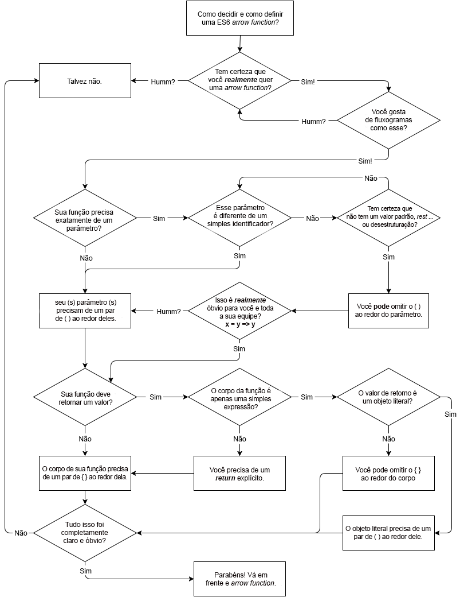

# You Don't Know JS: ES6 & Além
# Capítulo 2: Sintaxe

Se você vem escrevendo JS por algum tempo, é provável que a sintaxe pareça bem familiar à você. Com certeza existem algumas confusões, mas em geral a sintaxe é bem clara e de entendimento razoável, com formato bem similar à outras linguagens.

Entretanto, o ES6 adiciona algumas formas sintáxicas que requerem algum tempo para se familiarizar. Nesse capítulo, iremos navegar através dela para encontrar o que ela nos reserva.

**Dica:** No momento desta escrita, algumas funcionalidades	discutidas neste livro já foram implementadas em diversos navegadores (Firefox, Chrome, etc.), mas algumas foram apenas parcialmente implementadas e muitas outras não foram sequer implementadas ainda. Sua experiência pode ser diversificada ao tentar esses exemplos diretamente. Se for, tente elas utilizando transpiladores, já que a maioria dessas funcionalidades foram cobertas por essas ferramentas. O ES6Fiddle (http://www.es6fiddle.net/) é um playground ótimo, fácil de usar para testar o ES6, já que é o REPL online para o transpilador Babel. (http://babeljs.io/repl/).

## Declarações em blocos de Escopos

Você provavelmente está consciente que a unidade fundamental de escopo de variáveis em JavaScript sempre foi `function`. Se você precisar criar um escopo de bloco, a forma mais prevalente de fazê-lo além da declaração regular de função seria a Expressão de Função Imediatamente Invocada (IIFE). Por exemplo:

```js
var a = 2;

(function IIFE(){
	var a = 3;
	console.log( a );	// 3
})();

console.log( a );		// 2
```

### Declarações `let`

Entretanto, nós podemos criar declarações que estão limitadas à qualquer bloco, chamados (sem nenhuma surpresa) *escopo de bloco* (block scoping). Isso significa que tudo que precisamos é um par de `{ .. }` para criar o escopo. Ao invés de usar `var`, que sempre declara variáveis anexadas ao enclausuramento do escopo da função (ou global, se for *top level*), use `let`:

```js
var a = 2;

{
	let a = 3;
	console.log( a );	// 3
}

console.log( a );		// 2
```

Não é muito comum ou idiomático até o presente momento, usar blocos `{ .. }` soltos, mas de qualquer forma isso sempre foi válido. E desenvolvedores de outras linguagens que contém *escopamento* de blocos (block scoping) irão rapidamente reconhecer este padrão.

Eu acredito que esta é a melhor forma de criar variáveis escopadas em blocos, usando um bloco `{ .. }` dedicado. E ainda mais, você deve sempre colocar as declarações `let` no ponto mais alto do bloco. Se você tiver mais de um a declarar, eu recomendo usar apenas um `let`.

Estéticamente falando, eu sempre prefiro usar o `let` na mesma linha do que a abertura `{`, para deixar claro que este escopo de bloco tem o objetivo de apenas declarar o escopo dessas variáveis.

```js
{	let a = 2, b, c;
	// ..
}
```

Agora, isso parece estranho aos olhos e é provável que não vá corresponder às recomendações dadas na maioria das literaturas sobre ES6. Mas eu tenho razões para minha loucura.

Existe outra forma experimental (não padronizada) de declarações `let` chamadas de `let`-block, que se parece com isso:

```js
let (a = 2, b, c) {
	// ..
}
```

Esta forma é o que eu chamo de escopo de bloco *explícito*, onde a forma da declaração `let ..` que espelha `var`é mais *implícita*, como se ela meio que *sequestrasse* qualquer par de `{ .. }` que for encontrado. Geralmente desenvolvedores acham mecanismos *explícitos* mais *preferíveis*, e eu digo que esse seria um desses casos.

Se você comparar os dois trechos e código, eles são bem similares, e na minha opinião os dois se qualificam estéticamente como escopamento de blocos *explícito*. Infelizmente, a forma `let (..) { .. }`, a mais *explícita* das opções, não foi adotada no ES6. Ela pode ser revisada em um pós-ES6, mas por ora a primeira opção é nossa melhor pedida, eu acho.

Para reforçar a natureza *implícita* das declarações `let ..`, considere seu uso:

```js
let a = 2;

if (a > 1) {
	let b = a * 3;
	console.log( b );		// 6

	for (let i = a; i <= b; i++) {
		let j = i + 10;
		console.log( j );
	}
	// 12 13 14 15 16

	let c = a + b;
	console.log( c );		// 8
}
```

Pequeno quiz antes de olhar novamente para o trecho de código: qua(l/is) variáve(l/is) existe(m) apenas dentro da instrução `if`, e qua(l/is) variáve(l/is) existe(m) apenas dentro do loop `for`?

As respostas: a instrução `if` contém em escopo de bloco as variáveis `b` e `c`, e o loop `for` contém em escopo de bloco as variáveis `i` e `j`.

Você teve que pensar nisso por um instante? Te surpreende que  `i` não tenha sido adicionada ao encerramento do escopo da instrução `if`? Aquela pausa mental e questionadora -- Eu chamo isso de "taxa mental" -- vem do fato de que o esse mecanismo `let` não é só novo para nós, como também é *implícito*.

Existe também o perigo da declaração `let c = ..` aparecer tão abaixo no escopo. Diferente das declarações `var` tradicionais, que são anexadas ao enclausuramento de todo escopo da função independentemente de onde apareçam, as declarações `let` anexam-se ao escopo de bloco mas não são inicializadas até aparecerem no bloco.

Acessar uma declaração de variável `let` antes de sua declaração/inicialização `let ..`, causa um erro, onde de outra forma nas declarações `var` sua ordenação não importa (apenas esteticamente).

Considere:

```js
{
	console.log( a );	// undefined
	console.log( b );	// ReferenceError!

	var a;
	let b;
}
```

**Atenção:** Por conta da referências declaradas com `let` terem sido acessado de forma muito antecipada, esse `ReferenceError` é tecnicamente chamado de um erro de Zona Morta Temporal *Temporal Dead Zone (TDZ)* -- você está acessando uma variável que foi declarada mas não foi inicializada ainda. Esta não será a primeira vez que você verá erros TDZ -- eles estão talhados em diversos lugares no ES6. Além disso, note que *inicializado* não significa explicitamente designar um valor no seu código, visto que `let b;` é totalmente válido. Uma variável que não é designda no momento da declaração é pressuposta a ter o valor designado de `undefined`. Sendo assim `let b;` é o mesmo que `let b = undefined;`. Explicitamente declarado ou não, você não pode acessar `b` até que a instrução `let b` rode.

Uma última pegadinha: `typeof` se comporta de maneira diferente entre variáveis não declaradas (ou declaradas!) e variáveis TDZ. Por exemplo:

```js
{
	// `a` não está declarada
	if (typeof a === "undefined") {
		console.log( "cool" );
	}

	// `b` está declarada, mas em seu TDZ
	if (typeof b === "undefined") {		// ReferenceError!
		// ..
	}

	// ..

	let b;
}
```

A variável `a` não está declarada, então `typeof` é a única maneira segura de verificar sua existência ou não. Mas `typeof b` lança um erro TDZ por lá embaixo no código acontece de haver uma declaração `let b`. Oops.

Agora que já deve estar claro sobre o porquê de eu insistir sobre porque declarações `let` devem estar todas no topo de seu escopo. Essa forma afasta totalmente o erro acidental de acessá-las de maneira precoce. Essa forma também faz torná-la mais *explícita* quando você procura no bloco, qualquer bloco, quais variáveis ele contém.

Seus blocos (instruções `if`, `while` loops, etc.) não precisam compartilhar seus comportamentos originais com seu comportamentos de escopo.

Estas explicitações são da sua parte, é contigo, e se você manter a sua parte com disciplina, esta forma irá te salvar de diversas dores de cabeça com refatorações e evitar tiros no pé.

**Nota:** Para mais informações sobre `let` escopos de blocos, veja o Capítulo 3 do título desta série *Escopos & Closures*.

#### `let` + `for`

A única exceção que eu daria preferência pela forma *explicita* num bloco de declaração é o `let` que aparece no cabeçalho de um `for` loop. O motivo pode parecer confuso, mas eu acho que seja um dos recursos mais importantes do ES6.

Considere:

```js
var funcs = [];

for (let i = 0; i < 5; i++) {
	funcs.push( function(){
		console.log( i );
	} );
}

funcs[3]();		// 3
```

O `let i` no cabeçalho do `for` declara um `i` não só para o `for` loop, mas redeclara um novo `i` para cada interação do loop. Isso significa que closures criadas dentro do loop fecham essas variáveis por iteração do jeito que você esperava.

Se você tentou esse mesmo trecho, mas com o `var i` no cabeçalho do `for` loop, você deveria ter `5` ao invés de `3`, porque haveria apenas um `i` no escopo externo que foi fechado, em vez de um novo `i` para cada função de fechamento.

Você também poderia ter obtido a mesma coisa um pouco mais verbosamente:

```js
var funcs = [];

for (var i = 0; i < 5; i++) {
	let j = i;
	funcs.push( function(){
		console.log( j );
	} );
}

funcs[3]();		// 3
```

Aqui, nós forçadamente criamos um novo `j` para cada iteração, e então a closure trabalha da mesma maneira. Eu prefiro da primeira forma; esta habilidade especial extra é a razão pela qual eu defendo a forma `for (let ..) ..`. Pode se argumentar que é um pouco mais *implícito*, mas isso é *explícito* o bastante, e útil bastante, pro meu gosto.

`let` também funciona do mesmo jeito com os loops `for..in` e `for..of` (veja em "for..of Loops").

### Declarações `const`

Há uma outra forma de declaração com escopo de bloco a ser considerada: o `const`, que cria *constantes*.

O que exatamente é uma constante? É uma variável que se baseia na leitura do valor inicial e definido. Considere:

```js
{
	const a = 2;
	console.log( a );	// 2

	a = 3;				// TypeError!
}
```

Você não tem permissão para alterar o valor que a variável tem uma vez que tenha sido definido, no momento da declaração. A declaração da `const` deve ter uma inicialização explícita. Se você quisesse uma *constante* com o valor `undefined`, você deveria ter declarado `const a = undefined` para obtê-la.

Constantes não são uma restrição ao valor em si, mas à atribuição da variável desse valor. Em outras palavras, o valor não é congelado ou imutável por causa da `const`, apenas a atribuição dele. Se o valor é complexo, como um objeto ou array, o conteúdo do valor ainda poderá ser modificado:

```js
{
	const a = [1,2,3];
	a.push( 4 );
	console.log( a );		// [1,2,3,4]

	a = 42;					// TypeError!
}
```

A variável `a` na verdade não contém um array constante; em vez disso, ele contém uma referência constante ao array. O array em si é livremente mutável.

**Atenção:** Atribuir um objeto ou array como uma constante, significa que o valor não estará disponível para o coletor de lixo até que o escopo léxico dessa constante desapareça pois a referência ao valor nunca pode ser desconfigurada. Isso pode ser desejável, mas tenha cuidado se não for sua intenção!

Essencialmente, declarações `const` reforçam o que estilisticamente sinalizamos com nosso código por anos, onde declaramos o nome da variável de todas as letras em maiúsculo e atribuímos isso algum valor literal que nós tomamos cuidado em nunca mudar. Não existe uma aplicação em uma atribuição `var`, mas agora há com a atribuição `const`, que pode te ajudar a capturar alterações não intencionais.

`const` *pode* ser usada com declarações de variáveis de `for`, `for..in` e `for..of` loops (veja em "for..of Loops"). No entanto, um erro será retornado se houver qualquer tentativa de reatribuição, como a típica cláusula de `i ++` de um `for` loop.

#### `const` Ou Não

Há algumas suposições de que a `const` poderia ser mais otimizável pelo JS em certos cenários do que um `let` ou `var` poderiam ser. Teoricamente, o JS reconhece mais facilmente o valor/tipo da variável que nunca mudará, então, ele pode eliminar qualquer possibilidade de rastreamento.

Se `const` realmente ajuda aqui ou isso é apenas coisa de nossas próprias fantasias e intuições, a decisão muito mais importante a se fazer é se você pretende ter um comportamento constante ou não. Lembre-se: um dos papéis mais importantes para o código-fonte é se comunicar claramente, não para apenas você, mas para seu eu do futuro e outros colaboradores, qual é a sua intenção.

Alguns desenvolvedores preferem começar a declaração de cada variável como uma 'const' e depois relaxar uma declaração para 'let` se for necessário que seu valor seja alterado no código. Essa é uma perspectiva interessante, mas não está claro se ela realmente melhora a legibilidade ou capacidade de raciocínio do código.

Isso não é realmente uma *proteção*, como muitos acreditam, porque o próximo desenvolvedor que quiser alterar o valor da `const` pode cegamente mudar esse `const` para `let` na declaração. Na melhor das hipóteses, isso protege de mudanças acidentais. Mas ainda, além de nossas intuições e sensibilidades, não parece haver uma medida objetiva e clara do que constitui "acidentes" ou prevenção disso. Existem maneiras semelhantes de pensar sobre a aplicação de tipos.

Meu conselho: para evitar códigos potencialmente confusos, use apenas `const` para variáveis que intencionalmente e obviamente você está sinalizando que não irão mudar. Em outras palavras, não *dependa* do `const` para o comportamento do código, mas use-o como uma ferramenta para sinalizar a intenção, quando a intenção puder ser claramente sinalizada.

### Funções de Escopo em Bloco

A partir do ES6, as declarações de função que ocorrem dentro dos blocos são agora definidas para serem escopo nesse bloco. Antes do ES6, as especificações não exigiam isso, mas muitas implementações faziam de qualquer forma. Então agora as especificações atendem a realidade.

Considere:

```js
{
	foo();					// funciona!

	function foo() {
		// ..
	}
}

foo();						// ReferenceError
```

A função `foo()` é declarada dentro do bloco `{...}`, e a partir do ES6 tem um escopo de bloco. Portanto, não está disponível fora desse bloco. Mas também note que ele é “içado” dentro do bloco, ao contrário das declarações do `let`, que sofrem da armadilha de erro TDZ mencionada anteriormente.

O escopo em bloco de uma declaração de função pode ser um problema se você sempre codificou desse jeito, e se baseou no que foi herdado do comportamento de escopo fora do bloco:

```js
if (algumaCoisa) {
	function foo() {
		console.log( "1" );
	}
}
else {
	function foo() {
		console.log( "2" );
	}
}

foo();		// ??
```

Em ambientes pré-ES6, `foo()` imprimiria `”2”`, independentemente do valor de `algumaCoisa`, porque ambas declarações da função foram içadas pelos blocos, e a segunda sempre vence.

No ES6, essa última linha retorna um `ReferenceError`.

## Spread/Rest

O ES6 introduz um novo operador `...` que normalmente é chamado de operador *spread* ou *rest*, dependendo de onde/como ele é usado. Vamos dar uma olhada:

```js
function foo(x,y,z) {
	console.log( x, y, z );
}

foo( ...[1,2,3] );				// 1 2 3
```

Quando `...` é usado na frente de um array (na verdade, qualquer *iterável*, que abordamos no Capítulo 3), ele age para "distribuí-lo" em seus valores individuais.

Você normalmente verá esse uso como é mostrado no trecho anterior, ao distribuir um array como um conjunto de argumentos para uma chamada de função. Neste caso, o `...` atua para nos dar uma substituição sintática mais simples para o método `apply(...)`, que normalmente teríamos usado antes do ES6 como:

```js
foo.apply( null, [1,2,3] );		// 1 2 3
```

Mas o `...` pode ser usado para distribuir/expandir um valor em outros contextos também, como dentro de uma outra declaração de array:

```js
var a = [2,3,4];
var b = [ 1, ...a, 5 ];

console.log( b );					// [1,2,3,4,5]
```

Neste caso, o `...` está basicamente substituindo o `concat(..)`, que se comporta como o `[1].concat( a, [5] )` aqui.

O outro uso comum de `…` pode ser visto essencialmente como o oposto; em vez de distribuindo um valor, o `...` *agrupa* um conjunto de valores em um array. Considere:

```js
function foo(x, y, ...z) {
	console.log( x, y, z );
}

foo( 1, 2, 3, 4, 5 );			// 1 2 [3,4,5]
```

O `…z` neste trecho está essencialmente dizendo: “reúna o *resto* dos argumentos (se houver) em um array chamado de `z`.” Como o `x` foi designado como `1` e o `y` foi designado como `2`, o restante dos argumentos `3`,`4` e `5` foram agrupados em `z`.

Claro, se você não tem nenhum parâmetro nomeado, o `...` agrupa todos os argumentos:

```js
function foo(...args) {
	console.log( args );
}

foo( 1, 2, 3, 4, 5);			// [1,2,3,4,5]
```

**Nota:** O `…args` na declaração da função `foo(...)` é normalmente chamado de “parâmetros restantes”, porque você está coletando o resto dos parâmetros. Eu prefiro “agrupar”, porque é mais descritivo do que ele faz e não o que contém.

A melhor parte deste uso é que ele fornece uma alternativa bastante sólida ao uso do array `arguments` a muito tempo já obsoleto - que na verdade não é realmente um array, mas um objeto parecido com array.  Porque o `args` (ou como você quiser chamar – muitas pessoas preferem chamar de  `r` ou `resto`) é um verdadeiro array, podemos nos livrar de um monte de truques pré-ES6 que criamos para fazer o `arguments` em algo que podemos tratá-lo como um array.

Considere:

```js
// fazendo as coisas à nova maneira ES6
function foo(...args) {
	// `args` já é um array real

	// descarte o primeiro elemento em `args`
	args.shift();

	// passa por todos os `args` como argumentos
	// para `console.log(..)`
	console.log( ...args );
}

// fazendo as coisas à moda antiga pré-ES6
function bar() {
	// transforma `arguments` em um array real
	var args = Array.prototype.slice.call( arguments );

	// adiciona alguns elementos ao final
	args.push( 4, 5 );

	// filtra os números ímpares
	args = args.filter( function(v){
		return v % 2 == 0;
	} );

	// passa por todos os `args` como argumentos
	// para `foo(..)`
	foo.apply( null, args );
}

bar( 0, 1, 2, 3 );					// 2 4
```

O `...args` na declaração da função `foo(...)` reúne os argumentos, e o `...args` na chamada do `console.log(...)` os distribui. Essa é uma boa ilustração dos usos simétricos, mas opostos operadores `...`.

Além do caso do `...` na declaração da função, há outro caso onde `...` é usado para reunir valores, e nós veremos isso mais adiante neste capítulo, na seção “Muitos, poucos, apenas o suficiente”.

## Valores Padrão de Parâmetro

Talvez um dos idiomas mais comuns em JavaScript seja definir um valor padrão para um parâmetro de uma função. A maneira como nós fizemos isso por anos deve ser bastante familiar a:

```js
function foo(x,y) {
	x = x || 11;
	y = y || 31;

	console.log( x + y );
}

foo();				// 42
foo( 5, 6 );		// 11
foo( 5 );			// 36
foo( null, 6 );		// 17
```

É claro que, se você já usou este padrão antes, você sabe como isso é um tanto perigoso como útil, se por exemplo, você precisa ser capaz de transmitir o que seria considerado um valor falso para um dos parâmetros. Considere:

```js
foo( 0, 42 );		// 53 <-- Oops, não 42
```

Por quê? Porque o `0` é falso, e então o `x || 11` resulta em `11`, não o transmitido diretamente em `0`.

Para corrigir essa pegadinha, algumas pessoas vão escrever a validação de uma maneira mais verbosa, assim:

```js
function foo(x,y) {
	x = (x !== undefined) ? x : 11;
	y = (y !== undefined) ? y : 31;

	console.log( x + y );
}

foo( 0, 42 );			// 42
foo( undefined, 6 );	// 17
```

Claro, isso significa que qualquer valor, exceto `undefined`, pode ser transmitido diretamente. No entanto, será assumido que `undefined` indica "Eu não passei isso". Isso funciona muito bem, a não ser que que você realmente precise passar `undefined`.

Nesse caso, você poderia testar para ver se o argumento é realmente omitido, por não estar presente na matriz `arguments`, talvez assim:

```js
function foo(x,y) {
	x = (0 in arguments) ? x : 11;
	y = (1 in arguments) ? y : 31;

	console.log( x + y );
}

foo( 5 );				// 36
foo( 5, undefined );	// NaN
```

Mas como omitir o primeiro argumento `x` sem a possibilidade de passar para qualquer tipo de valor (nem mesmo `undefined`) que sinalize "estou omitindo este argumento"?

`foo(,5)` é tentador, mas é uma sintaxe inválida. `foo.apply(null,[,5])` parece que deve fazer o truque, mas as peculiaridades do `apply(..)` aqui significam que os argumentos são tratados como `[undefined,5]`, que com certeza não são omitidos

Se você investigar mais, verá que só pode omitir argumentos no final (ou seja, no lado direito) simplesmente passando menos argumentos que "esperado", mas você não pode omitir os argumentos no meio ou no início da lista de argumentos. Isso não é possível.

Há um princípio aplicado ao design do JavaScript aqui que é importante lembrar: `undefined` significa *ausente*. Ou seja, não há diferença entre `undefined` e *ausente*, pelo menos no que diz respeito aos argumentos de função.

**Nota:** Estranhamente, existem outros lugares em JS onde esse princípio específico de design não se aplica, como arrays com casas vazios. Veja o título *Tipos & Gramática* desta série para mais informações.

Com tudo isso em mente, agora podemos examinar uma sintaxe útil e agradável adicionada a partir do ES6 para facilitar a atribuição de valores padrão a argumentos ausentes:

```js
function foo(x = 11, y = 31) {
	console.log( x + y );
}

foo();					// 42
foo( 5, 6 );			// 11
foo( 0, 42 );			// 42

foo( 5 );				// 36
foo( 5, undefined );	// 36 <-- `undefined` está faltando
foo( 5, null );			// 5  <-- null é convertido em `0`

foo( undefined, 6 );	// 17 <-- `undefined` está faltando
foo( null, 6 );			// 6  <-- null é convertido em `0`
```

Observe os resultados e a maneira como eles implicam sutis diferenças e semelhanças com abordagens anteriores.

`x = 11` em uma declaração de função é mais parecido com` x! == undefined? x: 11` do que o mais comum `x || 11`, então você deve ter cuidado ao converter seu código pré-ES6 nesta sintaxe do valor do parâmetro ES6 padrão.

**Nota:** Um parâmetro rest/gather (veja "Spread/Rest") não pode ter um valor padrão. Então, enquanto `function foo(...vals=[1,2,3]) {` pode parecer uma capacidade intrigante, não é uma sintaxe válida. Você terá que continuar aplicando esse tipo de lógica manualmente, se necessário.

### Expressões de valor padrão

Os valores padrão de funções podem ser mais do que apenas valores como `31`; pode ser qualquer expressão válida, até mesmo uma chamada de função:

```js
function bar(val) {
	console.log( "bar chamado!" );
	return y + val;
}

function foo(x = y + 3, z = bar( x )) {
	console.log( x, z );
}

var y = 5;
foo();								// "bar chamado!"
									// 8 13
foo( 10 );							// "bar chamado!"
									// 10 15
y = 6;
foo( undefined, 10 );				// 9 10
```

Como você pode ver, as expressões de valor padrão são avaliadas preguiçosamente, o que significa que elas só serão executadas se e quando forem necessárias - ou seja, quando o argumento de um parâmetro for omitido ou for `undefined`.

É um detalhe sutil, mas os parâmetros formais em uma declaração de função estão dentro de seu próprio escopo (pense nisso como uma bolha de escopo envolvendo apenas o `(..)` da declaração da função), não dentro do corpo da função. Isso significa que uma referência a um identificador em uma expressão de valor padrão corresponde primeiro ao escopo dos parâmetros formais antes de procurar um escopo externo. Veja o título *Escopos & Closures* desta série para mais informações.

Considere:

```js
var w = 1, z = 2;

function foo( x = w + 1, y = x + 1, z = z + 1 ) {
	console.log( x, y, z );
}

foo();					// ReferenceError
```

O `w` na expressão de valor padrão` w + 1` procura por `w` no escopo dos parâmetros formais, mas não o encontra, então o` w` do escopo externo é usado. Assim, o `x` na expressão de valor padrão` x + 1` encontra `x` no escopo dos parâmetros formais e, felizmente, o ` x` já foi inicializado, então a designação para `y` funciona bem.

No entanto, o `z` em` z + 1` encontra `z` como uma variável de parâmetro ainda não inicializada no momento, então ele nunca tenta encontrar o` z` do escopo externo.

Como mencionamos na seção "Declarações de let" anteriormente neste capítulo, o ES6 tem um TDZ (Temporal Dead Zone), que impede que uma variável seja acessada em seu estado não inicializado. Como tal, a expressão de valor padrão `z + 1` gera um erro TDZ `ReferenceError`.

Embora não seja necessariamente uma boa ideia para clareza de código, uma expressão de valor padrão pode até ser uma chamada de expressão de função embutida (ou in-line) - normalmente chamada de expressão de função invocada imediatamente (IIFE):

```js
function foo( x =
	(function(v){ return v + 11; })( 31 )
) {
	console.log( x );
}

foo();			// 42
```

Raramente haverá casos em que um IIFE (ou qualquer outra expressão de função in-line executada) seja apropriado para expressões de valor padrão. Se você se sentir tentado a fazer isso, dê um passo atrás e reavalie!

**Atenção:** Se a IIFE tentasse acessar o identificador `x` e não tivesse declarado seu próprio` x`, isso também seria um erro de TDZ, como discutido acima.

A expressão de valor padrão no trecho anterior é considerada uma IIFE desde que, no sentido de que é uma função que é executada imediatamente, através de `(31)`. Se tivéssemos deixado essa parte de lado, o valor padrão atribuído a `x` teria sido apenas uma referência de função, talvez como um retorno de chamada padrão. Provavelmente haverá casos em que esse padrão será bastante útil, como:

```js
function ajax(url, cb = function(){}) {
	// ..
}

	ajax( "http://algum.url.1" );
```

Neste caso, nós essencialmente queremos que o padrão `cb` seja uma chamada de função vazia, se não for especificada. A expressão de função é apenas uma referência a uma função, não uma chamada de função em si (sem invocar `()` no final dela), que realiza esse objetivo.

Desde o começo do JS, há uma peculiaridade pouco conhecida, mas útil, disponível para nós: `Function.prototype` é uma função vazia não operacional. Assim, a declaração poderia ter sido `cb = Function.prototype` e salva a criação das expressões in-line.

## Desestruturação (Destructuring)

ES6 introduz um novo recurso sintático chamado *destructuring* (*desestruturação*), que pode ser um pouco menos confusa se você pensar nela como uma *designação estruturada*. Para entender esse significado, considere:

```js
function foo() {
	return [1,2,3];
}

var tmp = foo(),
	a = tmp[0], b = tmp[1], c = tmp[2];

console.log( a, b, c );				// 1 2 3
```

Como pode ver, criamos uma atribuição manual dos valores no array que `foo()` retorna para as variáveis individuais `a`, `b` e `c` e para isso nós (infelizmente) precisamos da variável `tmp`.

Da mesma forma, podemos fazer o seguinte com objetos:

```js
function bar() {
	return {
		x: 4,
		y: 5,
		z: 6
	};
}

var tmp = bar(),
	x = tmp.x, y = tmp.y, z = tmp.z;

console.log( x, y, z );				// 4 5 6
```

O valor da propriedade `tmp.x` é assinado para variável `x`, e da mesma forma `tmp.y` para `y` e `tmp.z` para `z`.

A atribuição manual de valores indexados por um array ou propriedades de um objeto pode ser considerada como *atribuição estruturada*. O ES6 adiciona uma sintaxe dedicada para *destructuring*, especificamente *array destructuring* e *object destructuring*. Esta sintaxe elimina a necessidade da variável `tmp` nos trechos anteriores, tornando-os muito mais limpos. Considere:

```js
var [ a, b, c ] = foo();
var { x: x, y: y, z: z } = bar();

console.log( a, b, c );				// 1 2 3
console.log( x, y, z );				// 4 5 6
```

Você provavelmente está mais acostumado a ver sintaxes como `[a, b, c]` à direita de uma atribuição `=`, como o valor sendo atribuído.

A desestruturação inverte simetricamente esse padrão, de modo que `[a, b, c]` no lado esquerdo da atribuição `=` é tratado como um tipo de "padrão" para decompor o valor da matriz à direita em atribuições de variáveis separadas.

Da mesma forma, `{x: x, y: y, z: z}` especifica um "padrão" para decompor o valor do objeto de `bar()` em atribuições de variáveis separadas.

### Padrão de Atribuição de Propriedade do Objeto

Vamos nos aprofundar nessa sintaxe `{x: x, ..}` do trecho anterior. Se o nome da propriedade correspondente for igual à variável que você deseja declarar, é possível encurtar a sintaxe:

```js
var { x, y, z } = bar();

console.log( x, y, z );				// 4 5 6
```

Massa demais, né!?

Mas é `{x, ..}` que deixa de fora a parte `x:` ou deixa a parte `: x`? Na verdade estamos deixando de fora a parte `x:` quando usamos a sintaxe mais curta. Pode não parecer um detalhe importante, mas você entenderá sua importância em um momento.

Se você pode escrever o formulário mais curto, por que você deveria escrever o formulário mais longo? Porque essa forma mais longa realmente permite que você atribua uma propriedade a um nome de variável diferente, o que às vezes pode ser bastante útil:

```js
var { x: bam, y: baz, z: bap } = bar();

console.log( bam, baz, bap );		// 4 5 6
console.log( x, y, z );				// ReferenceError
```

Há uma peculiaridade sutil, mas superimportante, para entender essa variação da forma de desestruturação do objeto. Para ilustrar por que pode ser uma pegadinha que precisa de atenção, vamos considerar o "padrão" de como os valores literais de objeto normais são especificados:

```js
var X = 10, Y = 20;

var o = { a: X, b: Y };

console.log( o.a, o.b );			// 10 20
```

Em `{a: X, b: Y}`, sabemos que `a` é a propriedade do objeto, e `X` é o valor de origem que é atribuído a ela. Em outras palavras, o padrão sintático é `target: source` ou, mais obviamente, `property-alias: value`. Intuitivamente entendemos isso porque é o mesmo que `=`, onde o padrão é 'target = source'.

No entanto, ao usar a atribuição de objetos destrutivos - isto é, colocando a sintaxe de visual literal do objeto `{..}` no lado esquerdo do operador `=`, você inverte o padrão `target: source`.

Lembre-se:

```js
var { x: bam, y: baz, z: bap } = bar();
```

O padrão de sintaxe aqui é `source: target` (ou `value: variable-alias`). `x: bam` significa que a propriedade` x` é o valor de origem e `bam` é a variável de destino a ser designada. Em outras palavras, os literais de objeto são `target <- source`, e as atribuições de desestruturação de objetos são `source -> target`. Percebe como isso é invertido?

Há outra maneira de pensar sobre essa sintaxe, o que pode ajudar a aliviar a confusão. Considere:

```js
var aa = 10, bb = 20;

var o = { x: aa, y: bb };
var     { x: AA, y: BB } = o;

console.log( AA, BB );				// 10 20
```

Na linha `{x: aa, y: bb}`, `x` e` y` representam as propriedades do objeto. Na linha `{x: AA, y: BB}`, o `x` e o `y` *também* representam as propriedades do objeto.

Lembre-se de como eu afirmei anteriormente que `{x, ..}` estava deixando de fora a parte `x:`? Nessas duas linhas, se você apagar as partes `x:` e `y:` nesse trecho, você ficará apenas com `aa, bb` e` AA, BB`, que na verdade - apenas conceitualmente, não atualmente - são atribuições de `aa` para` AA` e de `bb` para `BB`.

Assim, essa simetria pode ajudar a explicar por que o padrão sintático foi invertido intencionalmente para esse recurso do ES6.

**Nota:** Eu teria preferido que a sintaxe fosse `{AA: x, BB: y}` para a atribuição de desestruturação, já que isso preservaria a consistência do padrão mais conhecido de `target: source` para ambos os usos. Ai, estou tendo que treinar meu cérebro para a inversão, como alguns leitores também podem ter que fazer.

### Não só declarações

Até agora, usamos a atribuição de desestruturação com declarações `var` (obviamente, elas também poderiam usar `let` e `const`), mas a desestruturação é uma operação de atribuição geral, não apenas uma declaração.

Considere:

```js
var a, b, c, x, y, z;

[a,b,c] = foo();
( { x, y, z } = bar() );

console.log( a, b, c );				// 1 2 3
console.log( x, y, z );				// 4 5 6
```

As variáveis já podem ser declaradas e, em seguida, a desestruturação só executa atribuições, exatamente como já vimos.

**Nota:** Para a desestruturação de objetos especificamente, ao sair de um declarador `var` / `let` / `const`, nós tivemos que cercar toda a expressão de atribuição em `()`, porque senão o `{. .}` no lado esquerdo, como o primeiro elemento na declaração é considerado como uma instrução de bloco em vez de um objeto.

De fato, expressões de atribuição (`a`,`y`, etc.) não precisam ser apenas identificadores de variáveis. Qualquer coisa que seja uma expressão de atribuição válida é permitida. Por exemplo:

```js
var o = {};

[o.a, o.b, o.c] = foo();
( { x: o.x, y: o.y, z: o.z } = bar() );

console.log( o.a, o.b, o.c );		// 1 2 3
console.log( o.x, o.y, o.z );		// 4 5 6
```

Você pode até usar expressões de propriedade calculadas na desestruturação. Leve em consideração:

```js
var which = "x",
	o = {};

( { [which]: o[which] } = bar() );

console.log( o.x );					// 4
```

A parte `[which]:` é a propriedade computada, o que resulta em `x` - a propriedade para desestruturada do objeto em questão como a origem da atribuição. A parte `o[which]` é apenas uma referência de chave de objeto normal, o que equivale a `o.x` como o destino da atribuição.

Você pode usar atribuições gerais para criar mapeamentos / transformações de objetos, como por exemplo:

```js
var o1 = { a: 1, b: 2, c: 3 },
	o2 = {};

( { a: o2.x, b: o2.y, c: o2.z } = o1 );

console.log( o2.x, o2.y, o2.z );	// 1 2 3
```

Ou você pode mapear um objeto para um array, como:

```js
var o1 = { a: 1, b: 2, c: 3 },
	a2 = [];

( { a: a2[0], b: a2[1], c: a2[2] } = o1 );

console.log( a2 );					// [1,2,3]
```

Ou o contrário:

```js
var a1 = [ 1, 2, 3 ],
	o2 = {};

[ o2.a, o2.b, o2.c ] = a1;

console.log( o2.a, o2.b, o2.c );	// 1 2 3
```

Ou você pode reordenar um array para outro:

```js
var a1 = [ 1, 2, 3 ],
	a2 = [];

[ a2[2], a2[0], a2[1] ] = a1;

console.log( a2 );					// [2,3,1]
```

Você também pode resolver a tarefa tradicional "trocar duas variáveis" sem uma variável temporária:

```js
var x = 10, y = 20;

[ y, x ] = [ x, y ];

console.log( x, y );				// 20 10
```

**Atenção:** Tenha cuidado: você não precisa misturar declaração com atribuição, a menos que você queira que todas as expressões de atribuição *também* sejam tratadas como declarações.  Caso contrário, você receberá erros de sintaxe. É por isso que no exemplo anterior eu tive que fazer `var a2 = []` separadamente da atribuição de desestruturação  `[a2 [0], ..] = ..`. Não faria sentido tentar `var [a2 [0], ..] = ..`, porque `a2 [0]` não é um identificador de declaração válido; obviamente, não é possível criar implicitamente uma declaração `var a2 = []` para usar.

### Atribuições repetidas

A forma de desestruturação de objetos permite que uma propriedade de origem (mantendo qualquer tipo de valor) seja listada várias vezes. Por exemplo:

```js
var { a: X, a: Y } = { a: 1 };

X;	// 1
Y;	// 1
```

Isso também significa que você pode desconstruir uma propriedade de sub-objeto/array e também capturar o próprio valor do sub-objeto/array propriamente dito. Leve em consideração:

```js
var { a: { x: X, x: Y }, a } = { a: { x: 1 } };

X;	// 1
Y;	// 1
a;	// { x: 1 }

( { a: X, a: Y, a: [ Z ] } = { a: [ 1 ] } );

X.push( 2 );
Y[0] = 10;

X;	// [10,2]
Y;	// [10,2]
Z;	// 1
```

Uma palavra de cautela sobre a desestruturação: pode ser tentador listar todas as atribuições de desestruturação em uma única linha, como foi feito até agora em nossa discussão. No entanto, é muito mais útil distribuir padrões de atribuição de desestruturação em várias linhas, usando o recuo adequado, bem como você faria em JSON ou com um valor literal de objeto, para fins de legibilidade.

```js
// harder to read:
var { a: { b: [ c, d ], e: { f } }, g } = obj;

// better:
var {
	a: {
		b: [ c, d ],
		e: { f }
	},
	g
} = obj;
```

Lembre-se: **O propósito da desestruturação não é apenas digitar menos código, mas uma maior legibilidade declarativa.**

#### Destruturação de Expressões de Atribuição

A expressão de atribuição com a desestruturação de objetos ou arrays tem o valor completo do objeto/array à direita como o valor de conclusão. Considere que:

```js
var o = { a:1, b:2, c:3 },
	a, b, c, p;

p = { a, b, c } = o;

console.log( a, b, c );			// 1 2 3
p === o;						// true
```

No fragmento anterior, um `p` recebeu a referência de objeto `o`, não um dos valores `a`,` b` ou `c`. O mesmo acontece com a desestruturação de um array:

```js
var o = [1,2,3],
	a, b, c, p;

p = [ a, b, c ] = o;

console.log( a, b, c );			// 1 2 3
p === o;						// true
```

Ao carregar o valor de objeto/array através da conclusão, você pode agrupar expressões de atribuição de desestruturação:

```js
var o = { a:1, b:2, c:3 },
	p = [4,5,6],
	a, b, c, x, y, z;

( {a} = {b,c} = o );
[x,y] = [z] = p;

console.log( a, b, c );			// 1 2 3
console.log( x, y, z );			// 4 5 4
```

### Muitos, poucos, apenas o suficiente

Com a atribuição de desestruturação do array e a atribuição de desestruturação do objeto, não é necessário atribuir todos os valores que estão presentes. Por exemplo:

```js
var [,b] = foo();
var { x, z } = bar();

console.log( b, x, z );				// 2 4 6
```

Os valores `1` e `3` retornados de `foo()` são descartados, assim como o valor `5` de `bar()`.

Da mesma forma, se você tentar atribuir mais valores do que os que estão presentes no valor que você está desestruturando/decompondo, você terá um esplêndido fallback `undefined`, como ja era de se esperar:

```js
var [,,c,d] = foo();
var { w, z } = bar();

console.log( c, z );				// 3 6
console.log( d, w );				// undefined undefined
```

Esse comportamento segue simetricamente igual ao princípio de "faltando `undefined`".

Analisamos o operador `...` anteriormente neste capítulo, e vimos que às vezes ele pode ser usado para distribuir um valor de array em seus valores separados, e às vezes, pode ser usado para fazer o oposto: para agrupar um conjunto de valores juntos em um array.

Além de usar gather/rest em declarações de função, `...` pode executar o mesmo comportamento em tarefas de desestruturação. Para ilustrar, vamos relembrar um trecho do início deste capítulo:

```js
var a = [2,3,4];
var b = [ 1, ...a, 5 ];

console.log( b );					// [1,2,3,4,5]
```

Aqui vemos que `... a` está distribuindo `a` fora, porque aparece na posição de valor `[..]`. Se `... a` aparecer em uma posição de desestruturação do array, ele executa o comportamento de gather/agrupar:

```js
var a = [2,3,4];
var [ b, ...c ] = a;

console.log( b, c );				// 2 [3,4]
```

A atribuição de desestruturação `var [..] = a` espalha o 'a' para ser atribuído ao padrão descrito em` [..] `. A primeira parte chama `b` para o primeiro valor em `a` (`2`). Mas então `...c` junta o resto dos valores (`3` e `4`) em um array chamado de `c`.

**Nota:** Vimos como o `...` funciona com arrays, mas e com objetos? Não é uma funcionalidade do ES6, mas veja o Capítulo 8 para a discussão de uma possível função "além do ES6" na qual `...` trabalha com a distribuição ou agrupamento de objetos.

### Atribuição de valor padrão

Ambas as formas de desestruturação podem oferecer uma opção de valor padrão para uma atribuição, usando a sintaxe `=` semelhante aos valores de argumento de função padrão discutidos anteriormente.

Considere:

```js
var [ a = 3, b = 6, c = 9, d = 12 ] = foo();
var { x = 5, y = 10, z = 15, w = 20 } = bar();

console.log( a, b, c, d );			// 1 2 3 12
console.log( x, y, z, w );			// 4 5 6 20
```

Você pode combinar a atribuição de valor padrão com a sintaxe de expressão de atribuição, alternativa coberta anteriormente. Por exemplo:

```js
var { x, y, z, w: WW = 20 } = bar();

console.log( x, y, z, WW );			// 4 5 6 20
```

Tenha cuidado para não se confundir (ou a outros desenvolvedores que leem seu código) se você usa um objeto ou array como o valor padrão em uma desestruturação. Você pode criar algum codigo realmente muito difícil de entender.

```js
var x = 200, y = 300, z = 100;
var o1 = { x: { y: 42 }, z: { y: z } };

( { y: x = { y: y } } = o1 );
( { z: y = { y: z } } = o1 );
( { x: z = { y: x } } = o1 );
```

Você pode dizer a partir desse trecho de código que valores `x`, `y`, e `z` terão no final? Leva um momento de reflexão, imagino. Eu terminarei o suspense:

```js
console.log( x.y, y.y, z.y );		// 300 100 42
```
O ponto aqui é: a desestruturação é ótima e pode ser muito útil, mas também é uma espada afiada que pode causar lesões (no cérebro de alguém) se usada imprudentemente.

### Desestruturação aninhada

Se os valores que você esta desestruturando tiverem objetos ou arrays aninhados, você poderá desestruturar esses valores também:

```js
var a1 = [ 1, [2, 3, 4], 5 ];
var o1 = { x: { y: { z: 6 } } };

var [ a, [ b, c, d ], e ] = a1;
var { x: { y: { z: w } } } = o1;

console.log( a, b, c, d, e );		// 1 2 3 4 5
console.log( w );					// 6
```

A desestruturação aninhada pode ser uma maneira simples de nivelar namespaces de objeto. Por exemplo:

```js
var App = {
	model: {
		User: function(){ .. }
	}
};

// ao invés de:
// var User = App.model.User;

var { model: { User } } = App;
```

### Desestruturação de Parâmetros

No trecho a seguir, você pode identificar a atribuição?

```js
function foo(x) {
	console.log( x );
}

foo( 42 );
```
A atribuição é meio que escondida: `42` (o argumento) é atribuído a `x` (o parâmetro) quando `foo(42)` é executado. Se o pareamento parâmetro/argumento é uma atribuição, então é lógico que é uma atribuição que pode ser desestruturada, certo? Claro!

Considere a desestruturação de arrays para parâmetros:

```js
function foo( [ x, y ] ) {
	console.log( x, y );
}

foo( [ 1, 2 ] );					// 1 2
foo( [ 1 ] );						// 1 undefined
foo( [] );							// undefined undefined
```

Desestruturação de objeto para parâmetros também funciona:

```js
function foo( { x, y } ) {
	console.log( x, y );
}

foo( { y: 1, x: 2 } );				// 2 1
foo( { y: 42 } );					// undefined 42
foo( {} );							// undefined undefined
```

Esta técnica é uma aproximação de argumentos nomeados (um recurso a muito solicitado para JS!), em que as propriedades no objeto são mapeados para os parâmetros desestruturados com os mesmos nomes. Isso também significa que nós obtemos parâmetros opcionais (em qualquer posição), como você pode ver deixando de fora o "parâmetro" `x` funcionou como seria de esperar. 

Naturalmente, todas as variações de desestruturação discutidas anteriormente estão disponíveis para nós com a desestruturação de parâmetros, incluindo a desestruturação aninhada, valores padrão e muito mais. A desestruturação também mistura bem com outros recursos de parâmetro de função ES6, como valores de parâmetro padrão e parâmetros rest/gather.


Considere estas ilustrações rápidas (certamente não exaustivas das possíveis variações):

```js
function f1([ x=2, y=3, z ]) { .. }
function f2([ x, y, ...z], w) { .. }
function f3([ x, y, ...z], ...w) { .. }

function f4({ x: X, y }) { .. }
function f5({ x: X = 10, y = 20 }) { .. }
function f6({ x = 10 } = {}, { y } = { y: 10 }) { .. }
```
Vamos pegar um exemplo deste trecho e examiná-lo, para fins de ilustração:

```js
function f3([ x, y, ...z], ...w) {
	console.log( x, y, z, w );
}

f3( [] );							// undefined undefined [] []
f3( [1,2,3,4], 5, 6 );				// 1 2 [3,4] [5,6]
```
Temos dois operadores `...` em uso aqui, e ambos estão reunindo valores em arrays (`z` e `w`), embora `...z` agrupa o resto dos valores que sobraram do array no primeiro argumento, enquanto `...w` agrupa do resto de argumentos principais depois do primeiro.

#### Valores Padrão de Desestruturação + Valores Padrão de Parâmetro

Há um ponto sutil que você deve prestar atenção especial -- a diferença de comportamento entre um valor padrão de desestruturação e um valor padrão de parâmetro de função. Por exemplo:

```js
function f6({ x = 10 } = {}, { y } = { y: 10 }) {
	console.log( x, y );
}

f6();								// 10 10
```

À primeira vista, pareceria que declaramos um valor padrão de `10` para ambos os parâmetros `x` e `y`, mas de duas maneiras diferentes. No entanto, essas duas abordagens diferentes se comportarão de forma diferente em certos casos, e a diferença é terrivelmente sutil.

Considere:

```js
f6( {}, {} );						// 10 undefined
```

Espera, por que isso aconteceu? É bem claro que o parâmetro nomeado `x` assume o padrão `10` se não for passado como uma propriedade de mesmo nome no objeto do primeiro argumento.

Mas e quanto ao `y` ser `undefined`? O valor `{ y: 10 }` é um objeto como valor padrão de parâmetro de função, não um valor padrão de desestruturação. Como tal, ele só se aplica se o segundo argumento não for passado de forma alguma, ou for passado como `undefined`.

No trecho anterior, *estamos* passando um segundo argumento (`{}`), então o valor padrão `{ y: 10 }` não é usado, e a desestruturação `{ y }` ocorre contra o valor de objeto vazio `{}` que foi passado.

Agora, compare `{ y } = { y: 10 }` com `{ x = 10 } = {}`.

Para o uso da forma do `x`, se o primeiro argumento da função for omitido ou `undefined`, o objeto vazio padrão `{}` se aplica. Então, qualquer que seja o valor na posição do primeiro argumento -- seja o padrão `{}` ou o que você passou -- é desestruturado com o `{ x = 10 }`, que verifica se uma propriedade `x` é encontrada, e se não for encontrada (ou for `undefined`), o valor padrão `10` é aplicado ao parâmetro nomeado `x`.

Respire fundo. Releia esses últimos parágrafos algumas vezes. Vamos revisar via código:

```js
function f6({ x = 10 } = {}, { y } = { y: 10 }) {
	console.log( x, y );
}

f6();								// 10 10
f6( undefined, undefined );			// 10 10
f6( {}, undefined );				// 10 10

f6( {}, {} );						// 10 undefined
f6( undefined, {} );				// 10 undefined

f6( { x: 2 }, { y: 3 } );			// 2 3
```

Em geral, parece que o comportamento padrão do parâmetro `x` é provavelmente o caso mais desejável e sensato em comparação ao do `y`. Dessa forma, é importante entender por que e como a forma `{ x = 10 } = {}` é diferente da forma `{ y } = { y: 10 }`.

Se isso ainda estiver um pouco nebuloso, volte e leia novamente, e brinque com isso por conta própria. Seu eu do futuro irá te agradecer por ter dedicado tempo para entender corretamente esse detalhe de nuance de pegadinha tão sutil.

#### Valores Padrão Aninhados: Desestruturados e Reestruturados

Embora possa a princípio ser difícil de entender, um idioma interessante emerge para definir valores padrão para as propriedades de um objeto aninhado: usar a desestruturação de objetos junto com o que eu chamaria de *reestruturação*.

Considere um conjunto de valores padrão em uma estrutura de objeto aninhado, como o seguinte:

```js
// taken from: http://es-discourse.com/t/partial-default-arguments/120/7

var defaults = {
	options: {
		remove: true,
		enable: false,
		instance: {}
	},
	log: {
		warn: true,
		error: true
	}
};
```

Agora, digamos que você tenha um objeto chamado `config`, que tem alguns desses aplicados, mas talvez não todos, e você gostaria de definir todos os valores padrão neste objeto nos pontos faltantes, mas sem sobrescrever configurações específicas já presentes:

```js
var config = {
	options: {
		remove: false,
		instance: null
	}
};
```

Você pode, é claro, fazer isso manualmente, como talvez tenha feito no passado:

```js
config.options = config.options || {};
config.options.remove = (config.options.remove !== undefined) ?
	config.options.remove : defaults.options.remove;
config.options.enable = (config.options.enable !== undefined) ?
	config.options.enable : defaults.options.enable;
...
```

Eca.

Outros podem preferir a abordagem de atribuir-sobrescrever para esta tarefa. Você pode ser tentado pelo utilitário `Object.assign(..)` do ES6 (veja o Capítulo 6) a clonar primeiro as propriedades de `defaults` e depois sobrescrevê-las com as propriedades clonadas de `config`, assim:

```js
config = Object.assign( {}, defaults, config );
```

Isso parece bem mais legal, né? Mas há um grande problema! `Object.assign(..)` é raso, o que significa que quando ele copia `defaults.options`, ele apenas copia aquela referência de objeto, sem clonar profundamente as propriedades daquele objeto para um objeto `config.options`. O `Object.assign(..)` precisaria ser aplicado (de forma meio "recursiva") em todos os níveis da árvore do seu objeto para obter a clonagem profunda que você espera.

**Nota:** Muitas bibliotecas/frameworks utilitários de JS fornecem sua própria opção para clonagem profunda de um objeto, mas essas abordagens e suas pegadinhas estão além do nosso escopo de discussão aqui.

Então, vamos examinar se a desestruturação de objetos com valores padrão do ES6 pode ajudar em algo:

```js
config.options = config.options || {};
config.log = config.log || {};
({
	options: {
		remove: config.options.remove = defaults.options.remove,
		enable: config.options.enable = defaults.options.enable,
		instance: config.options.instance = defaults.options.instance
	} = {},
	log: {
		warn: config.log.warn = defaults.log.warn,
		error: config.log.error = defaults.log.error
	} = {}
} = config);
```

Não tão legal quanto a falsa promessa do `Object.assign(..)` (já que ele é apenas raso), mas é melhor que a abordagem manual por uma boa margem, eu acho. Ainda assim, infelizmente é verboso e repetitivo.

A abordagem do trecho anterior funciona porque estou hackeando o mecanismo de desestruturação e valores padrão para fazer as verificações de `=== undefined` da propriedade e as decisões de atribuição por mim. É um truque no sentido de que estou desestruturando `config` (veja o `= config` no final do trecho), mas estou reatribuindo todos os valores desestruturados de volta para `config`, com as referências de atribuição `config.options.enable`.

Ainda é demais, no entanto. Vamos ver se podemos melhorar alguma coisa.

O truque a seguir funciona melhor se você souber que todas as várias propriedades que está desestruturando têm nomes únicos. Você ainda pode fazê-lo mesmo que esse não seja o caso, mas não fica tão legal -- você terá que fazer a desestruturação em etapas, ou criar variáveis locais únicas como aliases temporários.

Se desestruturarmos completamente todas as propriedades em variáveis de nível superior, podemos então reestruturar imediatamente para reconstituir a estrutura de objeto aninhado original.

Mas todas aquelas variáveis temporárias por aí poluiriam o escopo. Então, vamos usar block scoping (veja "Declarações em blocos de Escopos" mais cedo neste capítulo) com um bloco `{ }` geral envolvente:

```js
// mescla `defaults` em `config`
{
	// desestrutura (com atribuições de valor padrão)
	let {
		options: {
			remove = defaults.options.remove,
			enable = defaults.options.enable,
			instance = defaults.options.instance
		} = {},
		log: {
			warn = defaults.log.warn,
			error = defaults.log.error
		} = {}
	} = config;

	// reestrutura
	config = {
		options: { remove, enable, instance },
		log: { warn, error }
	};
}
```

Isso parece bem mais legal, né?

**Nota:** Você também poderia alcançar o enclausuramento de escopo com uma IIFE de arrow ao invés do bloco `{ }` geral e das declarações `let`. Suas atribuições/valores padrão de desestruturação ficariam na lista de parâmetros e sua reestruturação seria a instrução `return` no corpo da função.

A sintaxe `{ warn, error }` na parte da reestruturação pode parecer nova para você; isso se chama "propriedades concisas" e abordamos isso na próxima seção!

## Extensões de Literais de Objeto

O ES6 adiciona um número de importantes extensões de conveniência ao humilde literal de objeto `{ .. }`.

### Propriedades Concisas

Você certamente está familiarizado com a declaração de literais de objeto nesta forma:

```js
var x = 2, y = 3,
	o = {
		x: x,
		y: y
	};
```

Se sempre pareceu redundante dizer `x: x` por toda parte, há boas notícias. Se você precisa definir uma propriedade que tem o mesmo nome de um identificador léxico, você pode encurtá-la de `x: x` para `x`. Considere:

```js
var x = 2, y = 3,
	o = {
		x,
		y
	};
```

### Métodos Concisos

Em um espírito similar às propriedades concisas que acabamos de examinar, funções anexadas a propriedades em literais de objeto também têm uma forma concisa, por conveniência.

A forma antiga:

```js
var o = {
	x: function(){
		// ..
	},
	y: function(){
		// ..
	}
}
```

E a partir do ES6:

```js
var o = {
	x() {
		// ..
	},
	y() {
		// ..
	}
}
```

**Atenção:** Embora `x() { .. }` pareça ser apenas uma forma abreviada de `x: function(){ .. }`, métodos concisos têm comportamentos especiais que suas contrapartes mais antigas não têm; especificamente, a permissão para `super` (veja "Object `super`" mais adiante neste capítulo).

Geradores (veja o Capítulo 4) também têm uma forma de método conciso:

```js
var o = {
	*foo() { .. }
};
```

#### Concisamente Sem Nome

Embora essa forma abreviada de conveniência seja bem atraente, há uma pegadinha sutil para ficar atento. Para ilustrar, vamos examinar um código pré-ES6 como o seguinte, que você poderia tentar refatorar para usar métodos concisos:

```js
function runSomething(o) {
	var x = Math.random(),
		y = Math.random();

	return o.something( x, y );
}

runSomething( {
	something: function something(x,y) {
		if (x > y) {
			// chama recursivamente com `x`
			// e `y` trocados
			return something( y, x );
		}

		return y - x;
	}
} );
```

Esse código obviamente bobo apenas gera dois números aleatórios e subtrai o menor do maior. Mas o importante aqui não é o que ele faz, mas sim como ele é definido. Vamos focar no literal de objeto e na definição da função, como vemos aqui:

```js
runSomething( {
	something: function something(x,y) {
		// ..
	}
} );
```

Por que dizemos tanto `something:` quanto `function something`? Isso não é redundante? Na verdade, não, ambos são necessários para propósitos diferentes. A propriedade `something` é como podemos chamar `o.something(..)`, meio que como seu nome público. Mas o segundo `something` é um nome léxico para referenciar a função de dentro de si mesma, para propósitos de recursão.

Você consegue ver por que a linha `return something(y,x)` precisa do nome `something` para referenciar a função? Não há um nome léxico para o objeto, de modo que ela pudesse ter dito `return o.something(y,x)` ou algo desse tipo.

Essa é, na verdade, uma prática bem comum quando o literal de objeto de fato tem um nome identificador, como:

```js
var controller = {
	makeRequest: function(..){
		// ..
		controller.makeRequest(..);
	}
};
```

Isso é uma boa ideia? Talvez, talvez não. Você está assumindo que o nome `controller` sempre apontará para o objeto em questão. Mas é bem possível que não -- a função `makeRequest(..)` não controla o código externo e portanto não pode forçar que isso seja o caso. Isso pode voltar para te morder.

Outros preferem usar `this` para definir tais coisas:

```js
var controller = {
	makeRequest: function(..){
		// ..
		this.makeRequest(..);
	}
};
```

Isso parece bom, e deveria funcionar se você sempre invocar o método como `controller.makeRequest(..)`. Mas agora você tem uma pegadinha de binding de `this` se fizer algo como:

```js
btn.addEventListener( "click", controller.makeRequest, false );
```

É claro, você pode resolver isso passando `controller.makeRequest.bind(controller)` como a referência do handler para vincular o evento. Mas eca -- não é muito atraente.

Ou e se sua chamada interna `this.makeRequest(..)` precisar ser feita de dentro de uma função aninhada? Você terá outro risco de binding de `this`, que as pessoas frequentemente resolvem com o gambiarroso `var self = this`, como:

```js
var controller = {
	makeRequest: function(..){
		var self = this;

		btn.addEventListener( "click", function(){
			// ..
			self.makeRequest(..);
		}, false );
	}
};
```

Mais eca.

**Nota:** Para mais informações sobre as regras de binding de `this` e suas pegadinhas, veja os Capítulos 1-2 do título *this & Object Prototypes* desta série.

OK, o que tudo isso tem a ver com métodos concisos? Lembre-se da nossa definição do método `something(..)`:

```js
runSomething( {
	something: function something(x,y) {
		// ..
	}
} );
```

O segundo `something` aqui fornece um identificador léxico super conveniente que sempre apontará para a própria função, nos dando a referência perfeita para recursão, binding/unbinding de eventos, e assim por diante -- sem mexer com `this` ou tentar usar uma referência de objeto não confiável.

Ótimo!

Então, agora tentamos refatorar aquela referência de função para esta forma de método conciso do ES6:

```js
runSomething( {
	something(x,y) {
		if (x > y) {
			return something( y, x );
		}

		return y - x;
	}
} );
```

Parece bom à primeira vista, exceto que este código vai quebrar. A chamada `return something(..)` não encontrará um identificador `something`, então você obterá um `ReferenceError`. Oops. Mas por quê?

O trecho de ES6 acima é interpretado com o significado:

```js
runSomething( {
	something: function(x,y){
		if (x > y) {
			return something( y, x );
		}

		return y - x;
	}
} );
```

Olhe com atenção. Você vê o problema? A definição de método conciso implica `something: function(x,y)`. Vê como o segundo `something` no qual estávamos confiando foi omitido? Em outras palavras, métodos concisos implicam expressões de função anônimas.

É, eca.

**Nota:** Você pode se sentir tentado a pensar que arrow functions `=>` são uma boa solução aqui, mas elas são igualmente insuficientes, já que também são expressões de função anônimas. Iremos cobri-las em "Arrow Functions" mais adiante neste capítulo.

A notícia parcialmente redentora é que nosso método conciso `something(x,y)` não será totalmente anônimo. Veja "Nome de Funções" no Capítulo 7 para informações sobre as regras de inferência de nomes de função do ES6. Isso não vai nos ajudar com nossa recursão, mas pelo menos ajuda com a depuração.

Então, o que nos resta concluir sobre métodos concisos? Eles são curtos e doces, e uma conveniência agradável. Mas você só deveria usá-los se nunca for precisar deles para fazer recursão ou binding/unbinding de eventos. Caso contrário, mantenha suas definições de método à moda antiga `something: function something(..)`.

Muitos dos seus métodos provavelmente vão se beneficiar das definições de método conciso, então isso é uma ótima notícia! Apenas tenha cuidado com os poucos onde há um risco de perda de nome.

#### Getter/Setter do ES5

Tecnicamente, o ES5 definiu formas de literais getter/setter, mas elas não pareceram ser muito usadas, principalmente devido à falta de transpiladores para lidar com aquela nova sintaxe (a única grande nova sintaxe adicionada no ES5, na verdade). Então, embora não seja um recurso novo do ES6, vamos relembrar brevemente aquela forma, já que provavelmente será muito mais útil daqui pra frente com o ES6.

Considere:

```js
var o = {
	__id: 10,
	get id() { return this.__id++; },
	set id(v) { this.__id = v; }
}

o.id;			// 10
o.id;			// 11
o.id = 20;
o.id;			// 20

// e:
o.__id;			// 21
o.__id;			// 21 -- ainda!
```

Essas formas de literal getter e setter também estão presentes em classes; veja o Capítulo 3.

**Atenção:** Pode não ser óbvio, mas o literal setter deve ter exatamente um parâmetro declarado; omiti-lo ou listar outros é uma sintaxe ilegal. O único parâmetro obrigatório *pode* usar desestruturação e valores padrão (por exemplo, `set id({ id: v = 0 }) { .. }`), mas o gather/rest `...` não é permitido (`set id(...v) { .. }`).

### Nomes de Propriedade Computados

Você provavelmente já esteve em uma situação como o trecho a seguir, onde você tem um ou mais nomes de propriedade que vêm de algum tipo de expressão e portanto não podem ser colocados no literal de objeto:

```js
var prefix = "user_";

var o = {
	baz: function(..){ .. }
};

o[ prefix + "foo" ] = function(..){ .. };
o[ prefix + "bar" ] = function(..){ .. };
..
```

O ES6 adiciona uma sintaxe à definição de literal de objeto que permite especificar uma expressão que deve ser computada, cujo resultado é o nome da propriedade atribuído. Considere:

```js
var prefix = "user_";

var o = {
	baz: function(..){ .. },
	[ prefix + "foo" ]: function(..){ .. },
	[ prefix + "bar" ]: function(..){ .. }
	..
};
```

Qualquer expressão válida pode aparecer dentro do `[ .. ]` que fica na posição do nome de propriedade da definição do literal de objeto.

Provavelmente o uso mais comum de nomes de propriedade computados será com `Symbol`s (que cobrimos em "Symbols" mais adiante neste capítulo), como:

```js
var o = {
	[Symbol.toStringTag]: "really cool thing",
	..
};
```

`Symbol.toStringTag` é um valor especial embutido, que avaliamos com a sintaxe `[ .. ]`, para que possamos atribuir o valor `"really cool thing"` ao nome de propriedade especial.

Nomes de propriedade computados também podem aparecer como o nome de um método conciso ou de um gerador conciso:

```js
var o = {
	["f" + "oo"]() { .. }	// método conciso computado
	*["b" + "ar"]() { .. }	// gerador conciso computado
};
```

### Definindo `[[Prototype]]`

Não cobriremos prototypes em detalhes aqui, então para mais informações, veja o título *this & Object Prototypes* desta série.

Às vezes será útil atribuir o `[[Prototype]]` de um objeto ao mesmo tempo em que você declara seu literal de objeto. O seguinte tem sido uma extensão não padronizada em muitos motores de JS há algum tempo, mas é padronizado a partir do ES6:

```js
var o1 = {
	// ..
};

var o2 = {
	__proto__: o1,
	// ..
};
```

`o2` é declarado com um literal de objeto normal, mas também está `[[Prototype]]`-vinculado a `o1`. O nome de propriedade `__proto__` aqui também pode ser uma string `"__proto__"`, mas note que ele *não pode* ser o resultado de um nome de propriedade computado (veja a seção anterior).

`__proto__` é controverso, para dizer o mínimo. É uma extensão proprietária ao JS com décadas de idade que é finalmente padronizada, meio a contragosto ao que parece, no ES6. Muitos desenvolvedores acham que ela nunca deveria ser usada. Na verdade, ela está no "Anexo B" do ES6, que é a seção que lista coisas que o JS sente que precisa padronizar apenas por razões de compatibilidade.

**Atenção:** Embora eu esteja endossando de forma restrita o `__proto__` como uma chave em uma definição de literal de objeto, eu definitivamente não endosso usá-lo em sua forma de propriedade de objeto, como `o.__proto__`. Aquela forma é tanto um getter quanto um setter (novamente por razões de compatibilidade), mas há definitivamente opções melhores. Veja o título *this & Object Prototypes* desta série para mais informações.

Para definir o `[[Prototype]]` de um objeto existente, você pode usar o utilitário `Object.setPrototypeOf(..)` do ES6. Considere:

```js
var o1 = {
	// ..
};

var o2 = {
	// ..
};

Object.setPrototypeOf( o2, o1 );
```

**Nota:** Discutiremos `Object` novamente no Capítulo 6. "Função Estática `Object.setPrototypeOf(..)`" fornece detalhes adicionais sobre `Object.setPrototypeOf(..)`. Veja também "Função Estática `Object.assign(..)`" para outra forma que relaciona `o2` prototipicamente a `o1`.

### Object `super`

`super` é tipicamente pensado como estando relacionado apenas a classes. No entanto, devido à natureza de objetos-sem-classes-com-prototypes do JS, `super` é igualmente eficaz, e quase o mesmo em comportamento, com os métodos concisos de objetos simples.

Considere:

```js
var o1 = {
	foo() {
		console.log( "o1:foo" );
	}
};

var o2 = {
	foo() {
		super.foo();
		console.log( "o2:foo" );
	}
};

Object.setPrototypeOf( o2, o1 );

o2.foo();		// o1:foo
				// o2:foo
```

**Atenção:** `super` só é permitido em métodos concisos, não em propriedades de expressão de função regulares. Ele também só é permitido na forma `super.XXX` (para acesso a propriedade/método), não na forma `super()`.

A referência `super` no método `o2.foo()` é travada estaticamente em `o2`, e especificamente no `[[Prototype]]` de `o2`. `super` aqui seria basicamente `Object.getPrototypeOf(o2)` -- resolve para `o1`, é claro -- que é como ele encontra e chama `o1.foo()`.

Para detalhes completos sobre `super`, veja "Classes" no Capítulo 3.

## Template Literals

Logo no início desta seção, vou ter que apontar o nome deste recurso do ES6 como sendo terrivelmente... enganoso, dependendo das suas experiências com o que a palavra *template* significa.

Muitos desenvolvedores pensam em templates como sendo pedaços reutilizáveis e renderizáveis de texto, como a capacidade fornecida pela maioria dos motores de template (Mustache, Handlebars, etc.). O uso da palavra *template* pelo ES6 implicaria algo similar, como uma forma de declarar template literals embutidos que podem ser re-renderizados. No entanto, essa não é, de forma alguma, a maneira correta de pensar sobre este recurso.

Então, antes de continuarmos, vou renomeá-lo para o que ele deveria ter sido chamado: *literais de string interpoladas* (ou *interpoliterais*, para encurtar).

Você já está bem ciente de declarar literais de string com delimitadores `"` ou `'`, e você também sabe que essas não são *strings inteligentes* (como algumas linguagens têm), onde o conteúdo seria analisado em busca de expressões de interpolação.

No entanto, o ES6 introduz um novo tipo de literal de string, usando o backtick `` ` `` como delimitador. Esses literais de string permitem que expressões básicas de interpolação de string sejam embutidas, que são então automaticamente analisadas e avaliadas.

Aqui está a velha forma pré-ES6:

```js
var name = "Kyle";

var greeting = "Hello " + name + "!";

console.log( greeting );			// "Hello Kyle!"
console.log( typeof greeting );		// "string"
```

Agora, considere a nova forma do ES6:

```js
var name = "Kyle";

var greeting = `Hello ${name}!`;

console.log( greeting );			// "Hello Kyle!"
console.log( typeof greeting );		// "string"
```

Como você pode ver, usamos o `` `..` `` ao redor de uma série de caracteres, que são interpretados como um literal de string, mas quaisquer expressões na forma `${..}` são analisadas e avaliadas inline imediatamente. O termo chique para tal análise e avaliação é *interpolação* (muito mais preciso do que templating).

O resultado da expressão de literal de string interpolada é apenas uma boa e velha string normal, atribuída à variável `greeting`.

**Atenção:** `typeof greeting == "string"` ilustra por que é importante não pensar nessas entidades como valores especiais de template, já que você não pode atribuir a forma não avaliada do literal a algo e reutilizá-la. O literal de string `` `..` `` é mais como uma IIFE no sentido de que é avaliado automaticamente inline. O resultado de um literal de string `` `..` `` é, simplesmente, apenas uma string.

Um benefício realmente legal dos literais de string interpoladas é que eles podem se dividir em múltiplas linhas:

```js
var text =
`Now is the time for all good men
to come to the aid of their
country!`;

console.log( text );
// Now is the time for all good men
// to come to the aid of their
// country!
```

As quebras de linha (newlines) no literal de string interpolada foram preservadas no valor da string.

A menos que apareçam como sequências de escape explícitas no valor literal, o valor do caractere de retorno de carro `\r` (code point `U+000D`) ou o valor da sequência de retorno de carro + alimentação de linha `\r\n` (code points `U+000D` e `U+000A`) são ambos normalizados para um caractere de alimentação de linha `\n` (code point `U+000A`). Mas não se preocupe; essa normalização é rara e provavelmente só aconteceria se você copiar e colar texto no seu arquivo JS.

### Expressões Interpoladas

Qualquer expressão válida pode aparecer dentro de `${..}` em um literal de string interpolada, incluindo chamadas de função, chamadas de expressão de função inline, e até outros literais de string interpoladas!

Considere:

```js
function upper(s) {
	return s.toUpperCase();
}

var who = "reader";

var text =
`A very ${upper( "warm" )} welcome
to all of you ${upper( `${who}s` )}!`;

console.log( text );
// A very WARM welcome
// to all of you READERS!
```

Aqui, o literal de string interpolada interno `` `${who}s` `` foi uma conveniência um pouquinho mais legal para nós ao combinar a variável `who` com a string `"s"`, em oposição a `who + "s"`. Haverá casos em que aninhar literais de string interpoladas é útil, mas fique atento se você se pegar fazendo esse tipo de coisa com frequência, ou se você se pegar aninhando vários níveis de profundidade.

Se esse for o caso, as chances são boas de que a produção do seu valor de string poderia se beneficiar de algumas abstrações.

**Atenção:** Como uma palavra de cautela, seja muito cuidadoso quanto à legibilidade do seu código com esse novo poder recém-descoberto. Assim como com expressões de valor padrão e expressões de atribuição de desestruturação, só porque você *pode* fazer algo não significa que você *deveria* fazê-lo. Nunca exagere tanto com os novos truques do ES6 a ponto de seu código ficar mais esperto do que você ou os outros membros da sua equipe.

#### Escopo de Expressão

Uma nota rápida sobre o escopo que é usado para resolver variáveis em expressões. Mencionei anteriormente que um literal de string interpolada é meio que como uma IIFE, e acontece que pensar nisso dessa forma também explica o comportamento de escopo.

Considere:

```js
function foo(str) {
	var name = "foo";
	console.log( str );
}

function bar() {
	var name = "bar";
	foo( `Hello from ${name}!` );
}

var name = "global";

bar();					// "Hello from bar!"
```

No momento em que o literal de string `` `..` `` é expresso, dentro da função `bar()`, o escopo disponível para ele encontra a variável `name` de `bar()` com o valor `"bar"`. Nem o `name` global nem o `name` de `foo(..)` importam. Em outras palavras, um literal de string interpolada tem escopo léxico apenas onde ele aparece, não tem escopo dinâmico de forma alguma.

### Tagged Template Literals

Novamente, renomeando o recurso por uma questão de sanidade: *literais de string com tag*.

Para ser honesto, este é um dos truques mais legais que o ES6 oferece. Pode parecer um pouco estranho, e talvez não tão geralmente prático à primeira vista. Mas, uma vez que você tenha passado algum tempo com ele, os literais de string com tag podem te surpreender em sua utilidade.

Por exemplo:

```js
function foo(strings, ...values) {
	console.log( strings );
	console.log( values );
}

var desc = "awesome";

foo`Everything is ${desc}!`;
// [ "Everything is ", "!"]
// [ "awesome" ]
```

Vamos parar um momento para considerar o que está acontecendo no trecho anterior. Primeiro, a coisa mais chocante que salta aos olhos é ``foo`Everything...`;``. Isso não se parece com nada que vimos antes. O que é isso?

É essencialmente um tipo especial de chamada de função que não precisa dos `( .. )`. A *tag* -- a parte `foo` antes do literal de string `` `..` `` -- é um valor de função que deve ser chamado. Na verdade, pode ser qualquer expressão que resulta em uma função, até mesmo uma chamada de função que retorna outra função, como:

```js
function bar() {
	return function foo(strings, ...values) {
		console.log( strings );
		console.log( values );
	}
}

var desc = "awesome";

bar()`Everything is ${desc}!`;
// [ "Everything is ", "!"]
// [ "awesome" ]
```

Mas o que é passado para a função `foo(..)` quando ela é invocada como uma tag para um literal de string?

O primeiro argumento -- nós o chamamos de `strings` -- é um array de todas as strings simples (as coisas entre quaisquer expressões interpoladas). Obtemos dois valores no array `strings`: `"Everything is "` e `"!"`.

Por uma questão de conveniência em nosso exemplo, em seguida reunimos todos os argumentos subsequentes em um array chamado `values` usando o operador gather/rest `...` (veja a seção "Spread/Rest" mais cedo neste capítulo), embora você pudesse, é claro, tê-los deixado como parâmetros nomeados individuais seguindo o parâmetro `strings`.

O(s) argumento(s) reunido(s) em nosso array `values` são os resultados das expressões de interpolação já avaliadas encontradas no literal de string. Então, obviamente, o único elemento em `values` em nosso exemplo é `"awesome"`.

Você pode pensar nesses dois arrays como: os valores em `values` são os separadores se você fosse intercalá-los entre os valores em `strings`, e então, se você juntasse tudo, obteria o valor completo da string interpolada.

Um literal de string com tag é como um passo de processamento depois que as expressões de interpolação são avaliadas, mas antes que o valor final da string seja compilado, permitindo a você mais controle sobre a geração da string a partir do literal.

Tipicamente, a função de tag do literal de string (`foo(..)` nos trechos anteriores) deve computar um valor de string apropriado e retorná-lo, de modo que você possa usar o literal de string com tag como um valor, assim como literais de string sem tag:

```js
function tag(strings, ...values) {
	return strings.reduce( function(s,v,idx){
		return s + (idx > 0 ? values[idx-1] : "") + v;
	}, "" );
}

var desc = "awesome";

var text = tag`Everything is ${desc}!`;

console.log( text );			// Everything is awesome!
```

Neste trecho, `tag(..)` é uma operação de passagem (pass-through), no sentido de que não realiza nenhuma modificação especial, apenas usa `reduce(..)` para iterar e intercalar `strings` e `values` juntos da mesma forma que um literal de string sem tag teria feito.

Então, quais são alguns usos práticos? Há muitos avançados que estão além do nosso escopo para discutir aqui. Mas aqui está uma ideia simples que formata números como dólares americanos (meio que como uma localização básica):

```js
function dollabillsyall(strings, ...values) {
	return strings.reduce( function(s,v,idx){
		if (idx > 0) {
			if (typeof values[idx-1] == "number") {
				// olha, usando também literais
				// de string interpoladas!
				s += `$${values[idx-1].toFixed( 2 )}`;
			}
			else {
				s += values[idx-1];
			}
		}

		return s + v;
	}, "" );
}

var amt1 = 11.99,
	amt2 = amt1 * 1.08,
	name = "Kyle";

var text = dollabillsyall
`Thanks for your purchase, ${name}! Your
product cost was ${amt1}, which with tax
comes out to ${amt2}.`

console.log( text );
// Thanks for your purchase, Kyle! Your
// product cost was $11.99, which with tax
// comes out to $12.95.
```

Se um valor `number` é encontrado no array `values`, colocamos `"$"` na frente dele e o formatamos com duas casas decimais com `toFixed(2)`. Caso contrário, deixamos o valor passar sem tocá-lo.

#### Raw Strings

Nos trechos anteriores, nossas funções de tag recebem o primeiro argumento que chamamos de `strings`, que é um array. Mas há um pedaço adicional de dados incluído: as versões cruas e não processadas de todas as strings. Você pode acessar esses valores de string crua usando a propriedade `.raw`, assim:

```js
function showraw(strings, ...values) {
	console.log( strings );
	console.log( strings.raw );
}

showraw`Hello\nWorld`;
// [ "Hello
// World" ]
// [ "Hello\nWorld" ]
```

A versão crua do valor preserva a sequência crua escapada `\n` (o `\` e o `n` são caracteres separados), enquanto a versão processada a considera um único caractere de nova linha. No entanto, a normalização de fim de linha mencionada anteriormente é aplicada a ambos os valores.

O ES6 vem com uma função embutida que pode ser usada como uma tag de literal de string: `String.raw(..)`. Ela simplesmente passa adiante as versões cruas dos valores de `strings`:

```js
console.log( `Hello\nWorld` );
// Hello
// World

console.log( String.raw`Hello\nWorld` );
// Hello\nWorld

String.raw`Hello\nWorld`.length;
// 12
```

Outros usos para tags de literais de string incluem processamento especial para internacionalização, localização, e mais!

## Arrow Functions

Tocamos nas complicações de binding de `this` com funções mais cedo neste capítulo, e elas são cobertas em detalhes no título *this & Object Prototypes* desta série. É importante entender as frustrações que a programação baseada em `this` com funções normais traz, porque essa é a principal motivação para o novo recurso de arrow function `=>` do ES6.

Vamos primeiro ilustrar como se parece uma arrow function, comparada a funções normais:

```js
function foo(x,y) {
	return x + y;
}

// versus

var foo = (x,y) => x + y;
```

A definição de uma arrow function consiste em uma lista de parâmetros (de zero ou mais parâmetros, e `( .. )` ao redor se não houver exatamente um parâmetro), seguida do marcador `=>`, seguido de um corpo de função.

Então, no trecho anterior, a arrow function é apenas a parte `(x,y) => x + y`, e essa referência de função acaba sendo atribuída à variável `foo`.

O corpo só precisa ser envolto por `{ .. }` se houver mais de uma expressão, ou se o corpo consistir em uma instrução que não seja expressão. Se houver apenas uma expressão, e você omitir os `{ .. }` ao redor, há um `return` implícito na frente da expressão, como ilustrado no trecho anterior.

Aqui estão algumas outras variações de arrow function para considerar:

```js
var f1 = () => 12;
var f2 = x => x * 2;
var f3 = (x,y) => {
	var z = x * 2 + y;
	y++;
	x *= 3;
	return (x + y + z) / 2;
};
```

Arrow functions são *sempre* expressões de função; não existe declaração de arrow function. Também deve ficar claro que elas são expressões de função anônimas -- elas não têm referência nomeada para fins de recursão ou binding/unbinding de eventos -- embora "Nome de Funções" no Capítulo 7 descreva as regras de inferência de nomes de função do ES6 para fins de depuração.

**Nota:** Todas as capacidades dos parâmetros de função normais estão disponíveis para arrow functions, incluindo valores padrão, desestruturação, parâmetros rest, e assim por diante.

Arrow functions têm uma sintaxe agradável e mais curta, o que as torna, na superfície, muito atraentes para escrever código mais conciso. De fato, quase toda a literatura sobre ES6 (além dos títulos desta série) parece adotar imediata e exclusivamente a arrow function como "a nova função".

É revelador que quase todos os exemplos na discussão sobre arrow functions são utilitários curtos de uma única instrução, como aqueles passados como callbacks para vários utilitários. Por exemplo:

```js
var a = [1,2,3,4,5];

a = a.map( v => v * 2 );

console.log( a );				// [2,4,6,8,10]
```

Nesses casos, onde você tem tais expressões de função inline, e elas se encaixam no padrão de computar um cálculo rápido em uma única instrução e retornar esse resultado, arrow functions de fato parecem ser uma alternativa atraente e leve em relação à mais verbosa palavra-chave e sintaxe `function`.

A maioria das pessoas tende a fazer *ohh e ahh* diante de exemplos concisos e legais como esse, como imagino que você acabou de fazer!

No entanto, eu o alertaria de que me pareceria meio um uso indevido deste recurso usar a sintaxe de arrow function com funções de outra forma normais, de múltiplas instruções, especialmente aquelas que seriam naturalmente expressas como declarações de função.

Lembre-se da função de tag de literal de string `dollabillsyall(..)` de mais cedo neste capítulo -- vamos alterá-la para usar a sintaxe `=>`:

```js
var dollabillsyall = (strings, ...values) =>
	strings.reduce( (s,v,idx) => {
		if (idx > 0) {
			if (typeof values[idx-1] == "number") {
				// olha, usando também literais
				// de string interpoladas!
				s += `$${values[idx-1].toFixed( 2 )}`;
			}
			else {
				s += values[idx-1];
			}
		}

		return s + v;
	}, "" );
```

Neste exemplo, as únicas modificações que fiz foram a remoção de `function`, `return`, e alguns `{ .. }`, e então a inserção de `=>` e um `var`. Isso é uma melhoria significativa na legibilidade do código? Meh.

Eu na verdade argumentaria que a falta de `return` e dos `{ .. }` externos obscurece parcialmente o fato de que a chamada `reduce(..)` é a única instrução na função `dollabillsyall(..)` e que seu resultado é o resultado pretendido da chamada. Além disso, o olho treinado que está tão acostumado a caçar a palavra `function` no código para encontrar limites de escopo agora precisa procurar pelo marcador `=>`, que pode definitivamente ser mais difícil de encontrar no meio do código.

Embora não seja uma regra rígida, eu diria que os ganhos de legibilidade da conversão para arrow function `=>` são inversamente proporcionais ao comprimento da função sendo convertida. Quanto mais longa a função, menos o `=>` ajuda; quanto mais curta a função, mais o `=>` pode brilhar.

Acho que provavelmente é mais sensato e razoável adotar `=>` para os lugares no código onde você de fato precisa de expressões de função inline curtas, mas deixar suas funções principais de comprimento normal como estão.

### Não Apenas uma Sintaxe Mais Curta, Mas `this`

A maior parte da atenção popular em relação ao `=>` tem sido em economizar aquelas preciosas teclas, eliminando `function`, `return`, e `{ .. }` do seu código.

Mas há um grande detalhe que pulamos até agora. Eu disse no início da seção que funções `=>` estão intimamente relacionadas ao comportamento de binding de `this`. Na verdade, arrow functions `=>` são *primariamente projetadas* para alterar o comportamento de `this` de uma forma específica, resolvendo um ponto de dor particular e comum com a codificação consciente de `this`.

A economia de teclas é uma pista falsa, uma distração enganosa na melhor das hipóteses.

Vamos revisitar outro exemplo de mais cedo neste capítulo:

```js
var controller = {
	makeRequest: function(..){
		var self = this;

		btn.addEventListener( "click", function(){
			// ..
			self.makeRequest(..);
		}, false );
	}
};
```

Usamos a gambiarra `var self = this`, e então referenciamos `self.makeRequest(..)`, porque dentro da função de callback que estamos passando para `addEventListener(..)`, o binding de `this` não será o mesmo que é em `makeRequest(..)` em si. Em outras palavras, como os bindings de `this` são dinâmicos, recorremos à previsibilidade do escopo léxico via a variável `self`.

Aqui podemos finalmente ver a principal característica de design das arrow functions `=>`. Dentro de arrow functions, o binding de `this` não é dinâmico, mas sim léxico. No trecho anterior, se usássemos uma arrow function para o callback, `this` será previsivelmente o que queríamos que fosse.

Considere:

```js
var controller = {
	makeRequest: function(..){
		btn.addEventListener( "click", () => {
			// ..
			this.makeRequest(..);
		}, false );
	}
};
```

O `this` léxico no callback de arrow function no trecho anterior agora aponta para o mesmo valor que na função `makeRequest(..)` que o envolve. Em outras palavras, `=>` é um substituto sintático para `var self = this`.

Em casos onde `var self = this` (ou, alternativamente, uma chamada `.bind(this)` da função) seria normalmente útil, arrow functions `=>` são uma alternativa mais legal operando sobre o mesmo princípio. Parece ótimo, certo?

Não é tão simples assim.

Se `=>` substitui `var self = this` ou `.bind(this)` e isso ajuda, adivinhe o que acontece se você usar `=>` com uma função consciente de `this` que *não* precisa de `var self = this` para funcionar? Você provavelmente consegue adivinhar que isso vai bagunçar as coisas. É isso mesmo.

Considere:

```js
var controller = {
	makeRequest: (..) => {
		// ..
		this.helper(..);
	},
	helper: (..) => {
		// ..
	}
};

controller.makeRequest(..);
```

Embora invoquemos como `controller.makeRequest(..)`, a referência `this.helper` falha, porque `this` aqui não aponta para `controller` como normalmente apontaria. Para onde ele aponta? Ele herda `this` lexicamente do escopo circundante. Neste trecho anterior, esse é o escopo global, onde `this` aponta para o objeto global. Ugh.

Além do `this` léxico, arrow functions também têm `arguments` léxico -- elas não têm seu próprio array `arguments`, mas sim herdam do seu pai -- bem como `super` e `new.target` léxicos (veja "Classes" no Capítulo 3).

Então agora podemos concluir um conjunto de regras mais matizado para quando `=>` é apropriado e quando não é:

* Se você tem uma expressão de função inline curta, de uma única instrução, onde a única instrução é um `return` de algum valor computado, *e* essa função já não faz uma referência a `this` dentro dela, *e* não há autorreferência (recursão, binding/unbinding de eventos), *e* você não espera razoavelmente que a função venha a ser assim algum dia, você provavelmente pode refatorá-la com segurança para ser uma arrow function `=>`.
* Se você tem uma expressão de função interna que depende de uma gambiarra `var self = this` ou de uma chamada `.bind(this)` na função que a envolve para garantir o binding correto de `this`, essa expressão de função interna provavelmente pode se tornar com segurança uma arrow function `=>`.
* Se você tem uma expressão de função interna que depende de algo como `var args = Array.prototype.slice.call(arguments)` na função que a envolve para fazer uma cópia léxica de `arguments`, essa expressão de função interna provavelmente pode se tornar com segurança uma arrow function `=>`.
* Para todo o resto -- declarações de função normais, expressões de função mais longas de múltiplas instruções, funções que precisam de uma autorreferência por identificador de nome léxico (recursão, etc.), e qualquer outra função que não se encaixe nas características anteriores -- você provavelmente deveria evitar a sintaxe de função `=>`.

Resumindo: `=>` é sobre o binding léxico de `this`, `arguments`, e `super`. Esses são recursos intencionais projetados para corrigir alguns problemas comuns, não bugs, peculiaridades, ou erros do ES6.

Não acredite em nenhum hype de que `=>` é primariamente, ou mesmo majoritariamente, sobre menos teclas. Quer você economize teclas ou as desperdice, você deveria saber exatamente o que está fazendo intencionalmente com cada caractere digitado.

**Dica:** Se você tem uma função que, por qualquer uma dessas razões articuladas, não é uma boa combinação para uma arrow function `=>`, mas está sendo declarada como parte de um literal de objeto, lembre-se de "Métodos Concisos" mais cedo neste capítulo de que há outra opção para uma sintaxe de função mais curta.

Se você prefere um gráfico de decisão visual sobre como/por que escolher uma arrow function:



## `for..of` Loops

Juntando-se aos loops `for` e `for..in` do JavaScript com os quais todos estamos familiarizados, o ES6 adiciona um loop `for..of`, que itera sobre o conjunto de valores produzidos por um *iterator*.

O valor sobre o qual você itera com `for..of` deve ser um *iterável*, ou deve ser um valor que possa ser coagido/encaixotado em um objeto (veja o título *Types & Grammar* desta série) que seja um iterável. Um iterável é simplesmente um objeto que é capaz de produzir um iterator, que o loop então usa.

Vamos comparar `for..of` com `for..in` para ilustrar a diferença:

```js
var a = ["a","b","c","d","e"];

for (var idx in a) {
	console.log( idx );
}
// 0 1 2 3 4

for (var val of a) {
	console.log( val );
}
// "a" "b" "c" "d" "e"
```

Como você pode ver, `for..in` itera sobre as chaves/índices no array `a`, enquanto `for..of` itera sobre os valores em `a`.

Aqui está a versão pré-ES6 do `for..of` daquele trecho anterior:

```js
var a = ["a","b","c","d","e"],
	k = Object.keys( a );

for (var val, i = 0; i < k.length; i++) {
	val = a[ k[i] ];
	console.log( val );
}
// "a" "b" "c" "d" "e"
```

E aqui está o equivalente em ES6 mas sem `for..of`, que também dá um vislumbre de como iterar manualmente um iterator (veja "Iterators" no Capítulo 3):

```js
var a = ["a","b","c","d","e"];

for (var val, ret, it = a[Symbol.iterator]();
	(ret = it.next()) && !ret.done;
) {
	val = ret.value;
	console.log( val );
}
// "a" "b" "c" "d" "e"
```

Nos bastidores, o loop `for..of` pede ao iterável por um iterator (usando o `Symbol.iterator` embutido; veja "Well-Known Symbols" no Capítulo 7), então ele repetidamente chama o iterator e atribui o valor produzido por ele à variável de iteração do loop.

Valores embutidos padrão em JavaScript que são, por padrão, iteráveis (ou os fornecem) incluem:

* Arrays
* Strings
* Geradores (veja o Capítulo 3)
* Collections / TypedArrays (veja o Capítulo 5)

**Atenção:** Objetos simples não são, por padrão, adequados para iteração com `for..of`. Isso porque eles não têm um iterator padrão, o que é intencional, não um erro. No entanto, não nos aprofundaremos mais nessas razões matizadas aqui. Em "Iterators" no Capítulo 3, veremos como definir iterators para nossos próprios objetos, o que permite que o `for..of` itere sobre qualquer objeto para obter um conjunto de valores que definimos.

Aqui está como iterar sobre os caracteres em uma string primitiva:

```js
for (var c of "hello") {
	console.log( c );
}
// "h" "e" "l" "l" "o"
```

O valor de string primitiva `"hello"` é coagido/encaixotado para o equivalente objeto wrapper `String`, que é um iterável por padrão.

Em `for (XYZ of ABC)..`, a cláusula `XYZ` pode ser tanto uma expressão de atribuição quanto uma declaração, idêntica àquela mesma cláusula nos loops `for` e `for..in`. Então você pode fazer coisas como esta:

```js
var o = {};

for (o.a of [1,2,3]) {
	console.log( o.a );
}
// 1 2 3

for ({x: o.a} of [ {x: 1}, {x: 2}, {x: 3} ]) {
  console.log( o.a );
}
// 1 2 3
```

Loops `for..of` podem ser interrompidos prematuramente, assim como outros loops, com `break`, `continue`, `return` (se estiver em uma função), e exceções lançadas. Em qualquer um desses casos, a função `return(..)` do iterator é automaticamente chamada (se existir uma) para permitir que o iterator execute tarefas de limpeza, se necessário.

**Nota:** Veja "Iterators" no Capítulo 3 para uma cobertura mais completa sobre iteráveis e iterators.

## Expressões Regulares

Vamos encarar: expressões regulares não mudaram muito em JS por um longo tempo. Então é uma ótima coisa que elas finalmente aprenderam alguns novos truques no ES6. Cobriremos brevemente as adições aqui, mas o tópico geral de expressões regulares é tão denso que você precisará recorrer a capítulos/livros dedicados a ele (dos quais há muitos!) se precisar de uma revisão.

### Flag Unicode

Cobriremos o tópico de Unicode com mais detalhes em "Unicode" mais adiante neste capítulo. Aqui, daremos apenas uma olhada breve na nova flag `u` para expressões regulares do ES6+, que ativa a correspondência Unicode para aquela expressão.

Strings em JavaScript são tipicamente interpretadas como sequências de caracteres de 16 bits, que correspondem aos caracteres no *Basic Multilingual Plane (BMP)* (http://en.wikipedia.org/wiki/Plane_%28Unicode%29). Mas há muitos caracteres UTF-16 que ficam fora desse intervalo, e portanto as strings podem ter esses caracteres multibyte nelas.

Antes do ES6, expressões regulares só conseguiam corresponder com base em caracteres BMP, o que significa que aqueles caracteres estendidos eram tratados como dois caracteres separados para fins de correspondência. Isso frequentemente não é ideal.

Então, a partir do ES6, a flag `u` diz a uma expressão regular para processar uma string com a interpretação de caracteres Unicode (UTF-16), de modo que tal caractere estendido será correspondido como uma única entidade.

**Atenção:** Apesar da implicação do nome, "UTF-16" não significa estritamente 16 bits. O Unicode moderno usa 21 bits, e padrões como UTF-8 e UTF-16 referem-se aproximadamente a quantos bits são usados na representação de um caractere.

Um exemplo (direto da especificação do ES6): 𝄞 (o símbolo musical clave de Sol) é o ponto Unicode U+1D11E (0x1D11E).

Se este caractere aparece em um padrão de expressão regular (como `/𝄞/`), a interpretação BMP padrão seria de que são dois caracteres separados (0xD834 e 0xDD1E) para corresponder. Mas o novo modo consciente de Unicode do ES6 significa que `/𝄞/u` (ou a forma Unicode escapada `/\u{1D11E}/u`) corresponderá a `"𝄞"` em uma string como um único caractere correspondido.

Você pode estar se perguntando por que isso importa? No modo BMP não-Unicode, o padrão é tratado como dois caracteres separados, mas ainda assim encontraria a correspondência em uma string que tenha o caractere `"𝄞"` nela, como você pode ver se tentar:

```js
/𝄞/.test( "𝄞-clef" );			// true
```

O comprimento da correspondência é o que importa. Por exemplo:

```js
/^.-clef/ .test( "𝄞-clef" );		// false
/^.-clef/u.test( "𝄞-clef" );		// true
```

O `^.-clef` no padrão diz para corresponder apenas a um único caractere no início antes do texto normal `"-clef"`. No modo BMP padrão, a correspondência falha (dois caracteres), mas com o modo Unicode `u` ativado, a correspondência tem sucesso (um caractere).

Também é importante notar que `u` faz com que quantificadores como `+` e `*` se apliquem ao code point Unicode inteiro como um único caractere, não apenas ao *lower surrogate* (também conhecido como a metade mais à direita do símbolo) do caractere. O mesmo vale para caracteres Unicode que aparecem em classes de caracteres, como `/[💩-💫]/u`.

**Nota:** Há muito mais detalhes minuciosos sobre o comportamento de `u` em expressões regulares, sobre os quais Mathias Bynens (https://twitter.com/mathias) escreveu extensivamente (https://mathiasbynens.be/notes/es6-unicode-regex).

### Flag Sticky

Outro modo de flag adicionado às expressões regulares do ES6 é `y`, que é frequentemente chamado de "modo sticky" (grudento). *Sticky* essencialmente significa que a expressão regular tem uma âncora virtual no seu início que a mantém fixada para corresponder apenas na posição indicada pela propriedade `lastIndex` da expressão regular.

Para ilustrar, vamos considerar duas expressões regulares, a primeira sem o modo sticky e a segunda com:

```js
var re1 = /foo/,
	str = "++foo++";

re1.lastIndex;			// 0
re1.test( str );		// true
re1.lastIndex;			// 0 -- não atualizado

re1.lastIndex = 4;
re1.test( str );		// true -- `lastIndex` ignorado
re1.lastIndex;			// 4 -- não atualizado
```

Três coisas a observar sobre este trecho:

* `test(..)` não presta nenhuma atenção ao valor de `lastIndex`, e sempre apenas realiza sua correspondência a partir do início da string de entrada.
* Como nosso padrão não tem uma âncora de início-de-entrada `^`, a busca por `"foo"` é livre para avançar por toda a string em busca de uma correspondência.
* `lastIndex` não é atualizado por `test(..)`.

Agora, vamos tentar uma expressão regular em modo sticky:

```js
var re2 = /foo/y,		// <-- note a flag sticky `y`
	str = "++foo++";

re2.lastIndex;			// 0
re2.test( str );		// false -- "foo" não encontrado em `0`
re2.lastIndex;			// 0

re2.lastIndex = 2;
re2.test( str );		// true
re2.lastIndex;			// 5 -- atualizado para depois da correspondência anterior

re2.test( str );		// false
re2.lastIndex;			// 0 -- resetado após a falha da correspondência anterior
```

E então nossas novas observações sobre o modo sticky:

* `test(..)` usa `lastIndex` como a posição exata e única em `str` onde olhar para fazer uma correspondência. Não há avanço para procurar a correspondência -- ou ela está lá na posição `lastIndex` ou não está.
* Se uma correspondência é feita, `test(..)` atualiza `lastIndex` para apontar para o caractere imediatamente após a correspondência. Se uma correspondência falha, `test(..)` reseta `lastIndex` de volta para `0`.

Padrões normais não-sticky que não estão de outra forma fixados com `^` ao início-de-entrada são livres para avançar na string de entrada procurando uma correspondência. Mas o modo sticky restringe o padrão a corresponder apenas na posição de `lastIndex`.

Como sugeri no início desta seção, outra forma de ver isso é que `y` implica uma âncora virtual no início do padrão que é relativa (ou seja, restringe o início da correspondência) exatamente à posição `lastIndex`.

**Atenção:** Em literatura anterior sobre o tópico, foi alternativamente afirmado que esse comportamento é como `y` implicando uma âncora `^` (início-de-entrada) no padrão. Isso é impreciso. Explicaremos em mais detalhes em "Anchored Sticky" mais adiante.

#### Posicionamento Sticky

Pode parecer estranhamente limitante que para usar `y` para correspondências repetidas, você tenha que garantir manualmente que `lastIndex` esteja na posição exata correta, já que ele não tem capacidade de avanço para correspondência.

Aqui está um cenário possível: se você sabe que a correspondência com a qual se importa sempre vai estar em uma posição que é um múltiplo de um número (por exemplo, `0`, `10`, `20`, etc.), você pode simplesmente construir um padrão limitado que corresponda ao que lhe interessa, mas então definir manualmente `lastIndex` a cada vez, antes da correspondência, para aquelas posições fixas.

Considere:

```js
var re = /f../y,
	str = "foo       far       fad";

str.match( re );		// ["foo"]

re.lastIndex = 10;
str.match( re );		// ["far"]

re.lastIndex = 20;
str.match( re );		// ["fad"]
```

No entanto, se você estiver analisando uma string que não está formatada em posições fixas como essa, descobrir para o que definir `lastIndex` antes de cada correspondência provavelmente será inviável.

Há uma nuance salvadora a considerar aqui. `y` exige que `lastIndex` esteja na posição exata para que uma correspondência ocorra. Mas ele não exige estritamente que *você* defina `lastIndex` manualmente.

Em vez disso, você pode construir suas expressões de tal forma que elas capturem em cada correspondência principal tudo antes e depois da coisa com a qual você se importa, até logo antes da próxima coisa que você vai querer corresponder.

Como `lastIndex` será definido para o próximo caractere além do final de uma correspondência, se você correspondeu a tudo até aquele ponto, `lastIndex` sempre estará na posição correta para o padrão `y` começar na próxima vez.

**Atenção:** Se você não consegue prever a estrutura da string de entrada de uma forma suficientemente padronizada como essa, esta técnica pode não ser adequada e você pode não conseguir usar `y`.

Ter uma entrada de string estruturada é provavelmente o cenário mais prático onde `y` será capaz de realizar correspondências repetidas ao longo de uma string. Considere:

```js
var re = /\d+\.\s(.*?)(?:\s|$)/y
	str = "1. foo 2. bar 3. baz";

str.match( re );		// [ "1. foo ", "foo" ]

re.lastIndex;			// 7 -- posição correta!
str.match( re );		// [ "2. bar ", "bar" ]

re.lastIndex;			// 14 -- posição correta!
str.match( re );		// ["3. baz", "baz"]
```

Isso funciona porque eu sabia algo de antemão sobre a estrutura da string de entrada: há sempre um prefixo numérico como `"1. "` antes da correspondência desejada (`"foo"`, etc.), e ou um espaço depois dela, ou o final da string (âncora `$`). Então a expressão regular que construí captura tudo isso em cada correspondência principal, e então eu uso um grupo de correspondência `( )` para que a coisa com a qual eu realmente me importo seja separada por conveniência.

Após a primeira correspondência (`"1. foo "`), o `lastIndex` é `7`, que já é a posição necessária para iniciar a próxima correspondência, para `"2. bar "`, e assim por diante.

Se você vai usar o modo sticky `y` para correspondências repetidas, você provavelmente vai querer procurar oportunidades para ter `lastIndex` posicionado automaticamente como acabamos de demonstrar.

#### Sticky Versus Global

Alguns leitores podem estar cientes de que você pode emular algo como essa correspondência relativa a `lastIndex` com a flag de correspondência global `g` e o método `exec(..)`, assim:

```js
var re = /o+./g,		// <-- olha, `g`!
	str = "foot book more";

re.exec( str );			// ["oot"]
re.lastIndex;			// 4

re.exec( str );			// ["ook"]
re.lastIndex;			// 9

re.exec( str );			// ["or"]
re.lastIndex;			// 13

re.exec( str );			// null -- não há mais correspondências!
re.lastIndex;			// 0 -- recomeça agora!
```

Embora seja verdade que correspondências de padrão `g` com `exec(..)` iniciem sua correspondência a partir do valor atual de `lastIndex`, e também atualizem `lastIndex` após cada correspondência (ou falha), isso não é a mesma coisa que o comportamento de `y`.

Note no trecho anterior que `"ook"`, localizado na posição `6`, foi correspondido e encontrado pela segunda chamada `exec(..)`, mesmo que, na ocasião, `lastIndex` fosse `4` (do final da correspondência anterior). Por quê? Porque, como dissemos antes, correspondências não-sticky são livres para avançar em sua correspondência. Uma expressão em modo sticky teria falhado aqui, porque não seria permitido avançar.

Além de talvez um comportamento de correspondência por avanço indesejado, outra desvantagem de simplesmente usar `g` em vez de `y` é que `g` muda o comportamento de alguns métodos de correspondência, como `str.match(re)`.

Considere:

```js
var re = /o+./g,		// <-- olha, `g`!
	str = "foot book more";

str.match( re );		// ["oot","ook","or"]
```

Vê como todas as correspondências foram retornadas de uma vez? Às vezes isso é OK, mas às vezes não é o que você quer.

A flag sticky `y` lhe dará correspondência progressiva, uma de cada vez, com utilitários como `test(..)` e `match(..)`. Apenas certifique-se de que o `lastIndex` esteja sempre na posição correta para cada correspondência!

#### Anchored Sticky

Como alertamos antes, é impreciso pensar no modo sticky como implicando que um padrão começa com `^`. A âncora `^` tem um significado distinto em expressões regulares, que *não é alterado* pelo modo sticky. `^` é uma âncora que *sempre* se refere ao início da entrada, e *não é* de forma alguma relativa a `lastIndex`.

Além da documentação pobre/imprecisa sobre este tópico, a confusão é infelizmente reforçada ainda mais porque um experimento mais antigo pré-ES6 com o modo sticky no Firefox *de fato* fez `^` ser relativo a `lastIndex`, então esse comportamento existe há anos.

O ES6 optou por não fazer dessa forma. `^` em um padrão significa início-de-entrada de forma absoluta e exclusiva.

Como consequência, um padrão como `/^foo/y` sempre e somente encontrará uma correspondência `"foo"` no início de uma string, *se for permitido corresponder ali*. Se `lastIndex` não for `0`, a correspondência falhará. Considere:

```js
var re = /^foo/y,
	str = "foo";

re.test( str );			// true
re.test( str );			// false
re.lastIndex;			// 0 -- resetado após a falha

re.lastIndex = 1;
re.test( str );			// false -- falhou por posicionamento
re.lastIndex;			// 0 -- resetado após a falha
```

Resumindo: `y` mais `^` mais `lastIndex > 0` é uma combinação incompatível que sempre causará uma correspondência falha.

**Nota:** Embora `y` não altere o significado de `^` de forma alguma, o modo multiline `m` *altera*, de modo que `^` significa início-de-entrada *ou* início de texto após uma nova linha. Então, se você combinar as flags `y` e `m` juntas em um padrão, você pode encontrar múltiplas correspondências fixadas com `^` em uma string. Mas lembre-se: como é sticky `y`, você terá que garantir que `lastIndex` esteja apontando para a posição correta da nova linha (provavelmente correspondendo até o final da linha) a cada vez subsequente, ou nenhuma correspondência subsequente será feita.

### Propriedade `flags` de Expressão Regular

Antes do ES6, se você quisesse examinar um objeto de expressão regular para ver quais flags ele tinha aplicado, você precisava extraí-las -- ironicamente, provavelmente com outra expressão regular -- do conteúdo da propriedade `source`, assim:

```js
var re = /foo/ig;

re.toString();			// "/foo/ig"

var flags = re.toString().match( /\/([gim]*)$/ )[1];

flags;					// "ig"
```

A partir do ES6, você agora pode obter esses valores diretamente, com a nova propriedade `flags`:

```js
var re = /foo/ig;

re.flags;				// "gi"
```

É uma pequena nuance, mas a especificação do ES6 pede que as flags da expressão sejam listadas nesta ordem: `"gimuy"`, independentemente da ordem em que o padrão original foi especificado. Essa é a razão para a diferença entre `/ig` e `"gi"`.

Não, a ordem das flags especificadas ou listadas não importa.

Outro ajuste do ES6 é que o construtor `RegExp(..)` agora é consciente de `flags` se você passar a ele uma expressão regular existente:

```js
var re1 = /foo*/y;
re1.source;							// "foo*"
re1.flags;							// "y"

var re2 = new RegExp( re1 );
re2.source;							// "foo*"
re2.flags;							// "y"

var re3 = new RegExp( re1, "ig" );
re3.source;							// "foo*"
re3.flags;							// "gi"
```

Antes do ES6, a construção de `re3` lançaria um erro, mas a partir do ES6 você pode sobrescrever as flags ao duplicar.

## Extensões de Literais Numéricos

Antes do ES5, literais numéricos eram como o seguinte -- a forma octal não era oficialmente especificada, apenas permitida como uma extensão sobre a qual os navegadores chegaram a um acordo de fato:

```js
var dec = 42,
	oct = 052,
	hex = 0x2a;
```

**Nota:** Embora você esteja especificando um número em bases diferentes, o valor matemático do número é o que é armazenado, e a interpretação de saída padrão é sempre base-10. As três variáveis no trecho anterior têm todas o valor `42` armazenado nelas.

Para ilustrar ainda mais que `052` era uma extensão de forma não padronizada, considere:

```js
Number( "42" );				// 42
Number( "052" );			// 52
Number( "0x2a" );			// 42
```

O ES5 continuou a permitir a forma octal estendida por navegadores (incluindo tais inconsistências), exceto que, em modo strict, a forma de literal octal (`052`) é proibida. Essa restrição foi feita principalmente porque muitos desenvolvedores tinham o hábito (vindo de outras linguagens) de prefixar de forma aparentemente inocente números que seriam de base-10 com `0`s para fins de alinhamento de código, e então se deparavam com o fato acidental de que haviam mudado completamente o valor do número!

O ES6 continua o legado de mudanças/variações sobre como literais numéricos fora dos números base-10 podem ser representados. Agora há uma forma octal oficial, uma forma hexadecimal emendada, e uma forma binária novinha em folha. Por razões de compatibilidade web, a velha forma octal `052` continuará a ser legal (embora não especificada) em modo não-strict, mas realmente nunca deveria mais ser usada.

Aqui estão as novas formas de literal numérico do ES6:

```js
var dec = 42,
	oct = 0o52,			// ou `0O52` :(
	hex = 0x2a,			// ou `0X2a` :/
	bin = 0b101010;		// ou `0B101010` :/
```

A única forma decimal permitida é a base-10. Octal, hexadecimal, e binário são todas formas inteiras.

E as representações em string dessas formas podem todas ser coagidas/convertidas para seu equivalente numérico:

```js
Number( "42" );			// 42
Number( "0o52" );		// 42
Number( "0x2a" );		// 42
Number( "0b101010" );	// 42
```

Embora não seja estritamente novo no ES6, é um fato pouco conhecido que você pode na verdade ir na direção oposta da conversão (bem, mais ou menos):

```js
var a = 42;

a.toString();			// "42" -- também `a.toString( 10 )`
a.toString( 8 );		// "52"
a.toString( 16 );		// "2a"
a.toString( 2 );		// "101010"
```

De fato, você pode representar um número desta forma em qualquer base de `2` a `36`, embora seja raro que você fosse além das bases padrão: 2, 8, 10, e 16.

## Unicode

Deixe-me apenas dizer que esta seção não é um recurso exaustivo de tudo-o-que-você-sempre-quis-saber-sobre-Unicode. Quero cobrir o que você precisa saber sobre o que está *mudando* para Unicode no ES6, mas não nos aprofundaremos muito além disso. Mathias Bynens (http://twitter.com/mathias) escreveu/palestrou extensa e brilhantemente sobre JS e Unicode (veja https://mathiasbynens.be/notes/javascript-unicode e http://fluentconf.com/javascript-html-2015/public/content/2015/02/18-javascript-loves-unicode).

Os caracteres Unicode que vão de `0x0000` a `0xFFFF` contêm todos os caracteres impressos padrão (em vários idiomas) que você provavelmente já viu ou com os quais interagiu. Esse grupo de caracteres é chamado de *Basic Multilingual Plane (BMP)*. O BMP até contém símbolos divertidos como este boneco de neve legal: ☃ (U+2603).

Há muitos outros caracteres Unicode estendidos além desse conjunto BMP, que vão até `0x10FFFF`. Esses símbolos são frequentemente referidos como símbolos *astrais*, já que esse é o nome dado ao conjunto de 16 *planos* (ou seja, camadas/agrupamentos) de caracteres além do BMP. Exemplos de símbolos astrais incluem 𝄞 (U+1D11E) e 💩 (U+1F4A9).

Antes do ES6, strings em JavaScript podiam especificar caracteres Unicode usando escape Unicode, como:

```js
var snowman = "\u2603";
console.log( snowman );			// "☃"
```

No entanto, o escape Unicode `\uXXXX` só suporta quatro caracteres hexadecimais, então você só pode representar o conjunto BMP de caracteres dessa forma. Para representar um caractere astral usando escape Unicode antes do ES6, você precisa usar um *surrogate pair* -- basicamente dois caracteres Unicode-escapados especialmente calculados lado a lado, que o JS interpreta juntos como um único caractere astral:

```js
var gclef = "\uD834\uDD1E";
console.log( gclef );			// "𝄞"
```

A partir do ES6, agora temos uma nova forma de escape Unicode (em strings e expressões regulares), chamada de *code point escaping* Unicode:

```js
var gclef = "\u{1D11E}";
console.log( gclef );			// "𝄞"
```

Como você pode ver, a diferença é a presença dos `{ }` na sequência de escape, o que permite que ela contenha qualquer número de caracteres hexadecimais. Como você só precisa de seis para representar o maior valor de code point possível no Unicode (ou seja, 0x10FFFF), isso é suficiente.

### Operações de String Conscientes de Unicode

Por padrão, operações e métodos de string em JavaScript não são sensíveis a símbolos astrais em valores de string. Então, eles tratam cada caractere BMP individualmente, até mesmo as duas metades surrogate que compõem o que de outra forma seria um único caractere astral. Considere:

```js
var snowman = "☃";
snowman.length;					// 1

var gclef = "𝄞";
gclef.length;					// 2
```

Então, como calculamos com precisão o comprimento de tal string? Neste cenário, o seguinte truque funcionará:

```js
var gclef = "𝄞";

[...gclef].length;				// 1
Array.from( gclef ).length;		// 1
```

Lembre-se da seção "`for..of` Loops" mais cedo neste capítulo que strings do ES6 têm iterators embutidos. Esse iterator acontece de ser consciente de Unicode, o que significa que ele automaticamente emitirá um símbolo astral como um único valor. Tiramos proveito disso usando o operador spread `...` em um literal de array, o que cria um array dos símbolos da string. Então apenas inspecionamos o comprimento daquele array resultante. O `Array.from(..)` do ES6 faz basicamente a mesma coisa que `[...XYZ]`, mas cobriremos esse utilitário em detalhes no Capítulo 6.

**Atenção:** Deve-se notar que construir e exaurir um iterator apenas para obter o comprimento de uma string é bem caro em desempenho, relativamente falando, comparado ao que um utilitário/propriedade nativo teoricamente otimizado faria.

Infelizmente, a resposta completa não é tão simples ou direta. Além dos surrogate pairs (dos quais o iterator de string cuida), há code points Unicode especiais que se comportam de outras maneiras especiais, o que é muito mais difícil de contabilizar. Por exemplo, há um conjunto de code points que modificam o caractere adjacente anterior, conhecidos como *Combining Diacritical Marks* (marcas diacríticas combinantes).

Considere estas duas saídas de string:

```js
console.log( s1 );				// "é"
console.log( s2 );				// "é"
```

Elas parecem iguais, mas não são! Aqui está como criamos `s1` e `s2`:

```js
var s1 = "\xE9",
	s2 = "e\u0301";
```

Como você provavelmente pode adivinhar, nosso truque anterior de `length` não funciona com `s2`:

```js
[...s1].length;					// 1
[...s2].length;					// 2
```

Então o que podemos fazer? Neste caso, podemos realizar uma *normalização Unicode* no valor antes de perguntar sobre seu comprimento, usando o utilitário `String#normalize(..)` do ES6 (que cobriremos mais no Capítulo 6):

```js
var s1 = "\xE9",
	s2 = "e\u0301";

s1.normalize().length;			// 1
s2.normalize().length;			// 1

s1 === s2;						// false
s1 === s2.normalize();			// true
```

Essencialmente, `normalize(..)` pega uma sequência como `"e\u0301"` e a normaliza para `"\xE9"`. A normalização pode até combinar múltiplas marcas combinantes adjacentes se houver um caractere Unicode adequado ao qual elas se combinem:

```js
var s1 = "o\u0302\u0300",
	s2 = s1.normalize(),
	s3 = "ồ";

s1.length;						// 3
s2.length;						// 1
s3.length;						// 1

s2 === s3;						// true
```

Infelizmente, a normalização também não é totalmente perfeita aqui. Se você tem múltiplas marcas combinantes modificando um único caractere, você pode não obter a contagem de comprimento que esperaria, porque pode não haver um único caractere normalizado definido que represente a combinação de todas as marcas. Por exemplo:

```js
var s1 = "e\u0301\u0330";

console.log( s1 );				// "ḛ́"

s1.normalize().length;			// 2
```

Quanto mais fundo você vai nesta toca do coelho, mais você percebe que é difícil obter uma definição precisa para "comprimento". O que vemos visualmente renderizado como um único caractere -- mais precisamente chamado de *grafema* -- nem sempre se relaciona estritamente a um único "caractere" no sentido de processamento do programa.

**Dica:** Se você quiser ver quão fundo esta toca do coelho vai, dê uma olhada no algoritmo "Grapheme Cluster Boundaries" (http://www.Unicode.org/reports/tr29/#Grapheme_Cluster_Boundaries).

### Posicionamento de Caracteres

Similar às complicações de comprimento, o que realmente significa perguntar "qual é o caractere na posição 2?" A resposta ingênua pré-ES6 vem de `charAt(..)`, que não respeitará a atomicidade de um caractere astral, nem levará em conta marcas combinantes.

Considere:

```js
var s1 = "abc\u0301d",
	s2 = "ab\u0107d",
	s3 = "ab\u{1d49e}d";

console.log( s1 );				// "abćd"
console.log( s2 );				// "abćd"
console.log( s3 );				// "ab𝒞d"

s1.charAt( 2 );					// "c"
s2.charAt( 2 );					// "ć"
s3.charAt( 2 );					// "" <-- surrogate não imprimível
s3.charAt( 3 );					// "" <-- surrogate não imprimível
```

Então, o ES6 está nos dando uma versão consciente de Unicode de `charAt(..)`? Infelizmente, não. No momento desta escrita, há uma proposta para tal utilitário que está sob consideração para o pós-ES6.

Mas com o que exploramos na seção anterior (e, é claro, com as limitações ali notadas!), podemos hackear uma resposta em ES6:

```js
var s1 = "abc\u0301d",
	s2 = "ab\u0107d",
	s3 = "ab\u{1d49e}d";

[...s1.normalize()][2];			// "ć"
[...s2.normalize()][2];			// "ć"
[...s3.normalize()][2];			// "𝒞"
```

**Atenção:** Lembrete de um aviso anterior: construir e exaurir um iterator cada vez que você quer chegar a um único caractere é... muito longe do ideal, em termos de desempenho. Vamos torcer para conseguirmos um utilitário embutido e otimizado para isso em breve, pós-ES6.

E quanto a uma versão consciente de Unicode do utilitário `charCodeAt(..)`? O ES6 nos dá `codePointAt(..)`:

```js
var s1 = "abc\u0301d",
	s2 = "ab\u0107d",
	s3 = "ab\u{1d49e}d";

s1.normalize().codePointAt( 2 ).toString( 16 );
// "107"

s2.normalize().codePointAt( 2 ).toString( 16 );
// "107"

s3.normalize().codePointAt( 2 ).toString( 16 );
// "1d49e"
```

E quanto à outra direção? Uma versão consciente de Unicode de `String.fromCharCode(..)` é o `String.fromCodePoint(..)` do ES6:

```js
String.fromCodePoint( 0x107 );		// "ć"

String.fromCodePoint( 0x1d49e );	// "𝒞"
```

Então, espera, podemos simplesmente combinar `String.fromCodePoint(..)` e `codePointAt(..)` para obter uma versão melhor de um `charAt(..)` consciente de Unicode de mais cedo? Pode sim!

```js
var s1 = "abc\u0301d",
	s2 = "ab\u0107d",
	s3 = "ab\u{1d49e}d";

String.fromCodePoint( s1.normalize().codePointAt( 2 ) );
// "ć"

String.fromCodePoint( s2.normalize().codePointAt( 2 ) );
// "ć"

String.fromCodePoint( s3.normalize().codePointAt( 2 ) );
// "𝒞"
```

Há vários outros métodos de string que não abordamos aqui, incluindo `toUpperCase()`, `toLowerCase()`, `substring(..)`, `indexOf(..)`, `slice(..)`, e uma dúzia de outros. Nenhum desses foi alterado ou ampliado para plena consciência de Unicode, então você deve ser muito cuidadoso -- provavelmente apenas evitá-los! -- ao trabalhar com strings contendo símbolos astrais.

Há também vários métodos de string que usam expressões regulares para seu comportamento, como `replace(..)` e `match(..)`. Felizmente, o ES6 traz consciência de Unicode às expressões regulares, como cobrimos em "Flag Unicode" mais cedo neste capítulo.

OK, aí temos! O suporte a strings Unicode do JavaScript é significativamente melhor em relação ao pré-ES6 (embora ainda não perfeito) com as várias adições que acabamos de cobrir.

### Nomes de Identificadores Unicode

Unicode também pode ser usado em nomes de identificadores (variáveis, propriedades, etc.). Antes do ES6, você podia fazer isso com escapes Unicode, como:

```js
var \u03A9 = 42;

// o mesmo que: var Ω = 42;
```

A partir do ES6, você também pode usar a sintaxe de escape de code point explicada anteriormente:

```js
var \u{2B400} = 42;

// o mesmo que: var 𫐀 = 42;
```

Há um conjunto complexo de regras sobre exatamente quais caracteres Unicode são permitidos. Além disso, alguns só são permitidos se não forem o primeiro caractere do nome do identificador.

**Nota:** Mathias Bynens tem um ótimo post (https://mathiasbynens.be/notes/javascript-identifiers-es6) sobre todos os detalhes minuciosos.

As razões para usar caracteres tão incomuns em nomes de identificadores são bastante raras e acadêmicas. Você tipicamente não será mais bem servido escrevendo código que depende dessas capacidades esotéricas.

## Symbols

Com o ES6, pela primeira vez em um bom tempo, um novo tipo primitivo foi adicionado ao JavaScript: o `symbol`. Diferentemente dos outros tipos primitivos, no entanto, symbols não têm uma forma literal.

Aqui está como você cria um symbol:

```js
var sym = Symbol( "some optional description" );

typeof sym;		// "symbol"
```

Algumas coisas a notar:

* Você não pode e não deve usar `new` com `Symbol(..)`. Ele não é um construtor, nem você está produzindo um objeto.
* O parâmetro passado para `Symbol(..)` é opcional. Se passado, deve ser uma string que forneça uma descrição amigável para o propósito do symbol.
* A saída de `typeof` é um novo valor (`"symbol"`) que é a principal forma de identificar um symbol.

A descrição, se fornecida, é usada exclusivamente para a representação de stringificação do symbol:

```js
sym.toString();		// "Symbol(some optional description)"
```

Similarmente a como valores primitivos de string não são instâncias de `String`, symbols também não são instâncias de `Symbol`. Se, por alguma razão, você quiser construir uma forma de objeto wrapper encaixotado de um valor de symbol, você pode fazer o seguinte:

```js
sym instanceof Symbol;		// false

var symObj = Object( sym );
symObj instanceof Symbol;	// true

symObj.valueOf() === sym;	// true
```

**Nota:** `symObj` neste trecho é intercambiável com `sym`; qualquer uma das formas pode ser usada em todos os lugares onde symbols são utilizados. Não há muita razão para usar a forma de objeto wrapper encaixotado (`symObj`) em vez da forma primitiva (`sym`). Mantendo um conselho similar aos outros primitivos, provavelmente é melhor preferir `sym` em vez de `symObj`.

O valor interno de um symbol em si -- referido como seu `name` -- é oculto do código e não pode ser obtido. Você pode pensar nesse valor de symbol como um valor de string gerado automaticamente, único (dentro da sua aplicação).

Mas se o valor é oculto e inobtenível, qual é o sentido de ter um symbol afinal?

O ponto principal de um symbol é criar um valor parecido com string que não pode colidir com nenhum outro valor. Então, por exemplo, considere usar um symbol como uma constante representando um nome de evento:

```js
const EVT_LOGIN = Symbol( "event.login" );
```

Você então usaria `EVT_LOGIN` no lugar de um literal de string genérico como `"event.login"`:

```js
evthub.listen( EVT_LOGIN, function(data){
	// ..
} );
```

O benefício aqui é que `EVT_LOGIN` contém um valor que não pode ser duplicado (acidentalmente ou de outra forma) por nenhum outro valor, então é impossível que haja qualquer confusão sobre qual evento está sendo despachado ou tratado.

**Nota:** Nos bastidores, o utilitário `evthub` assumido no trecho anterior estaria quase certamente usando o valor de symbol do argumento `EVT_LOGIN` diretamente como a propriedade/chave em algum objeto interno (hash) que rastreia handlers de eventos. Se, em vez disso, o `evthub` precisasse usar o valor de symbol como uma string de verdade, ele precisaria coagir explicitamente com `String(..)` ou `toString()`, já que a coerção implícita de symbols para string não é permitida.

Você pode usar um symbol diretamente como um nome/chave de propriedade em um objeto, como uma propriedade especial que você quer tratar como oculta ou meta em uso. É importante saber que, embora você pretenda tratá-la como tal, ela não é *de fato* uma propriedade oculta ou intocável.

Considere este módulo que implementa o comportamento do padrão *singleton* -- ou seja, ele só permite que a si mesmo seja criado uma vez:

```js
const INSTANCE = Symbol( "instance" );

function HappyFace() {
	if (HappyFace[INSTANCE]) return HappyFace[INSTANCE];

	function smile() { .. }

	return HappyFace[INSTANCE] = {
		smile: smile
	};
}

var me = HappyFace(),
	you = HappyFace();

me === you;			// true
```

O valor de symbol `INSTANCE` aqui é uma propriedade especial, quase oculta, parecida com meta, armazenada estaticamente no objeto função `HappyFace()`.

Ele poderia, alternativamente, ter sido uma boa e velha propriedade como `__instance`, e o comportamento teria sido idêntico. O uso de um symbol simplesmente melhora o estilo de metaprogramação, mantendo esta propriedade `INSTANCE` separada de quaisquer outras propriedades normais.

### Registro de Symbols

Uma leve desvantagem de usar symbols como nos últimos exemplos é que as variáveis `EVT_LOGIN` e `INSTANCE` tiveram que ser armazenadas em um escopo externo (talvez até o escopo global), ou de outra forma armazenadas em algum local publicamente disponível, de modo que todas as partes do código que precisam usar os symbols possam acessá-las.

Para ajudar na organização do código com acesso a esses symbols, você pode criar valores de symbol com o *registro global de symbols*. Por exemplo:

```js
const EVT_LOGIN = Symbol.for( "event.login" );

console.log( EVT_LOGIN );		// Symbol(event.login)
```

E:

```js
function HappyFace() {
	const INSTANCE = Symbol.for( "instance" );

	if (HappyFace[INSTANCE]) return HappyFace[INSTANCE];

	// ..

	return HappyFace[INSTANCE] = { .. };
}
```

`Symbol.for(..)` procura no registro global de symbols para ver se um symbol já está armazenado com o texto de descrição fornecido, e o retorna se for o caso. Se não, ele cria um para retornar. Em outras palavras, o registro global de symbols trata valores de symbol, por texto de descrição, como singletons em si mesmos.

Mas isso também significa que qualquer parte da sua aplicação pode recuperar o symbol do registro usando `Symbol.for(..)`, desde que o nome de descrição correspondente seja usado.

Ironicamente, symbols são basicamente destinados a substituir o uso de *magic strings* (valores de string arbitrários aos quais é dado um significado especial) na sua aplicação. Mas você usa precisamente valores de string de descrição *mágicos* para identificá-los/localizá-los de forma única no registro global de symbols!

Para evitar colisões acidentais, você provavelmente vai querer tornar suas descrições de symbol bem únicas. Uma maneira fácil de fazer isso é incluir informações de prefixo/contexto/namespace nelas.

Por exemplo, considere um utilitário como o seguinte:

```js
function extractValues(str) {
	var key = Symbol.for( "extractValues.parse" ),
		re = extractValues[key] ||
			/[^=&]+?=([^&]+?)(?=&|$)/g,
		values = [], match;

	while (match = re.exec( str )) {
		values.push( match[1] );
	}

	return values;
}
```

Usamos o valor de magic string `"extractValues.parse"` porque é bem improvável que qualquer outro symbol no registro colida com aquela descrição.

Se um usuário deste utilitário quiser sobrescrever a expressão regular de parsing, ele também pode usar o registro de symbols:

```js
extractValues[Symbol.for( "extractValues.parse" )] =
	/..some pattern../g;

extractValues( "..some string.." );
```

Além da assistência que o registro de symbols fornece ao armazenar globalmente esses valores, tudo o que estamos vendo aqui poderia ter sido feito apenas usando de fato a magic string `"extractValues.parse"` como a chave, em vez do symbol. As melhorias existem no nível de metaprogramação mais do que no nível funcional.

Você pode ter ocasião de usar um valor de symbol que foi armazenado no registro para descobrir sob qual texto de descrição (chave) ele está armazenado. Por exemplo, você pode precisar sinalizar para outra parte da sua aplicação como localizar um symbol no registro, porque você não pode passar o próprio valor de symbol.

Você pode recuperar o texto de descrição (chave) de um symbol registrado usando `Symbol.keyFor(..)`:

```js
var s = Symbol.for( "something cool" );

var desc = Symbol.keyFor( s );
console.log( desc );			// "something cool"

// obtém o symbol do registro novamente
var s2 = Symbol.for( desc );

s2 === s;						// true
```

### Symbols como Propriedades de Objeto

Se um symbol é usado como uma propriedade/chave de um objeto, ele é armazenado de uma forma especial de modo que a propriedade não aparecerá em uma enumeração normal das propriedades do objeto:

```js
var o = {
	foo: 42,
	[ Symbol( "bar" ) ]: "hello world",
	baz: true
};

Object.getOwnPropertyNames( o );	// [ "foo","baz" ]
```

Para recuperar as propriedades symbol de um objeto:

```js
Object.getOwnPropertySymbols( o );	// [ Symbol(bar) ]
```

Isso deixa claro que uma propriedade symbol não está de fato oculta ou inacessível, já que você sempre pode vê-la na lista de `Object.getOwnPropertySymbols(..)`.

#### Symbols Embutidos

O ES6 vem com um número de symbols embutidos predefinidos que expõem vários comportamentos meta em valores de objeto JavaScript. No entanto, esses symbols *não* são registrados no registro global de symbols, como se poderia esperar.

Em vez disso, eles são armazenados como propriedades no objeto função `Symbol`. Por exemplo, na seção "`for..of`" mais cedo neste capítulo, introduzimos o valor `Symbol.iterator`:

```js
var a = [1,2,3];

a[Symbol.iterator];			// função nativa
```

A especificação usa a notação de prefixo `@@` para se referir aos symbols embutidos, sendo os mais comuns: `@@iterator`, `@@toStringTag`, `@@toPrimitive`. Vários outros também são definidos, embora provavelmente não sejam usados com tanta frequência.

**Nota:** Veja "Well Known Symbols" no Capítulo 7 para informações detalhadas sobre como esses symbols embutidos são usados para fins de metaprogramação.

## Revisão

O ES6 adiciona um monte de novas formas sintáticas ao JavaScript, então há bastante a aprender!

A maioria delas é projetada para aliviar os pontos de dor de idiomas comuns de programação, como definir valores padrão para parâmetros de função e reunir o "resto" dos parâmetros em um array. A desestruturação é uma ferramenta poderosa para expressar de forma mais concisa atribuições de valores de arrays e objetos aninhados.

Embora recursos como arrow functions `=>` pareçam também ser todos sobre uma sintaxe mais curta e mais bonita, eles na verdade têm comportamentos muito específicos que você deveria usar intencionalmente apenas em situações apropriadas.

Suporte Unicode expandido, novos truques para expressões regulares, e até um novo tipo primitivo `symbol` completam a evolução sintática do ES6.
