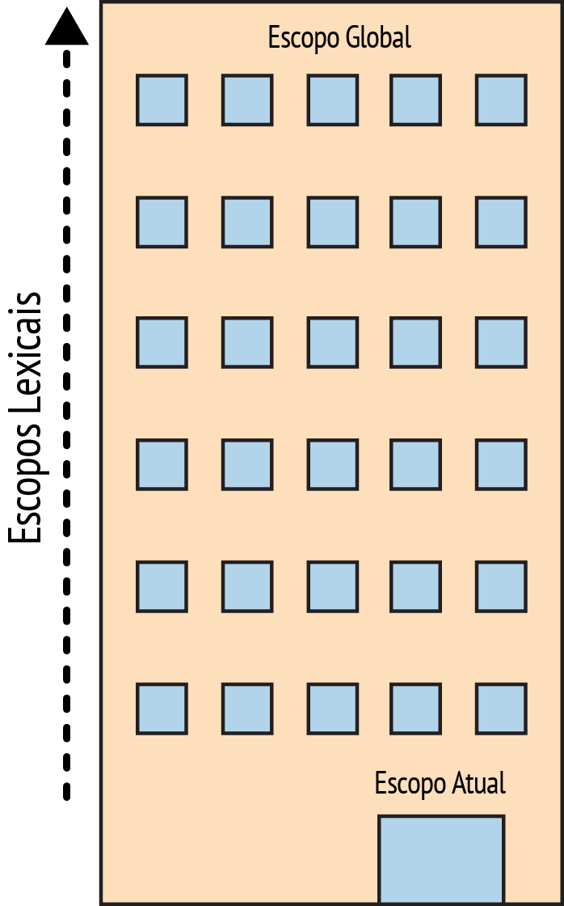

# You Don't Know JS: Escopos & Clausuras
# Capítulo 1: O que é Escopo?

Um dos paradigmas mais fundamentais de quase todas as linguagens de programação é a capacidade de armazenar valores em variáveis e, posteriormente, obter ou modificar esses valores. Na verdade, a habilidade de armazenar e pegar valores de variáveis é o que fornece *estado* a um programa.

Sem esse conceito, um programa pode realizar algumas tarefas, mas elas seriam extremamente limitadas e extremamente desinteressantes.

Mas a inclusão de variáveis em nossos programas gera perguntas mais interessantes como: onde essas variáveis *vivem*? Em outras palavras, onde elas são armazenadas? E, mais importante, como nossos programas as encontram quando eles precisam delas?

Estas perguntas mostram a necessidade de um conjunto bem definido de regras para armazenar variáveis em algum lugar, e para encontrar essas variáveis posteriormente. Nós iremos chamar esse conjunto de regras: *Escopo*.

Mas, onde e como essas regras de *Escopo* são definidas?

## Teoria de Compiladores

Talvez seja evidente, ou pode ser que seja uma novidade, dependendo do seu nível de interação com linguagens diversas, mas apesar do fato de Javascript ser geralmente colocada na categoria de linguagens "dinâmicas" ou "interpretadas", ela é de fato uma linguagem compilada. Ela *não* é compilada com muita antecedência, como são muitas outras linguagens tradicionalmente compiladas, e nem os resultados da compilação são portáveis entre vários sistemas distribuídos.

Mas, no entanto, o motor do Javascript realiza muitos dos passos efetuados por qualquer compilador tradicional, embora de forma mais sofisticada do que estamos acostumados a ver.

Em um processo tradicional de uma linguagem compilada, um pedaço de código fonte, seu programa, vai tipicamente passar por três passos *antes* de ser executado, grosseiramente chamado "compilação":

1. **Tokenização/Análise Léxica:** quebrar uma string de caracteres em pedaços com algum significado (para a linguagem), chamados tokens. Por exemplo, considere o programa: `var a = 2;`. Esse programa provavelmente seria quebrado nos seguintes tokens: `var`, `a`, `=`, `2`, e `;`. Espaço em branco pode ou não ser mantido como um token, dependendo se tem ou não algum significado.

    **Nota:** A diferença entre Tokenização e Análise Léxica é sutil e teórica, mas centraliza-se no fato desses tokens serem ou não identificados de uma maneira *stateless* ou *stateful*. Colocando de maneira simples, se o Tokenizador fosse invocar regras de análise stateful para saber se `a` deve ser considerado um token distinto ou apenas parte de outro token, *isso* seria **Análise Léxica**.

2. **Análise:** pegar um conjunto (array) de tokens e transformar isso numa árvore de elementos aninhados, que juntos representam a estrutura gramática do programa. Essa árvore é conhecida como "AST" (<b>A</b>bstract <b>S</b>yntax <b>T</b>ree, que, em tradução livre, significa: Árvore Sintática Abstrata).

    A árvore para `var a = 2;` pode começar com um nó de nível superior chamado `VariableDeclaration`, que tem um nó filho chamado `Identifier` (cujo valor é `a`), e outro nó filho chamado `AssignmentExpression` que por sua vez tem um filho chamado `NumericLiteral` (cujo valor é `2`).

3. **Geração de código:** o processo de obter uma AST e transformar isso em código executável. Esta parte varia muito dependendo da linguagem, da plataforma-alvo, etc.

    Então, em vez de focar em detalhes, nós vamos apenas olhar superficialmente e dizer que existe uma forma de obter nossa AST descrita acima para `var a = 2;` e transformá-la em instruções de máquina para de fato *criar* uma variável chamada `a` (incluindo a reserva de memória, etc), e então armazenar um valor em `a`.

    **Nota:** Os detalhes de como o motor administra recursos do sistema estão além do que iremos cobrir, então nós vamos apenas considerar que esse motor é capaz de criar e armazenar variáveis conforme necessário.

O motor do Javascript é muito mais complexo do que *apenas* aqueles três passos, assim como são os compiladores de outras linguagens. Por exemplo, no processo de análise e geração de código, há com certeza passos para otimizar o desempenho da execução, incluindo tratar elementos redundantes, etc.

Sendo assim, eu estou mostrando de forma bem grosseira aqui. Mas eu acho que vocês verão em breve porque *esses* detalhes que nós *cobrimos*, mesmo que superficialmente, são relevantes.

Por um lado, o motor do Javascript não tem o luxo (como compiladores de outras linguagens) de ter uma grande disponibilidade de tempo para otimização, porque a compilação de Javascript não acontece numa etapa de preparação anterior, como em outras linguagens.

Para Javascript, a compilação executada acontece, em muitos casos, somente alguns microssegundos (ou menos!) antes do código ser executado. Para garantir o mais alto desempenho, diferentes motores JS utilizam todos os tipos de truques (como JITs, que compilam de maneira preguiçosa e até mesmo recompilam rapidamente, etc.) que vão além do escopo da nossa discussão aqui.

Vamos apenas dizer, para fins de simplicidade, que qualquer pedaço de Javascript tem que ser compilado antes (geralmente *logo antes* como dito anteriormente!) de ser executado. Sendo assim, o compilador JS vai obter o programa `var a = 2;` e compilá-lo *antes*, e então estará pronto para executá-lo, geralmente de imediato.

## Entendendo Escopo

A forma como nós vamos abordar o aprendizado sobre escopo é imaginar o processo como uma conversa. Mas, *quem* está tendo essa conversa?

### O Elenco

Vamos conhecer o elenco dos personagens que interagem para processar o programa `var a = 2;`, assim entenderemos a conversa que vamos ouvir em breve:

1. *Motor*: responsável pela compilação do começo ao fim e pela execução do nosso programa Javascript.

2. *Compilador*: um dos amigos do *Motor*; gerencia todo o trabalho sujo da análise e da geração de código (veja a seção anterior).

3. *Escopo*: outro amigo do *Motor*; coleta e mantém uma lista de consultas a todos os identificadores declarados (variáveis), e impõe um rigoroso conjunto de regras sobre a maneira como estes identificadores ficam acessíveis para o código que está em execução.

Para o seu *completo entendimento* sobre como Javascript funciona, você precisa começar a *pensar* como o *Motor* (e seus amigos) pensa, fazer as perguntas que eles fazem, e responder essas perguntas.

### Para a frente e para trás

Quando você vê o programa `var a = 2;`, você provavelmente pensa nele como uma única instrução. Mas não é como nosso novo amigo *Motor* o vê. Na verdade, o *Motor* vê duas instruções distintas, uma que o *Compilador* vai gerenciar durante a compilação, e uma que o *Motor* vai gerenciar durante a execução.

Então, vamos expandir a forma como o *Motor* e seus amigos vão abordar o programa `var a = 2;`

A primeira coisa que o *Compilador* vai fazer com este programa é realizar uma análise léxica para quebrá-lo em tokens, que posteriormente serão transformados em uma árvore (AST). Mas quando o *Compilador* chega à fase de geração de código, ele vai tratar este programa um pouco diferente do que você talvez tenha suposto.

Uma suposição provável seria o *Compilador* produzir códigos que poderiam ser resumidos pelo pseudo-código: "Reserve memória para uma variável, rotule-a como `a`, então ponha o valor `2` nessa variável". Mas infelizmente, isso não é tão preciso.

Em vez disso, o *Compilador* vai proceder da seguinte forma:

1. Encontrando `var a`, o *Compilador* pede ao *Escopo* para ver se alguma variável `a` já existe para o conjunto particular deste escopo. Se já existe, o *Compilador* ignora essa declaração e segue em frente. Caso contrário, o *Compilador* pede ao *Escopo* para declarar uma nova variável chamada `a` para o conjunto deste escopo.

2. o *Compilador* então produz código para que o *Motor* execute mais tarde, para gerenciar a atribuição `a = 2`. O código que o *Motor* executa vai primeiro perguntar ao *Escopo* se existe uma variável chamada `a` acessível no conjunto do escopo atual. Se já existe, o *Motor* usa esta variável. Se não existe, o *Motor* procura *em outro lugar* (veja abaixo a seção *Escopos* aninhados).

Se o *Motor* eventualmente encontra uma variável, ele atribui o valor `2` a ela. Se não, o *Motor* vai levantar a mão e gritar que há um erro!

Para resumir: duas ações distintas são tomadas para uma atribuição a uma variável: Primeiro, o *Compilador* declara uma variável (se não foi anteriormente declarada no escopo atual), e segundo, quando executa, o *Motor* busca a variável no *Escopo* e atribui a ela, se encontrada.

### Papo de compilador

Nós precisamos de um pouco mais de terminologias do compilador para seguir com a compreensão.

Quando o *Motor* executa o código que o *Compilador* produziu no passo (2), ele tem que buscar pela variável `a` para saber se ela foi declarada, e essa busca ocorre consultando o *Escopo*. Mas o tipo de busca que o *Motor* efetua afeta o resultado da mesma.

No nosso caso, é dito que o *Motor* faria uma busca "LHS" para a variável `a`. O outro tipo de busca é chamado de "RHS".

Eu aposto que você pode adivinhar o que o "L" e o "R" significam. Esses termos significam "Left-hand Side" (que em tradução livre, significa: "Lado esquerdo") e "Right-hand Side" (que em tradução livre, significa: "Lado direito").

Lado... de quê? **Da operação de atribuição.**

Em outras palavras, uma busca LHS é feita quando uma variável aparece do lado esquerdo da operação de atribuição, e uma busca RHS é feita quando uma variável aparece do lado direito de uma operação de atribuição.

Na verdade, vamos ser um pouco mais precisos. Para nossos propósitos, uma busca RHS é indistinguível de uma busca simples pelo valor de uma variável, enquanto a busca LHS está tentando encontrar o local onde a variável foi declarada para assim poder fazer a atribuição. Sendo assim, RHS não significa *exatamente* "lado direito de uma atribuição", mas sim "não estar do lado esquerdo".

Sendo ligeiramente simplista por um momento, você poderia também pensar que "RHS", em vez de "obtenha sua fonte (valor)", significa "vá buscar o valor de...".

Vamos um pouco mais fundo nisso.

Quando eu digo:

```js
console.log( a );
```

A referência para `a` é uma referência RHS porque nada está sendo atribuído a `a` aqui. Em vez disso, nós estamos buscando pelo valor de `a` para que possa ser passado para `console.log(..)`.

Em compensação:

```js
a = 2;
```

A referência para `a` aqui é uma referência LHS, porque na verdade não nos importamos com o valor atual, nós apenas queremos encontrar a variável para que seja o alvo da atribuição `= 2`.

**Nota:** o significado "lado esquerdo/direito de uma atribuição" em LHS e RHS não necessariamente quer dizer "lado esquerdo/direito do operador de atribuição `=`". Existem muitas outras maneiras dessas atribuições acontecerem, então é melhor pensar sobre isso como: "quem é o alvo da atribuição (LHS)" e "quem é a fonte da atribuição (RHS)".

Considere este programa, que tem ambas as referências LHS e RHS:

```js
function foo(a) {
	console.log( a ); // 2
}

foo( 2 );
```
A última linha que invoca `foo(..)` como uma chamada de função requer uma referências RHS para `foo`, significando, "vá buscar o valor de `foo` e entregue para mim". Além disso, `(..)` significa que o valor de `foo` deve ser executado, então é melhor que seja realmente uma função!

Existe uma sútil, porém importante, atribuição aqui. **Conseguiu encontrar?**

Talvez você não tenha notado a operação implícita `a = 2` neste trecho de código. Ela ocorre quando o valor `2` é passado como um argumento para a função `foo(..)`, e, assim sendo, é **atribuído** ao parâmetro `a`. Para efetuar a atribuição (implícita) no parâmetro `a`, uma busca LHS é efetuada.

Há também uma referência RHS para o valor de `a`, e o valor resultante desta busca é passado para `console.log(..)`. `console.log(..)` também precisa de uma referência para ser executada. É feita uma busca RHS para localizar o objeto `console` e então ocorre a chamada resolução de propriedades para ver se este objeto possui um método chamado `log`.

Finalmente, podemos conceituar que existe uma troca de dados entre as buscas LHS/RHS para passagem do valor `2` (obtido pela busca RHS efetuada na variável `a`) para a função `log(..)`. Dentro da implementação nativa de `log(..)`, podemos supor que esta possui parâmetros, cujo primeiro (talvez chamado `arg1`) realiza uma busca LHS antes de receber a atribuição do valor `2`.

**Nota:** Talvez você esteja inclinado(a) a conceituar a declaração de uma função `function foo(a) {...` da mesma forma que uma declaração e atribuição comum de variáveis, como `var foo` e `foo = function(a){...`. Desta forma, seria natural pensar que esta declaração envolve uma busca LHS.

Porém, a diferença sutil, mas importante, é que o *Compilador* trata tanto a declaração quanto a definição do valor durante a etapa de geração de código, de modo que, quando o *Motor* estiver executando o código, não é preciso processamento para "atribuir" um valor de função para `foo`. Portanto, não é correto pensar na declaração de uma função da mesma forma que pensamos em uma atribuição realizada através de uma busca LHS.

### Diálogo entre Motor e Escopo

```js
function foo(a) {
	console.log( a ); // 2
}

foo( 2 );
```

Vamos imaginar que a troca de dados acima (que processa este trecho de código) seja um diálogo. Este diálogo seria mais ou menos assim:

> ***Motor***: Ei *Escopo*, tenho uma referência RHS para `foo`. Já ouviu falar dela?

> ***Escopo***: Ouvi sim. O *Compilador* a declarou há um segundo. É uma função, aqui está.

> ***Motor***: Legal, obrigado! Certo, estou executando `foo`.

> ***Motor***: Ei, *Escopo*, tenho uma referência LHS para `a`, já ouviu falar dela?

> ***Escopo***: Ouvi sim. O *Compilador* a declarou como um parâmetro formal para `foo` há pouco. Aqui está.

> ***Motor***: Prestativo como sempre, *Escopo*. Muito obrigado. Agora, é hora de atribuir o valor `2` para `a`.

> ***Motor***: Ei, *Escopo*, desculpe novamente pelo incômodo. Preciso de uma busca RHS para `console`. Já ouviu falar?

> ***Escopo***: Sem problemas, *Motor*, estou aqui para isso. Sim, eu achei `console`. É um código nativo, aqui está.

> ***Motor***: Perfeito. Buscando por `log(..)`. Certo, ótimo, é uma função.

> ***Motor***: Fala, *Escopo*. Pode me ajudar com uma referência RHS para `a`. Eu acho que lembro dela, mas quero ter certeza.

> ***Escopo***: Você está certo, *Motor*. Tudo igual, sem mudanças. Aqui está.

> ***Motor***: Legal. Passando o valor de `a`, que é `2`, para `log(..)`.

> ...

### Desafio

Teste sua compreensão até agora. Assuma o papel do *Motor* e tenha um "diálogo" com o *Escopo*.

```js
function foo(a) {
	var b = a;
	return a + b;
}

var c = foo( 2 );
```

1. Identifique todas as buscas LHS (existem 3!).

2. Identifique todas as buscas RHS (existem 4!).

**Nota:** As respostas estão na revisão do capítulo!

## Escopos aninhados

Dissemos que *Escopo* é um conjunto de regras para a busca de variáveis pelo seu identificador. Entretanto, normalmente há mais de um *Escopo* para considerarmos.

Assim como um bloco ou função pode estar aninhado dentro de outro bloco ou função, escopos são aninhados dentro de outros escopos. Sendo assim, se uma variável não é localizada no escopo mais próximo, o *Motor* consulta o próximo escopo acima do atual, seguindo assim até que a variável seja localizada ou que o último escopo (também chamado de escopo global) seja acessado.

Considere:

```js
function foo(a) {
	console.log( a + b );
}

var b = 2;

foo( 2 ); // 4
```

A referência RHS para `b` não pode ser resolvida dentro da função `foo`, mas pode ser resolvida no *Escopo* ao redor desta (neste caso, o escopo global).

Assim, retomando o díalogo entre *Motor* e *Escopo*, nós escutaríamos:

> ***Motor***: "Ei, *Escopo* de `foo`, já ouviu falar de `b`? Tenho uma referência RHS para ela."

> ***Escopo***: "Não, nunca ouvi falar. Cai fora."

> ***Motor***: "Ei, *Escopo* acima de `foo`, ah você é o *Escopo* global, legal. Já ouviu falar de `b`? Tenho uma referência RHS para ela."

> ***Escopo***: "Sim, ouvi falar sim. Aqui está."

A regra simples do percurso dos *Escopos* aninhados: o *Motor* inicia no *Escopo* que está em execução e busca pela variável, se ela não for localizada segue a busca subindo um nível e assim por diante. Se o escopo global for acessado, a busca é encerrada independente da variável ser localizada ou não.

### Fixando com metáforas

Para visualizarmos o processo de resolução de *Escopos* aninhados, quero que você observe este prédio alto.



Este prédio representa o conjunto de *Escopos* aninhados do nosso programa. O andar térreo representa o *Escopo* que está em execução, independente de onde estiver. O último andar do prédio é o *Escopo* global.

Você resolve as referências LHS e RHS através da busca no andar atual, e, se não encontrar nada, vai de elevador procurar no próximo andar, e no seguinte, e assim por diante. Assim que você chega no último andar (o *Escopo* global), você pode encontrar ou não o que procurava, mas a busca é encerrada de qualquer maneira.

## Erros

Qual a importância de nos referirmos como LHS ou RHS?

Porque estes dois tipos de busca comportam-se de maneiras diferentes quando uma variável ainda não foi declarada (não foi localizada em nenhum dos *Escopos* consultados).

Considere:

```js
function foo(a) {
	console.log( a + b );
	b = a;
}

foo( 2 );
```

Quando a busca RHS ocorre para `b` pela primeira vez, a variável não será localizada. É tomada por uma variável "não-declarada" porque não é encontrada no escopo.

Se uma busca RHS falha ao encontrar uma variável em qualquer lugar dos *Escopos* aninhados, esta operação resulta em um `ReferenceError` lançado pelo *Motor*. É importante salientar que o erro é do tipo `ReferenceError`.

Por outro lado, se o *Motor* executa uma busca LHS e chega no último andar (*Escopo* global) sem localizar a variável, e se o programa não está sendo executado em "Modo estrito" (strict mode) [^note-strictmode], então o *Escopo* global irá criar uma nova variável com este nome **no escopo global** e repassá-la para o *Motor*

*"Não, não tinha nada com esse nome, mas fui prestativo e criei pra você."*

"Modo estrito" (strict mode) [^note-strictmode], adicionado na versão ES5, possui uma série de diferenças comportamentais em relação ao modo normal/relaxado/preguiçoso. Uma destas diferenças é a proibição da criação automática/implícita de variáveis globais. Neste caso, em uma busca LHS, não haveria uma variável de *Escopo* global para ser repassada, e o *Motor* lançaria um `ReferenceError` como no caso da busca RHS.

Agora, se uma variável é encontrada em uma busca RHS, mas você tenta realizar uma ação impossível, como executar como função um valor que não é uma função ou tentar ler uma propriedade a partir de valores como `null` ou `undefined`, então o *Motor* irá lançar um tipo diferente de erro, chamado de `TypeError`.

`ReferenceError` está relacionado à falha na resolução de *Escopo*, enquanto `TypeError` sugere que a resolução de *Escopo* foi bem sucedida, mas houve uma tentativa de operação ilegal/impossível no resultado que foi obtido.

## Revisão (TL;DR)

Escopo é o conjunto de regras que determina onde e como uma variável (identificador) pode ser buscada. Esta busca pode ter como objetivo a atribuição de um valor para a variável, que chamamos de referência LHS (left-hand-side, ou, em tradução livre, lado esquerdo), ou então pode ter como objetivo a leitura do seu valor, que chamamos de referência RHS (right-hand-side, ou, em tradução livre, lado direito).

Referências LHS resultam das operações de atribuição. Atribuições relacionadas a *Escopo* podem ocorrer tanto com o uso do operador `=` quanto com a passagem de argumentos para uma função, quando os valores são atribuídos aos parâmetros definidos na sua declaração.

O *Motor* JavaScript primeiro compila o código para depois executá-lo, e, para isso, divide instruções como `var a = 2;` em dois passos distintos:

1. Primeiro, `var a` para declaração no *Escopo* atual. Isto é realizado bem no início, antes da execução do código.

2. Em seguida, `a = 2` para buscar pela variável (referência LHS) para então atribuir-lhe um valor, se encontrada.

Ambas buscas por referências LHS e RHS iniciam no *Escopo* atual de execução, e em caso de necessidade (ou seja, na ocasião de não serem encontradas por lá), seguem em frente pelos *Escopos* aninhados, um escopo (andar) de cada vez, buscando pelo identificador, até que atinjam o escopo global (último andar) e encerrem a busca, encontrando ou não a variável.

Referências RHS não satisfeitas resultam no lançamento de um `ReferenceError`. Referências LHS não satisfeitas resultam na criação automática e implícita de uma variável global de mesmo nome (caso não esteja em "Modo estrito" (strict mode) [^note-strictmode]) ou em um `ReferenceError` (caso esteja em "Modo estrito" (strict mode) [^note-strictmode]).

### Resposta do Desafio

```js
function foo(a) {
	var b = a;
	return a + b;
}

var c = foo( 2 );
```

1. Identifique todas as buscas LHS (existem 3!).

	**`c = ..`, `a = 2` (atribuição implícita para o parâmetro) e `b = ..`**

2. Identifique todas as buscas RHS (existem 4!).

    **`foo(2..`, `= a;`, `a + ..` e `.. + b`**


[^note-strictmode]: MDN: [Strict Mode](https://developer.mozilla.org/en-US/docs/Web/JavaScript/Reference/Functions_and_function_scope/Strict_mode)
