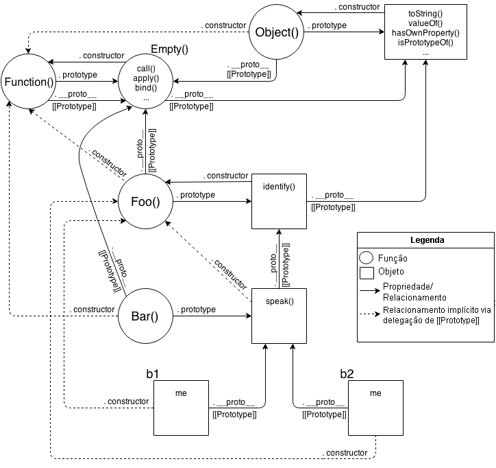
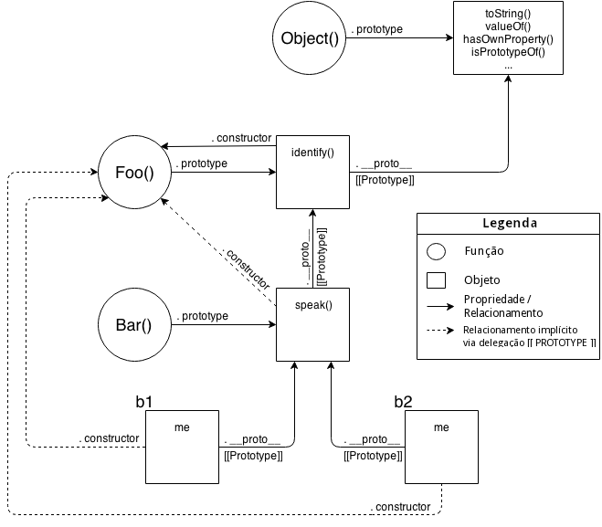

# You Don't Know JS: *this* & Prototipagem de Objetos
# Capítulo 6: Delegação de Comportamentos

No Capítulo 5, nós abordamos detalhadamente o mecânismo `[[Prototype]]`, e o *porquê* de ser confuso e inapropriado (apesar das incontáveis tentativas por quase duas décadas) descrevê-lo como "classe" ou "herança". Vimos à fundo não só sua síntaxe razoavelmente prolixa (`.prototype` sujando o código), mas também as armadilhas (como a surpreendente resolução de `.constructor` ou a horrível síntaxe pseudo-polimórfica). E exploramos as variações da abordagem "mixin", que muitas pessoas utilizam para tentar suavizar áreas mais pesadas.

É uma reação comum à essa altura imaginar qual a necessidade de ser tão complexo algo que parece ser tão simples de ser feito. Agora que abaixamos as cortinas e vimos o quão poluído o código fica, não é uma surpresa a maioria dos desenvolvedores JS nunca mergulharem tão fundo, e ao invés disso relegarem  toda a bagunça para uma biblioteca de "classes" cuidar para eles.

Eu espero que agora você não se contente em encobrir e deixar tais detalhes para uma biblioteca "caixa preta" cuidar. Vamos ver à seguir como nós *podemos e devemos* pensar sobre o mecânismo do objeto `[[Prototype]]` em JS, de uma **forma muito mais simples e direta** que a confusão de classes.

Como uma breve revisão de nossas conclusões do Capítulo 5, o mecânismo `[[Prototype]]` é uma ligação interna que existe em um objeto que referencia outro objeto.

Essa ligação é exercida quando uma referência de uma propriedade/método é feita contra o primeiro objeto, e tal propriedade/método não existe. Neste caso, a ligação `[[Prototype]]` diz ao motor para buscar pela propriedade/método no objeto que está ligado. Por sua vez, caso o objeto não consiga completar a busca, seu `[[Prototype]]` é seguido, e assim por diante. Essa série de ligações entre formas de objetos é chamada de "cadeia de protótipos".

Em outras palavras, o mecânismo atual, a essência do que é importante para a funcionalidade do que podemos fazer com JavaScript, se resume à **objetos sendo ligados à outros objetos.**

Essa observação por si só é fundamental e crítica para entender as motivações e abordagens ao longo deste capítulo!

## Em Direção ao Design Orientado à Delegação

Para focar adequadamente nossa forma de pensar em como usar o `[[Prototype]]` da maneira mais direta, nós devemos reconhecer que isso representa uma diferença fundamental de design pattern em relação às classes (veja Capítulo 4).

**Nota:** *Alguns* princípios de design orientado à classes continuam muito válidos, então não jogue fora tudo que sabe (apenas a maior parte!). Por exemplo, *encapsulamento* é bem poderoso, e é compátivel (embora não muito comum) com delegação.

Nós devemos tentar mudar nossa forma de pensar do padrão classe/herança para o padrão de delegação de comportamento. Se a maior parte do que programou em sua educação/carreira pensando em classes, essa maneira pode ser desconfortável ou não parecer natural. Você pode precisar experimentar fazer esse exercício mental algumas vezes até conseguir pegar o jeito dessa forma tão diferente de se pensar. 

Eu vou orientá-lo através de alguns exercícios teóricos primeiro, e então vamos ver lado à lado em um exemplo mais concreto para te dar um contexto prático para seu próprio código.  

### Teoria de Classe

Digamos que temos várias tarefas semelhantes ("XYZ", "ABC", etc) que precisamos modelar em nosso software.

Com classes, a forma de se projetar esse cenário é: definir uma classe geral pai (base) como `Task`, definindo o comportamento compartilhado para todas as tarefas "parecidas". Então, você define as classes filhas `XYZ` e `ABC`, ambas herdadas de `Task`, e cada uma adiciona um comportamento especial para lidar com suas respectivas tarefas.

**Mais importante,** o design pattern de classes irá encorajá-lo a obter o máximo de herança, você irá querer empregar sobreescrita de métodos (e polimorfismo), onde você sobreescreve a definição de algum método geral `Task` em sua tarefa `XYZ`, talvez até fazendo uso de `super` para chamar a versão base desse método ao adicionar mais comportamento à ele. **Você provavelmente encontrará alguns lugares** nos quais você pode "abstrair" o comportamento geral da classe pai e especializá-lo (substituí-lo) em suas classes filhas.

Aqui vai um pseudo-código para esse cenário:

```js
class Task {
	id;

	// construtor `Task()`
	Task(ID) { id = ID; }
	outputTask() { output( id ); }
}

class XYZ inherits Task {
	label;

	// construtor `XYZ()`
	XYZ(ID,Label) { super( ID ); label = Label; }
	outputTask() { super(); output( label ); }
}

class ABC inherits Task {
	// ...
}
```

Agora, você pode instanciar uma ou mais **cópias** da classe filha `XYZ` e usar essas instâncias para executar a tarefa "XYZ". Estas instâncias possuem **cópias** tanto do comportamento geral definido para a classe `Task` como também do comportamento especificamente definido para `XYZ`. Da mesma forma, instâncias da classe `ABC` teriam cópias do comportamento de `Task` e do comportamento específico de `ABC`. Após a construção, você geralmente só interage com essas instâncias (e não as classes), já que as instâncias têm cópias de todo o comportamento necessário para executar a tarefa pretendida.

### Teoria da Delegação

Mas agora vamos tentar pensar sobre o mesmo domínio do problema, mas usando *delegação de comportamento* ao invés de *classes*.

Primeiro você irá definir um **objeto** (não uma classe, nem uma `function` como muitos desenvolvedores JS o levariam à crer) chamado `Task`, e ele terá um comportamento concreto em si que inclui métodos utilitários que várias outras tarefas podem usar (leia: *delegar para*!). Então, para cada tarefa ("XYZ", "ABC"), você define um **objeto** para manter esses dados/comportamentos específicos. Você **liga** seu(s) objetos(s) de tarefas específicas com o objeto utilitário `Task`, permitindo que deleguem à ele quando precisam.

Basicamente, você pensa em executar a tarefa "XYZ" como se precisasse de comportamentos de dois objetos irmãos (`XYZ` e `Task`) para realizá-lo. Mas, ao invés de precisar compô-los juntos, por meio de cópias de classe, podemos mantê-los em seus objetos separados, e podemos permitir que o objeto `XYZ` **delegue para** `Task` quando preciso. 

Aqui tem um código simples para sugerir como se conseguir isso:

```js
var Task = {
	setID: function(ID) { this.id = ID; },
	outputID: function() { console.log( this.id ); }
};

// faz `XYZ` delegar para `Task`
var XYZ = Object.create( Task );

XYZ.prepareTask = function(ID,Label) {
	this.setID( ID );
	this.label = Label;
};

XYZ.outputTaskDetails = function() {
	this.outputID();
	console.log( this.label );
};

// ABC = Object.create( Task );
// ABC ... = ...
```

Neste código, `Task` e `XYZ` não são classes (ou funções), eles são **apenas objetos**, `XYZ` é configurado via `Object.create(..)` para o `[[Prototype]]` delegar para o objeto `Task` (veja Capítulo 5).

Em comparação com orientação à classes (também conhecido como OO -- orientado à objetos), eu chamo esse estilo de código de **"OLOO"** (objetos-ligados-à-outros-objetos). Tudo que *realmente* nos importa é que o objeto `XYZ` delega para o objeto `Task` (assim como também faz o objeto `ABC`).

Em Javascript, o mecânismo `[[Prototype]]` liga **objetos** com outros **objetos**. Não há mecânismos abstratos como "classes" não importa o quanto tentarem te convencer do contrário. É como remar uma canoa rio acima: você *pode* fazer isso, mas se você estará *escolhendo* ir contra a corrente natural, então obviamente **será muito mais difícil de se chegar onde estiver indo.**

Algumas outras diferenças para se notar com o **código no estilo OLOO**:

1. Ambos os membros de dados `id` e `label` no exemplo de classe anterior são propriedades de dados diretamente em `XYZ` (sem estar em `Task`). Em geral, com delegação `[[Prototype]]` involvida, **você quer que o estado esteja em quem delega** (`XYZ`, `ABC`), não em quem é delegado (`Task`).
2. Com o padrão de classes, nós intencionalmente nomeamos de `outputTask` tanto na classe pai (`Task`) quanto na filha (`XYZ`), para que pudessemos tirar vantagem da substituição (polimorfismo). Em delegação de comportamentos, nós fazemos o oposto: **nós evitamos dar o mesmo nome à qualquer coisa sempre que possível** em diferentes níveis da cadeia `[[Prototype]]` (chamado de sombreamento -- veja Capítulo 5), porque a colisão desses nomes cria uma síntaxe estranha e frágil para se tirar a ambiguidade de suas referências (veja Capítulo 4), e gostaríamos de evitar isso se pudermos.

   Esse padrão exige menos nomes de métodos gerais que tendem à substituir outros métodos e mais nomes descritivos, *específicos* para o tipo de comportamento que cada objeto está executando. **Isso pode de fato criar códigos mais fáceis de se entender/manter**, porque os nomes dos métodos (não só no local de definição como espalhado por outros códigos) são mais óbvios (se auto documentando).
3. `this.setID (ID);` dentro de um método no objeto `XYZ` primeiro olha em `XYZ` para `setID (..)`, mas já que não encontra um método com esse nome em `XYZ`, *delegação* `[[Prototype]]` significa que ele pode seguir a ligação para `Task` procurar por `setID (..)`, que obviamente o encontra. Além disso, devido às regras de ligação implícitas em chamadas `this` (veja o Capítulo 2), quando `setID (..)` é executado, mesmo que o método tenha sido encontrado em `Task`, a ligação `this` para essa chamada de função é `XYZ` exatamente como esperávamos e queríamos. Nós vemos a mesma coisa com `this.outputID ()` depois na listagem de código.
   Em outras palavras, os métodos gerais utilitários que existem em `Task` estão disponíveis para nós enquanto interagimos com `XYZ`, porque `XYZ` pode delegar para `Task`.

**Delegação de comportamentos** significa: deixar algum objeto (`XYZ`) fornecer uma delegação (para `Task`) para referências de métodos ou propriedades, caso não sejam encontradas no objeto (`XYZ`).

Esse é um padrão de design *extremamente poderoso*, muito diferente da ideia de classes pai e filha, herança, polimorfismo, etc. Ao invés de organizar objetos mentalmente de forma vertical, com as classes Pais fluindo para as classes Filhas, pense em objetos lado à lado, como pares, com qualquer direção de ligação de delegação entre os objetos, conforme a necessidade.

**Nota:** O uso de delegação é mais apropriado como um detalhe de implementação interno ao invés de algo exposto diretamente no desenho da interface da API. No exemplo acima, nós não necessariamente *pretendemos* com o desenho de nossa API que desenvolvedores chamem `XYZ.setID()` (embora seja possível, é claro!). Nós meio que *escondemos* a delegação como um detalhe interno de nossa API, onde `XYZ.prepareTask(..)` delega para `Task.setID(..)`. Veja a discussão de "Ligações como Fallbacks?" no Capítulo 5 para maiores detalhes.

#### Delegação Mútua (Não permitida)

Você não pode criar um *ciclo* onde dois ou mais objetos estão mutualmente delegados um para o outro (bidirecionalmente). Se você fizer `B` ligado a `A`, e então tentar ligar `A` para `B`, você receberá um erro.

É uma vergonha (não é terrivelmente surpreendente, mas um pouco irritante) que isso não seja permitido. Se você criasse uma referência a uma propriedade/método que não exista em nenhum lugar, você teria um loop de recursão infinita no `[[Prototype]]`. Mas se todas as referências estiverem estritamente presentes, então `B` poderia delegar para `A`, e vice-versa, e isso *poderia* funcionar. Isso significa que você poderia usar um dos objetos para delegar para o outro, para várias tarefas. Existem alguns poucos casos de uso onde isso poderia ser útil.

Mas isto não é permitido porque os implementadores dos motores JS observaram que é mais eficiente verificar (e rejeitar!) referências circulares infinitas uma vez na sua definição, do que precisar ter o impacto de execução dessas verificações toda vez que você procurar por uma propriedade em um objeto.

#### Depurado

Vamos abordar brevemente um detalhe sutil que pode ser confuso aos desenvolvedores. No geral, a especificação do JS não controla como as ferramentas de desenvolvimento do navegador devem apresentar valores/estruturas específicos para uma desenvolvedora, então cada navegador/motor é livre para interpretar algumas coisas como eles acharem melhor. Dessa forma, navegadores/ferramentas *nem sempre estão de acordo*. Especificamente, o comportamentos que iremos examinar é atualmente observado somente no Chrome's Developer Tools.

Considere como esse tradicional estilo de código JS para "construtor de classe" apareceria no *console* do Chrome Developer Tools:

```js
function Foo() {}

var a1 = new Foo();

a1; // Foo {}
```

Vamos olhar para a última linha do código: o output computado da expressão `a1`, que imprime `Foo {}`. Se você tentar o mesmo código no Firefox, provavelmente verá algo como `Object {}`.  Por que a diferença? O que esses outputs significam?

Chrome está essencialmente dizendo "{} é um objeto vazio que foi contruído por uma função com nome 'Foo'". Firefox está dizendo "{} é um objeto vazio da construção geral de Object". A sutil diferença é que o Chrome está rastreando ativamente, como uma *propriedade interna*, o nome da função que realmente fez a construção, enquanto outros navegadores não fazem o rastreamento dessa informação adicional.

Seria tentador tentar explicar isso com o funcionamento do JavaScript:

```js
function Foo() {}

var a1 = new Foo();

a1.constructor; // Foo(){}
a1.constructor.name; // "Foo"
```

Então, é assim que o Chrome está mostrando "Foo", por uma simples olhada na `.constructor.name` do objeto? Confusamente, a resposta é tanto "sim" quanto "não".

Considere este código:

```js
function Foo() {}

var a1 = new Foo();

Foo.prototype.constructor = function Gotcha(){};

a1.constructor; // Gotcha(){}
a1.constructor.name; // "Gotcha"

a1; // Foo {}
```

Mesmo que nós mudemos `a1.constructor.name` para legitimamente ser alguma outra coisa ("Gotcha"), o console do Chrome ainda vai usar o nome "Foo".

Então, parece que a resposta da pergunta anterior (o Chrome usa `.constructor.name`?) é **não**, ele deve olhar algum outro lugar, internamente.

Mas, não tão rápido! Vamos ver como esse tipo de comportamento funciona com código estilo OLOO:

```js
var Foo = {};

var a1 = Object.create( Foo );

a1; // Object {}

Object.defineProperty( Foo, "constructor", {
	enumerable: false,
	value: function Gotcha(){}
});

a1; // Gotcha {}
```

Ah-ha! **Gotcha!** Aqui, o console do Chrome **realmente** achou e usou a `.constructor.name`. Na verdade, enquanto escrevia esse livro, esse exato comportamento era identificado no Chrome como um bug, e no momento que você estiver lendo isso, ele pode ter sido corrigido. Então pode ser que você veja `a1; // Object {}` corretamente.

Deixando o bug de lado, o rastreamento interno (aparentemente somente para propósitos de depuração) de "constructor name" que o Chrome faz (mostrado nos trechos anteriores) é uma extensão intencional do Chrome, além do que a especificação do JS exige.

Se você não usar um "constructor" para criar seus objetos, como desencorajamos com o estilo de código OOLO aqui nesse capítulo, então você terá objetos que o Chrome *não* rastreia um "constructor name" interno, e esses objetos serão exibidos corretamente como "Object {}", significando "objeto gerado pelo construtor Object()".

**Não pense** que isso representa uma desvantagem do estilo de código OLOO. Quando você escreve código com OLOO e delegação de comportamento como seu padrão de design, *quem* "construiu" (isso é, *qual função* foi chamada com `new`?) algum objeto é um detalhe irrelevante. O rastreamento interno de "constructor name" específico do Chrome só é realmente útil se você adotar totalmente o estilo de código de "classe", mas é discutível se, no lugar, você adotar delegação de OLOO.

### Modelos Mentais Comparados

Agora que você pode ver a diferença entre os padrões de design "classe" e "delegação", pelo menos teoricamente, vamos ver as implicações que esses padrões de design tem nos modelos mentais que usamos para pensar sobre nosso código.

Nós vamos examinar um código mais hipotético ("Foo", "Bar"), e comparar as duas formas (OO vs. OLOO) de se implementar o código. O primeiro trecho usa o clássico estilo OO (com "prototype"):

```js
function Foo(who) {
	this.me = who;
}
Foo.prototype.identify = function() {
	return "I am " + this.me;
};

function Bar(who) {
	Foo.call( this, who );
}
Bar.prototype = Object.create( Foo.prototype );

Bar.prototype.speak = function() {
	alert( "Hello, " + this.identify() + "." );
};

var b1 = new Bar( "b1" );
var b2 = new Bar( "b2" );

b1.speak();
b2.speak();
```

A classe pai `Foo`, herdada pela classe filha `Bar`, é então instanciada duas vezes como `b1` e `b2`. O que nós temos é `b1` delegando para `Bar.prototype` que delega para `Foo.prototype`. Isso deve parecer bastante familiar para você, nesse momento. Nada muito inovador acontecendo.

Agora, vamos implementar **exatamente a mesma funcionalidade** usando o estilo de código *OLOO*:

```js
var Foo = {
	init: function(who) {
		this.me = who;
	},
	identify: function() {
		return "I am " + this.me;
	}
};

var Bar = Object.create( Foo );

Bar.speak = function() {
	alert( "Hello, " + this.identify() + "." );
};

var b1 = Object.create( Bar );
b1.init( "b1" );
var b2 = Object.create( Bar );
b2.init( "b2" );

b1.speak();
b2.speak();
```

Nós pegamos exatamente as mesmas vantagens da delegação via `[[Prototype]]` de `b1` para `Bar` para `Foo` como nós fizemos no exemplo anterior entre `b1`, `Bar.prototype`, e `Foo.prototype`. **Nós ainda temos os mesmos 3 objetos ligados entre si**.

Mas, mais importante, nós simplificamos bastante *todas as outras coisas*, porque agora nós apenas ligamos **objetos** uns aos outros, sem precisar de toda a confusão de coisas que parecem (mas não se comportam!) como classes, com contrutores e prototypes e chamadas `new`.

Pergunte a si mesmo: se eu posso ter a mesma funcionalidade com código OLOO como eu tenho com código estilo "class", mas OLOO é mais simples e tem menos coisas para me preocupar, **OLOO é melhor**?

Vamos examinar os modelos mentais involvidos entre esses dois exemplos.

Primeiro, o trecho de código no estilo de classe implica esse modelo mental de entidades e seus relacionamentos:



Na verdade, isso é um pouco desleal/ilusório, porque mostra vários detalhes extras que você *tecnicamente* não precisa saber o tempo todo (embora você *precise* entendê-los!). Um deles é que é uma série bastante complexa de relacionamentos. Mas outra coisa é: se você dedicar tempo para seguir essas setas de relacionamentos, **há uma incrível quantidade de consistência interna** nos mecanismos do JS.

Por exemplo, a habilidade de uma função JS acessar `call(..)`, `apply(..)`, e `bind(..)` (veja o Capítulo 2) é porque funções em si são objetos, e funções-objeto também tem um vínculo de `[[Prototype]]`, para o objeto `Function.prototype`, que define esses métodos padrões que qualquer função-objeto pode usar por delegação. JS pode fazer essas coisas, *e você também pode!*.

OK, agora vamos olhar para uma versão *ligeiramente* simplificada desse diagrama que é um pouco mais "justa" para comparação -- mostra apenas as entidades e relacionamentos *relevantes*.



Ainda é bem complexo, né? As linhas tracejadas estão descrevendo os relacionamentos implícitos de quando você define a "herança" entre `Foo.prototype` e `Bar.prototype` e ainda não *corrigiu* a referência da propriedade `.constructor` **ausente** (veja "Constructor Redux" no Capítulo 5). Mesmo com essas linhas tracejadas removidas, o modelo mental ainda é um malabarismo muito terrível toda vez que você trabalha com vínculos de objetos.

Agora, vamos dar uma olhada no modelo mental para código estilo OLOO:


Como você pode ver comparando eles, é óbvio que o código estilo OLOO tem *muito menos coisa* para se preocupar, porque código OLOO abraça o **fato** que a única coisa que nos preocupamos foi com **objetos ligados a outros objetos**.

Todas as outras sujeiras de "classes" foram uma confusa e complexa forma de se conseguir o mesmo resultado. Remova essas coisas, e as coisas ficam muito mais simples (sem perder nenhuma funcionalidade).

## Classes vs. Objetos

Acabamos de ver várias explorações teóricas e modelos mentais de "classes" vs. "delegação de comportamento". Mas, agora vamos analisar cenários de código mais concretos para mostrar como você realmente usa essas ideias.

Primeiro, examinaremos um cenário típico no desenvolvimento web front-end: criação de widgets de UI (botões, menus suspensos etc.).

### Widget "Classes"

Porque você provavelmente ainda está tão acostumado com o padrão de design OO, provavelmente irá pensar imediatamente no domínio deste problema em termos de uma classe pai (talvez chamada de `Widget`) com todo o comportamento do widget base comum e depois classes filhas derivadas para tipos de widget específicos (como `Button`).

**Nota:** Vamos usar jQuery para manipulação de DOM e CSS aqui, apenas porque é um detalhe que realmente não importa para os propósitos de nossa discussão atual. Nenhum desses códigos se importam com qual framework JS (jQuery, Dojo, YUI, etc.), se houver, você pode resolver tarefas comuns desse tipo.

Vamos examinar como implementaríamos o design "classe" no estilo clássico em JS puro sem nenhuma biblioteca ou sintaxe auxiliar de "classe":

```js
// Classe pai
function Widget(width,height) {
	this.width = width || 50;
	this.height = height || 50;
	this.$elem = null;
}

Widget.prototype.render = function($where){
	if (this.$elem) {
		this.$elem.css( {
			width: this.width + "px",
			height: this.height + "px"
		} ).appendTo( $where );
	}
};

// Class filha
function Button(width,height,label) {
	// chamada do construtor "super"
	Widget.call( this, width, height );
	this.label = label || "Default";

	this.$elem = $( "<button>" ).text( this.label );
}

// faz `Button` "herdar" de `Widget`
Button.prototype = Object.create( Widget.prototype );

// sobrescreve `render(..)` "herdado" 
Button.prototype.render = function($where) {
	// chamada "super"
	Widget.prototype.render.call( this, $where );
	this.$elem.click( this.onClick.bind( this ) );
};

Button.prototype.onClick = function(evt) {
	console.log( "Button '" + this.label + "' clicked!" );
};

$( document ).ready( function(){
	var $body = $( document.body );
	var btn1 = new Button( 125, 30, "Hello" );
	var btn2 = new Button( 150, 40, "World" );

	btn1.render( $body );
	btn2.render( $body );
} );
```

O padrão de design OO nos diz para declarar um `render(..)` base na classe pai, e então sobrescrevê-lo na nossa classe filha, mas não necessariamente substituí-lo, preferindo aumentar a funcionalidade base com o comportamento específico de botão.

Observe a feiura do *pseudo-polimorfismo explícito* (veja o Capítulo 4) com as referências `Widget.call` e `Widget.prototype.render.call` para fingir chamadas "super" a partir dos métodos da "classe" filha para os métodos base da "classe" pai. Que nojo.

#### Açúcar Sintático ES6 `class`

Nós cobrimos o açúcar sintático `class` do ES6 em detalhes no Apêndice A, mas vamos demonstrar brevemente como nós poderíamos implementar o mesmo código usando `class`:

```js
class Widget {
	constructor(width,height) {
		this.width = width || 50;
		this.height = height || 50;
		this.$elem = null;
	}
	render($where){
		if (this.$elem) {
			this.$elem.css( {
				width: this.width + "px",
				height: this.height + "px"
			} ).appendTo( $where );
		}
	}
}

class Button extends Widget {
	constructor(width,height,label) {
		super( width, height );
		this.label = label || "Default";
		this.$elem = $( "<button>" ).text( this.label );
	}
	render($where) {
		super.render( $where );
		this.$elem.click( this.onClick.bind( this ) );
	}
	onClick(evt) {
		console.log( "Button '" + this.label + "' clicked!" );
	}
}

$( document ).ready( function(){
	var $body = $( document.body );
	var btn1 = new Button( 125, 30, "Hello" );
	var btn2 = new Button( 150, 40, "World" );

	btn1.render( $body );
	btn2.render( $body );
} );
```

Sem dúvidas, um pouco da feia sintaxe da abordagem clássica anterior foi suavizada pela `class` do ES6. A presença do `super(..)` em particular parece bastante agradável (embora quando você cava mais fundo nisso, nem tudo são flores!).

Apesar das melhorias sintáticas, **essas não são classes *reais***, uma vez que elas ainda operam sobre o mecanismo do `[[Prototype]]`. Eles sofrem das mesmas discrepâncias de modelo mental que exploramos nos Capítulos 4, 5 e até agora neste capítulo. O Apêndice A irá expôr a sintaxe `class` do ES6 e suas implicações em detalhes. Nós vamos ver por que resolver contratempos de linguagem não resolve substancialmente nossas confusões com classes no JS, embora isso faça um grande esforço para se mascarar de uma solução!

Se você usa a sintaxe prototípica clássica ou o novo açúcar sintático do ES6, ainda fez uma *escolha* para modelar o domínio do problema (widgets da interface do usuário) com "classes". E, como os poucos capítulos anteriores tentam demonstrar, essa *opção* no JavaScript está deixando você com dores de cabeça extras e esgotamento mental.

### Delegating Widget Objects

Here's our simpler `Widget` / `Button` example, using **OLOO style delegation**:

```js
var Widget = {
	init: function(width,height){
		this.width = width || 50;
		this.height = height || 50;
		this.$elem = null;
	},
	insert: function($where){
		if (this.$elem) {
			this.$elem.css( {
				width: this.width + "px",
				height: this.height + "px"
			} ).appendTo( $where );
		}
	}
};

var Button = Object.create( Widget );

Button.setup = function(width,height,label){
	// delegated call
	this.init( width, height );
	this.label = label || "Default";

	this.$elem = $( "<button>" ).text( this.label );
};
Button.build = function($where) {
	// delegated call
	this.insert( $where );
	this.$elem.click( this.onClick.bind( this ) );
};
Button.onClick = function(evt) {
	console.log( "Button '" + this.label + "' clicked!" );
};

$( document ).ready( function(){
	var $body = $( document.body );

	var btn1 = Object.create( Button );
	btn1.setup( 125, 30, "Hello" );

	var btn2 = Object.create( Button );
	btn2.setup( 150, 40, "World" );

	btn1.build( $body );
	btn2.build( $body );
} );
```

With this OLOO-style approach, we don't think of `Widget` as a parent and `Button` as a child. Rather, `Widget` **is just an object** and is sort of a utility collection that any specific type of widget might want to delegate to, and `Button` **is also just a stand-alone object** (with a delegation link to `Widget`, of course!).

From a design pattern perspective, we **didn't** share the same method name `render(..)` in both objects, the way classes suggest, but instead we chose different names (`insert(..)` and `build(..)`) that were more descriptive of what task each does specifically. The *initialization* methods are called `init(..)` and `setup(..)`, respectively, for the same reasons.

Not only does this delegation design pattern suggest different and more descriptive names (rather than shared and more generic names), but doing so with OLOO happens to avoid the ugliness of the explicit pseudo-polymorphic calls (`Widget.call` and `Widget.prototype.render.call`), as you can see by the simple, relative, delegated calls to `this.init(..)` and `this.insert(..)`.

Syntactically, we also don't have any constructors, `.prototype` or `new` present, as they are, in fact, just unnecessary cruft.

Now, if you're paying close attention, you may notice that what was previously just one call (`var btn1 = new Button(..)`) is now two calls (`var btn1 = Object.create(Button)` and `btn1.setup(..)`). Initially this may seem like a drawback (more code).

However, even this is something that's **a pro of OLOO style code** as compared to classical prototype style code. How?

With class constructors, you are "forced" (not really, but strongly suggested) to do both construction and initialization in the same step. However, there are many cases where being able to do these two steps separately (as you do with OLOO!) is more flexible.

For example, let's say you create all your instances in a pool at the beginning of your program, but you wait to initialize them with specific setup until they are pulled from the pool and used. We showed the two calls happening right next to each other, but of course they can happen at very different times and in very different parts of our code, as needed.

**OLOO** supports *better* the principle of separation of concerns, where creation and initialization are not necessarily conflated into the same operation.

## Simpler Design

In addition to OLOO providing ostensibly simpler (and more flexible!) code, behavior delegation as a pattern can actually lead to simpler code architecture. Let's examine one last example that illustrates how OLOO simplifies your overall design.

The scenario we'll examine is two controller objects, one for handling the login form of a web page, and another for actually handling the authentication (communication) with the server.

We'll need a utility helper for making the Ajax communication to the server. We'll use jQuery (though any framework would do fine), since it handles not only the Ajax for us, but it returns a promise-like answer so that we can listen for the response in our calling code with `.then(..)`.

**Note:** We don't cover Promises here, but we will cover them in a future title of the *"You Don't Know JS"* series.

Following the typical class design pattern, we'll break up the task into base functionality in a class called `Controller`, and then we'll derive two child classes, `LoginController` and `AuthController`, which both inherit from `Controller` and specialize some of those base behaviors.

```js
// Parent class
function Controller() {
	this.errors = [];
}
Controller.prototype.showDialog = function(title,msg) {
	// display title & message to user in dialog
};
Controller.prototype.success = function(msg) {
	this.showDialog( "Success", msg );
};
Controller.prototype.failure = function(err) {
	this.errors.push( err );
	this.showDialog( "Error", err );
};
```

```js
// Child class
function LoginController() {
	Controller.call( this );
}
// Link child class to parent
LoginController.prototype = Object.create( Controller.prototype );
LoginController.prototype.getUser = function() {
	return document.getElementById( "login_username" ).value;
};
LoginController.prototype.getPassword = function() {
	return document.getElementById( "login_password" ).value;
};
LoginController.prototype.validateEntry = function(user,pw) {
	user = user || this.getUser();
	pw = pw || this.getPassword();

	if (!(user && pw)) {
		return this.failure( "Please enter a username & password!" );
	}
	else if (pw.length < 5) {
		return this.failure( "Password must be 5+ characters!" );
	}

	// got here? validated!
	return true;
};
// Override to extend base `failure()`
LoginController.prototype.failure = function(err) {
	// "super" call
	Controller.prototype.failure.call( this, "Login invalid: " + err );
};
```

```js
// Child class
function AuthController(login) {
	Controller.call( this );
	// in addition to inheritance, we also need composition
	this.login = login;
}
// Link child class to parent
AuthController.prototype = Object.create( Controller.prototype );
AuthController.prototype.server = function(url,data) {
	return $.ajax( {
		url: url,
		data: data
	} );
};
AuthController.prototype.checkAuth = function() {
	var user = this.login.getUser();
	var pw = this.login.getPassword();

	if (this.login.validateEntry( user, pw )) {
		this.server( "/check-auth",{
			user: user,
			pw: pw
		} )
		.then( this.success.bind( this ) )
		.fail( this.failure.bind( this ) );
	}
};
// Override to extend base `success()`
AuthController.prototype.success = function() {
	// "super" call
	Controller.prototype.success.call( this, "Authenticated!" );
};
// Override to extend base `failure()`
AuthController.prototype.failure = function(err) {
	// "super" call
	Controller.prototype.failure.call( this, "Auth Failed: " + err );
};
```

```js
var auth = new AuthController(
	// in addition to inheritance, we also need composition
	new LoginController()
);
auth.checkAuth();
```

We have base behaviors that all controllers share, which are `success(..)`, `failure(..)` and `showDialog(..)`. Our child classes `LoginController` and `AuthController` override `failure(..)` and `success(..)` to augment the default base class behavior. Also note that `AuthController` needs an instance of `LoginController` to interact with the login form, so that becomes a member data property.

The other thing to mention is that we chose some *composition* to sprinkle in on top of the inheritance. `AuthController` needs to know about `LoginController`, so we instantiate it (`new LoginController()`) and keep a class member property called `this.login` to reference it, so that `AuthController` can invoke behavior on `LoginController`.

**Note:** There *might* have been a slight temptation to make `AuthController` inherit from `LoginController`, or vice versa, such that we had *virtual composition* through the inheritance chain. But this is a strongly clear example of what's wrong with class inheritance as *the* model for the problem domain, because neither `AuthController` nor `LoginController` are specializing base behavior of the other, so inheritance between them makes little sense except if classes are your only design pattern. Instead, we layered in some simple *composition* and now they can cooperate, while still both benefiting from the inheritance from the parent base `Controller`.

If you're familiar with class-oriented (OO) design, this should all look pretty familiar and natural.

### De-class-ified

But, **do we really need to model this problem** with a parent `Controller` class, two child classes, **and some composition**? Is there a way to take advantage of OLOO-style behavior delegation and have a *much* simpler design? **Yes!**

```js
var LoginController = {
	errors: [],
	getUser: function() {
		return document.getElementById( "login_username" ).value;
	},
	getPassword: function() {
		return document.getElementById( "login_password" ).value;
	},
	validateEntry: function(user,pw) {
		user = user || this.getUser();
		pw = pw || this.getPassword();

		if (!(user && pw)) {
			return this.failure( "Please enter a username & password!" );
		}
		else if (pw.length < 5) {
			return this.failure( "Password must be 5+ characters!" );
		}

		// got here? validated!
		return true;
	},
	showDialog: function(title,msg) {
		// display success message to user in dialog
	},
	failure: function(err) {
		this.errors.push( err );
		this.showDialog( "Error", "Login invalid: " + err );
	}
};
```

```js
// Link `AuthController` to delegate to `LoginController`
var AuthController = Object.create( LoginController );

AuthController.errors = [];
AuthController.checkAuth = function() {
	var user = this.getUser();
	var pw = this.getPassword();

	if (this.validateEntry( user, pw )) {
		this.server( "/check-auth",{
			user: user,
			pw: pw
		} )
		.then( this.accepted.bind( this ) )
		.fail( this.rejected.bind( this ) );
	}
};
AuthController.server = function(url,data) {
	return $.ajax( {
		url: url,
		data: data
	} );
};
AuthController.accepted = function() {
	this.showDialog( "Success", "Authenticated!" )
};
AuthController.rejected = function(err) {
	this.failure( "Auth Failed: " + err );
};
```

Since `AuthController` is just an object (so is `LoginController`), we don't need to instantiate (like `new AuthController()`) to perform our task. All we need to do is:

```js
AuthController.checkAuth();
```

Of course, with OLOO, if you do need to create one or more additional objects in the delegation chain, that's easy, and still doesn't require anything like class instantiation:

```js
var controller1 = Object.create( AuthController );
var controller2 = Object.create( AuthController );
```

With behavior delegation, `AuthController` and `LoginController` are **just objects**, *horizontal* peers of each other, and are not arranged or related as parents and children in class-orientation. We somewhat arbitrarily chose to have `AuthController` delegate to `LoginController` -- it would have been just as valid for the delegation to go the reverse direction.

The main takeaway from this second code listing is that we only have two entities (`LoginController` and `AuthController`), **not three** as before.

We didn't need a base `Controller` class to "share" behavior between the two, because delegation is a powerful enough mechanism to give us the functionality we need. We also, as noted before, don't need to instantiate our classes to work with them, because there are no classes, **just the objects themselves.** Furthermore, there's no need for *composition* as delegation gives the two objects the ability to cooperate *differentially* as needed.

Lastly, we avoided the polymorphism pitfalls of class-oriented design by not having the names `success(..)` and `failure(..)` be the same on both objects, which would have required ugly explicit pseudopolymorphism. Instead, we called them `accepted()` and `rejected(..)` on `AuthController` -- slightly more descriptive names for their specific tasks.

**Bottom line**: we end up with the same capability, but a (significantly) simpler design. That's the power of OLOO-style code and the power of the *behavior delegation* design pattern.

## Nicer Syntax

One of the nicer things that makes ES6's `class` so deceptively attractive (see Appendix A on why to avoid it!) is the short-hand syntax for declaring class methods:

```js
class Foo {
	methodName() { /* .. */ }
}
```

We get to drop the word `function` from the declaration, which makes JS developers everywhere cheer!

And you may have noticed and been frustrated that the suggested OLOO syntax above has lots of `function` appearances, which seems like a bit of a detractor to the goal of OLOO simplification. **But it doesn't have to be that way!**

As of ES6, we can use *concise method declarations* in any object literal, so an object in OLOO style can be declared this way (same short-hand sugar as with `class` body syntax):

```js
var LoginController = {
	errors: [],
	getUser() { // Look ma, no `function`!
		// ...
	},
	getPassword() {
		// ...
	}
	// ...
};
```

About the only difference is that object literals will still require `,` comma separators between elements whereas `class` syntax doesn't. Pretty minor concession in the whole scheme of things.

Moreover, as of ES6, the clunkier syntax you use (like for the `AuthController` definition), where you're assigning properties individually and not using an object literal, can be re-written using an object literal (so that you can use concise methods), and you can just modify that object's `[[Prototype]]` with `Object.setPrototypeOf(..)`, like this:

```js
// use nicer object literal syntax w/ concise methods!
var AuthController = {
	errors: [],
	checkAuth() {
		// ...
	},
	server(url,data) {
		// ...
	}
	// ...
};

// NOW, link `AuthController` to delegate to `LoginController`
Object.setPrototypeOf( AuthController, LoginController );
```

OLOO-style as of ES6, with concise methods, **is a lot friendlier** than it was before (and even then, it was much simpler and nicer than classical prototype-style code). **You don't have to opt for class** (complexity) to get nice clean object syntax!

### Unlexical

There *is* one drawback to concise methods that's subtle but important to note. Consider this code:

```js
var Foo = {
	bar() { /*..*/ },
	baz: function baz() { /*..*/ }
};
```

Here's the syntactic de-sugaring that expresses how that code will operate:

```js
var Foo = {
	bar: function() { /*..*/ },
	baz: function baz() { /*..*/ }
};
```

See the difference? The `bar()` short-hand became an *anonymous function expression* (`function()..`) attached to the `bar` property, because the function object itself has no name identifier. Compare that to the manually specified *named function expression* (`function baz()..`) which has a lexical name identifier `baz` in addition to being attached to a `.baz` property.

So what? In the *"Scope & Closures"* title of this *"You Don't Know JS"* book series, we cover the three main downsides of *anonymous function expressions* in detail. We'll just briefly repeat them so we can compare to the concise method short-hand.

Lack of a `name` identifier on an anonymous function:

1. makes debugging stack traces harder
2. makes self-referencing (recursion, event (un)binding, etc) harder
3. makes code (a little bit) harder to understand

Items 1 and 3 don't apply to concise methods.

Even though the de-sugaring uses an *anonymous function expression* which normally would have no `name` in stack traces, concise methods are specified to set the internal `name` property of the function object accordingly, so stack traces should be able to use it (though that's implementation dependent so not guaranteed).

Item 2 is, unfortunately, **still a drawback to concise methods**. They will not have a lexical identifier to use as a self-reference. Consider:

```js
var Foo = {
	bar: function(x) {
		if (x < 10) {
			return Foo.bar( x * 2 );
		}
		return x;
	},
	baz: function baz(x) {
		if (x < 10) {
			return baz( x * 2 );
		}
		return x;
	}
};
```

The manual `Foo.bar(x*2)` reference above kind of suffices in this example, but there are many cases where a function wouldn't necessarily be able to do that, such as cases where the function is being shared in delegation across different objects, using `this` binding, etc. You would want to use a real self-reference, and the function object's `name` identifier is the best way to accomplish that.

Just be aware of this caveat for concise methods, and if you run into such issues with lack of self-reference, make sure to forgo the concise method syntax **just for that declaration** in favor of the manual *named function expression* declaration form: `baz: function baz(){..}`.

## Introspection

If you've spent much time with class oriented programming (either in JS or other languages), you're probably familiar with *type introspection*: inspecting an instance to find out what *kind* of object it is. The primary goal of *type introspection* with class instances is to reason about the structure/capabilities of the object based on *how it was created*.

Consider this code which uses `instanceof` (see Chapter 5) for introspecting on an object `a1` to infer its capability:

```js
function Foo() {
	// ...
}
Foo.prototype.something = function(){
	// ...
}

var a1 = new Foo();

// later

if (a1 instanceof Foo) {
	a1.something();
}
```

Because `Foo.prototype` (not `Foo`!) is in the `[[Prototype]]` chain (see Chapter 5) of `a1`, the `instanceof` operator (confusingly) pretends to tell us that `a1` is an instance of the `Foo` "class". With this knowledge, we then assume that `a1` has the capabilities described by the `Foo` "class".

Of course, there is no `Foo` class, only a plain old normal function `Foo`, which happens to have a reference to an arbitrary object (`Foo.prototype`) that `a1` happens to be delegation-linked to. By its syntax, `instanceof` pretends to be inspecting the relationship between `a1` and `Foo`, but it's actually telling us whether `a1` and (the arbitrary object referenced by) `Foo.prototype` are related.

The semantic confusion (and indirection) of `instanceof` syntax  means that to use `instanceof`-based introspection to ask if object `a1` is related to the capabilities object in question, you *have to* have a function that holds a reference to that object -- you can't just directly ask if the two objects are related.

Recall the abstract `Foo` / `Bar` / `b1` example from earlier in this chapter, which we'll abbreviate here:

```js
function Foo() { /* .. */ }
Foo.prototype...

function Bar() { /* .. */ }
Bar.prototype = Object.create( Foo.prototype );

var b1 = new Bar( "b1" );
```

For *type introspection* purposes on the entities in that example, using `instanceof` and `.prototype` semantics, here are the various checks you might need to perform:

```js
// relating `Foo` and `Bar` to each other
Bar.prototype instanceof Foo; // true
Object.getPrototypeOf( Bar.prototype ) === Foo.prototype; // true
Foo.prototype.isPrototypeOf( Bar.prototype ); // true

// relating `b1` to both `Foo` and `Bar`
b1 instanceof Foo; // true
b1 instanceof Bar; // true
Object.getPrototypeOf( b1 ) === Bar.prototype; // true
Foo.prototype.isPrototypeOf( b1 ); // true
Bar.prototype.isPrototypeOf( b1 ); // true
```

It's fair to say that some of that kinda sucks. For instance, intuitively (with classes) you might want to be able to say something like `Bar instanceof Foo` (because it's easy to mix up what "instance" means to think it includes "inheritance"), but that's not a sensible comparison in JS. You have to do `Bar.prototype instanceof Foo` instead.

Another common, but perhaps less robust, pattern for *type introspection*, which many devs seem to prefer over `instanceof`, is called "duck typing". This term comes from the adage, "if it looks like a duck, and it quacks like a duck, it must be a duck".

Example:

```js
if (a1.something) {
	a1.something();
}
```

Rather than inspecting for a relationship between `a1` and an object that holds the delegatable `something()` function, we assume that the test for `a1.something` passing means `a1` has the capability to call `.something()` (regardless of if it found the method directly on `a1` or delegated to some other object). In and of itself, that assumption isn't so risky.

But "duck typing" is often extended to make **other assumptions about the object's capabilities** besides what's being tested, which of course introduces more risk (aka, brittle design) into the test.

One notable example of "duck typing" comes with ES6 Promises (which as an earlier note explained are not being covered in this book).

For various reasons, there's a need to determine if any arbitrary object reference *is a Promise*, but the way that test is done is to check if the object happens to have a `then()` function present on it. In other words, **if any object** happens to have a `then()` method, ES6 Promises will assume unconditionally that the object **is a "thenable"** and therefore will expect it to behave conformantly to all standard behaviors of Promises.

If you have any non-Promise object that happens for whatever reason to have a `then()` method on it, you are strongly advised to keep it far away from the ES6 Promise mechanism to avoid broken assumptions.

That example clearly illustrates the perils of "duck typing". You should only use such approaches sparingly and in controlled conditions.

Turning our attention once again back to OLOO-style code as presented here in this chapter, *type introspection* turns out to be much cleaner. Let's recall (and abbreviate) the `Foo` / `Bar` / `b1` OLOO example from earlier in the chapter:

```js
var Foo = { /* .. */ };

var Bar = Object.create( Foo );
Bar...

var b1 = Object.create( Bar );
```

Using this OLOO approach, where all we have are plain objects that are related via `[[Prototype]]` delegation, here's the quite simplified *type introspection* we might use:

```js
// relating `Foo` and `Bar` to each other
Foo.isPrototypeOf( Bar ); // true
Object.getPrototypeOf( Bar ) === Foo; // true

// relating `b1` to both `Foo` and `Bar`
Foo.isPrototypeOf( b1 ); // true
Bar.isPrototypeOf( b1 ); // true
Object.getPrototypeOf( b1 ) === Bar; // true
```

We're not using `instanceof` anymore, because it's confusingly pretending to have something to do with classes. Now, we just ask the (informally stated) question, "are you *a* prototype of me?" There's no more indirection necessary with stuff like `Foo.prototype` or the painfully verbose `Foo.prototype.isPrototypeOf(..)`.

I think it's fair to say these checks are significantly less complicated/confusing than the previous set of introspection checks. **Yet again, we see that OLOO is simpler than (but with all the same power of) class-style coding in JavaScript.**

## Review (TL;DR)

Classes and inheritance are a design pattern you can *choose*, or *not choose*, in your software architecture. Most developers take for granted that classes are the only (proper) way to organize code, but here we've seen there's another less-commonly talked about pattern that's actually quite powerful: **behavior delegation**.

Behavior delegation suggests objects as peers of each other, which delegate amongst themselves, rather than parent and child class relationships. JavaScript's `[[Prototype]]` mechanism is, by its very designed nature, a behavior delegation mechanism. That means we can either choose to struggle to implement class mechanics on top of JS (see Chapters 4 and 5), or we can just embrace the natural state of `[[Prototype]]` as a delegation mechanism.

When you design code with objects only, not only does it simplify the syntax you use, but it can actually lead to simpler code architecture design.

**OLOO** (objects-linked-to-other-objects) is a code style which creates and relates objects directly without the abstraction of classes. OLOO quite naturally implements `[[Prototype]]`-based behavior delegation.
