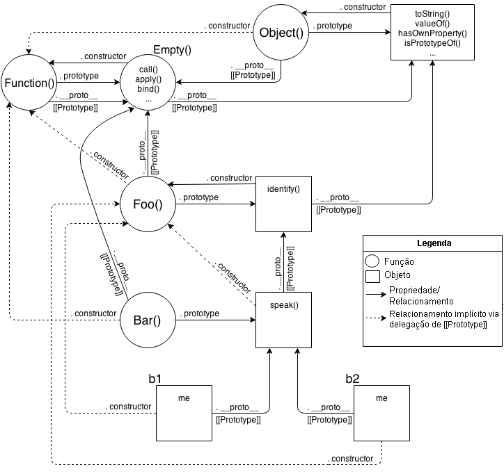
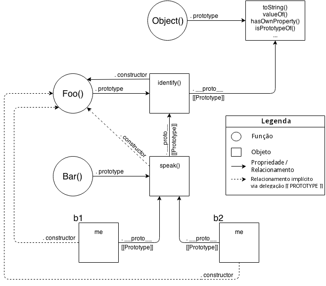
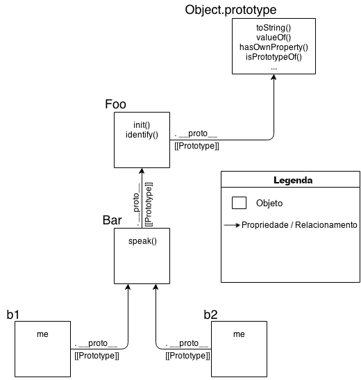

# You Don't Know JS: *this* & Prototipagem de Objetos
# Capítulo 6: Delegação de Comportamentos

No Capítulo 5, nós abordamos detalhadamente o mecânismo `[[Prototype]]`, e o *porquê* de ser confuso e inapropriado (apesar das incontáveis tentativas por quase duas décadas) descrevê-lo como "classe" ou "herança". Vimos a fundo não só sua sintaxe razoavelmente prolixa (`.prototype` sujando o código), mas também as armadilhas (como a surpreendente resolução de `.constructor` ou a horrível sintaxe pseudo-polimórfica). E exploramos as variações da abordagem "mixin", que muitas pessoas utilizam para tentar suavizar áreas mais pesadas.

É uma reação comum a essa altura imaginar qual a necessidade de ser tão complexo algo que parece ser tão simples de ser feito. Agora que abaixamos as cortinas e vimos o quão poluído o código fica, não é uma surpresa a maioria dos desenvolvedores JS nunca mergulharem tão fundo, e ao invés disso relegarem  toda a bagunça para uma biblioteca de "classes" cuidar para eles.

Eu espero que agora você não se contente em encobrir e deixar tais detalhes para uma biblioteca "caixa preta" cuidar. Vamos ver a seguir como nós *podemos e devemos* pensar sobre o mecânismo do objeto `[[Prototype]]` em JS, de uma **forma muito mais simples e direta** que a confusão de classes.

Como uma breve revisão de nossas conclusões do Capítulo 5, o mecânismo `[[Prototype]]` é uma ligação interna que existe em um objeto que referencia outro objeto.

Essa ligação é exercida quando uma referência de uma propriedade/método é feita contra o primeiro objeto, e tal propriedade/método não existe. Neste caso, a ligação `[[Prototype]]` diz ao motor para buscar pela propriedade/método no objeto que está ligado. Por sua vez, caso o objeto não consiga completar a busca, seu `[[Prototype]]` é seguido, e assim por diante. Essa série de ligações entre formas de objetos é chamada de "cadeia de protótipos".

Em outras palavras, o mecânismo atual, a essência do que é importante para a funcionalidade do que podemos fazer com JavaScript, se resume à **objetos sendo ligados a outros objetos.**

Essa observação por si só é fundamental e crítica para entender as motivações e abordagens ao longo deste capítulo!

## Em Direção ao Design Orientado à Delegação

Para focar adequadamente nossa forma de pensar em como usar o `[[Prototype]]` da maneira mais direta, nós devemos reconhecer que isso representa uma diferença fundamental de design pattern em relação às classes (veja Capítulo 4).

**Nota:** *Alguns* princípios de design orientado a classes continuam muito válidos, então não jogue fora tudo que sabe (apenas a maior parte!). Por exemplo, *encapsulamento* é bem poderoso, e é compátivel (embora não muito comum) com delegação.

Nós devemos tentar mudar nossa forma de pensar do padrão classe/herança para o padrão de delegação de comportamento. Se a maior parte do que programou em sua educação/carreira pensando em classes, essa maneira pode ser desconfortável ou não parecer natural. Você pode precisar experimentar fazer esse exercício mental algumas vezes até conseguir pegar o jeito dessa forma tão diferente de se pensar. 

Eu vou orientá-lo através de alguns exercícios teóricos primeiro, e então vamos ver lado a lado em um exemplo mais concreto para te dar um contexto prático para seu próprio código.  

### Teoria de Classe

Digamos que temos várias tarefas semelhantes ("XYZ", "ABC", etc) que precisamos modelar em nosso software.

Com classes, a forma de se projetar esse cenário é: definir uma classe geral pai (base) como `Task`, definindo o comportamento compartilhado para todas as tarefas "parecidas". Então, você define as classes filhas `XYZ` e `ABC`, ambas herdadas de `Task`, e cada uma adiciona um comportamento especial para lidar com suas respectivas tarefas.

**Mais importante,** o design pattern de classes irá encorajá-lo a obter o máximo de herança, você irá querer empregar sobreescrita de métodos (e polimorfismo), onde você sobreescreve a definição de algum método geral `Task` em sua tarefa `XYZ`, talvez até fazendo uso de `super` para chamar a versão base desse método ao adicionar mais comportamento a ele. **Você provavelmente encontrará alguns lugares** nos quais você pode "abstrair" o comportamento geral da classe pai e especializá-lo (substituí-lo) em suas classes filhas.

Aqui vai um pseudo-código para esse cenário:

```js
class Task {
	id;

	// construtor `Task()`
	Task(ID) { id = ID; }
	outputTask() { output( id ); }
}

class XYZ inherits Task {
	label;

	// construtor `XYZ()`
	XYZ(ID,Label) { super( ID ); label = Label; }
	outputTask() { super(); output( label ); }
}

class ABC inherits Task {
	// ...
}
```

Agora, você pode instanciar uma ou mais **cópias** da classe filha `XYZ` e usar essas instâncias para executar a tarefa "XYZ". Estas instâncias possuem **cópias** tanto do comportamento geral definido para a classe `Task` como também do comportamento especificamente definido para `XYZ`. Da mesma forma, instâncias da classe `ABC` teriam cópias do comportamento de `Task` e do comportamento específico de `ABC`. Após a construção, você geralmente só interage com essas instâncias (e não as classes), já que as instâncias têm cópias de todo o comportamento necessário para executar a tarefa pretendida.

### Teoria da Delegação

Mas agora vamos tentar pensar sobre o mesmo domínio do problema, mas usando *delegação de comportamento* ao invés de *classes*.

Primeiro você irá definir um **objeto** (não uma classe, nem uma `function` como muitos desenvolvedores JS o levariam a crer) chamado `Task`, e ele terá um comportamento concreto em si que inclui métodos utilitários que várias outras tarefas podem usar (leia: *delegar para*!). Então, para cada tarefa ("XYZ", "ABC"), você define um **objeto** para manter esses dados/comportamentos específicos. Você **liga** seu(s) objetos(s) de tarefas específicas com o objeto utilitário `Task`, permitindo que deleguem a ele quando precisam.

Basicamente, você pensa em executar a tarefa "XYZ" como se precisasse de comportamentos de dois objetos irmãos (`XYZ` e `Task`) para realizá-lo. Mas, ao invés de precisar compô-los juntos, por meio de cópias de classe, podemos mantê-los em seus objetos separados, e podemos permitir que o objeto `XYZ` **delegue para** `Task` quando preciso. 

Aqui tem um código simples para sugerir como se conseguir isso:

```js
var Task = {
	setID: function(ID) { this.id = ID; },
	outputID: function() { console.log( this.id ); }
};

// faz `XYZ` delegar para `Task`
var XYZ = Object.create( Task );

XYZ.prepareTask = function(ID,Label) {
	this.setID( ID );
	this.label = Label;
};

XYZ.outputTaskDetails = function() {
	this.outputID();
	console.log( this.label );
};

// ABC = Object.create( Task );
// ABC ... = ...
```

Neste código, `Task` e `XYZ` não são classes (ou funções), eles são **apenas objetos**, `XYZ` é configurado via `Object.create(..)` para o `[[Prototype]]` delegar para o objeto `Task` (veja Capítulo 5).

Em comparação com orientação a classes (também conhecido como OO -- orientado a objetos), eu chamo esse estilo de código de **"OLOO"** (objetos-ligados-à-outros-objetos). Tudo que *realmente* nos importa é que o objeto `XYZ` delega para o objeto `Task` (assim como também faz o objeto `ABC`).

Em Javascript, o mecânismo `[[Prototype]]` liga **objetos** com outros **objetos**. Não há mecânismos abstratos como "classes" não importa o quanto tentarem te convencer do contrário. É como remar uma canoa rio acima: você *pode* fazer isso, mas se você estará *escolhendo* ir contra a corrente natural, então obviamente **será muito mais difícil de se chegar onde estiver indo.**

Algumas outras diferenças para se notar com o **código no estilo OLOO**:

1. Ambos os membros de dados `id` e `label` no exemplo de classe anterior são propriedades de dados diretamente em `XYZ` (sem estar em `Task`). Em geral, com delegação `[[Prototype]]` involvida, **você quer que o estado esteja em quem delega** (`XYZ`, `ABC`), não em quem é delegado (`Task`).
2. Com o padrão de classes, nós intencionalmente nomeamos de `outputTask` tanto na classe pai (`Task`) quanto na filha (`XYZ`), para que pudessemos tirar vantagem da substituição (polimorfismo). Em delegação de comportamentos, nós fazemos o oposto: **nós evitamos dar o mesmo nome à qualquer coisa sempre que possível** em diferentes níveis da cadeia `[[Prototype]]` (chamado de sombreamento -- veja Capítulo 5), porque a colisão desses nomes cria uma sintaxe estranha e frágil para se tirar a ambiguidade de suas referências (veja Capítulo 4), e gostaríamos de evitar isso se pudermos.

   Esse padrão exige menos nomes de métodos gerais que tendem a substituir outros métodos e mais nomes descritivos, *específicos* para o tipo de comportamento que cada objeto está executando. **Isso pode de fato criar códigos mais fáceis de se entender/manter**, porque os nomes dos métodos (não só no local de definição como espalhado por outros códigos) são mais óbvios (se auto documentando).
3. `this.setID (ID);` dentro de um método no objeto `XYZ` primeiro olha em `XYZ` para `setID (..)`, mas já que não encontra um método com esse nome em `XYZ`, *delegação* `[[Prototype]]` significa que ele pode seguir a ligação para `Task` procurar por `setID (..)`, que obviamente o encontra. Além disso, devido às regras de ligação implícitas em chamadas `this` (veja o Capítulo 2), quando `setID (..)` é executado, mesmo que o método tenha sido encontrado em `Task`, a ligação `this` para essa chamada de função é `XYZ` exatamente como esperávamos e queríamos. Nós vemos a mesma coisa com `this.outputID ()` depois na listagem de código.
   Em outras palavras, os métodos gerais utilitários que existem em `Task` estão disponíveis para nós enquanto interagimos com `XYZ`, porque `XYZ` pode delegar para `Task`.

**Delegação de comportamentos** significa: deixar algum objeto (`XYZ`) fornecer uma delegação (para `Task`) para referências de métodos ou propriedades, caso não sejam encontradas no objeto (`XYZ`).

Esse é um padrão de design *extremamente poderoso*, muito diferente da ideia de classes pai e filha, herança, polimorfismo, etc. Ao invés de organizar objetos mentalmente de forma vertical, com as classes Pais fluindo para as classes Filhas, pense em objetos lado a lado, como pares, com qualquer direção de ligação de delegação entre os objetos, conforme a necessidade.

**Nota:** O uso de delegação é mais apropriado como um detalhe de implementação interno ao invés de algo exposto diretamente no desenho da interface da API. No exemplo acima, nós não necessariamente *pretendemos* com o desenho de nossa API que desenvolvedores chamem `XYZ.setID()` (embora seja possível, é claro!). Nós meio que *escondemos* a delegação como um detalhe interno de nossa API, onde `XYZ.prepareTask(..)` delega para `Task.setID(..)`. Veja a discussão de "Ligações como Fallbacks?" no Capítulo 5 para maiores detalhes.

#### Delegação Mútua (Não permitida)

Você não pode criar um *ciclo* onde dois ou mais objetos estão mutualmente delegados um para o outro (bidirecionalmente). Se você fizer `B` ligado a `A`, e então tentar ligar `A` para `B`, você receberá um erro.

É uma vergonha (não é terrivelmente surpreendente, mas um pouco irritante) que isso não seja permitido. Se você criasse uma referência a uma propriedade/método que não exista em nenhum lugar, você teria um loop de recursão infinita no `[[Prototype]]`. Mas se todas as referências estiverem estritamente presentes, então `B` poderia delegar para `A`, e vice-versa, e isso *poderia* funcionar. Isso significa que você poderia usar um dos objetos para delegar para o outro, para várias tarefas. Existem alguns poucos casos de uso onde isso poderia ser útil.

Mas isto não é permitido porque os implementadores dos motores JS observaram que é mais eficiente verificar (e rejeitar!) referências circulares infinitas uma vez na sua definição, do que precisar ter o impacto de execução dessas verificações toda vez que você procurar por uma propriedade em um objeto.

#### Depurado

Vamos abordar brevemente um detalhe sutil que pode ser confuso aos desenvolvedores. No geral, a especificação do JS não controla como as ferramentas de desenvolvimento do navegador devem apresentar valores/estruturas específicos para uma desenvolvedora, então cada navegador/motor é livre para interpretar algumas coisas como eles acharem melhor. Dessa forma, navegadores/ferramentas *nem sempre estão de acordo*. Especificamente, o comportamentos que iremos examinar é atualmente observado somente no Chrome's Developer Tools.

Considere como esse tradicional estilo de código JS para "construtor de classe" apareceria no *console* do Chrome Developer Tools:

```js
function Foo() {}

var a1 = new Foo();

a1; // Foo {}
```

Vamos olhar para a última linha do código: o output computado da expressão `a1`, que imprime `Foo {}`. Se você tentar o mesmo código no Firefox, provavelmente verá algo como `Object {}`.  Por que a diferença? O que esses outputs significam?

Chrome está essencialmente dizendo "{} é um objeto vazio que foi contruído por uma função com nome 'Foo'". Firefox está dizendo "{} é um objeto vazio da construção geral de Object". A sutil diferença é que o Chrome está rastreando ativamente, como uma *propriedade interna*, o nome da função que realmente fez a construção, enquanto outros navegadores não fazem o rastreamento dessa informação adicional.

Seria tentador tentar explicar isso com o funcionamento do JavaScript:

```js
function Foo() {}

var a1 = new Foo();

a1.constructor; // Foo(){}
a1.constructor.name; // "Foo"
```

Então, é assim que o Chrome está mostrando "Foo", por uma simples olhada na `.constructor.name` do objeto? Confusamente, a resposta é tanto "sim" quanto "não".

Considere este código:

```js
function Foo() {}

var a1 = new Foo();

Foo.prototype.constructor = function Gotcha(){};

a1.constructor; // Gotcha(){}
a1.constructor.name; // "Gotcha"

a1; // Foo {}
```

Mesmo que nós mudemos `a1.constructor.name` para legitimamente ser alguma outra coisa ("Gotcha"), o console do Chrome ainda vai usar o nome "Foo".

Então, parece que a resposta da pergunta anterior (o Chrome usa `.constructor.name`?) é **não**, ele deve olhar algum outro lugar, internamente.

Mas, não tão rápido! Vamos ver como esse tipo de comportamento funciona com código estilo OLOO:

```js
var Foo = {};

var a1 = Object.create( Foo );

a1; // Object {}

Object.defineProperty( Foo, "constructor", {
	enumerable: false,
	value: function Gotcha(){}
});

a1; // Gotcha {}
```

Ah-ha! **Gotcha!** Aqui, o console do Chrome **realmente** achou e usou a `.constructor.name`. Na verdade, enquanto escrevia esse livro, esse exato comportamento era identificado no Chrome como um bug, e no momento que você estiver lendo isso, ele pode ter sido corrigido. Então pode ser que você veja `a1; // Object {}` corretamente.

Deixando o bug de lado, o rastreamento interno (aparentemente somente para propósitos de depuração) de "constructor name" que o Chrome faz (mostrado nos trechos anteriores) é uma extensão intencional do Chrome, além do que a especificação do JS exige.

Se você não usar um "constructor" para criar seus objetos, como desencorajamos com o estilo de código OLOO aqui nesse capítulo, então você terá objetos que o Chrome *não* rastreia um "constructor name" interno, e esses objetos serão exibidos corretamente como "Object {}", significando "objeto gerado pelo construtor Object()".

**Não pense** que isso representa uma desvantagem do estilo de código OLOO. Quando você escreve código com OLOO e delegação de comportamento como seu padrão de design, *quem* "construiu" (isso é, *qual função* foi chamada com `new`?) algum objeto é um detalhe irrelevante. O rastreamento interno de "constructor name" específico do Chrome só é realmente útil se você adotar totalmente o estilo de código de "classe", mas é discutível se, no lugar, você adotar delegação de OLOO.

### Modelos Mentais Comparados

Agora que você pode ver a diferença entre os padrões de design "classe" e "delegação", pelo menos teoricamente, vamos ver as implicações que esses padrões de design tem nos modelos mentais que usamos para pensar sobre nosso código.

Nós vamos examinar um código mais hipotético ("Foo", "Bar"), e comparar as duas formas (OO vs. OLOO) de se implementar o código. O primeiro trecho usa o clássico estilo OO (com "prototype"):

```js
function Foo(who) {
	this.me = who;
}
Foo.prototype.identify = function() {
	return "I am " + this.me;
};

function Bar(who) {
	Foo.call( this, who );
}
Bar.prototype = Object.create( Foo.prototype );

Bar.prototype.speak = function() {
	alert( "Hello, " + this.identify() + "." );
};

var b1 = new Bar( "b1" );
var b2 = new Bar( "b2" );

b1.speak();
b2.speak();
```

A classe pai `Foo`, herdada pela classe filha `Bar`, é então instanciada duas vezes como `b1` e `b2`. O que nós temos é `b1` delegando para `Bar.prototype` que delega para `Foo.prototype`. Isso deve parecer bastante familiar para você, nesse momento. Nada muito inovador acontecendo.

Agora, vamos implementar **exatamente a mesma funcionalidade** usando o estilo de código *OLOO*:

```js
var Foo = {
	init: function(who) {
		this.me = who;
	},
	identify: function() {
		return "I am " + this.me;
	}
};

var Bar = Object.create( Foo );

Bar.speak = function() {
	alert( "Hello, " + this.identify() + "." );
};

var b1 = Object.create( Bar );
b1.init( "b1" );
var b2 = Object.create( Bar );
b2.init( "b2" );

b1.speak();
b2.speak();
```

Nós pegamos exatamente as mesmas vantagens da delegação via `[[Prototype]]` de `b1` para `Bar` para `Foo` como nós fizemos no exemplo anterior entre `b1`, `Bar.prototype`, e `Foo.prototype`. **Nós ainda temos os mesmos 3 objetos ligados entre si**.

Mas, mais importante, nós simplificamos bastante *todas as outras coisas*, porque agora nós apenas ligamos **objetos** uns aos outros, sem precisar de toda a confusão de coisas que parecem (mas não se comportam!) como classes, com contrutores e prototypes e chamadas `new`.

Pergunte a si mesmo: se eu posso ter a mesma funcionalidade com código OLOO como eu tenho com código estilo "class", mas OLOO é mais simples e tem menos coisas para me preocupar, **OLOO é melhor**?

Vamos examinar os modelos mentais involvidos entre esses dois exemplos.

Primeiro, o trecho de código no estilo de classe implica esse modelo mental de entidades e seus relacionamentos:



Na verdade, isso é um pouco desleal/ilusório, porque mostra vários detalhes extras que você *tecnicamente* não precisa saber o tempo todo (embora você *precise* entendê-los!). Um deles é que é uma série bastante complexa de relacionamentos. Mas outra coisa é: se você dedicar tempo para seguir essas setas de relacionamentos, **há uma incrível quantidade de consistência interna** nos mecanismos do JS.

Por exemplo, a habilidade de uma função JS acessar `call(..)`, `apply(..)`, e `bind(..)` (veja o Capítulo 2) é porque funções em si são objetos, e funções-objeto também tem um vínculo de `[[Prototype]]`, para o objeto `Function.prototype`, que define esses métodos padrões que qualquer função-objeto pode usar por delegação. JS pode fazer essas coisas, *e você também pode!*.

OK, agora vamos olhar para uma versão *ligeiramente* simplificada desse diagrama que é um pouco mais "justa" para comparação -- mostra apenas as entidades e relacionamentos *relevantes*.



Ainda é bem complexo, né? As linhas tracejadas estão descrevendo os relacionamentos implícitos de quando você define a "herança" entre `Foo.prototype` e `Bar.prototype` e ainda não *corrigiu* a referência da propriedade `.constructor` **ausente** (veja "Constructor Redux" no Capítulo 5). Mesmo com essas linhas tracejadas removidas, o modelo mental ainda é um malabarismo muito terrível toda vez que você trabalha com vínculos de objetos.

Agora, vamos dar uma olhada no modelo mental para código estilo OLOO:



Como você pode ver comparando eles, é óbvio que o código estilo OLOO tem *muito menos coisa* para se preocupar, porque código OLOO abraça o **fato** que a única coisa que nos preocupamos foi com **objetos ligados a outros objetos**.

Todas as outras sujeiras de "classes" foram uma confusa e complexa forma de se conseguir o mesmo resultado. Remova essas coisas, e as coisas ficam muito mais simples (sem perder nenhuma funcionalidade).

## Classes vs. Objetos

Acabamos de ver várias explorações teóricas e modelos mentais de "classes" vs. "delegação de comportamento". Mas, agora vamos analisar cenários de código mais concretos para mostrar como você realmente usa essas ideias.

Primeiro, examinaremos um cenário típico no desenvolvimento web front-end: criação de widgets de UI (botões, menus suspensos etc.).

### Widget "Classes"

Porque você provavelmente ainda está tão acostumado com o padrão de design OO, provavelmente irá pensar imediatamente no domínio deste problema em termos de uma classe pai (talvez chamada de `Widget`) com todo o comportamento do widget base comum e depois classes filhas derivadas para tipos de widget específicos (como `Button`).

**Nota:** Vamos usar jQuery para manipulação de DOM e CSS aqui, apenas porque é um detalhe que realmente não importa para os propósitos de nossa discussão atual. Nenhum desses códigos se importam com qual framework JS (jQuery, Dojo, YUI, etc.), se houver, você pode resolver tarefas comuns desse tipo.

Vamos examinar como implementaríamos o design "classe" no estilo clássico em JS puro sem nenhuma biblioteca ou sintaxe auxiliar de "classe":

```js
// Classe pai
function Widget(width,height) {
	this.width = width || 50;
	this.height = height || 50;
	this.$elem = null;
}

Widget.prototype.render = function($where){
	if (this.$elem) {
		this.$elem.css( {
			width: this.width + "px",
			height: this.height + "px"
		} ).appendTo( $where );
	}
};

// Class filha
function Button(width,height,label) {
	// chamada do construtor "super"
	Widget.call( this, width, height );
	this.label = label || "Default";

	this.$elem = $( "<button>" ).text( this.label );
}

// faz `Button` "herdar" de `Widget`
Button.prototype = Object.create( Widget.prototype );

// sobrescreve `render(..)` "herdado" 
Button.prototype.render = function($where) {
	// chamada "super"
	Widget.prototype.render.call( this, $where );
	this.$elem.click( this.onClick.bind( this ) );
};

Button.prototype.onClick = function(evt) {
	console.log( "Button '" + this.label + "' clicked!" );
};

$( document ).ready( function(){
	var $body = $( document.body );
	var btn1 = new Button( 125, 30, "Hello" );
	var btn2 = new Button( 150, 40, "World" );

	btn1.render( $body );
	btn2.render( $body );
} );
```

O padrão de design OO nos diz para declarar um `render(..)` base na classe pai, e então sobrescrevê-lo na nossa classe filha, mas não necessariamente substituí-lo, preferindo aumentar a funcionalidade base com o comportamento específico de botão.

Observe a feiura do *pseudo-polimorfismo explícito* (veja o Capítulo 4) com as referências `Widget.call` e `Widget.prototype.render.call` para fingir chamadas "super" a partir dos métodos da "classe" filha para os métodos base da "classe" pai. Que nojo.

#### Açúcar Sintático ES6 `class`

Nós cobrimos o açúcar sintático `class` do ES6 em detalhes no Apêndice A, mas vamos demonstrar brevemente como nós poderíamos implementar o mesmo código usando `class`:

```js
class Widget {
	constructor(width,height) {
		this.width = width || 50;
		this.height = height || 50;
		this.$elem = null;
	}
	render($where){
		if (this.$elem) {
			this.$elem.css( {
				width: this.width + "px",
				height: this.height + "px"
			} ).appendTo( $where );
		}
	}
}

class Button extends Widget {
	constructor(width,height,label) {
		super( width, height );
		this.label = label || "Default";
		this.$elem = $( "<button>" ).text( this.label );
	}
	render($where) {
		super.render( $where );
		this.$elem.click( this.onClick.bind( this ) );
	}
	onClick(evt) {
		console.log( "Button '" + this.label + "' clicked!" );
	}
}

$( document ).ready( function(){
	var $body = $( document.body );
	var btn1 = new Button( 125, 30, "Hello" );
	var btn2 = new Button( 150, 40, "World" );

	btn1.render( $body );
	btn2.render( $body );
} );
```

Sem dúvidas, um pouco da feia sintaxe da abordagem clássica anterior foi suavizada pela `class` do ES6. A presença do `super(..)` em particular parece bastante agradável (embora quando você cava mais fundo nisso, nem tudo são flores!).

Apesar das melhorias sintáticas, **essas não são classes *reais***, uma vez que elas ainda operam sobre o mecanismo do `[[Prototype]]`. Eles sofrem das mesmas discrepâncias de modelo mental que exploramos nos Capítulos 4, 5 e até agora neste capítulo. O Apêndice A irá expôr a sintaxe `class` do ES6 e suas implicações em detalhes. Nós vamos ver por que resolver contratempos de linguagem não resolve substancialmente nossas confusões com classes no JS, embora isso faça um grande esforço para se mascarar de uma solução!

Se você usa a sintaxe prototípica clássica ou o novo açúcar sintático do ES6, ainda fez uma *escolha* para modelar o domínio do problema (widgets da interface do usuário) com "classes". E, como os poucos capítulos anteriores tentam demonstrar, essa *opção* no JavaScript está deixando você com dores de cabeça extras e esgotamento mental.

### Delegando Objetos Widget

Aqui está nosso simplório exemplo `Widget` / `Button`, usando **estilo de delegação OLOO**:

```js
var Widget = {
	init: function(width,height){
		this.width = width || 50;
		this.height = height || 50;
		this.$elem = null;
	},
	insert: function($where){
		if (this.$elem) {
			this.$elem.css( {
				width: this.width + "px",
				height: this.height + "px"
			} ).appendTo( $where );
		}
	}
};

var Button = Object.create( Widget );

Button.setup = function(width,height,label){
	// chamada de delegação
	this.init( width, height );
	this.label = label || "Default";

	this.$elem = $( "<button>" ).text( this.label );
};
Button.build = function($where) {
	// chamada de delegação
	this.insert( $where );
	this.$elem.click( this.onClick.bind( this ) );
};
Button.onClick = function(evt) {
	console.log( "Button '" + this.label + "' clicked!" );
};

$( document ).ready( function(){
	var $body = $( document.body );

	var btn1 = Object.create( Button );
	btn1.setup( 125, 30, "Hello" );

	var btn2 = Object.create( Button );
	btn2.setup( 150, 40, "World" );

	btn1.build( $body );
	btn2.build( $body );
} );
```

Com essa abordagem de estilo OLOO, nós não pensamos em `Widget` como pai e `Button` como filho. Ao invés disso, `Widget` **é apenas um objeto** e é uma espécie de utilitário para o qual qualquer tipo de widget pode querer delegar comportamento, e `Button` **também é apenas um objeto independente** (com uma conexão de delegação para `Widget`, é claro!).

De uma perspectiva de padrão de design, nós **não** compartilhamos o mesmo nome de método `render(..)` nos dois objetos, da forma que classes sugerem, mas no lugar nós escolhemos nomes diferentes (`insert(..)` e `build(..)`) que são mais descritivos para o tipo de tarefas que cada um faz. Os métodos de *inicialização* são chamados de `init(..)` e `setup(..)`, respectivamente, pelas mesmas razões.

O padrão de design de delegação não só sugere nomes diferentes e mais descritivos (no lugar de compartilhar nomes genéricos), mas a sua utilização faz com que evitemos a feiura das chamadas pseudo-polimórficas explícitas (`Widget.call` e `Widget.prototype.render.call`), como você pode ver nas chamadas simples, relativas e delegadas para `this.init(..)` e `this.insert(..)`.

Sintaticamente, nós também não temos a presença de nenhum construtor, `.prototype` ou `new`, já que eles são, de fato, apenas sujeira desnecessária.

Agora, se você está prestando bastante atenção, você deve ter notado que o que anteriormente era apenas uma chamada (`var btn1 = new Button(..)`) agora são duas chamadas (`var btn1 = Object.create(Button)` e `btn1.setup(..)`). De início isso pode parecer uma desvantagem (mais código).

No entanto, mesmo isso é algo que é **um ponto positivo do estilo de código OLOO** em comparação ao estilo de código clássico com prototype. Como?

Com construtores de classes, você é forçado (não exatamente, mas fortemente sugerido) a fazer ambos, construção e inicialização, no mesmo passo. No entanto, existem vários casos onde é mais flexível ter a opção de fazer esses dois passos separadamente (como podemos fazer com OLOO!).

Por exemplo, digamos que você crie todas as suas instâncias em um pool no início de seu programa, mas espera para inicializá-las com configuração específica até que sejam retiradas do pool e usadas. Mostramos as duas chamadas acontecendo uma ao lado da outra, mas é claro que elas podem acontecer em momentos muito diferentes e em partes muito diferentes do nosso código, conforme necessário.

**OLOO** tem um suporte *melhor* ao princípio de separação de conceitos, onde criação e inicialização não são necessariamente associadas dentro da mesma operação.

## Design Mais Simples

Além de o OLOO fornecer um código ostensivamente mais simples (e mais flexível!), a delegação de comportamento como padrão pode, na verdade, levar a uma arquitetura de código mais simples. Vamos examinar um último exemplo que ilustra como o OLOO simplifica seu design geral.

O cenário que vamos examinar é o de dois objetos controladores, um para lidar com o formulário de login de uma página web, e outro para lidar de fato com a autenticação (comunicação) com o servidor.

Vamos precisar de um utilitário auxiliar para fazer a comunicação Ajax com o servidor. Vamos usar o jQuery (embora qualquer framework sirva bem), já que ele não apenas trata o Ajax para nós, mas também retorna uma resposta semelhante a uma promise, de modo que possamos escutar a resposta em nosso código chamador com `.then(..)`.

**Nota:** Não abordamos Promises aqui, mas vamos abordá-las em um título futuro da série *"You Don't Know JS"*.

Seguindo o típico padrão de design de classes, vamos dividir a tarefa em uma funcionalidade base numa classe chamada `Controller`, e então vamos derivar duas classes filhas, `LoginController` e `AuthController`, que ambas herdam de `Controller` e especializam alguns desses comportamentos base.

```js
// Classe pai
function Controller() {
	this.errors = [];
}
Controller.prototype.showDialog = function(title,msg) {
	// exibe título & mensagem ao usuário no diálogo
};
Controller.prototype.success = function(msg) {
	this.showDialog( "Success", msg );
};
Controller.prototype.failure = function(err) {
	this.errors.push( err );
	this.showDialog( "Error", err );
};
```

```js
// Classe filha
function LoginController() {
	Controller.call( this );
}
// Liga a classe filha a pai
LoginController.prototype = Object.create( Controller.prototype );
LoginController.prototype.getUser = function() {
	return document.getElementById( "login_username" ).value;
};
LoginController.prototype.getPassword = function() {
	return document.getElementById( "login_password" ).value;
};
LoginController.prototype.validateEntry = function(user,pw) {
	user = user || this.getUser();
	pw = pw || this.getPassword();

	if (!(user && pw)) {
		return this.failure( "Please enter a username & password!" );
	}
	else if (pw.length < 5) {
		return this.failure( "Password must be 5+ characters!" );
	}

	// chegou aqui? validado!
	return true;
};
// Sobrescreve para estender o `failure()` base
LoginController.prototype.failure = function(err) {
	// chamada "super"
	Controller.prototype.failure.call( this, "Login invalid: " + err );
};
```

```js
// Classe filha
function AuthController(login) {
	Controller.call( this );
	// além da herança, também precisamos de composição
	this.login = login;
}
// Liga a classe filha a pai
AuthController.prototype = Object.create( Controller.prototype );
AuthController.prototype.server = function(url,data) {
	return $.ajax( {
		url: url,
		data: data
	} );
};
AuthController.prototype.checkAuth = function() {
	var user = this.login.getUser();
	var pw = this.login.getPassword();

	if (this.login.validateEntry( user, pw )) {
		this.server( "/check-auth",{
			user: user,
			pw: pw
		} )
		.then( this.success.bind( this ) )
		.fail( this.failure.bind( this ) );
	}
};
// Sobrescreve para estender o `success()` base
AuthController.prototype.success = function() {
	// chamada "super"
	Controller.prototype.success.call( this, "Authenticated!" );
};
// Sobrescreve para estender o `failure()` base
AuthController.prototype.failure = function(err) {
	// chamada "super"
	Controller.prototype.failure.call( this, "Auth Failed: " + err );
};
```

```js
var auth = new AuthController(
	// além da herança, também precisamos de composição
	new LoginController()
);
auth.checkAuth();
```

Temos comportamentos base que todos os controladores compartilham, que são `success(..)`, `failure(..)` e `showDialog(..)`. Nossas classes filhas `LoginController` e `AuthController` sobrescrevem `failure(..)` e `success(..)` para ampliar o comportamento padrão da classe base. Note também que `AuthController` precisa de uma instância de `LoginController` para interagir com o formulário de login, então isso se torna uma propriedade de dados membro.

A outra coisa a mencionar é que escolhemos polvilhar um pouco de *composição* por cima da herança. `AuthController` precisa conhecer `LoginController`, então o instanciamos (`new LoginController()`) e mantemos uma propriedade membro de classe chamada `this.login` para referenciá-lo, de modo que `AuthController` possa invocar comportamento em `LoginController`.

**Nota:** Pode ter havido uma leve tentação de fazer `AuthController` herdar de `LoginController`, ou vice-versa, de modo que tivéssemos *composição virtual* através da cadeia de herança. Mas este é um exemplo bastante claro do que há de errado com a herança de classes como *o* modelo para o domínio do problema, porque nem `AuthController` nem `LoginController` estão especializando o comportamento base um do outro, então a herança entre eles faz pouco sentido, exceto se classes forem seu único padrão de design. Em vez disso, intercalamos um pouco de *composição* simples e agora eles podem cooperar, ainda que ambos se beneficiem da herança do `Controller` base pai.

Se você está familiarizado com design orientado a classes (OO), tudo isso deve parecer bastante familiar e natural.

### Des-classe-ificado

Mas, **será que realmente precisamos modelar este problema** com uma classe pai `Controller`, duas classes filhas **e alguma composição**? Existe uma maneira de tirar proveito da delegação de comportamento no estilo OLOO e ter um design *muito* mais simples? **Sim!**

```js
var LoginController = {
	errors: [],
	getUser: function() {
		return document.getElementById( "login_username" ).value;
	},
	getPassword: function() {
		return document.getElementById( "login_password" ).value;
	},
	validateEntry: function(user,pw) {
		user = user || this.getUser();
		pw = pw || this.getPassword();

		if (!(user && pw)) {
			return this.failure( "Please enter a username & password!" );
		}
		else if (pw.length < 5) {
			return this.failure( "Password must be 5+ characters!" );
		}

		// chegou aqui? validado!
		return true;
	},
	showDialog: function(title,msg) {
		// exibe mensagem de sucesso ao usuário no diálogo
	},
	failure: function(err) {
		this.errors.push( err );
		this.showDialog( "Error", "Login invalid: " + err );
	}
};
```

```js
// Liga `AuthController` para delegar a `LoginController`
var AuthController = Object.create( LoginController );

AuthController.errors = [];
AuthController.checkAuth = function() {
	var user = this.getUser();
	var pw = this.getPassword();

	if (this.validateEntry( user, pw )) {
		this.server( "/check-auth",{
			user: user,
			pw: pw
		} )
		.then( this.accepted.bind( this ) )
		.fail( this.rejected.bind( this ) );
	}
};
AuthController.server = function(url,data) {
	return $.ajax( {
		url: url,
		data: data
	} );
};
AuthController.accepted = function() {
	this.showDialog( "Success", "Authenticated!" )
};
AuthController.rejected = function(err) {
	this.failure( "Auth Failed: " + err );
};
```

Como `AuthController` é apenas um objeto (assim como `LoginController`), não precisamos instanciar (como `new AuthController()`) para realizar nossa tarefa. Tudo o que precisamos fazer é:

```js
AuthController.checkAuth();
```

Claro, com OLOO, se você de fato precisar criar um ou mais objetos adicionais na cadeia de delegação, isso é fácil e ainda não requer nada parecido com instanciação de classe:

```js
var controller1 = Object.create( AuthController );
var controller2 = Object.create( AuthController );
```

Com a delegação de comportamento, `AuthController` e `LoginController` são **apenas objetos**, pares *horizontais* um do outro, e não estão dispostos ou relacionados como pais e filhos na orientação a classes. Escolhemos de forma um tanto arbitrária fazer `AuthController` delegar a `LoginController` -- teria sido igualmente válido que a delegação fosse na direção inversa.

A principal conclusão desta segunda listagem de código é que temos apenas duas entidades (`LoginController` e `AuthController`), **não três** como antes.

Não precisamos de uma classe base `Controller` para "compartilhar" comportamento entre as duas, porque a delegação é um mecanismo poderoso o suficiente para nos dar a funcionalidade de que precisamos. Também, como observado antes, não precisamos instanciar nossas classes para trabalhar com elas, porque não há classes, **apenas os próprios objetos.** Além disso, não há necessidade de *composição*, pois a delegação dá aos dois objetos a capacidade de cooperar de forma *diferencial* conforme necessário.

Por fim, evitamos as armadilhas de polimorfismo do design orientado a classes ao não ter os nomes `success(..)` e `failure(..)` iguais em ambos os objetos, o que teria exigido um feio pseudopolimorfismo explícito. Em vez disso, os chamamos de `accepted()` e `rejected(..)` em `AuthController` -- nomes um pouco mais descritivos para suas tarefas específicas.

**Resumindo**: acabamos com a mesma capacidade, mas com um design (significativamente) mais simples. Esse é o poder do código no estilo OLOO e o poder do padrão de design de *delegação de comportamento*.

## Sintaxe Mais Agradável

Uma das coisas mais agradáveis que torna a `class` do ES6 tão enganosamente atraente (veja o Apêndice A sobre por que evitá-la!) é a sintaxe abreviada para declarar métodos de classe:

```js
class Foo {
	methodName() { /* .. */ }
}
```

Conseguimos eliminar a palavra `function` da declaração, o que faz desenvolvedores JS de todos os lugares comemorarem!

E você pode ter notado e ficado frustrado que a sintaxe OLOO sugerida acima tem muitas aparições de `function`, o que parece um certo detrator do objetivo de simplificação do OLOO. **Mas não precisa ser assim!**

A partir do ES6, podemos usar *declarações concisas de método* em qualquer objeto literal, então um objeto no estilo OLOO pode ser declarado desta forma (mesmo açúcar abreviado da sintaxe do corpo de `class`):

```js
var LoginController = {
	errors: [],
	getUser() { // Olha mãe, sem `function`!
		// ...
	},
	getPassword() {
		// ...
	}
	// ...
};
```

A única diferença é que objetos literais ainda exigirão separadores de vírgula `,` entre os elementos, enquanto a sintaxe de `class` não. Concessão bem pequena no esquema geral das coisas.

Além disso, a partir do ES6, a sintaxe mais desajeitada que você usa (como na definição de `AuthController`), onde você atribui propriedades individualmente e não usa um objeto literal, pode ser reescrita usando um objeto literal (para que você possa usar métodos concisos), e você pode simplesmente modificar o `[[Prototype]]` desse objeto com `Object.setPrototypeOf(..)`, assim:

```js
// usa a sintaxe mais agradável de objeto literal c/ métodos concisos!
var AuthController = {
	errors: [],
	checkAuth() {
		// ...
	},
	server(url,data) {
		// ...
	}
	// ...
};

// AGORA, liga `AuthController` para delegar a `LoginController`
Object.setPrototypeOf( AuthController, LoginController );
```

O estilo OLOO a partir do ES6, com métodos concisos, **é muito mais amigável** do que era antes (e, mesmo então, era muito mais simples e agradável do que o código clássico no estilo prototype). **Você não precisa optar por class** (complexidade) para ter uma sintaxe de objeto limpa e agradável!

### Não Lexical

*Há* uma desvantagem nos métodos concisos que é sutil, mas importante de se notar. Considere este código:

```js
var Foo = {
	bar() { /*..*/ },
	baz: function baz() { /*..*/ }
};
```

Aqui está a remoção do açúcar sintático que expressa como esse código vai operar:

```js
var Foo = {
	bar: function() { /*..*/ },
	baz: function baz() { /*..*/ }
};
```

Percebe a diferença? A abreviação `bar()` tornou-se uma *expressão de função anônima* (`function()..`) anexada à propriedade `bar`, porque o próprio objeto função não tem identificador de nome. Compare isso com a *expressão de função nomeada* especificada manualmente (`function baz()..`), que tem um identificador de nome lexical `baz` além de estar anexada a uma propriedade `.baz`.

E daí? No título *"Scope & Closures"* desta série de livros *"You Don't Know JS"*, abordamos em detalhes as três principais desvantagens das *expressões de função anônimas*. Vamos apenas repeti-las brevemente para que possamos comparar com a abreviação dos métodos concisos.

A falta de um identificador `name` em uma função anônima:

1. torna a depuração de stack traces mais difícil
2. torna a auto-referência (recursão, (des)vinculação de eventos, etc) mais difícil
3. torna o código (um pouquinho) mais difícil de entender

Os itens 1 e 3 não se aplicam aos métodos concisos.

Embora a remoção do açúcar sintático use uma *expressão de função anônima* que normalmente não teria `name` nos stack traces, os métodos concisos são especificados para definir a propriedade interna `name` do objeto função de forma correspondente, então os stack traces deveriam conseguir usá-la (embora isso dependa da implementação e, portanto, não seja garantido).

O item 2 é, infelizmente, **ainda uma desvantagem dos métodos concisos**. Eles não terão um identificador lexical para usar como auto-referência. Considere:

```js
var Foo = {
	bar: function(x) {
		if (x < 10) {
			return Foo.bar( x * 2 );
		}
		return x;
	},
	baz: function baz(x) {
		if (x < 10) {
			return baz( x * 2 );
		}
		return x;
	}
};
```

A referência manual `Foo.bar(x*2)` acima meio que basta neste exemplo, mas há muitos casos em que uma função não conseguiria necessariamente fazer isso, como nos casos em que a função está sendo compartilhada em delegação entre diferentes objetos, usando vinculação de `this`, etc. Você gostaria de usar uma auto-referência de verdade, e o identificador `name` do objeto função é a melhor maneira de conseguir isso.

Apenas esteja ciente dessa ressalva quanto aos métodos concisos e, se você se deparar com tais problemas de falta de auto-referência, certifique-se de abrir mão da sintaxe de método conciso **apenas para aquela declaração** em favor da forma manual de declaração de *expressão de função nomeada*: `baz: function baz(){..}`.

## Introspecção

Se você passou muito tempo com programação orientada a classes (seja em JS ou em outras linguagens), provavelmente está familiarizado com a *introspecção de tipo*: inspecionar uma instância para descobrir que *tipo* de objeto ela é. O objetivo principal da *introspecção de tipo* com instâncias de classe é raciocinar sobre a estrutura/capacidades do objeto com base em *como ele foi criado*.

Considere este código que usa `instanceof` (veja o Capítulo 5) para fazer introspecção em um objeto `a1` a fim de inferir sua capacidade:

```js
function Foo() {
	// ...
}
Foo.prototype.something = function(){
	// ...
}

var a1 = new Foo();

// later

if (a1 instanceof Foo) {
	a1.something();
}
```

Como `Foo.prototype` (não `Foo`!) está na cadeia de `[[Prototype]]` (veja o Capítulo 5) de `a1`, o operador `instanceof` (de forma confusa) finge nos dizer que `a1` é uma instância da "classe" `Foo`. Com esse conhecimento, então assumimos que `a1` tem as capacidades descritas pela "classe" `Foo`.

Claro, não existe classe `Foo`, apenas uma boa e velha função normal `Foo`, que por acaso tem uma referência a um objeto arbitrário (`Foo.prototype`) ao qual `a1` por acaso está ligado por delegação. Por sua sintaxe, `instanceof` finge estar inspecionando a relação entre `a1` e `Foo`, mas na verdade está nos dizendo se `a1` e (o objeto arbitrário referenciado por) `Foo.prototype` estão relacionados.

A confusão semântica (e indireção) da sintaxe de `instanceof` significa que, para usar a introspecção baseada em `instanceof` para perguntar se o objeto `a1` está relacionado ao objeto de capacidades em questão, você *tem que* ter uma função que mantenha uma referência a esse objeto -- você não pode simplesmente perguntar diretamente se os dois objetos estão relacionados.

Lembre-se do exemplo abstrato `Foo` / `Bar` / `b1` do início deste capítulo, que vamos abreviar aqui:

```js
function Foo() { /* .. */ }
Foo.prototype...

function Bar() { /* .. */ }
Bar.prototype = Object.create( Foo.prototype );

var b1 = new Bar( "b1" );
```

Para fins de *introspecção de tipo* nas entidades desse exemplo, usando a semântica de `instanceof` e `.prototype`, aqui estão as várias verificações que você pode precisar realizar:

```js
// relacionando `Foo` e `Bar` entre si
Bar.prototype instanceof Foo; // true
Object.getPrototypeOf( Bar.prototype ) === Foo.prototype; // true
Foo.prototype.isPrototypeOf( Bar.prototype ); // true

// relacionando `b1` tanto a `Foo` quanto a `Bar`
b1 instanceof Foo; // true
b1 instanceof Bar; // true
Object.getPrototypeOf( b1 ) === Bar.prototype; // true
Foo.prototype.isPrototypeOf( b1 ); // true
Bar.prototype.isPrototypeOf( b1 ); // true
```

É justo dizer que parte disso meio que é ruim. Por exemplo, intuitivamente (com classes) você poderia querer ser capaz de dizer algo como `Bar instanceof Foo` (porque é fácil confundir o que "instância" significa e achar que inclui "herança"), mas essa não é uma comparação sensata em JS. Você tem que fazer `Bar.prototype instanceof Foo` em vez disso.

Outro padrão comum, mas talvez menos robusto, de *introspecção de tipo*, que muitos devs parecem preferir em vez de `instanceof`, é chamado de "duck typing". Esse termo vem do ditado: "se parece com um pato e grasna como um pato, então deve ser um pato".

Exemplo:

```js
if (a1.something) {
	a1.something();
}
```

Em vez de inspecionar uma relação entre `a1` e um objeto que mantém a função delegável `something()`, assumimos que o teste de `a1.something` passar significa que `a1` tem a capacidade de chamar `.something()` (independentemente de ter encontrado o método diretamente em `a1` ou delegado a algum outro objeto). Por si só, essa suposição não é tão arriscada.

Mas o "duck typing" é frequentemente estendido para fazer **outras suposições sobre as capacidades do objeto** além do que está sendo testado, o que, é claro, introduz mais risco (ou seja, design frágil) no teste.

Um exemplo notável de "duck typing" vem com as Promises do ES6 (que, como uma nota anterior explicou, não são abordadas neste livro).

Por várias razões, há a necessidade de determinar se qualquer referência de objeto arbitrária *é uma Promise*, mas a forma como esse teste é feito é verificar se o objeto por acaso tem uma função `then()` presente nele. Em outras palavras, **se qualquer objeto** por acaso tiver um método `then()`, as Promises do ES6 vão assumir incondicionalmente que o objeto **é um "thenable"** e, portanto, vão esperar que ele se comporte em conformidade com todos os comportamentos padrão das Promises.

Se você tiver qualquer objeto que não seja uma Promise mas que, por qualquer motivo, tenha um método `then()`, recomenda-se fortemente que você o mantenha bem longe do mecanismo de Promise do ES6 para evitar suposições quebradas.

Esse exemplo ilustra claramente os perigos do "duck typing". Você só deve usar tais abordagens com moderação e em condições controladas.

Voltando nossa atenção mais uma vez para o código no estilo OLOO apresentado aqui neste capítulo, a *introspecção de tipo* acaba sendo muito mais limpa. Vamos relembrar (e abreviar) o exemplo OLOO `Foo` / `Bar` / `b1` do início do capítulo:

```js
var Foo = { /* .. */ };

var Bar = Object.create( Foo );
Bar...

var b1 = Object.create( Bar );
```

Usando essa abordagem OLOO, onde tudo o que temos são objetos comuns relacionados via delegação de `[[Prototype]]`, aqui está a *introspecção de tipo* bastante simplificada que poderíamos usar:

```js
// relacionando `Foo` e `Bar` entre si
Foo.isPrototypeOf( Bar ); // true
Object.getPrototypeOf( Bar ) === Foo; // true

// relacionando `b1` tanto a `Foo` quanto a `Bar`
Foo.isPrototypeOf( b1 ); // true
Bar.isPrototypeOf( b1 ); // true
Object.getPrototypeOf( b1 ) === Bar; // true
```

Não estamos mais usando `instanceof`, porque ele finge de forma confusa ter algo a ver com classes. Agora, apenas fazemos a pergunta (formulada informalmente): "você é *um* protótipo de mim?" Não há mais necessidade de indireção com coisas como `Foo.prototype` ou o dolorosamente verboso `Foo.prototype.isPrototypeOf(..)`.

Acho justo dizer que essas verificações são significativamente menos complicadas/confusas do que o conjunto anterior de verificações de introspecção. **Mais uma vez, vemos que o OLOO é mais simples do que (mas com todo o mesmo poder de) a codificação no estilo de classe em JavaScript.**

## Revisão (TL;DR)

Classes e herança são um padrão de design que você pode *escolher*, ou *não escolher*, em sua arquitetura de software. A maioria dos desenvolvedores dá como certo que classes são a única maneira (apropriada) de organizar código, mas aqui vimos que há outro padrão menos comentado que, na verdade, é bastante poderoso: a **delegação de comportamento**.

A delegação de comportamento sugere objetos como pares uns dos outros, que delegam entre si, em vez de relações de classe pai e filho. O mecanismo de `[[Prototype]]` do JavaScript é, por sua própria natureza projetada, um mecanismo de delegação de comportamento. Isso significa que podemos escolher lutar para implementar a mecânica de classes sobre o JS (veja os Capítulos 4 e 5), ou podemos simplesmente abraçar o estado natural de `[[Prototype]]` como um mecanismo de delegação.

Quando você projeta código apenas com objetos, isso não só simplifica a sintaxe que você usa, mas também pode, na verdade, levar a um design de arquitetura de código mais simples.

**OLOO** (objects-linked-to-other-objects, ou seja, objetos-ligados-a-outros-objetos) é um estilo de código que cria e relaciona objetos diretamente, sem a abstração de classes. O OLOO implementa de forma bem natural a delegação de comportamento baseada em `[[Prototype]]`.
