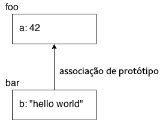

# You Don't Know JS: Iniciando
# Capítulo 2: Por dentro do JavaScript

No capítulo anterior, fiz uma introdução básica sobre os blocos construtores da programação, como variáveis, loops, condicionais e funções. Claro, todo o código demonstrado foi em JavaScript. Mas neste capítulo, iremos focar especificamente no que deve ser aprendido em JavaScript para começarmos como um desenvolvedor JS.

Iremos introduzir alguns conceitos neste capítulo que não serão totalmente explorados até a sequência dos próximos livros desta série. Você pode pensar nesse capítulo como uma visão geral dos tópicos que serão abordados ao longo dos outros livros.

Especialmente se você for novo ao JavaScript, você pode esperar utilizar boa parte do seu tempo revisando por diversas vezes os conceitos e exemplos de códigos abordados. Toda boa fundação é feita de tijolo em tijolo, então não espere entender de imediato a medida que for progredindo em sua leitura.

Sua jornada para entender a fundo JavaScript começa aqui.

**Nota:** Como havia dito no Capítulo 1, você deve definitivamente testar por conta própria todos os códigos apresentados enquanto você estiver lendo através do capítulo. Tome nota que alguns dos códigos escritos aqui utilizam capacidades introduzidas na nova versão do  JavaScript no momento em que estou escrevendo  (comumente chamado de "ES6" por ser a 6ª edição do ECMAScript -- o nome oficial da especificação JS). Caso aconteça de você estar utilizando um navegador antigo, pre-ES6, o código pode não funcionar. Uma versão atualizada de um navegador moderno (como Chrome, Firefox, or IE) deverá ser usada.

## Valores & Tipos

Como definimos no Capítulo 1, JavaScript tem valores tipados, não variáveis tipadas. Os seguintes tipos nativos estão disponíveis:

* `string`
* `number`
* `boolean`
* `null` e `undefined`
* `object`
* `symbol` (novidade do ES6)

O JavaScript dispõe de um operador `typeof`que pode examinar um valor e dizer a você qual é o tipo informado:

```js
var a;
typeof a;               // "undefined"

a = "hello world";
typeof a;               // "string"

a = 42;
typeof a;               // "number"

a = true;
typeof a;               // "boolean"

a = null;
typeof a;               // "object" -- weird, bug

a = undefined;
typeof a;               // "undefined"

a = { b: "c" };
typeof a;               // "object"
```

O valor que é retornado pelo operador `typeof`é sempre um dos seis (sete com o ES6!) valores em string. Isso é, `typeof "abc"` retorna `"string"`, não `string`.

Note como nesse snippet a variável `a` contém cada tipo diferente tipo de valor, e apesar de parecer, `typeof a` não está perguntando pelo "tipo de `a`", mas sim pelo "tipo de valor atualmente armazenado em `a`." Apenas valores possuem tipos em JavaScript; variáveis são apenas _containers_ para esses valores.

`typeof null` é um caso interessante, porque erradamente retorna um `"object"`, enquanto você espera que ele retorne `"null"`.

**Atenção:** Esse é um bug antigo em JS, mas um do tipo que é provável de nunca ser consertado. Muitos códigos na Web dependem desse bug e portanto consertá-lo iria trazer ainda mais bugs!

Além disso, note que `a = undefined`. Nós explicitamente indicamos `a` para o valor `undefined`, mas a forma com que se comporta não é diferente de uma variável que não tem valor definido, como a linha `var a;`no topo do snippet. Uma variável pode chegar a esse valor "undefined" de diversas maneiras, incluindo funções que não retornam valores e o uso do operador`void`.

### Objetos

O tipo `object` se refere a um valor composto onde você pode definir propriedades (lugares nomeados prontos para armazenar informação) que podem armazenar seus próprios valores de qualquer tipo. Esse é talvez um dos tipos de valor mais úteis em todo JavaScript:


```js
var obj = {
    a: "hello world",
    b: 42,
    c: true
};

obj.a;      // "hello world"
obj.b;      // 42
obj.c;      // true

obj["a"];   // "hello world"
obj["b"];   // 42
obj["c"];   // true
```

Talvez seja útil pensar nesse valor `obj` visualmente:


Propriedades podem ser acessadas tanto com *notação com ponto* (_dot notation_, ex: `obj.a`) quanto por notação em colchetes (ex: `obj["a"]`). A notação por ponto é menor e geralmente mais fácil de ser lida, e por isso é a notação preferida, sempre que possível.

A notação em colchetes é útil caso você tenha um nome de propriedade que contenha caracteres especiais nele, como `obj["hello world!"]` -- esses tipos de propriedades são geralmente referenciadas com chaves (*keys*) quando acessadas por notação em colchetes. A notação `[ ]`  requer ou uma variável (explicarei a seguir) ou uma `string` *literal* (que precisa ser englobada em `" .. "` ou `' .. '`).

É claro, a notação em colchetes também é útil se você quiser acessar uma propriedade/chave onde o nome é armazenado dentro de outra variável, como por exemplo:

```js
var obj = {
    a: "hello world",
    b: 42
};

var b = "a";

obj[b];         // "hello world"
obj["b"];       // 42
```

**Nota:** Para mais informação sobre objetos (`objects`) em JavaScript, veja o título desta série *this & Prototipagem de Objetos*, especificamente o Capítulo 3.

Existem outros tipos de valores que você pode facilmente interagir com programas em JavaScript: *array* e *function*. Mas ao invés de serem tipos nativos (built-in), eles devem ser vistos mais como sub-tipos -- versões especializadas do tipo `object`.

#### Arrays

Uma array é um `object` que armazena valores (qualquer tipo de valor), não necesariamente em propriedades ou chaves nomeadas, mas em posições enumeradas. Por exemplo:

```js
var arr = [
    "hello world",
    42,
    true
];

arr[0];         // "hello world"
arr[1];         // 42
arr[2];         // true
arr.length;     // 3

typeof arr;     // "object"
```

**Nota:** Linguagens que começam contando do zero, como JS faz, usam `0` como índice do primeiro elemento da array.

Talvez seja útil pensar sobre `arr` visualmente:


Visto que arrays são objetos especiais (assim como `typeof` sugere), elas também podem conter propriedades, incluindo a propriedade `length` que é automaticamente atualizada.

Em teoria, você pode usar uma array como um objeto normal com suas próprias propriedades nomeadas, ou pode usar um `object` e apenas determinar propriedades numéricas (`0`, `1`, etc.) de maneira similar a uma array. Entretanto, isso geralmente é considerado uma maneira indevida de utilizar seus respectivos tipos.

A melhor maneira (e a mais natural) é utilizar arrays para valores posicionados numericamente e usar `object`s para propriedades nomeadas.

#### Funções

O outro subtipo de `object` que você usará ao longo de seus programas é uma função:

```js
function foo() {
    return 42;
}

foo.bar = "hello world";

typeof foo;         // "function"
typeof foo();       // "number"
typeof foo.bar;     // "string"
```

Novamente, funções são um subtipo de `objects` -- o `typeof` retorna `"function"`, que indica que `function` é um tipo padrão -- e por isso pode ter propriedades. Entretanto, é provável que você use as propriedades do objeto de `function` (como `foo.bar`) apenas em alguns casos.

**Nota:** Para mais informações sobre valores em JS e seus tipos, veja os primeiros dois capítulos do título *Tipos & Gramática*, desta série.

### Métodos de Tipos Nativos

Os tipos e subtipos nativos que acabamos de ver tem alguns comportamentos bem úteis, expostos como propriedades e métodos.

Por exemplo:

```js
var a = "hello world";
var b = 3.14159;

a.length;               // 11
a.toUpperCase();        // "HELLO WORLD"
b.toFixed(4);           // "3.1416"
```

É mais complicado do que apenas o método existente em um valor.

Resumidamente, existe uma forma agregadora do objeto `String` (`S` maiúsculo), que pareia com o tipo primitivo `string`. É esse objeto agregador que define o método `toUpperCase()` em seu protótipo.

Quando você usa um valor primitivo, como "hello world", como um `object` referenciando a propriedade ou método (exemplo `a.toUpperCase()` no snippet anterior), o JS automaticamente "encaixota" o valor na contraparte do agregador de seu objeto (escondido).

Um valor `string` pode ser englobado por um objeto `String`, um `number` pode ser englobado por um objeto `Number`, e um `boolean` pode ser englobado por um objeto `Boolean`. Para a maioria dos casos, você não precisa se preocupar sobre isso ou usar diretamente essas formas de agregar os valores do objeto -- preferindo a forma de valores primitivos em todos os casos que puder e o JavaScript vai cuidar do resto pra você.

**Nota:** Para mais informações em nativos em JS e formas de "encaixotar", veja o Capítulo 3 do título deste livro *Tipos & Gramática*. Para melhor entendimento dos protótipos de um objeto, veja o Capítulo 5 do título *this & Prototipagem de Objetos*.

### Comparando Valores

Existem dois tipos principais de comparação de valores que você irá precisar para fazer seus programas em JS: *igualdade* e *desigualdade*. O resultado de qualquer comparação é estritamente um valor `boolean` (`true` ou `false`), independente do tipo de valor comparado.

#### Coerção

Falamos brevemente sobre coerção no Capítulo 1, mas vamos revisitá-lo aqui.

A coerção vem em duas formas em JavaScript: *explicita* e *implicita*. A coerção explícita é a forma que você pode, obviamente, através do código, que uma conversão de um tipo para o outro vai acontecer, e a coerção implícita é quando o tipo de conversão ocorre como um efeito paralelo, não tão óbvio, de alguma outra operação.

Você provavelmente ouviu coisas como "coerção é do mal", por conta da surpresa nos resultados que algumas situações específicas podem causar. Talvez nenhuma outra situação frustre mais um desenvolvedor do que quando a linguagem o surpreende.

Coerções não são do mal, nem mesmo devem ser surpreendentes. De fato, a maioria dos casos que você pode construir com a coerção de tipos são bem sensíveis e entendíveis, e podem até mesmo serem usados como maneira de *melhorar* a legibilidade do código. Mas não iremos entrar muito nesse debate -- O Capítulo 4 do título *Tipos & Gramática* desta série cobre bem essa parte.

Aqui temos um exemplo de coerção *explícita*:

```js
var a = "42";

var b = Number( a );

a;              // "42"
b;              // 42 -- o número!
```

E aqui um exemplo de coerção *implícita*:

```js
var a = "42";

var b = a * 1;  // "42" implicitamente coagido para 42 aqui

a;              // "42"
b;              // 42 -- o número!
```

#### Truthy & Falsy

No Capítulo 1, nós mencionamos brevemente a natureza "truthy" e "falsy" dos valores: quando um valor não-`boolean` é coagido para um valor `boolean`, ele se torna de fato `true` ou `false`?

A lista de valores "falsy" em JavaScript é a seguinte:

* `""` (string vazia)
* `0`, `-0`, `NaN` (`number` inválido)
* `null`, `undefined`
* `false`

Qualquer valor que não esteja nessa lista de "falsy", é considerado "truthy". Aqui estão alguns exemplos deles:

* `"hello"`
* `42`
* `true`
* `[ ]`, `[ 1, "2", 3 ]` (arrays)
* `{ }`, `{ a: 42 }` (objects)
* `function foo() { .. }` (functions)

É importante lembrar que um valor não-`boolean` segue a coerção como "truthy"/"falsy" apenas se ele for coagindo para `boolean`. Não é difícil se confundir com uma situação onde parece que estamos coagindo um valor para um `boolean` quando na verdade não estamos.

#### Igualdade

Existem quatro operadores de igualdade: `==`, `===`, `!=`, e `!==`. A forma `!` é a versão simétrica de "não igual" de suas contrapartes; *não-igualdade* não deve ser confundido com  *desigualdade*.

A diferença entre `==` e `===` é geralmente caracterizada por `==` verificar a igualdade de valores e `===` verificar a igualdade do valor e do tipo. Entretanto, essa forma não é a mais apurada. A maneira correta de caracterizá-los é que `==` verifica  por igualdade com coerção autorizada, e `===` verifica a igualdade do valor sem autorizar a coerção; `===` é comumente chamada de "igualdade estrita" por essa razão.

Considere a coerção implícita que é autorizada pelo comparador de igualdade `==` e não permitido com a igualdade estrita `===`:

```js
var a = "42";
var b = 42;

a == b;         // true
a === b;        // false
```

Na comparação `a == b`, o JS percebe que os tipos não combinam, então ele segue uma sequência de etapas para coagir um ou ambos os valores para um tipo diferente até que os tipos combinem, de forma que um valor de igualdade simples possa ser considerado.

Se você pensar sobre isso, não existem dois modos possíveis onde `a == b` possa dar `true` por coerção. Ou a comparação por se dar por `42 == 42` ou ela pode ser `"42" == "42"`. Sendo assim, qual das duas é a correta?

Resposta: `"42"` se torna `42`, para fazer a comparação `42 == 42`. Nesse exemplo simples, não parece importante saber qual processo será, no final o resultado é o mesmo. Existem casos mais complexos onde não apenas importa qual é o resultado final *como* foi possível chegar lá.

A igualdade `a === b` produz um resultado `false`, porque a coerção não é permitida, assim obviamente a comparação falha. Muitos desenvolvedores pregam que `===` é mais previsível, permanecendo usando sempre esta forma e ficando longe de `==`. Acho esse ponto de vista limitado. Acredito que `==` é uma ferramenta poderosa que pode ajudar você em seus programas,  *se você se dedicar a aprender como ele funciona.*

Não vamos nos aprofundar nos detalhes de como a coerção em comparações com `==` funciona. Muito sobre ela é bem intuitivo, mas existem casos específicos importantes de se tomar nota. Você pode ler a seção 11.9.3 da especificação do ES5 (http://www.ecma-international.org/ecma-262/5.1/) para ver suas regras exatas, e você ficará surpreso em como seu mecanismo é bem desenvolvido, comparado a toda hype negativa à sua volta.

Para resumir um monte de detalhes em passos bem simples e ajudar você a decidir sobre usar `==` ou `===` em várias situações, aqui vão minhas regras simples:

* Se em um dos lados da comparação você puder ter um valor `true` ou `false`, evite `==` e use `===`.
* Se em um dos lados da comparação você puder ter esses valores específicos (`0`, `""`, ou `[]` -- array vazia), evite `==` e use `===`.
* Em *todos* os outros casos, você estará seguro usando `==`. Não apenas é mais seguro, mas em muitos casos simplifica seu código de forma a melhorar sua leitura.

O que essas regras fazem é obrigar você a pensar criticamente sobre seu código e quais tipos de valor podem aparecer através de variáveis que são comparadas pela igualdade. Se você estiver certo desses valores, e `==` é seguro, use-o! Se você não pode estar certo dos resultados, use `===`. É simples assim.

A não igualdade `!=`forma um par com `==`, e sua forma `!==` forma um par com `===`. Todas as regras e observações que discutimos até aqui funcionam de maneira simétrica para essas comparações de não-igualdade.

Você deve ter uma atenção especial sobre as regras de comparação de `==` e `===` se você estiver comparando dois valores não-primitivos, como `object`s (incluíndo `function` e `array`). Por estes valores serem regidos por suas referências, ambas as comparações `==` e `===` irão apenas verificar se suas referências são compatíveis, e não irá comparar nada sobre seus valores subjacentes.

Por exemplo, `array`s são por padrão convertidas para`string`s por simplesmente se juntarem todos os valores com vírgulas (`,`) entre elas. Você pode pensar que duas `array`s com o mesmo conteúdo são iguais `==`, quando na verdade não são:

```js
var a = [1,2,3];
var b = [1,2,3];
var c = "1,2,3";

a == c;     // true
b == c;     // true
a == b;     // false
```

**Nota:** Para mais informações sobre as regras de comparação de igualdade `==`, veja a especificação do ES5 (seção 11.9.3) e também consulte o Capítulo  4 do título desta série *Tipos & Gramática*; veja o Capítulo 2 sobre mais informações sobre valores versus referências.

#### Desigualdade

Os operadores `<`, `>`, `<=`, e `>=` são usados para representar uma desigualdade, sendo referenciados na especificação como "comparadores relacionais". Tipicamente eles são usados para comparar valores ordinários como `number`s. É fácil entender que  `3 < 4`.

Mas em JavaScript, valores `string` também podem ser comparados para desigualdade, usando regras alfabéticas (`"bar" < "foo"`).

E como fica a coerção: regras similares à comparação `==` (apesar de não serem idênticas!) aplicam-se aos operadores de desigualdade. Uma nota importante, é que não existe um operador de "desigualdade estrita" que possa desabilitar a coerção da mesma forma que a "igualdade estrita" `===` faz.

Considere:

```js
var a = 41;
var b = "42";
var c = "43";

a < b;      // true
b < c;      // true
```

O que acontece aqui: Na seção 11.8.5, da especificação do ES5, ela diz que ambos os valores na comparação `<` são `string`s, assim como em `b < c`, a comparação é feita lexicograficamente (em outras palavras: alfabeticamente, como um dicionário). Mas se um ou ambos os valores não forem uma `string`, como acontece em `a < b`, então ambos os valores são coagidos para serem `number`s, e uma comparação típica de números acontece.

A maior pegadinha que você pode encontrar aqui é em comparações entre diferentes tipos de valores -- lembrando, não existem formas de usar uma "desigualdade estrita" -- é quando um dos valores não pode ser transformado em um número válido, como por exemplo:

```js
var a = 42;
var b = "foo";

a < b;      // false
a > b;      // false
a == b;     // false
```

Espera, como podem as três comparações serem `false`? Porque o valor de `b` é coagido para um "valor numérico inválido" (`NaN`) nas comparações `<` e `>`, e a especificação diz que `NaN` não é nem maior nem menor do que qualquer valor.

A comparação `==` falha por uma razão diferente. `a == b` pode falhar se for interpretada tanto como `42 == NaN` ou como `"42" == "foo"` -- como explicamos anteriormente.

**Nota:** Para mais informações sobre as regras de comparação de desigualdade, veja a seção 11.8.5 da especificação ES5 e também consulte o Capítulo 4 de *Tipos & Grámatica* dessa série.

## Variáveis

Em JavaScript, nome de variáveis (incluindo nomes de funções) precisam ter *identificadores* válidos. As restritas e completas regras para caracteres válidos como identificadores são um pouco complexas considerando os caracteres não tradicionais como Unicode. Se você considerar apenas caracteres alfanuméricos típicos do ASCII, as regras ficam mais simples.

Um identificador precisa começar com `a`-`z`, `A`-`Z`, `$`, ou `_`. Ele pode conter qualquer um desses caracteres e incluem também numerais `0`-`9`.

Em geral, as mesmas regras que se aplicam tanto para identificar variáveis como para nomear uma propriedade. Entretanto, algumas palavras não podem ser usadas para nomear variáveis, mas não tem impedimento para nomear propriedades. Essas palavras são denominadas "palavras reservadas"(reserved words), e incluem as palavras-chave (`for`, `in`, `if`, etc.) assim como `null`, `true`, e `false`.

**Nota:** Para mais informações sobre palavas reservadas, veja o Apêndice A do título desta série *Tipos & Gramática*.

### Escopos de Função

Você usa a palavra-chave `var` para declarar a variável que irá referenciar o escopo da função corrente, ou o escopo global se ela estiver no topo de tudo, fora de qualquer outra função.

#### Hoisting

Onde quer que `var` apareça dentro de um escopo, sua declaração é tomada como parte de todo o escopo e acessada em qualquer área dentro dele.

Metaforicamente, esse comportamento é chamado de *hoisting*, quando uma declaração `var` é conceitualmente "movida" para o topo do escopo. Tecnicamente, este processo é explicado de forma mais apurada entendendo como o código é compilado, mas vamos pular estes detalhes por ora.

Considere:

```js
var a = 2;

foo();                  // funciona porque a declaração `foo()`
                        // é "hoisted"

function foo() {
    a = 3;

    console.log( a );   // 3

    var a;              // a declaração é "hoisted"
                        // para o topo de `foo()`
}

console.log( a );   // 2
```

**Atenção:** não é comum nem uma boa ideia confiar no hoisting de variáveis para utilizar uma determinada variável dentro do seu escopo antes de sua declaração aparecer no código; pode ficar um tanto confuso. É muito mais comum e aceito utilizar funções que sofreram hoisting em sua declaração, assim como fazemos com a chamada para `foo()` que aparece antes de sua declaração formal.

#### Escopos Aninhados

Quando você declara uma variável, ela é disponibilizada em todos os lugares dentro do escopo, assim como dentro de qualquer escopo interno. Por exemplo:

```js
function foo() {
    var a = 1;

    function bar() {
        var b = 2;

        function baz() {
            var c = 3;

            console.log( a, b, c ); // 1 2 3
        }

        baz();
        console.log( a, b );        // 1 2
    }

    bar();
    console.log( a );               // 1
}

foo();
```

Note que `c` não está disponível dentro de `bar()`, porque está declarado dentro do escopo de `baz()`, e o `b` não está disponível para `foo()` pelo mesmo motivo.

Se você tentar acessar o valor da variável dentro de um escopo onde ela não está disponível, você irá receber um erro de `ReferenceError`. Se você tentar setar uma variável que ainda não foi declarada, ou você terminará criando uma variável no escopo global (ruim!) ou irá gerar um erro (caso tenha declarado "strict mode", **veja "Strict Mode"**). Vamos dar uma olhada:

```js
function foo() {
    a = 1;  // `a` não foi formalmente declarada
}

foo();
a;          // 1 -- oops, você acaba de criar uma variável global automática :(
```

Esta é uma prática muito ruim. Não faça isso! Sempre declare suas variáveis formalmente.

Além de criarmos declarações de variáveis no mesmo nível da função, o ES6 *deixa* (let) você criar variáveis que irão pertencer a blocos individuais (pares de `{ .. }`), usando a palavra-chave `let`. Apesar de suas nuances e detalhes, as regras do escopo terão o comportamento bem parecido com o que vimos em funções.

```js
function foo() {
    var a = 1;

    if (a >= 1) {
        let b = 2;

        while (b < 5) {
            let c = b * 2;
            b++;

            console.log( a + c );
        }
    }
}

foo();
// 5 7 9
```

Por usarmos `let` ao invés de `var`, `b` irá pertencer apenas à instrução `if` e não para todo o escopo da função `foo()`. De maneira similar, `c` pertence somente ao loop `while`. Escopamentos de bloco são muito úteis para controlar seus escopos de variáveis, usando uma maneira requintada, o que faz seu código muito mais fácil de manter ao longo do tempo.

**Nota:** Para mais informações sobre escopos, veja o título desta série *Escopos & Clausuras*. Veja o título *ES6 & Além* para mais informações sobre o bloco de escopo `let`.

## Condicionais

Em adição à instrução condicional `if` que introduzimos brevemente no Capítulo 1, o JavaScript nos fornece alguns outros mecanismos de condicionais que devemos saber.

Por vezes você se encontrará escrevendo uma série de instruções `if..else..if` como estas:

```js
if (a == 2) {
    // faça alguma coisa
}
else if (a == 10) {
    // faça outra coisa
}
else if (a == 42) {
    // faça outra coisa diferente
}
else {
    // resultado se nenhuma instrução for atendida (fallback)
}
```

Essa estrutura funciona, mas é um pouco verbosa porque você precisa especificar um teste para `a` em cada um dos casos. Abaixo veremos uma outra opção, a instrução `switch`:

```js
switch (a) {
    case 2:
        // faça alguma coisa
        break;
    case 10:
        // faça outra coisa
        break;
    case 42:
        // faça outra coisa diferente
        break;
    default:
        // resultado se nenhuma instrução for atendida (fallback)
}
```

O `break` é importante se você quiser que apenas uma instrução seja executada em cada`case`. Se você omitir o `break` de um `case`, e esse `case` for aceito ou rodar, a execução irá continuar pelos próximos `case`'s independente do `case` que foi aceito. Esse então chamado "fall through" é por vezes útil/proposital:

```js
switch (a) {
    case 2:
    case 10:
        // alguma coisa legal
        break;
    case 42:
        // outra coisa
        break;
    default:
        // resultado se nenhuma instrução for atendida (fallback)
}
```

Aqui, se `a` for ou `2` ou `10`, iremos  executar a instrução de código "alguma coisa legal".

Uma outra forma de condicional em JavaScript é o "operador condicional," chamado também de "operador ternário." Ele é uma forma concisa/simplificada de uma instrução `if..else`, como em:

```js
var a = 42;

var b = (a > 41) ? "hello" : "world";

// similar a:

// if (a > 41) {
//    b = "hello";
// }
// else {
//    b = "world";
// }
```

Se a expressão teste (`a > 41` aqui) for avaliada como `true`, a primeira cláusula (`"hello"`) é retornada, se não for, a segunda cláusula é retornada (`"world"`), e qualquer que seja o resultado ele é designado para `b`.

O operador condicional não precisa necessariamente ser usado em uma atribuição, mas é definitivamente a forma mais comum de usá-lo.

**Nota:** Para mais informações sobre testes de condições e outros padrões para `switch` e `? :`, veja o título desta série *Tipos & Gramática*.

## Modo Estrito (Strict Mode)

O ES5 adicionou o "strict mode" para a linguagem, que determina regras mais rígidas para certos comportamentos. Geralmente essas restrições são vistas como algo que faz o código se tornar mais seguro e com padrões melhor definidos. Além disso, aderindo ao modo estrito, em geral, seu código será melhor otimizado pelo *Motor*. O *strict mode* é uma grande vitória para o código, e você deveria usá-lo em todos os seus programas.

Você pode optar pelo modo estrito em uma função individualmente, ou em todo um arquivo, dependendo de onde você determinar o pragma do modo estrito:

```js
function foo() {
    "use strict";

    // este código usa o modo estrito

    function bar() {
        // este código está em modo estrito
    }
}

// este código não está em modo estrito
```

Compare isso com:

```js
"use strict";

function foo() {
    // este código está em modo estrito

    function bar() {
        // este código está em modo estrito
    }
}

// este código está em modo estrito
```

Uma diferença chave (melhoria!) com o *strict mode* é desabilitar a variável auto-global implícita ao omitir o `var`:

```js
function foo() {
    "use strict";   // liga o strict mode
    a = 1;          // `var` faltando: ReferenceError
}

foo();
```

Se você habilitar o modo estrito em seu código, e você receber erros, ou o código se comporta de maneira *bugada*, a tentação é evitar o modo estrito. Mas esse instinto é uma má ideia de se deixar acontecer. Se o modo estrito gera problemas no seu programa, é certo que isso é um sinal que existem coisas que você deve consertar.

O modo estrito não irá apenas deixar seu código em um caminho mais seguro, também deixará seu código mais otimizável e também representando o futuro da linguagem. É mais fácil se acostumar com o modo estrito agora do que deixá-lo de lado -- vai ser mais difícil se converter a ele mais tarde!

**Nota:** Para mais informações sobre o modo estrito, veja o Capítulo 5 do título desta série *Tipos & Gramática*.

## Funções como Valores

Até agora discutimos funções como um mecanismo primário do *escopo* em JavaScript. Você deve se lembrar da típica sintaxe da declaração `function` desse jeito:

```js
function foo() {
    // ..
}
```

Apesar de não parecer óbvio por essa sintaxe, `foo` é basicamente apenas uma variável que referência um escopo por onde é feita a referência para a função (`function`) que está sendo declarada. Isso é, a `function` por si só é um valor, assim como `42` ou `[1,2,3]` podem ser.

Pode parecer um conceito estranho de primeira, então vamos tirar um tempo para ponderar. Você não apenas pode passar um valor (argumento) *para* a função, mas *a função por conta própria pode ser um valor* que pode ser designado a uma variável, ou, passado para ou retornado por, outras funções.

Sendo assim, o valor de uma função deve ser pensado como uma expressão, assim como qualquer outro valor ou expressão.

Considere:

```js
var foo = function() {
    // ..
};

var x = function bar(){
    // ..
};
```

A primeira expressão da função designada para a variável `foo` é chamada de *anônima* porque não tem `nome`.

A segunda expressão da função é *nomeada* (`bar`), mesmo que ela tenha sido referenciada para a variável `x`. *Expressões de Funções Nomeadas* são geralmente preferidas, apesar de *expressões de funções anônimas* serem extremamente comuns.

Para mais informações, veja o título desta série *Escopos & Clausuras*.

### Expressões de Função Invocadas Imediatamente (IIFEs)

No snippet anterior, nenhuma das expressões de função são executadas -- poderíamos executá-las se incluíssemos `foo()` ou `x()`, por exemplo.

Existe uma outra forma de executar uma expressão de função, que é tipicamente chamada de *Expressões de Função Invocadas Imediatamente* (immediately invoked function expression, ou IIFE):

```js
(function IIFE(){
    console.log( "Hello!" );
})();
// "Hello!"
```

O `( .. )` externo que rodeia a expressão de função `(function IIFE(){ .. })` é apenas uma nuance que a gramática do JS precisa para prevenir que seja tratada como uma declaração de uma função qualquer.

O final `()` no fim da expressão -- a linha `})();` -- é o que atualmente executa a expressão da função referenciada logo em seguida a ela.

Isso pode parecer estranho, mas não é tão desconhecido em um primeiro olhar. Considere as similaridades entre `foo` e `IIFE` abaixo:

```js
function foo() { .. }

// referência de expressão `foo`,
// depois `()` executa ele
foo();

// expressão da função `IIFE`,
// depois `()` executa ele
(function IIFE(){ .. })();
```

Como você pode ver, listar `(function IIFE(){ .. })` antes de sua execução `()` é essencialmente a mesma coisa do que executar `foo` antes de sua execução `()`; em ambos os casos, a referência da função é executada com o `()` logo em seguida.

Porque IIFE é apenas uma função, e funções criam variáveis *scope*, usar uma IIFE dessa forma é muitas vezes usado para declarar variáveis que não afetarão o código fora de IIFE:

```js
var a = 42;

(function IIFE(){
    var a = 10;
    console.log( a );   // 10
})();

console.log( a );       // 42
```

IIFEs também podem retornar valores:

```js
var x = (function IIFE(){
    return 42;
})();

x;  // 42
```

O valor `42` é retornado da função nomeada `IIFE`, e depois designada à variável `x`.

### Clausura

A *Clausura* (Closure) é um dos mais importantes, e muitas vezes incompreendido, conceitos em JavaScript. Eu não irei cobri-lo em detalhes aqui, deixando para fazer uma melhor referência no título desta série *Escopos & Clausuras*. Porém, gostaria de dizer algumas coisas relacionadas a ele para que você possa ter uma visão geral do conceito. Esta será uma das habilidades mais importantes do seu vocabulário em JS.

Você pode pensar em uma clausura como uma forma de "lembrar" e continuar acessando o escopo de uma função (e suas variáveis) mesmo se a função já estiver terminado de rodar.

Considere:

```js
function makeAdder(x) {
    // parâmetro `x` é uma variável interna

    // função interna `add()` usa `x`, então
    // ele tem uma "clausura" que o envolve
    function add(y) {
        return y + x;
    };

    return add;
}
```

A referêcia para a função interna `add(..)`, que faz um retorno com cada chamada para sua função externa `makeAdder(..)` é apta a se lembrar sempre que o valor `x` for passado para `makeAdder(..)`. Agora, vamos usar o  `makeAdder(..)`:

```js
// `plusOne` pega a referência para a função interna add(..)`
// função com clausura sobre o parâmetro `x` da
// função externa `makeAdder(..)`
var plusOne = makeAdder( 1 );

// `plusTen` pega a referência para a função interna `add(..)`
// função com clausura sobre o parâmetro `x` da
// função externa `makeAdder(..
var plusTen = makeAdder( 10 );

plusOne( 3 );       // 4  <-- 1 + 3
plusOne( 41 );      // 42 <-- 1 + 41

plusTen( 13 );      // 23 <-- 10 + 13
```

Mais sobre como esse código funciona:

1. Quando chamamos `makeAdder(1)`, temos de volta a referência para a função `add(..)` que se lembra de `x` como `1`. Chamamos a referência dessa função de `plusOne(..)`.
2. Quando chamamos `makeAdder(10)`, temos de volta outra referência para a função interna `add(..)` que se lembra de `x` como `10`. Nós chamamos a referência dessa função de `plusTen(..)`.
3. Quando chamamos `plusOne(3)`, ele adiciona `3` (seu `y` interno) ao `1` (lembrado por `x`), e temos `4` como resultado.
4. Quando nós chamamos `plusTen(13)`, ele adiciona `13` (seu `y` interno) ao `10` (lembrado por `x`), e nós conseguimos `23` como resultado.

Não se preocupe se parecer estranho e confuso no começo -- pode ser mesmo! Vai precisar de muita prática para entender completamente.

Mas acredite em mim, uma vez que conseguir entender, vai perceber que é uma das mais poderosa e mais úteis  técnicas em toda linguagem. É definitivamente válido o esforço de deixar seu cérebro acostumado com clausuras. Na próxima seção, vamos ter um pouco mais de prática com clausuras.

#### Módulos

A forma de uso mais comum de um clausura (closure) em JavaScript é o padrão módulo (module pattern). Módulos deixam você definir detalhes privados de implementação (variáveis, funções) que estarão escondidas do mundo externo, assim como uma API pública que *é* acessível *de fora*.

Considere:

```js
function User(){
    var username, password;

    function doLogin(user,pw) {
        username = user;
        password = pw;

        // faça o resto do trabalho do login
    }

    var publicAPI = {
        login: doLogin
    };

    return publicAPI;
}

// cria uma instãncia do módulo`User`
var fred = User();

fred.login( "fred", "12Battery34!" );
```

A função `User()` serve como um escopo externo que mantém as variáveis `username` e `password` protegidas, assim como a função interna `doLogin()`; esses itens são todos detalhes internos desse módulo `User` que não podem ser acessados de fora.

**Atenção:** Nós não estamos chamando `new User()` aqui de propósito. Apesar do fato de que provavelmente esta ser a forma mais comum para a maioria dos usuários. `User()` é apenas uma função, não uma classe a ser instanciada, então ela é chamada normalmente. Usar `new` poderia ser inapropriado e até mesmo um desperdício de recursos.

Executar `User()` cria uma *instância* do módulo `User` -- todo um novo escopo é criado, e assim toda uma nova cópia de cada uma das variáveis/funções internas. Nós designamos essa instância para `fred`. Se nós rodarmos `User()` novamente, teríamos uma nova instância completamente separada do `fred`.

A função interna `doLogin()` tem uma clausura sobre `username` e `password`, significando que ela iria reter seus acessos à eles mesmo após a função `User()` terminar.

`publicAPI` é um objeto com uma propriedade/método nela, o `login`, que é uma referência à função interna `doLogin()`. Quando nós retornamos `publicAPI` de `User()`, ele se torna a instância que chamamos de `fred`.

Neste ponto, a função externa `User()` já terminou de ser executada. Normalmente, você pensaria que variáveis internas como `username` e `password` teriam se perdido. Mas não estão, porque existe uma clausura (closure) na função `login()` que os mantém vivos.

É por isso que chamamos `fred.login(..)` -- o mesmo que chamar a função interna `doLogin(..)` -- e ela ainda assim pode acessar as variáveis internas `username` e `password`.

Existe uma boa chance que com apenas este resumo breve sobre clausuras e o padrão módulo (module pattern), alguma coisa sobre o assunto ainda pareça confuso. Está tudo bem! Precisa de alguma prática para seu cérebro passar a entendê-los.

Daqui, vá para o título desta série *Escopos & Clausuras* para uma exploração do assunto muito mais profunda.

## Identificador `this`

Outro conceito comumente incompreendido em JavaScript é o identificador`this`. Novamente, existem um bocado de capítulos sobre ele no título desta série *this & Prototipagem de Objetos*, então aqui iremos introduzir apenas superficialmente o conceito.

Enquanto geralmente possa parecer que `this` está relacionado aos padrões de orientação à objetos, em JS o `this` é um mecanismo diferente.

Se uma função tiver uma referência ao `this` dentro dela, esse `this` geralmente aponta para um `object`. Mas qual objeto que this aponta irá depender de como a função é chamada.

É importante entender que`this` *não* se refere à função propriamente dita, visto que essa é a parte mais comumente confundida.

Aqui uma ilustração rápida:

```js
function foo() {
    console.log( this.bar );
}

var bar = "global";

var obj1 = {
    bar: "obj1",
    foo: foo
};

var obj2 = {
    bar: "obj2"
};

// --------

foo();              // "global"
obj1.foo();         // "obj1"
foo.call( obj2 );   // "obj2"
new foo();          // undefined
```

Existem quatro regras de como `this` é definido, e como ele é apresentado nessas quatro últimas linhas do snippet acima.

1. `foo()` termina definindo `this` para o objeto global em modo não-estrito -- no modo estrito (strict mode), `this` seria `undefined` e você receberia um erro ao acessar a propriedade `bar` -- então `"global"` é o valor encontrado para `this.bar`.
2. `obj1.foo()` define `this` para o objeto `obj1`.
3. `foo.call(obj2)` define `this` para o objeto `obj2`.
4. `new foo()` define `this` para um objeto completamente novo.

Fim da linha: para entender o que `this` aponta, você precisa examinar como a função em questão é chamada. Ela será uma das quatro formas demonstradas, e assim você irá ter a resposta do que é `this`.

**Nota:** Para mais informações sobre `this`, veja os Capítulos 1 e 2 do título desta série *this & Prototipagem de Objetos*.

## Prototipagem

O mecanismo de protótipos em JavaScript é bem complicado. Aqui vamos só vê-lo de relance. Você irá precisar de algum tempo revisando os Capítulos 4-6 do título desta série *this & Prototipagem de Objetos* para saber todos os detalhes.

Quando você referencia uma propriedade em um objeto, se essa propriedade não existir, o JavaScript irá automaticamente usar aquela referência ao protótipo interno do objeto para achar outro objeto procurando pela propriedade em si. Você pode pensar nisso como um fallback para o caso da propriedade estar faltando.

A referência da relação ao protótipo interno de um objeto para o seu fallback acontece no tempo em que o objeto é criado. A maneira mais simples de ilustrar isso é com sua utilidade nativa chamada `Object.create(..)`.

Considere:

```js
var foo = {
    a: 42
};

// cria `bar` e faz o link para `foo`
var bar = Object.create( foo );

bar.b = "hello world";

bar.b;      // "hello world"
bar.a;      // 42 <-- delegado para `foo`
```

Talvez ajude visualizando os objetos `foo` e `bar` e sua relação:



A propriedade `a` não existe atualmente no objeto `bar`, mas por conta de `bar` ser prototipalmente associada a `foo`, o JavaScript automaticamente *falls back* para procurar por `a` no objeto `foo`, onde o encontra.

Essa *linkagem* (associação) pode parecer uma funcionalidade estranha na linguagem. A forma mais comum que essa funcionalidade é usada -- e eu digo até, abusada -- é ao tentar emular um mecanismo de "classe" com "herança".

Mas uma forma mais natural de aplicar prototipagens é em um padrão chamado "delegação de comportamento", onde você intencionalmente desenha as associações de seus objetos para serem habilitadas a *delegar* de uma a outra parte do comportamento desejado.

**Nota:** Para mais informações sobre prototipagens e delegação de comportamentos, veja os Capítulos 4-6 do título desta série *this & Prototipagem de Objetos*.

## Velho & Novo

Algumas das funcionalidades de JS que já cobrimos, e certamente muitas das funcionalidades que cobriremos no resto dessa série, são novas adições que não necessariamente estarão disponíveis em navegadores antigos. De fato, algumas das novas funcionalidades disponíveis na especificação nem mesmo foram implementadas em navegadores estáveis ainda.

Então, o que você faz com as coisas novas? Você só precisa esperar por anos ou décadas por todos os navegadores antigos apagarem e sumirem na escuridão?

Isso é como muitas pessoas pensam sobre essa situação, mas não é realmente uma abordagem saudável para o JS.

Existem duas técnicas principais que você pode usar para "trazer" as coisas novas de JavaScript para os navegadores antigos: polyfilling e transpiling.

### Polyfilling

A palavras "polyfill" é um termo inventado (por Remy Sharp) (https://remysharp.com/2010/10/08/what-is-a-polyfill) usado para referenciar a definição de uma nova funcionalidade e reproduzir um pedaço de código que é equivalente ao comportamento, mas que pode rodar em ambientes com o JS antigo.

Por exemplo, o ES6 define uma utilidade chamada `Number.isNaN(..)` para prover um check acurado e livre de bugs para valores `NaN`, deixando obsoleto a utilidade original `isNaN(..)`. Mas é fácil criar um polyfill para essa utilidade de forma que você possa usar no seu código independente do usuário final estar usando um navegador com suporte ao ES6 ou não.

Considere:

```js
if (!Number.isNaN) {
    Number.isNaN = function isNaN(x) {
        return x !== x;
    };
}
```

A instrução `if` deixa de aplicar a definição do polyfill em navegadores ES6 onde ela já existe. Se não estiver presente, nós definimos `Number.isNaN(..)`.

**Nota:** A verificação que fazemos aqui toma vantagem de um equívoco com valores `NaN`, que é o único valor na linguagem que não é igual a ele mesmo. Então o valor `NaN` é o único que pode fazer `x !== x` ser `true`.

Nem todas as novas funcionalidades são completamente *polyfillável*. Às vezes a maior parte do comportamento pode ser *polyfillada*, mas com alguns desvios. Você deve ter muito, muito cuidado em implementar um polyfill por conta própria, para ter certeza que está aderindo à especificação da forma mais estrita possível.

Ou melhor ainda, use um vetado grupo de polyfills que você pode confiar, como os providos pelo ES5-Shim (https://github.com/es-shims/es5-shim) e ES6-Shim (https://github.com/es-shims/es6-shim).

### Transpiling

Não existe nenhuma forma de *polyfillar* uma nova sintaxe, que ainda não foi incluída na linguagem. A nova sintaxe iria retornar um erro no mecanismo do JS como não reconhecida/inválida.

Sendo assim a melhor opção é usar uma ferramenta que converte seu código novo em um código antigo equivalente. Esse processo é comumente chamado "transpiling".

Essencialmente, seu código fonte é feito com o formato da nova sintaxe, mas quando você faz o deploy para o navegador ele aparece como um código *transpilado* com o formato da sintaxe velha. Tipicamente você insere o *transpilador* no seu processo de *build*, similar ao seu *linter* ou *minifier*.

Você pode se perguntar por que você se meteria em confusão ao escrever uma sintaxe nova, apenas para vê-la sendo transpilada para o código antigo. Por que então não escrever da forma antiga diretamente?

Existem diversas razões importantes que você deveria se importar em relação ao transpiling:

* A nova sintaxe adicionada à linguagem é desenhada para fazer seu código ser mais legível e fácil de manter. Os equivalentes mais antigos são geralmente muito mais debilitados. Você deve optar por escrever a sintaxe mais moderna e clara, não apenas para você mas para todos os membros do seu time de desenvolvimento.

* Se você transpilar apenas para navegadores antigos, mas servir a nova sintaxe para os navegadores mais novos, você teria uma vantagem por conta da otimização da performance do navegador devido a nova sintaxe. Isso também permite que os criadores dos browsers tenham códigos do mundo-real (em produção) para testar neles suas implementações e otimizações.
* Usando a nova sintaxe de forma precoce faz com que ela possa ser testada de forma mais robusta no mundo real, o que dá um feedback prematuro para o comitê do JavaScript (TC39). Se problemas forem encontrados brevemente, eles podem ser alterados/consertados antes que esses erros de design da linguagem serem implementados permanentemente.

Aqui um breve exemplo de transpiling. O ES6 adiciona uma funcionalidade chamada "valor padrão de parâmetro". Ele se parece com isso:

```js
function foo(a = 2) {
    console.log( a );
}

foo();      // 2
foo( 42 );  // 42
```

Simples, não? Útil, também! Mas é uma nova sintaxe que é inválida em mecanismos pre-ES6. Então o que faria um transpilador para esse código rodar em ambientes mais antigos?

```js
function foo() {
    var a = arguments[0] !== (void 0) ? arguments[0] : 2;
    console.log( a );
}
```

Como você pode ver, ele faz uma verificação para saber se o valor de `arguments[0]` é `void 0` (vulgo `undefined`), e se for define `2` como valor padrão; se for outra forma, ele designa qualquer que seja o valor informado.

Em adição ao fato de poder usar agora uma sintaxe mais bacana, mesmo em navegadores mais antigos, olhar para o código transpilado explica o comportamento esperado de forma mais clara.

Você não deve ter reparado apenas olhando para a versão do ES6 que `undefined` é o único valor que não pode ser passado explicitamente como um valor padrão para um parâmetro, mas o código transpilado nos faz entender de forma muito mais clara.

O último detalhe importante a enfatizar sobre transpiladores é que eles devem ser pensados agora como uma parte padrão do ecossistema do processo de desenvolvimento. O JS continuará evoluindo, muito mais rápido do que antes, então a cada poucos meses novas sintaxes e novas funcionalidades serão adicionadas.

Se você usar um transpilador por padrão, você irá sempre poder fazer essa mudança para uma sintaxe mais nova sempre que você achá-la útil, ao invés de ter que ficar esperando por anos para os navegadores de hoje se tornarem obsoletos.

Existem alguns grandes transpiladores para escolher. Aqui algumas boas opções no momento da escrita dessa redação:

* Babel (https://babeljs.io) (antigo 6to5): Transpila ES6+ em ES5
* Traceur (https://github.com/google/traceur-compiler): Transpila ES6, ES7, e além, em ES5

## Não-JavaScript

Até aqui, a única coisa que cobrimos foi a linguagem do JS propriamente dita. A realidade é que grande parte do JS é escrito para rodar e interagir com ambientes como navegadores. Uma boa parte das coisas que você escreve no seu código são, estritamente falando, não diretamente controladas por JavaScript. Isso provavelmente soa um pouco estranho.

A forma mais comum de JavaScript não-JavaScript que você vai encontrar é o DOM API. Por exemplo:

```js
var el = document.getElementById( "foo" );
```

A variável `document` existe como uma variável global quando seu código está rodando em um navegador. Ele não é provido pelo mecanismo do JS nem mesmo é particularmente controlado pela especificação do JavaScript. Ele tem a forma de algo que parece terrivelmente parecido com um `object`, mas não é exatamente assim. Ele é um `object` especial, muitas vezes chamado de "host object."

Além disso, o método `getElementById(..)` em `document` parece uma função normal em JS, mas é apenas uma pequena interface exposta a um método nativo provido pelo DOM através do seu navegador. Em alguns (nova geração) navegadores, essa camada pode também ser em JS, mas tradicionalmente o DOM e seus comportamentos são implementados em algo mais parecido com C/C++.

Um outro exemplo é com input/output (I/O).

O favorito de todos, `alert(..)`, *pipoca* uma caixa de mensagem na janela do navegador do usuário. O `alert(..)` é provido para seu programa em JS pelo navegador, não pelo mecanismo do JS propriamente dito. O chamado que você faz envia uma mensagem para os mecanismos internos do navegador que fazem o desenho e enfim mostram a caixa de mensagem.

O mesmo acontece com o `console.log(..)`; seu navegador provê os devidos mecanismos e colocam-os nas *ferramentas do desenvolvedor*.

Este livro, e toda esta série, focam na linguagem JavaScript. Esse é o motivo de você não ver nenhuma cobertura substancial desses mecanismos JavaScript não-JavaScript. Independentemente, você precisa estar atento à eles, visto que eles estarão em todo programa em JS que você for escrever!

## Revisão

O primeiro passo para aprender o sabor JavaScript de programação é ter um entendimento básico dos mecanismos básicos como valores, tipos, clausuras de funções, `this` e prototipagem.

Claro, cada um desses tópicos merecem uma cobertura muito maior do que você viu aqui, mas é por isso que eles têm capítulos e livros dedicados para eles ao longo desta série de livros. Depois de se sentir confortável com os conceitos e exemplos de código deste capítulo, o resto da série te aguarda para que você se aprofunde na linguagem.

O capítulo final deste livro irá fazer um breve sumário de todos os outros títulos da série e outros conceitos que serão cobertos além do que já exploramos até aqui.
